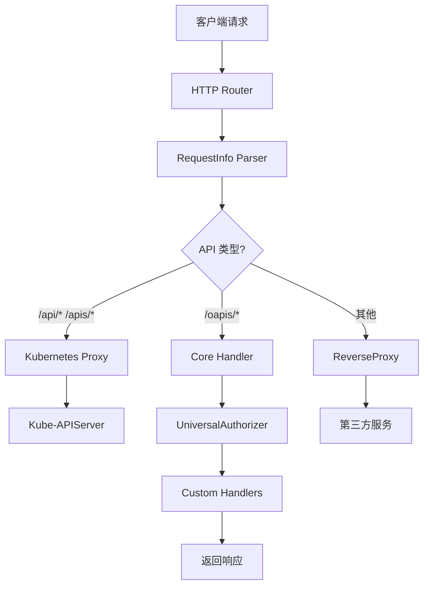
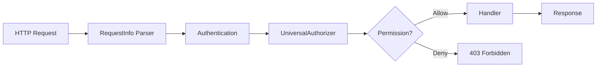

# API Service 开发指南

本指南讲解如何在 edge-apiserver 中创建自定义 API 端点，实现组织级 API (oapis) 和权限集成。

## APIService 工作原理

### 架构概览

edge-apiserver 采用双层 API 架构：



### API 路径设计

遵循 oapis 设计规范，创建清晰的 API 命名空间：

| API 类型 | 路径模式 | 处理方式 | 示例 |
|---------|---------|---------|------|
| **Kubernetes 核心 API** | `/api/v1/*` | 代理到 kube-apiserver | `/api/v1/pods` |
| **Kubernetes 扩展 API** | `/apis/{group}/{version}/*` | 代理到 kube-apiserver | `/apis/apps/v1/deployments` |
| **组织自定义 API** | `/oapis/{module}/{version}/*` | 本地 Handler 处理 | `/oapis/iam/v1alpha1/roletemplates` |
| **系统 API** | `/healthz`, `/metrics` | 系统功能 | `/healthz` |

## 自定义 API Group 和版本设计

### API Group 规划

edge-platform 的 API Group 组织：

```
/oapis/
├── iam/v1alpha1/           # 身份访问管理
│   ├── roletemplates       # 角色模板
│   ├── iamroles           # IAM 角色
│   └── iamrolebindings    # 角色绑定
│
├── management/v1/          # 基础设施管理
│   ├── clusters           # 集群管理
│   ├── workspaces         # 工作空间
│   └── system             # 系统状态
│
├── monitoring/v1/          # 监控告警（计划中）
│   ├── alerts
│   ├── metrics
│   └── dashboards
│
└── storage/v1/             # 存储管理（计划中）
    ├── volumes
    ├── snapshots
    └── policies
```

### 版本化策略

```go
// API 版本演进
/oapis/iam/v1alpha1/*    // 初始版本，API 不稳定
/oapis/iam/v1alpha2/*    // 重大改进
/oapis/iam/v1beta1/*     // 生产可用
/oapis/iam/v1/*          // 稳定版本，长期支持
```

## API 路由和处理器实现

### RequestInfo 解析

edge-apiserver 使用自定义的 RequestInfo Parser 解析 HTTP 请求：

```go
// pkg/apiserver/request/requestinfo.go
package request

type RequestInfo struct {
    // 基础信息
    Path      string
    Verb      string
    APIPrefix string  // "api", "apis", "oapis"
    APIGroup  string  // "iam", "management"
    APIVersion string // "v1alpha1", "v1"

    // 资源信息
    Resource    string
    Subresource string
    Name        string
    Namespace   string

    // 作用域信息
    Workspace     string
    Cluster       string
    NodeGroup     string
    ResourceScope string  // "Global", "Cluster", "Workspace", "Namespace"

    // 请求分类
    IsResourceRequest   bool
    IsKubernetesRequest bool  // true for /api/* and /apis/*, false for /oapis/*

    // 请求元数据
    SourceIP  string
    UserAgent string
}
```

### 请求解析流程

```go
func (r *RequestInfoResolver) NewRequestInfo(req *http.Request) (*RequestInfo, error) {
    requestInfo := RequestInfo{
        Path:                req.URL.Path,
        Verb:                strings.ToLower(req.Method),
        IsKubernetesRequest: false,
        SourceIP:            iputil.GetRealIP(req),
        UserAgent:           req.UserAgent(),
    }

    // 解析路径
    currentParts := splitPath(req.URL.Path)

    // 检查是否是 API 请求
    if !r.APIPrefixes.Has(currentParts[0]) {
        // 非 API 请求，直接返回
        return &requestInfo, nil
    }

    requestInfo.APIPrefix = currentParts[0]
    currentParts = currentParts[1:]

    // 解析 API Group（对于非 groupless API）
    if !r.GrouplessAPIPrefixes.Has(requestInfo.APIPrefix) {
        requestInfo.APIGroup = currentParts[0]
        currentParts = currentParts[1:]
    }

    // 解析 API Version
    requestInfo.IsResourceRequest = true
    requestInfo.APIVersion = currentParts[0]
    currentParts = currentParts[1:]

    // 解析 Verb
    switch req.Method {
    case "POST":
        requestInfo.Verb = VerbCreate
    case "GET", "HEAD":
        requestInfo.Verb = VerbGet
    case "PUT":
        requestInfo.Verb = VerbUpdate
    case "PATCH":
        requestInfo.Verb = VerbPatch
    case "DELETE":
        requestInfo.Verb = VerbDelete
    }

    // 解析 Resource、Name、Subresource
    if len(currentParts) >= 1 {
        requestInfo.Resource = currentParts[0]
    }
    if len(currentParts) >= 2 {
        requestInfo.Name = currentParts[1]
    }
    if len(currentParts) >= 3 {
        requestInfo.Subresource = currentParts[2]
    }

    // 判断是否是 Kubernetes API
    if requestInfo.APIPrefix == "api" || requestInfo.APIPrefix == "apis" {
        requestInfo.IsKubernetesRequest = true
    }

    return &requestInfo, nil
}
```

### 路由分发

```go
// cmd/apiserver/main.go
func setupAPIRoutes(mux *http.ServeMux, config *Config) {
    // 1. Kubernetes API 代理
    mux.HandleFunc("/api/", kubeAPIProxyHandler(config))
    mux.HandleFunc("/apis/", kubeAPIProxyHandler(config))

    // 2. 组织自定义 API
    mux.HandleFunc("/oapis/", coreAPIHandler(config))

    // 3. 系统 API
    mux.HandleFunc("/healthz", healthzHandler)
    mux.HandleFunc("/metrics", metricsHandler)
    mux.HandleFunc("/openapi/v2", openapiHandler)

    // 4. 默认处理器（ReverseProxy 或 404）
    mux.HandleFunc("/", defaultHandler(config))
}
```

### 创建自定义 Handler

```go
// pkg/apiserver/apis/iam/handler.go
package iam

import (
    "encoding/json"
    "net/http"

    "github.com/emicklei/go-restful/v3"
    "sigs.k8s.io/controller-runtime/pkg/client"

    iamv1alpha1 "github.com/theriseunion/apiserver/api/iam/v1alpha1"
    "github.com/theriseunion/apiserver/pkg/apiserver/request"
)

type IAMHandler struct {
    client.Client
}

// RegisterRoutes 注册 IAM API 路由
func (h *IAMHandler) RegisterRoutes(ws *restful.WebService) {
    // 列出角色模板
    ws.Route(ws.GET("/roletemplates").
        To(h.listRoleTemplates).
        Doc("List all role templates").
        Returns(http.StatusOK, "OK", iamv1alpha1.RoleTemplateList{}).
        Returns(http.StatusUnauthorized, "Unauthorized", nil).
        Returns(http.StatusForbidden, "Forbidden", nil))

    // 获取单个角色模板
    ws.Route(ws.GET("/roletemplates/{name}").
        To(h.getRoleTemplate).
        Doc("Get a role template by name").
        Param(ws.PathParameter("name", "Template name")).
        Returns(http.StatusOK, "OK", iamv1alpha1.RoleTemplate{}).
        Returns(http.StatusNotFound, "Not Found", nil))

    // 创建角色模板
    ws.Route(ws.POST("/roletemplates").
        To(h.createRoleTemplate).
        Doc("Create a new role template").
        Reads(iamv1alpha1.RoleTemplate{}).
        Returns(http.StatusCreated, "Created", iamv1alpha1.RoleTemplate{}))

    // 更新角色模板
    ws.Route(ws.PUT("/roletemplates/{name}").
        To(h.updateRoleTemplate).
        Doc("Update a role template").
        Param(ws.PathParameter("name", "Template name")).
        Reads(iamv1alpha1.RoleTemplate{}).
        Returns(http.StatusOK, "OK", iamv1alpha1.RoleTemplate{}))

    // 删除角色模板
    ws.Route(ws.DELETE("/roletemplates/{name}").
        To(h.deleteRoleTemplate).
        Doc("Delete a role template").
        Param(ws.PathParameter("name", "Template name")).
        Returns(http.StatusOK, "OK", nil))
}

// listRoleTemplates 列出所有角色模板
func (h *IAMHandler) listRoleTemplates(req *restful.Request, resp *restful.Response) {
    ctx := req.Request.Context()

    // 从上下文获取 RequestInfo（已经过权限检查）
    requestInfo, _ := request.RequestInfoFrom(ctx)

    // 构建查询选项
    var listOpts []client.ListOption

    // 应用标签过滤器（如果有）
    if labelSelector := req.QueryParameter("labelSelector"); labelSelector != "" {
        // 解析并应用标签选择器
        // ...
    }

    // 查询数据
    var templateList iamv1alpha1.RoleTemplateList
    if err := h.List(ctx, &templateList, listOpts...); err != nil {
        resp.WriteHeaderAndEntity(http.StatusInternalServerError, map[string]string{
            "error": err.Error(),
        })
        return
    }

    // 根据作用域过滤结果（如果需要）
    filteredItems := h.filterByScope(templateList.Items, requestInfo)

    // 返回结果
    resp.WriteEntity(iamv1alpha1.RoleTemplateList{
        Items: filteredItems,
    })
}

// getRoleTemplate 获取单个角色模板
func (h *IAMHandler) getRoleTemplate(req *restful.Request, resp *restful.Response) {
    ctx := req.Request.Context()
    name := req.PathParameter("name")

    template := &iamv1alpha1.RoleTemplate{}
    if err := h.Get(ctx, client.ObjectKey{Name: name}, template); err != nil {
        if client.IgnoreNotFound(err) == nil {
            resp.WriteHeaderAndEntity(http.StatusNotFound, map[string]string{
                "error": "RoleTemplate not found",
            })
            return
        }
        resp.WriteHeaderAndEntity(http.StatusInternalServerError, map[string]string{
            "error": err.Error(),
        })
        return
    }

    resp.WriteEntity(template)
}

// createRoleTemplate 创建角色模板
func (h *IAMHandler) createRoleTemplate(req *restful.Request, resp *restful.Response) {
    ctx := req.Request.Context()

    template := &iamv1alpha1.RoleTemplate{}
    if err := req.ReadEntity(template); err != nil {
        resp.WriteHeaderAndEntity(http.StatusBadRequest, map[string]string{
            "error": "Invalid request body",
        })
        return
    }

    // 验证字段
    if template.Name == "" {
        resp.WriteHeaderAndEntity(http.StatusBadRequest, map[string]string{
            "error": "metadata.name is required",
        })
        return
    }

    // 创建资源
    if err := h.Create(ctx, template); err != nil {
        resp.WriteHeaderAndEntity(http.StatusInternalServerError, map[string]string{
            "error": err.Error(),
        })
        return
    }

    resp.WriteHeaderAndEntity(http.StatusCreated, template)
}

// updateRoleTemplate 更新角色模板
func (h *IAMHandler) updateRoleTemplate(req *restful.Request, resp *restful.Response) {
    ctx := req.Request.Context()
    name := req.PathParameter("name")

    // 获取现有资源
    existing := &iamv1alpha1.RoleTemplate{}
    if err := h.Get(ctx, client.ObjectKey{Name: name}, existing); err != nil {
        if client.IgnoreNotFound(err) == nil {
            resp.WriteHeaderAndEntity(http.StatusNotFound, map[string]string{
                "error": "RoleTemplate not found",
            })
            return
        }
        resp.WriteHeaderAndEntity(http.StatusInternalServerError, map[string]string{
            "error": err.Error(),
        })
        return
    }

    // 读取更新内容
    updated := &iamv1alpha1.RoleTemplate{}
    if err := req.ReadEntity(updated); err != nil {
        resp.WriteHeaderAndEntity(http.StatusBadRequest, map[string]string{
            "error": "Invalid request body",
        })
        return
    }

    // 保留 ResourceVersion
    updated.ResourceVersion = existing.ResourceVersion

    // 更新资源
    if err := h.Update(ctx, updated); err != nil {
        resp.WriteHeaderAndEntity(http.StatusInternalServerError, map[string]string{
            "error": err.Error(),
        })
        return
    }

    resp.WriteEntity(updated)
}

// deleteRoleTemplate 删除角色模板
func (h *IAMHandler) deleteRoleTemplate(req *restful.Request, resp *restful.Response) {
    ctx := req.Request.Context()
    name := req.PathParameter("name")

    template := &iamv1alpha1.RoleTemplate{}
    template.Name = name

    if err := h.Delete(ctx, template); err != nil {
        if client.IgnoreNotFound(err) == nil {
            resp.WriteHeaderAndEntity(http.StatusNotFound, map[string]string{
                "error": "RoleTemplate not found",
            })
            return
        }
        resp.WriteHeaderAndEntity(http.StatusInternalServerError, map[string]string{
            "error": err.Error(),
        })
        return
    }

    resp.WriteHeader(http.StatusOK)
}

// filterByScope 根据 RequestInfo 的作用域过滤结果
func (h *IAMHandler) filterByScope(items []iamv1alpha1.RoleTemplate, requestInfo *request.RequestInfo) []iamv1alpha1.RoleTemplate {
    if requestInfo == nil {
        return items
    }

    var filtered []iamv1alpha1.RoleTemplate
    for _, item := range items {
        // 根据作用域标签过滤
        if requestInfo.Cluster != "" {
            if clusterLabel, ok := item.Labels["scope.theriseunion.io/cluster"]; ok {
                if clusterLabel != requestInfo.Cluster {
                    continue
                }
            }
        }

        if requestInfo.Workspace != "" {
            if workspaceLabel, ok := item.Labels["scope.theriseunion.io/workspace"]; ok {
                if workspaceLabel != requestInfo.Workspace {
                    continue
                }
            }
        }

        filtered = append(filtered, item)
    }

    return filtered
}
```

## 与 UniversalAuthorizer 集成

### 权限检查流程



### 权限过滤器中间件

```go
// pkg/apiserver/filters/authorization.go
package filters

import (
    "net/http"

    "k8s.io/apiserver/pkg/authorization/authorizer"
    "k8s.io/klog/v2"

    "github.com/theriseunion/apiserver/pkg/apiserver/authorization"
    "github.com/theriseunion/apiserver/pkg/apiserver/request"
)

// WithAuthorization 创建权限检查中间件
func WithAuthorization(handler http.Handler, auth authorizer.Authorizer) http.Handler {
    return http.HandlerFunc(func(w http.ResponseWriter, req *http.Request) {
        ctx := req.Context()

        // 获取 RequestInfo
        requestInfo, ok := request.RequestInfoFrom(ctx)
        if !ok {
            http.Error(w, "RequestInfo not found", http.StatusInternalServerError)
            return
        }

        // 获取用户信息
        user, ok := request.UserFrom(ctx)
        if !ok {
            http.Error(w, "User not found", http.StatusUnauthorized)
            return
        }

        // 构建 Attributes
        attrs := authorizer.AttributesRecord{
            User:            user,
            Verb:            requestInfo.Verb,
            Namespace:       requestInfo.Namespace,
            APIGroup:        requestInfo.APIGroup,
            APIVersion:      requestInfo.APIVersion,
            Resource:        requestInfo.Resource,
            Subresource:     requestInfo.Subresource,
            Name:            requestInfo.Name,
            ResourceRequest: requestInfo.IsResourceRequest,
            Path:            requestInfo.Path,
        }

        // 执行权限检查
        decision, reason, err := auth.Authorize(ctx, attrs)
        if err != nil {
            klog.Errorf("Authorization error: %v", err)
            http.Error(w, "Authorization error", http.StatusInternalServerError)
            return
        }

        if decision != authorizer.DecisionAllow {
            klog.V(4).Infof("Authorization denied: user=%s, verb=%s, resource=%s, reason=%s",
                user.GetName(), requestInfo.Verb, requestInfo.Resource, reason)
            http.Error(w, "Forbidden", http.StatusForbidden)
            return
        }

        // 权限检查通过，调用下一个 Handler
        handler.ServeHTTP(w, req)
    })
}
```

### 在 Handler 中使用权限信息

```go
func (h *IAMHandler) listRoleTemplates(req *restful.Request, resp *restful.Response) {
    ctx := req.Request.Context()

    // 请求已经过权限检查，这里可以安全执行业务逻辑
    user, _ := request.UserFrom(ctx)
    klog.V(4).Infof("User %s is listing RoleTemplates", user.GetName())

    // 查询资源
    var templateList iamv1alpha1.RoleTemplateList
    if err := h.List(ctx, &templateList); err != nil {
        resp.WriteHeaderAndEntity(http.StatusInternalServerError, map[string]string{
            "error": err.Error(),
        })
        return
    }

    resp.WriteEntity(templateList)
}
```

## 错误处理和响应格式

### 标准错误响应

```go
// pkg/apiserver/response/error.go
package response

import (
    "encoding/json"
    "net/http"

    metav1 "k8s.io/apimachinery/pkg/apis/meta/v1"
)

// Error 标准错误响应格式（兼容 Kubernetes）
type Error struct {
    metav1.TypeMeta
    metav1.Status
}

// WriteError 写入错误响应
func WriteError(w http.ResponseWriter, statusCode int, reason metav1.StatusReason, message string) {
    w.Header().Set("Content-Type", "application/json")
    w.WriteHeader(statusCode)

    status := metav1.Status{
        TypeMeta: metav1.TypeMeta{
            Kind:       "Status",
            APIVersion: "v1",
        },
        Status:  metav1.StatusFailure,
        Code:    int32(statusCode),
        Reason:  reason,
        Message: message,
    }

    json.NewEncoder(w).Encode(status)
}

// WriteBadRequest 400 错误
func WriteBadRequest(w http.ResponseWriter, message string) {
    WriteError(w, http.StatusBadRequest, metav1.StatusReasonBadRequest, message)
}

// WriteNotFound 404 错误
func WriteNotFound(w http.ResponseWriter, message string) {
    WriteError(w, http.StatusNotFound, metav1.StatusReasonNotFound, message)
}

// WriteForbidden 403 错误
func WriteForbidden(w http.ResponseWriter, message string) {
    WriteError(w, http.StatusForbidden, metav1.StatusReasonForbidden, message)
}

// WriteInternalError 500 错误
func WriteInternalError(w http.ResponseWriter, err error) {
    WriteError(w, http.StatusInternalServerError, metav1.StatusReasonInternalError, err.Error())
}
```

### 使用标准错误响应

```go
func (h *IAMHandler) getRoleTemplate(req *restful.Request, resp *restful.Response) {
    ctx := req.Request.Context()
    name := req.PathParameter("name")

    template := &iamv1alpha1.RoleTemplate{}
    if err := h.Get(ctx, client.ObjectKey{Name: name}, template); err != nil {
        if client.IgnoreNotFound(err) == nil {
            // 使用标准 404 响应
            response.WriteNotFound(resp.ResponseWriter,
                fmt.Sprintf("RoleTemplate %q not found", name))
            return
        }
        // 使用标准 500 响应
        response.WriteInternalError(resp.ResponseWriter, err)
        return
    }

    resp.WriteEntity(template)
}
```

## 实战：创建自定义 API 端点

### 场景：系统状态 API

创建一个返回系统状态的自定义 API：

```
GET /oapis/management/v1/system/status
```

#### 步骤 1: 定义响应结构

```go
// pkg/apiserver/apis/management/types.go
package management

type SystemStatus struct {
    Version     string            `json:"version"`
    BuildDate   string            `json:"buildDate"`
    GitCommit   string            `json:"gitCommit"`
    Components  []ComponentStatus `json:"components"`
    HealthScore int               `json:"healthScore"`
}

type ComponentStatus struct {
    Name    string `json:"name"`
    Status  string `json:"status"`  // "Healthy", "Degraded", "Unhealthy"
    Message string `json:"message,omitempty"`
}
```

#### 步骤 2: 实现 Handler

```go
// pkg/apiserver/apis/management/handler.go
package management

import (
    "net/http"

    "github.com/emicklei/go-restful/v3"
    "sigs.k8s.io/controller-runtime/pkg/client"
)

type ManagementHandler struct {
    client.Client
    Version   string
    BuildDate string
    GitCommit string
}

func (h *ManagementHandler) RegisterRoutes(ws *restful.WebService) {
    ws.Route(ws.GET("/system/status").
        To(h.getSystemStatus).
        Doc("Get system status").
        Returns(http.StatusOK, "OK", SystemStatus{}))
}

func (h *ManagementHandler) getSystemStatus(req *restful.Request, resp *restful.Response) {
    ctx := req.Request.Context()

    // 检查各组件状态
    components := h.checkComponentsHealth(ctx)

    // 计算健康分数
    healthScore := h.calculateHealthScore(components)

    status := SystemStatus{
        Version:     h.Version,
        BuildDate:   h.BuildDate,
        GitCommit:   h.GitCommit,
        Components:  components,
        HealthScore: healthScore,
    }

    resp.WriteEntity(status)
}

func (h *ManagementHandler) checkComponentsHealth(ctx context.Context) []ComponentStatus {
    components := []ComponentStatus{
        {Name: "kube-apiserver", Status: "Healthy"},
        {Name: "controller-manager", Status: "Healthy"},
        {Name: "etcd", Status: "Healthy"},
    }

    // 实际检查逻辑
    // ...

    return components
}

func (h *ManagementHandler) calculateHealthScore(components []ComponentStatus) int {
    healthy := 0
    for _, comp := range components {
        if comp.Status == "Healthy" {
            healthy++
        }
    }
    return (healthy * 100) / len(components)
}
```

#### 步骤 3: 注册路由

```go
// cmd/apiserver/main.go
func setupManagementAPI(container *restful.Container, config *Config) {
    // 创建 WebService
    ws := new(restful.WebService)
    ws.Path("/oapis/management/v1").
        Consumes(restful.MIME_JSON).
        Produces(restful.MIME_JSON)

    // 创建 Handler
    handler := &management.ManagementHandler{
        Client:    config.RuntimeClient,
        Version:   config.Version,
        BuildDate: config.BuildDate,
        GitCommit: config.GitCommit,
    }

    // 注册路由
    handler.RegisterRoutes(ws)

    // 添加到 Container
    container.Add(ws)
}
```

#### 步骤 4: 测试 API

```bash
# 调用 API
curl http://localhost:8080/oapis/management/v1/system/status

# 响应示例
{
  "version": "v1.0.0",
  "buildDate": "2025-10-17T10:00:00Z",
  "gitCommit": "1322ee3b",
  "components": [
    {
      "name": "kube-apiserver",
      "status": "Healthy"
    },
    {
      "name": "controller-manager",
      "status": "Healthy"
    },
    {
      "name": "etcd",
      "status": "Degraded",
      "message": "High latency detected"
    }
  ],
  "healthScore": 66
}
```

## OpenAPI 规范生成

edge-apiserver 自动生成 OpenAPI v2 规范：

```bash
# 获取 OpenAPI 规范
curl http://localhost:8080/openapi/v2 > openapi.json

# 使用规范生成客户端代码
# 参考前端开发文档
```

## 常见问题

### 1. API 路由不生效

```go
// 问题：请求返回 404
// 解决：检查路由注册顺序和路径匹配

// ❌ 错误：路径不匹配
ws.Path("/oapis/iam/v1alpha1/")  // 末尾斜杠
ws.Route(ws.GET("roletemplates"))  // 缺少前导斜杠

// ✅ 正确
ws.Path("/oapis/iam/v1alpha1")
ws.Route(ws.GET("/roletemplates"))
```

### 2. 权限检查失败

```bash
# 问题：总是返回 403 Forbidden
# 解决：检查 RBAC 规则和 RequestInfo 解析

# 查看 RequestInfo
--v=4  # 启用详细日志

# 检查用户权限
kubectl auth can-i list roletemplates --as=alice
```

### 3. 响应格式不一致

```go
// 问题：有时返回 JSON，有时返回纯文本
// 解决：统一使用 restful.Response

// ❌ 错误
fmt.Fprintf(w, "error message")

// ✅ 正确
resp.WriteHeaderAndEntity(http.StatusBadRequest, map[string]string{
    "error": "error message",
})
```

## 下一步阅读

- [Reverse Proxy](./reverse-proxy.md) - 集成第三方 API
- [Metrics 监控](./metrics.md) - 添加 API 监控指标
- [权限体系](../permissions/overview.md) - 深入理解权限控制

---

**提示**: 自定义 API 是扩展 edge-platform 功能的核心机制，遵循 oapis 设计规范可以保持 API 的一致性和可维护性。
