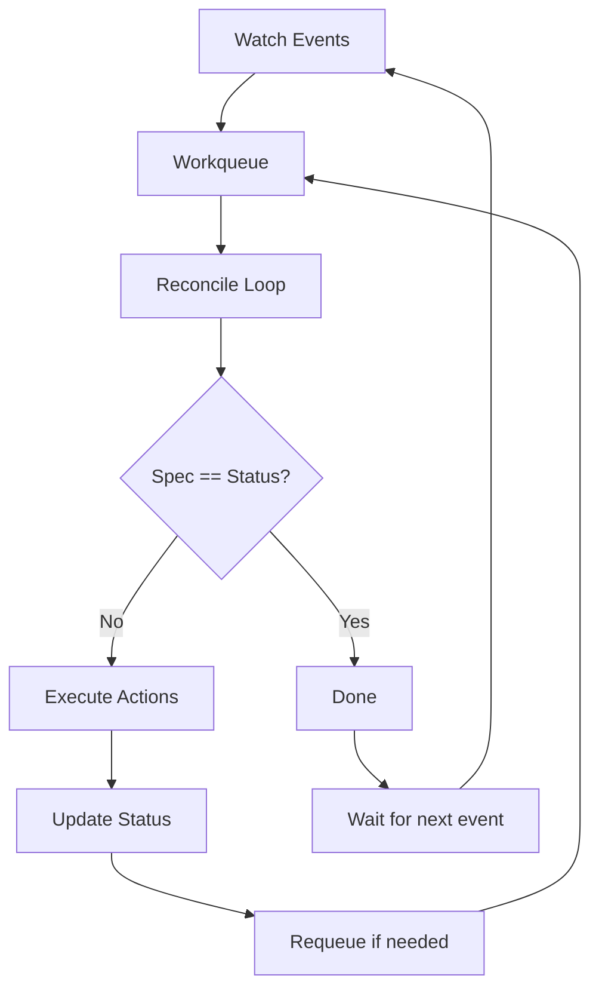

# Controller 开发指南

本指南深入讲解 Kubernetes Controller 模式、Reconcile 循环实现和性能优化策略。

## Kubernetes Controller 模式

### 控制循环原理

Controller 是 Kubernetes 的核心机制，持续监控资源状态并确保实际状态符合期望状态。



### Controller 核心组件

```go
type RoleTemplateReconciler struct {
    // Client 用于操作 Kubernetes 资源
    client.Client

    // Scheme 运行时类型信息
    Scheme *runtime.Scheme

    // Recorder 用于发送事件
    Recorder record.EventRecorder
}
```

| 组件 | 作用 | 使用场景 |
|------|------|---------|
| **Client** | CRUD 操作 Kubernetes 资源 | 读取/更新资源 |
| **Scheme** | 类型注册和转换 | 对象序列化/反序列化 |
| **Recorder** | 发送 Kubernetes Events | 记录重要操作 |

## Reconcile 循环实现

### 基本结构

```go
package controller

import (
    "context"
    "fmt"

    apierrors "k8s.io/apimachinery/pkg/api/errors"
    "k8s.io/apimachinery/pkg/runtime"
    ctrl "sigs.k8s.io/controller-runtime"
    "sigs.k8s.io/controller-runtime/pkg/client"
    "sigs.k8s.io/controller-runtime/pkg/log"

    iamv1alpha1 "github.com/theriseunion/apiserver/api/iam/v1alpha1"
)

// RoleTemplateReconciler reconciles a RoleTemplate object
type RoleTemplateReconciler struct {
    client.Client
    Scheme   *runtime.Scheme
    Recorder record.EventRecorder
}

//+kubebuilder:rbac:groups=iam.theriseunion.io,resources=roletemplates,verbs=get;list;watch;create;update;patch;delete
//+kubebuilder:rbac:groups=iam.theriseunion.io,resources=roletemplates/status,verbs=get;update;patch
//+kubebuilder:rbac:groups=iam.theriseunion.io,resources=roletemplates/finalizers,verbs=update
//+kubebuilder:rbac:groups=iam.theriseunion.io,resources=iamroles,verbs=get;list;watch;create;update;patch;delete
//+kubebuilder:rbac:groups="",resources=events,verbs=create;patch

// Reconcile 是主协调循环
func (r *RoleTemplateReconciler) Reconcile(ctx context.Context, req ctrl.Request) (ctrl.Result, error) {
    logger := log.FromContext(ctx)

    logger.Info("Starting reconciliation for RoleTemplate", "namespacedName", req.NamespacedName)

    // 第一步：获取资源
    roleTemplate := &iamv1alpha1.RoleTemplate{}
    if err := r.Get(ctx, req.NamespacedName, roleTemplate); err != nil {
        if apierrors.IsNotFound(err) {
            // 资源已删除，处理清理逻辑
            logger.Info("RoleTemplate not found, possibly deleted", "namespacedName", req.NamespacedName)
            return r.reconcileAllIAMRolesWithAggregation(ctx)
        }
        logger.Error(err, "Failed to get RoleTemplate")
        return ctrl.Result{}, err
    }

    logger.Info("RoleTemplate found, updating affected IAMRole resources",
        "template", roleTemplate.Name,
        "labels", roleTemplate.Labels)

    // 第二步：执行业务逻辑
    if err := r.updateIAMRolesWithAggregation(ctx, roleTemplate); err != nil {
        logger.Error(err, "Failed to update IAMRole resources with template aggregation")
        return ctrl.Result{}, err
    }

    // 第三步：发送事件
    r.Recorder.Event(roleTemplate, "Normal", "Reconciled",
        "RoleTemplate reconciliation completed successfully")

    logger.Info("Successfully completed RoleTemplate reconciliation", "template", roleTemplate.Name)

    // 第四步：返回结果
    return ctrl.Result{}, nil
}
```

### Reconcile 返回值

```go
// 返回类型：(ctrl.Result, error)

// 1. 成功完成，不重新入队
return ctrl.Result{}, nil

// 2. 发生错误，自动重试（指数退避）
return ctrl.Result{}, err

// 3. 成功但需要定期重新协调
return ctrl.Result{RequeueAfter: 30 * time.Second}, nil

// 4. 立即重新入队（谨慎使用，可能导致热循环）
return ctrl.Result{Requeue: true}, nil

// 5. 错误但不重试（已记录日志）
return ctrl.Result{}, nil
```

### 事件处理流程

```go
func (r *RoleTemplateReconciler) Reconcile(ctx context.Context, req ctrl.Request) (ctrl.Result, error) {
    logger := log.FromContext(ctx)

    // 第一步：获取资源
    roleTemplate := &iamv1alpha1.RoleTemplate{}
    if err := r.Get(ctx, req.NamespacedName, roleTemplate); err != nil {
        if apierrors.IsNotFound(err) {
            // 删除事件：资源已不存在
            logger.Info("RoleTemplate deleted, triggering dependent updates")
            return r.handleDeletion(ctx, req.Name)
        }
        // 其他错误：重试
        return ctrl.Result{}, err
    }

    // 第二步：检查是否正在删除
    if roleTemplate.DeletionTimestamp != nil {
        logger.Info("RoleTemplate is being deleted, running finalizers")
        return r.handleFinalizers(ctx, roleTemplate)
    }

    // 第三步：正常协调逻辑
    return r.reconcileNormal(ctx, roleTemplate)
}
```

## Event Watching 和资源过滤

### SetupWithManager 配置

```go
func (r *RoleTemplateReconciler) SetupWithManager(mgr ctrl.Manager) error {
    return ctrl.NewControllerManagedBy(mgr).
        // 主要监控的资源类型
        For(&iamv1alpha1.RoleTemplate{}).

        // 监控依赖的资源（触发 reconcile）
        Owns(&corev1.ConfigMap{}).

        // 监控相关资源（通过 EnqueueRequestsFromMapFunc）
        Watches(
            &source.Kind{Type: &iamv1alpha1.IAMRole{}},
            handler.EnqueueRequestsFromMapFunc(r.findRoleTemplatesForIAMRole),
        ).

        // 添加事件过滤器
        WithEventFilter(predicate.Funcs{
            UpdateFunc: func(e event.UpdateEvent) bool {
                // 只处理真正有变化的更新
                return r.hasSignificantChanges(e.ObjectOld, e.ObjectNew)
            },
            DeleteFunc: func(e event.DeleteEvent) bool {
                // 总是处理删除事件
                return true
            },
            CreateFunc: func(e event.CreateEvent) bool {
                // 总是处理创建事件
                return true
            },
            GenericFunc: func(e event.GenericEvent) bool {
                // 通常忽略 Generic 事件
                return false
            },
        }).

        // 设置并发处理数
        WithOptions(controller.Options{
            MaxConcurrentReconciles: 3,
        }).

        Complete(r)
}
```

### Predicates 过滤器

```go
package controller

import (
    "sigs.k8s.io/controller-runtime/pkg/event"
    "sigs.k8s.io/controller-runtime/pkg/predicate"
)

// 自定义过滤器：只处理 Spec 或 Label 变化
func (r *RoleTemplateReconciler) hasSignificantChanges(oldObj, newObj client.Object) bool {
    if oldObj == nil || newObj == nil {
        return true
    }

    oldTemplate, ok1 := oldObj.(*iamv1alpha1.RoleTemplate)
    newTemplate, ok2 := newObj.(*iamv1alpha1.RoleTemplate)

    if !ok1 || !ok2 {
        return true
    }

    // 检查 Spec 变化
    if !equalTemplateSpecs(&oldTemplate.Spec, &newTemplate.Spec) {
        return true
    }

    // 检查 Scope 标签变化
    if !equalScopeLabels(oldTemplate.Labels, newTemplate.Labels) {
        return true
    }

    // 忽略 Status、Annotations 等其他变化
    return false
}

const (
    ScopeLabel      = "iam.theriseunion.io/scope"
    ScopeValueLabel = "iam.theriseunion.io/scope-value"
)

func equalScopeLabels(a, b map[string]string) bool {
    if a == nil && b == nil {
        return true
    }
    if a == nil || b == nil {
        return false
    }
    return a[ScopeLabel] == b[ScopeLabel] && a[ScopeValueLabel] == b[ScopeValueLabel]
}

func equalTemplateSpecs(a, b *iamv1alpha1.RoleTemplateSpec) bool {
    // 规则数量变化
    if len(a.Rules) != len(b.Rules) {
        return false
    }

    // UI 权限数量变化
    if len(a.UIPermissions) != len(b.UIPermissions) {
        return false
    }

    // 更详细的比较可以使用 reflect.DeepEqual 或自定义逻辑
    return false  // 简化处理：认为 Spec 总是有变化
}
```

### 跨资源监控

```go
// 监控 IAMRole 变化时，找到需要更新的 RoleTemplate
func (r *RoleTemplateReconciler) findRoleTemplatesForIAMRole(obj client.Object) []reconcile.Request {
    iamRole, ok := obj.(*iamv1alpha1.IAMRole)
    if !ok {
        return nil
    }

    // 如果 IAMRole 没有聚合规则，不触发任何 RoleTemplate reconcile
    if iamRole.Spec.AggregationRoleTemplates == nil {
        return nil
    }

    var requests []reconcile.Request

    // 根据直接引用的模板名称生成 reconcile 请求
    for _, templateName := range iamRole.Spec.AggregationRoleTemplates.TemplateNames {
        requests = append(requests, reconcile.Request{
            NamespacedName: client.ObjectKey{
                Name: templateName,
            },
        })
    }

    // 如果有 Label Selector，查询匹配的模板
    if iamRole.Spec.AggregationRoleTemplates.RoleSelector != nil {
        selector, err := metav1.LabelSelectorAsSelector(iamRole.Spec.AggregationRoleTemplates.RoleSelector)
        if err != nil {
            return requests
        }

        var templateList iamv1alpha1.RoleTemplateList
        if err := r.List(context.Background(), &templateList, client.MatchingLabelsSelector{Selector: selector}); err != nil {
            return requests
        }

        for _, template := range templateList.Items {
            requests = append(requests, reconcile.Request{
                NamespacedName: client.ObjectKey{
                    Name: template.Name,
                },
            })
        }
    }

    return requests
}
```

## 错误处理和重试策略

### 指数退避重试

controller-runtime 自动实现指数退避：

```
第 1 次失败：立即重试
第 2 次失败：5ms 后重试
第 3 次失败：10ms 后重试
第 4 次失败：20ms 后重试
...
最大延迟：1000s（约 16.7 分钟）
```

### 自定义重试逻辑

```go
func (r *RoleTemplateReconciler) Reconcile(ctx context.Context, req ctrl.Request) (ctrl.Result, error) {
    logger := log.FromContext(ctx)

    roleTemplate := &iamv1alpha1.RoleTemplate{}
    if err := r.Get(ctx, req.NamespacedName, roleTemplate); err != nil {
        return ctrl.Result{}, client.IgnoreNotFound(err)
    }

    // 业务逻辑执行
    if err := r.updateIAMRolesWithAggregation(ctx, roleTemplate); err != nil {
        // 错误分类处理
        if isTransientError(err) {
            // 临时错误：快速重试
            logger.Info("Transient error, retrying in 10s", "error", err)
            return ctrl.Result{RequeueAfter: 10 * time.Second}, nil
        } else if isRateLimitError(err) {
            // 限流错误：延长重试间隔
            logger.Info("Rate limit error, retrying in 60s", "error", err)
            return ctrl.Result{RequeueAfter: 60 * time.Second}, nil
        } else {
            // 其他错误：使用默认指数退避
            logger.Error(err, "Failed to update IAM roles")
            return ctrl.Result{}, err
        }
    }

    return ctrl.Result{}, nil
}

func isTransientError(err error) bool {
    // 网络超时、连接失败等
    return apierrors.IsTimeout(err) || apierrors.IsServerTimeout(err)
}

func isRateLimitError(err error) bool {
    return apierrors.IsTooManyRequests(err)
}
```

### 错误事件记录

```go
func (r *RoleTemplateReconciler) Reconcile(ctx context.Context, req ctrl.Request) (ctrl.Result, error) {
    logger := log.FromContext(ctx)

    roleTemplate := &iamv1alpha1.RoleTemplate{}
    if err := r.Get(ctx, req.NamespacedName, roleTemplate); err != nil {
        return ctrl.Result{}, client.IgnoreNotFound(err)
    }

    if err := r.updateIAMRolesWithAggregation(ctx, roleTemplate); err != nil {
        // 记录错误事件
        r.Recorder.Event(roleTemplate, "Warning", "ReconcileFailed",
            fmt.Sprintf("Failed to update IAM roles: %v", err))

        logger.Error(err, "Reconciliation failed",
            "template", roleTemplate.Name,
            "retry", "will be retried with exponential backoff")

        return ctrl.Result{}, err
    }

    // 记录成功事件
    r.Recorder.Event(roleTemplate, "Normal", "ReconcileSuccess",
        "Successfully updated all affected IAM roles")

    return ctrl.Result{}, nil
}
```

## 实战：RoleTemplate Controller 深度解析

基于实际的 `roletemplate_controller.go` 代码分析。

### 模板聚合逻辑

```go
// updateIAMRolesWithAggregation 找到所有应该聚合此模板的 IAMRole 并更新
func (r *RoleTemplateReconciler) updateIAMRolesWithAggregation(
    ctx context.Context,
    template *iamv1alpha1.RoleTemplate,
) error {
    logger := log.FromContext(ctx)

    // 列出所有 IAMRole
    var iamRoleList iamv1alpha1.IAMRoleList
    if err := r.List(ctx, &iamRoleList); err != nil {
        return fmt.Errorf("failed to list IAMRoles: %w", err)
    }

    updated := 0
    for _, iamRole := range iamRoleList.Items {
        // 检查是否应该聚合此模板
        if r.shouldAggregateTemplateForIAMRole(&iamRole, template) {
            if err := r.recomputeIAMRole(ctx, &iamRole); err != nil {
                logger.Error(err, "Failed to recompute IAMRole",
                    "iamRole", iamRole.Name,
                    "template", template.Name)
                return fmt.Errorf("failed to recompute IAMRole %s: %w", iamRole.Name, err)
            }
            updated++
        }
    }

    logger.Info("Successfully updated IAMRoles with template",
        "template", template.Name,
        "iamRolesUpdated", updated)
    return nil
}
```

### 聚合规则匹配

```go
// shouldAggregateTemplateForIAMRole 判断 IAMRole 是否应该聚合给定模板
func (r *RoleTemplateReconciler) shouldAggregateTemplateForIAMRole(
    iamRole *iamv1alpha1.IAMRole,
    template *iamv1alpha1.RoleTemplate,
) bool {
    if iamRole.Spec.AggregationRoleTemplates == nil {
        return false
    }

    // 方式 1：按名称匹配
    for _, templateName := range iamRole.Spec.AggregationRoleTemplates.TemplateNames {
        if templateName == template.Name {
            return true
        }
    }

    // 方式 2：按标签选择器匹配
    if iamRole.Spec.AggregationRoleTemplates.RoleSelector != nil {
        if r.labelSelectorMatches(*iamRole.Spec.AggregationRoleTemplates.RoleSelector, template.Labels) {
            return true
        }
    }

    return false
}

func (r *RoleTemplateReconciler) labelSelectorMatches(
    selector metav1.LabelSelector,
    templateLabels map[string]string,
) bool {
    labelSelector, err := metav1.LabelSelectorAsSelector(&selector)
    if err != nil {
        return false
    }
    return labelSelector.Matches(labels.Set(templateLabels))
}
```

### IAMRole 重新计算

```go
// recomputeIAMRole 从 AggregationRoleTemplates 重新构建 IAMRole 的 rules 和 uiPermissions
func (r *RoleTemplateReconciler) recomputeIAMRole(
    ctx context.Context,
    iamRole *iamv1alpha1.IAMRole,
) error {
    logger := log.FromContext(ctx)

    if iamRole.Spec.AggregationRoleTemplates == nil {
        return nil  // 无聚合规则，跳过
    }

    logger.Info("Recomputing IAMRole from aggregation rule", "iamRole", iamRole.Name)

    // 使用 CreateOrUpdate 模式确保幂等性
    _, err := controllerutil.CreateOrUpdate(ctx, r.Client, iamRole, func() error {
        // 获取原始规则（存储在 annotation 中）
        originalRules, err := r.getOriginalIAMRoleRules(iamRole)
        if err != nil {
            return fmt.Errorf("failed to get original rules: %w", err)
        }

        originalUIPermissions, err := r.getOriginalIAMRoleUIPermissions(iamRole)
        if err != nil {
            return fmt.Errorf("failed to get original UI permissions: %w", err)
        }

        // 从原始规则开始
        iamRole.Spec.Rules = make([]rbacv1.PolicyRule, len(originalRules))
        copy(iamRole.Spec.Rules, originalRules)
        iamRole.Spec.UIPermissions = make([]string, len(originalUIPermissions))
        copy(iamRole.Spec.UIPermissions, originalUIPermissions)

        // 按名称聚合模板
        if len(iamRole.Spec.AggregationRoleTemplates.TemplateNames) > 0 {
            templates, err := r.getTemplatesByNames(ctx, iamRole.Spec.AggregationRoleTemplates.TemplateNames)
            if err != nil {
                return fmt.Errorf("failed to get templates by names: %w", err)
            }

            for _, template := range templates {
                iamRole.Spec.Rules = mergeRules(iamRole.Spec.Rules, template.Spec.Rules)
                iamRole.Spec.UIPermissions = mergeUIPermissions(iamRole.Spec.UIPermissions, template.Spec.UIPermissions)
            }
        }

        // 按选择器聚合模板
        if iamRole.Spec.AggregationRoleTemplates.RoleSelector != nil {
            templates, err := r.getTemplatesMatchingSelector(ctx, *iamRole.Spec.AggregationRoleTemplates.RoleSelector)
            if err != nil {
                return fmt.Errorf("failed to get templates by selector: %w", err)
            }

            for _, template := range templates {
                iamRole.Spec.Rules = mergeRules(iamRole.Spec.Rules, template.Spec.Rules)
                iamRole.Spec.UIPermissions = mergeUIPermissions(iamRole.Spec.UIPermissions, template.Spec.UIPermissions)
            }
        }

        // 更新作用域标签
        if err := r.updateScopeLabelsFromTemplates(ctx, iamRole, iamRole.Spec.AggregationRoleTemplates); err != nil {
            logger.Error(err, "Failed to update scope labels from templates")
        }

        logger.Info("Successfully recomputed IAMRole",
            "iamRole", iamRole.Name,
            "rulesCount", len(iamRole.Spec.Rules),
            "uiPermissionsCount", len(iamRole.Spec.UIPermissions))
        return nil
    })

    return err
}
```

### 规则合并逻辑

```go
// mergeRules 合并两个 PolicyRule 切片
func mergeRules(existing []rbacv1.PolicyRule, additional []rbacv1.PolicyRule) []rbacv1.PolicyRule {
    if len(additional) == 0 {
        return existing
    }

    merged := make([]rbacv1.PolicyRule, len(existing))
    copy(merged, existing)

    // 简单追加（可以增强去重逻辑）
    merged = append(merged, additional...)

    return merged
}

// mergeUIPermissions 合并 UI 权限，去重
func mergeUIPermissions(existing []string, additional []string) []string {
    if len(additional) == 0 {
        return existing
    }

    // 使用 map 去重
    permSet := make(map[string]bool)
    for _, perm := range existing {
        permSet[perm] = true
    }

    merged := make([]string, len(existing))
    copy(merged, existing)

    // 添加不重复的新权限
    for _, perm := range additional {
        if !permSet[perm] {
            merged = append(merged, perm)
            permSet[perm] = true
        }
    }

    return merged
}
```

### 原始状态保存

```go
const originalRulesAnnotation = "iam.theriseunion.io/original-rules"

// getOriginalIAMRoleRules 从 annotation 获取原始规则
func (r *RoleTemplateReconciler) getOriginalIAMRoleRules(iamRole *iamv1alpha1.IAMRole) ([]rbacv1.PolicyRule, error) {
    if iamRole.Annotations == nil {
        iamRole.Annotations = make(map[string]string)
    }

    // 首次执行：保存当前规则为原始规则
    if rulesJSON, exists := iamRole.Annotations[originalRulesAnnotation]; !exists {
        rulesData, err := json.Marshal(iamRole.Spec.Rules)
        if err != nil {
            return nil, fmt.Errorf("failed to marshal original rules: %w", err)
        }
        iamRole.Annotations[originalRulesAnnotation] = string(rulesData)
        return iamRole.Spec.Rules, nil
    } else {
        // 后续执行：解析保存的原始规则
        var originalRules []rbacv1.PolicyRule
        if err := json.Unmarshal([]byte(rulesJSON), &originalRules); err != nil {
            return nil, fmt.Errorf("failed to unmarshal original rules: %w", err)
        }
        return originalRules, nil
    }
}
```

## Controller 性能优化

### 1. 减少不必要的 Reconcile

```go
func (r *RoleTemplateReconciler) SetupWithManager(mgr ctrl.Manager) error {
    return ctrl.NewControllerManagedBy(mgr).
        For(&iamv1alpha1.RoleTemplate{}).
        WithEventFilter(predicate.Funcs{
            UpdateFunc: func(e event.UpdateEvent) bool {
                // 只在 Spec 或关键 Label 变化时触发
                return r.hasSignificantChanges(e.ObjectOld, e.ObjectNew)
            },
        }).
        Complete(r)
}
```

### 2. 批量操作优化

```go
func (r *RoleTemplateReconciler) updateIAMRolesWithAggregation(
    ctx context.Context,
    template *iamv1alpha1.RoleTemplate,
) error {
    var iamRoleList iamv1alpha1.IAMRoleList

    // 使用 Label Selector 减少查询范围
    selector := client.MatchingLabels{
        "iam.theriseunion.io/has-aggregation": "true",
    }

    if err := r.List(ctx, &iamRoleList, selector); err != nil {
        return err
    }

    // 并发更新（谨慎使用）
    errChan := make(chan error, len(iamRoleList.Items))
    semaphore := make(chan struct{}, 5)  // 限制并发数

    for _, iamRole := range iamRoleList.Items {
        go func(role iamv1alpha1.IAMRole) {
            semaphore <- struct{}{}
            defer func() { <-semaphore }()

            if err := r.recomputeIAMRole(ctx, &role); err != nil {
                errChan <- err
            }
        }(iamRole)
    }

    // 等待所有更新完成
    // ...
}
```

### 3. 缓存优化

```go
type RoleTemplateReconciler struct {
    client.Client
    Scheme   *runtime.Scheme
    Recorder record.EventRecorder

    // 本地缓存（需要手动失效）
    templateCache sync.Map
}

func (r *RoleTemplateReconciler) getTemplatesCached(ctx context.Context, names []string) ([]iamv1alpha1.RoleTemplate, error) {
    var templates []iamv1alpha1.RoleTemplate

    for _, name := range names {
        // 先查缓存
        if cached, ok := r.templateCache.Load(name); ok {
            templates = append(templates, cached.(iamv1alpha1.RoleTemplate))
            continue
        }

        // 缓存未命中，从 API Server 获取
        template := &iamv1alpha1.RoleTemplate{}
        if err := r.Get(ctx, client.ObjectKey{Name: name}, template); err != nil {
            return nil, err
        }

        r.templateCache.Store(name, *template)
        templates = append(templates, *template)
    }

    return templates, nil
}
```

### 4. 限制并发数

```go
func (r *RoleTemplateReconciler) SetupWithManager(mgr ctrl.Manager) error {
    return ctrl.NewControllerManagedBy(mgr).
        For(&iamv1alpha1.RoleTemplate{}).
        WithOptions(controller.Options{
            // 限制并发 Reconcile 数量
            MaxConcurrentReconciles: 3,

            // 自定义 RateLimiter
            RateLimiter: workqueue.NewItemExponentialFailureRateLimiter(
                5*time.Millisecond,   // 基础延迟
                1000*time.Second,      // 最大延迟
            ),
        }).
        Complete(r)
}
```

## 常见问题

### 1. Reconcile 频繁触发

```go
// 问题：每次 Status 更新都触发 Reconcile
// 解决：使用 Predicate 过滤 Status 变化

func (r *RoleTemplateReconciler) SetupWithManager(mgr ctrl.Manager) error {
    return ctrl.NewControllerManagedBy(mgr).
        For(&iamv1alpha1.RoleTemplate{}).
        WithEventFilter(predicate.GenerationChangedPredicate{}).  // 只在 Generation 变化时触发
        Complete(r)
}
```

### 2. Controller 无法启动

```bash
# 问题：RBAC 权限不足
# 解决：检查 kubebuilder rbac 标记

//+kubebuilder:rbac:groups=iam.theriseunion.io,resources=roletemplates,verbs=get;list;watch

# 重新生成 RBAC 配置
make manifests
```

### 3. 资源更新冲突

```go
// 问题：Conflict error during update
// 解决：使用 Retry 机制

import "k8s.io/client-go/util/retry"

func (r *RoleTemplateReconciler) updateIAMRole(ctx context.Context, iamRole *iamv1alpha1.IAMRole) error {
    return retry.RetryOnConflict(retry.DefaultRetry, func() error {
        // 重新获取最新版本
        latest := &iamv1alpha1.IAMRole{}
        if err := r.Get(ctx, client.ObjectKeyFromObject(iamRole), latest); err != nil {
            return err
        }

        // 应用更新
        latest.Spec = iamRole.Spec

        // 尝试更新
        return r.Update(ctx, latest)
    })
}
```

## 下一步阅读

- [API Service 开发](./api-service.md) - 创建自定义 API 端点
- [Reverse Proxy](./reverse-proxy.md) - 集成第三方服务
- [Metrics 监控](./metrics.md) - 添加 Controller 监控指标

---

**提示**: Controller 是 Kubernetes Operator 的核心，理解 Reconcile 循环和错误处理是构建可靠系统的关键。
