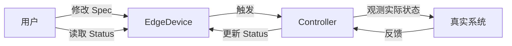

# CRD 开发指南

本指南深入讲解 Custom Resource Definition (CRD) 的设计原则、开发流程和最佳实践。

## CRD 设计原则

### 1. 声明式 API 设计

Kubernetes 采用声明式 API 模型，用户描述**期望状态**而非执行步骤。

```yaml
# ❌ 命令式思维（不推荐）
apiVersion: edge.theriseunion.io/v1alpha1
kind: EdgeDeviceAction
metadata:
  name: restart-device
spec:
  action: restart  # 执行动作
  deviceName: gateway-001

# ✅ 声明式思维（推荐）
apiVersion: edge.theriseunion.io/v1alpha1
kind: EdgeDevice
metadata:
  name: gateway-001
spec:
  desiredState: running  # 期望状态
  enabled: true
```

**声明式设计优势：**
- **幂等性**: 多次应用相同配置结果一致
- **可恢复性**: 系统自动修复偏差
- **可观测性**: 清晰的状态追踪
- **GitOps 友好**: 配置即代码

### 2. Spec/Status 分离

这是 Kubernetes API 设计的核心原则：

```go
type EdgeDevice struct {
    metav1.TypeMeta   `json:",inline"`
    metav1.ObjectMeta `json:"metadata,omitempty"`

    // Spec 定义期望状态（用户输入）
    Spec   EdgeDeviceSpec   `json:"spec,omitempty"`

    // Status 定义观测状态（系统输出）
    Status EdgeDeviceStatus `json:"status,omitempty"`
}
```

**分离规则：**

| 字段类型 | 位置 | 由谁修改 | 用途 |
|---------|------|---------|------|
| **期望配置** | `.spec` | 用户/管理员 | 定义资源应该是什么样 |
| **当前状态** | `.status` | Controller | 报告资源实际情况 |
| **元数据** | `.metadata` | 系统/用户 | 标识、标签、注解 |



### 3. 幂等性保证

Controller 必须是幂等的，多次执行产生相同结果：

```go
func (r *EdgeDeviceReconciler) Reconcile(ctx context.Context, req ctrl.Request) (ctrl.Result, error) {
    device := &edgev1alpha1.EdgeDevice{}
    if err := r.Get(ctx, req.NamespacedName, device); err != nil {
        return ctrl.Result{}, client.IgnoreNotFound(err)
    }

    // ✅ 幂等操作：检查当前状态后再执行
    if device.Status.Phase != "Running" && device.Spec.Enabled {
        // 执行启动逻辑
        if err := r.startDevice(device); err != nil {
            return ctrl.Result{}, err
        }
        device.Status.Phase = "Running"
    }

    // ❌ 非幂等操作：无条件递增
    // device.Status.RestartCount++  // 错误！每次 Reconcile 都会增加

    return r.Status().Update(ctx, device), nil
}
```

### 4. 最小权限原则

CRD 字段应该最小化，只包含必要信息：

```go
// ❌ 过度设计
type BadWorkspaceSpec struct {
    Name        string  // 冗余，已在 metadata.name
    CreatedBy   string  // 冗余，应在 metadata.annotations
    InternalID  string  // 实现细节，不应暴露
    CacheKey    string  // 实现细节
}

// ✅ 精简设计
type WorkspaceSpec struct {
    Manager   string              `json:"manager,omitempty"`
    Template  *WorkspaceTemplate  `json:"template,omitempty"`
}
```

## Kubebuilder 使用流程

### 初始化项目

```bash
# 创建新项目
mkdir my-operator && cd my-operator
kubebuilder init --domain theriseunion.io --repo github.com/theriseunion/my-operator

# 项目结构
.
├── PROJECT           # Kubebuilder 配置
├── go.mod           # Go 模块
├── Makefile         # 构建命令
├── cmd/main.go      # 入口程序
└── config/          # Kubernetes 配置
```

### 创建 API

```bash
# 创建新的 API Group 和 Kind
kubebuilder create api \
  --group iam \
  --version v1alpha1 \
  --kind RoleTemplate \
  --resource \
  --controller

# 生成文件：
# api/iam/v1alpha1/roletemplate_types.go
# internal/controller/roletemplate_controller.go
```

### 生成代码和配置

```bash
# 生成 DeepCopy、DeepCopyInto、DeepCopyObject 方法
make generate

# 生成 CRD YAML 和 RBAC 配置
make manifests

# 查看生成的 CRD
ls config/crd/bases/
```

## 字段验证

### Kubebuilder Markers

使用注释标记实现 OpenAPI v3 验证：

```go
package v1alpha1

import (
    rbacv1 "k8s.io/api/rbac/v1"
    metav1 "k8s.io/apimachinery/pkg/apis/meta/v1"
)

// RoleTemplateSpec 定义角色模板的期望状态
type RoleTemplateSpec struct {
    // DisplayName 模板显示名称
    // +kubebuilder:validation:Required
    // +kubebuilder:validation:MinLength=1
    // +kubebuilder:validation:MaxLength=63
    DisplayName string `json:"displayName"`

    // Category 模板分类
    // +kubebuilder:validation:Enum=compute;network;storage;monitoring;security
    // +kubebuilder:default=compute
    Category string `json:"category"`

    // Priority 优先级 (0-100)
    // +kubebuilder:validation:Minimum=0
    // +kubebuilder:validation:Maximum=100
    // +kubebuilder:default=50
    Priority int32 `json:"priority"`

    // Rules RBAC 策略规则
    // +kubebuilder:validation:MinItems=1
    // +listType=atomic
    Rules []rbacv1.PolicyRule `json:"rules"`

    // UIPermissions UI 权限标识符
    // +optional
    // +listType=set
    UIPermissions []string `json:"uiPermissions,omitempty"`

    // Tags 标签列表
    // +optional
    // +kubebuilder:validation:MaxItems=10
    // +listType=set
    Tags []string `json:"tags,omitempty"`
}
```

### 常用验证标记

| Marker | 说明 | 示例 |
|--------|------|------|
| `+kubebuilder:validation:Required` | 必填字段 | `DisplayName string` |
| `+kubebuilder:validation:Optional` | 可选字段（默认） | `Description string` |
| `+kubebuilder:validation:Enum` | 枚举值 | `Enum=foo;bar;baz` |
| `+kubebuilder:validation:Pattern` | 正则匹配 | `Pattern=^[a-z0-9]+$` |
| `+kubebuilder:validation:MinLength` | 最小长度 | `MinLength=1` |
| `+kubebuilder:validation:MaxLength` | 最大长度 | `MaxLength=253` |
| `+kubebuilder:validation:Minimum` | 最小值 | `Minimum=0` |
| `+kubebuilder:validation:Maximum` | 最大值 | `Maximum=100` |
| `+kubebuilder:validation:MinItems` | 数组最小项数 | `MinItems=1` |
| `+kubebuilder:validation:MaxItems` | 数组最大项数 | `MaxItems=100` |
| `+kubebuilder:default` | 默认值 | `default=true` |
| `+optional` | 可选字段标记 | 生成文档用 |

### List 类型标记

```go
type MySpec struct {
    // +listType=atomic
    // 原子列表：整体替换，不支持合并
    AtomicList []string `json:"atomicList"`

    // +listType=set
    // 集合：去重，顺序无关
    UniqueList []string `json:"uniqueList"`

    // +listType=map
    // +listMapKey=name
    // Map 列表：按 key 合并
    MapList []Item `json:"mapList"`
}

type Item struct {
    Name  string `json:"name"`  // Map Key
    Value string `json:"value"`
}
```

### Webhook 验证

对于复杂验证逻辑，使用 Webhook：

```bash
# 创建 Webhook
kubebuilder create webhook \
  --group iam \
  --version v1alpha1 \
  --kind RoleTemplate \
  --defaulting \
  --programmatic-validation
```

实现验证逻辑：

```go
// api/iam/v1alpha1/roletemplate_webhook.go
package v1alpha1

import (
    "fmt"
    "k8s.io/apimachinery/pkg/runtime"
    ctrl "sigs.k8s.io/controller-runtime"
    "sigs.k8s.io/controller-runtime/pkg/webhook"
)

func (r *RoleTemplate) SetupWebhookWithManager(mgr ctrl.Manager) error {
    return ctrl.NewWebhookManagedBy(mgr).
        For(r).
        Complete()
}

//+kubebuilder:webhook:path=/validate-iam-theriseunion-io-v1alpha1-roletemplate,mutating=false,failurePolicy=fail,sideEffects=None,groups=iam.theriseunion.io,resources=roletemplates,verbs=create;update,versions=v1alpha1,name=vroletemplate.kb.io,admissionReviewVersions=v1

var _ webhook.Validator = &RoleTemplate{}

// ValidateCreate 创建时验证
func (r *RoleTemplate) ValidateCreate() error {
    if len(r.Spec.Rules) == 0 && len(r.Spec.UIPermissions) == 0 {
        return fmt.Errorf("at least one of rules or uiPermissions must be specified")
    }
    return r.validateScopeLabels()
}

// ValidateUpdate 更新时验证
func (r *RoleTemplate) ValidateUpdate(old runtime.Object) error {
    oldTemplate := old.(*RoleTemplate)

    // 禁止修改 Category（示例）
    if r.Spec.Category != oldTemplate.Spec.Category {
        return fmt.Errorf("category is immutable")
    }

    return r.ValidateCreate()
}

// ValidateDelete 删除时验证
func (r *RoleTemplate) ValidateDelete() error {
    // 检查是否被其他资源引用
    return nil
}

// validateScopeLabels 验证作用域标签
func (r *RoleTemplate) validateScopeLabels() error {
    scope, hasScopeLabel := r.Labels["iam.theriseunion.io/scope"]
    scopeValue, hasScopeValue := r.Labels["iam.theriseunion.io/scope-value"]

    if hasScopeLabel && !hasScopeValue {
        return fmt.Errorf("scope-value label is required when scope label is set")
    }

    validScopes := map[string]bool{
        "global": true, "cluster": true, "workspace": true, "namespace": true,
    }

    if hasScopeLabel && !validScopes[scope] {
        return fmt.Errorf("invalid scope: %s", scope)
    }

    return nil
}
```

## CRD 版本管理

### 版本演进策略

```
v1alpha1 → v1alpha2 → v1beta1 → v1
```

| 版本阶段 | 稳定性 | 说明 | 使用场景 |
|---------|-------|------|---------|
| **v1alpha1** | 不稳定 | 初始版本，API 可能变化 | 早期开发和测试 |
| **v1alpha2** | 不稳定 | 重大改进，向前不兼容 | 功能迭代 |
| **v1beta1** | 相对稳定 | 生产可用，API 趋于稳定 | 预发布环境 |
| **v1** | 稳定 | 长期支持，向后兼容 | 生产环境 |

### 创建新版本

```bash
# 创建 v1beta1 版本
kubebuilder create api \
  --group iam \
  --version v1beta1 \
  --kind RoleTemplate \
  --resource

# 不创建 controller（复用 v1alpha1 的）
```

### 版本转换

在 `api/iam/v1beta1/` 下实现转换函数：

```go
// api/iam/v1beta1/roletemplate_conversion.go
package v1beta1

import (
    "sigs.k8s.io/controller-runtime/pkg/conversion"
    iamv1alpha1 "github.com/theriseunion/apiserver/api/iam/v1alpha1"
)

// ConvertTo 转换到 Hub 版本
func (src *RoleTemplate) ConvertTo(dstRaw conversion.Hub) error {
    dst := dstRaw.(*iamv1alpha1.RoleTemplate)

    // 基础字段复制
    dst.ObjectMeta = src.ObjectMeta
    dst.Spec.DisplayName = src.Spec.DisplayName
    dst.Spec.Rules = src.Spec.Rules

    // v1beta1 新增字段映射
    dst.Spec.Priority = src.Spec.Priority

    // v1alpha1 废弃字段处理
    if src.Spec.LegacyField != "" {
        if dst.Annotations == nil {
            dst.Annotations = make(map[string]string)
        }
        dst.Annotations["legacy-field"] = src.Spec.LegacyField
    }

    return nil
}

// ConvertFrom 从 Hub 版本转换
func (dst *RoleTemplate) ConvertFrom(srcRaw conversion.Hub) error {
    src := srcRaw.(*iamv1alpha1.RoleTemplate)

    dst.ObjectMeta = src.ObjectMeta
    dst.Spec.DisplayName = src.Spec.DisplayName
    dst.Spec.Rules = src.Spec.Rules
    dst.Spec.Priority = src.Spec.Priority

    return nil
}
```

标记 Hub 版本（存储版本）：

```go
// api/iam/v1alpha1/roletemplate_types.go
//+kubebuilder:storageversion

// RoleTemplate is the Schema for the roletemplates API
type RoleTemplate struct {
    // ...
}
```

## 实战：创建 Workspace CRD

让我们基于实际的 Workspace CRD 进行深入分析。

### 完整定义

```go
package v1alpha1

import (
    metav1 "k8s.io/apimachinery/pkg/apis/meta/v1"
)

// WorkspaceTemplate 定义工作空间资源模板
type WorkspaceTemplate struct {
    // Namespaces 要创建的命名空间列表
    // +optional
    // +listType=set
    Namespaces []string `json:"namespaces,omitempty"`

    // ResourceQuotas 默认资源配额
    // +optional
    ResourceQuotas map[string]string `json:"resourceQuotas,omitempty"`
}

// WorkspaceSpec 定义工作空间的期望状态
type WorkspaceSpec struct {
    // Manager 工作空间管理员
    // +kubebuilder:validation:Required
    Manager string `json:"manager"`

    // Template 资源模板
    // +optional
    Template *WorkspaceTemplate `json:"template,omitempty"`
}

// WorkspaceStatus 定义工作空间的观测状态
type WorkspaceStatus struct {
    // Phase 当前生命周期阶段
    // +optional
    // +kubebuilder:validation:Enum=Pending;Active;Terminating;Failed
    Phase string `json:"phase,omitempty"`

    // Conditions 状况列表
    // +optional
    // +listType=map
    // +listMapKey=type
    Conditions []metav1.Condition `json:"conditions,omitempty"`

    // NamespaceCount 命名空间数量
    // +optional
    NamespaceCount int32 `json:"namespaceCount,omitempty"`

    // MemberCount 成员数量
    // +optional
    MemberCount int32 `json:"memberCount,omitempty"`
}

//+kubebuilder:object:root=true
//+kubebuilder:subresource:status
//+kubebuilder:resource:scope=Cluster,categories=scope,shortName=ws
//+kubebuilder:printcolumn:name="Manager",type="string",JSONPath=".spec.manager"
//+kubebuilder:printcolumn:name="Cluster",type="string",JSONPath=".metadata.labels['scope\\.theriseunion\\.io/cluster']"
//+kubebuilder:printcolumn:name="Phase",type="string",JSONPath=".status.phase"
//+kubebuilder:printcolumn:name="Namespaces",type="integer",JSONPath=".status.namespaceCount"
//+kubebuilder:printcolumn:name="Members",type="integer",JSONPath=".status.memberCount"
//+kubebuilder:printcolumn:name="Age",type="date",JSONPath=".metadata.creationTimestamp"

// Workspace 是工作空间的 Schema
type Workspace struct {
    metav1.TypeMeta   `json:",inline"`
    metav1.ObjectMeta `json:"metadata,omitempty"`

    Spec   WorkspaceSpec   `json:"spec,omitempty"`
    Status WorkspaceStatus `json:"status,omitempty"`
}

//+kubebuilder:object:root=true

// WorkspaceList 包含 Workspace 列表
type WorkspaceList struct {
    metav1.TypeMeta `json:",inline"`
    metav1.ListMeta `json:"metadata,omitempty"`
    Items           []Workspace `json:"items"`
}

func init() {
    SchemeBuilder.Register(&Workspace{}, &WorkspaceList{})
}
```

### Kubebuilder 资源标记详解

```go
//+kubebuilder:object:root=true
// 标记这是一个根对象（顶层 API 资源）

//+kubebuilder:subresource:status
// 启用 status 子资源，允许独立更新 .status 字段

//+kubebuilder:resource:scope=Cluster,categories=scope,shortName=ws
// scope=Cluster: 集群级别资源（非命名空间级别）
// categories=scope: 添加到 "scope" 类别（kubectl get scope）
// shortName=ws: 短名称（kubectl get ws）

//+kubebuilder:printcolumn:name="Phase",type="string",JSONPath=".status.phase"
// kubectl get 输出自定义列
```

### 测试 CRD

创建测试资源：

```yaml
# test-workspace.yaml
apiVersion: scope.theriseunion.io/v1alpha1
kind: Workspace
metadata:
  name: dev-team
  labels:
    scope.theriseunion.io/cluster: "prod-cluster-01"
    environment: development
spec:
  manager: alice@example.com
  template:
    namespaces:
      - dev-team-frontend
      - dev-team-backend
      - dev-team-database
    resourceQuotas:
      cpu: "100"
      memory: "200Gi"
      pods: "500"
```

应用和验证：

```bash
# 应用资源
kubectl apply -f test-workspace.yaml

# 查看资源（标准格式）
kubectl get workspace dev-team

# 查看资源（短名称）
kubectl get ws dev-team

# 查看详细信息
kubectl describe workspace dev-team

# 查看 Spec
kubectl get workspace dev-team -o jsonpath='{.spec}' | jq

# 查看 Status
kubectl get workspace dev-team -o jsonpath='{.status}' | jq

# 只更新 Status（需要启用 status 子资源）
kubectl patch workspace dev-team --subresource=status --type=merge -p '
{
  "status": {
    "phase": "Active",
    "namespaceCount": 3,
    "memberCount": 5
  }
}'
```

## 最佳实践

### 1. 字段命名规范

```go
// ✅ 推荐：使用驼峰命名
type GoodSpec struct {
    DisplayName    string  // 清晰明确
    MaxReplicas    int32   // 语义化
    IsEnabled      bool    // 布尔字段用 is/has/should 前缀
}

// ❌ 不推荐
type BadSpec struct {
    display_name   string  // 不符合 Go 规范
    max             int32   // 语义不明
    enabled         bool    // 缺少前缀
}
```

### 2. 使用 Condition 报告状态

```go
import metav1 "k8s.io/apimachinery/pkg/apis/meta/v1"

type WorkspaceStatus struct {
    // Conditions 使用标准的 Condition 类型
    // +optional
    // +listType=map
    // +listMapKey=type
    Conditions []metav1.Condition `json:"conditions,omitempty"`
}

// 在 Controller 中设置 Condition
func (r *WorkspaceReconciler) updateCondition(ws *Workspace, condType string, status metav1.ConditionStatus, reason, message string) {
    condition := metav1.Condition{
        Type:               condType,
        Status:             status,
        LastTransitionTime: metav1.Now(),
        Reason:             reason,
        Message:            message,
    }

    // 查找并更新或追加
    found := false
    for i, c := range ws.Status.Conditions {
        if c.Type == condType {
            ws.Status.Conditions[i] = condition
            found = true
            break
        }
    }
    if !found {
        ws.Status.Conditions = append(ws.Status.Conditions, condition)
    }
}
```

### 3. 合理使用 Optional 字段

```go
type WorkspaceSpec struct {
    // 必填字段：核心功能必需
    Manager string `json:"manager"`

    // 可选字段：有合理默认值或非必需
    Template *WorkspaceTemplate `json:"template,omitempty"`  // 使用指针

    // 可选布尔字段：使用指针区分未设置和 false
    AutoProvision *bool `json:"autoProvision,omitempty"`
}

// Controller 中处理可选字段
func (r *WorkspaceReconciler) shouldAutoProvision(ws *Workspace) bool {
    if ws.Spec.AutoProvision == nil {
        return true  // 默认为 true
    }
    return *ws.Spec.AutoProvision
}
```

### 4. 使用 Finalizer 处理清理逻辑

```go
const workspaceFinalizer = "workspace.theriseunion.io/finalizer"

func (r *WorkspaceReconciler) Reconcile(ctx context.Context, req ctrl.Request) (ctrl.Result, error) {
    ws := &Workspace{}
    if err := r.Get(ctx, req.NamespacedName, ws); err != nil {
        return ctrl.Result{}, client.IgnoreNotFound(err)
    }

    // 检查是否正在删除
    if ws.DeletionTimestamp != nil {
        if controllerutil.ContainsFinalizer(ws, workspaceFinalizer) {
            // 执行清理逻辑
            if err := r.cleanupWorkspaceResources(ctx, ws); err != nil {
                return ctrl.Result{}, err
            }

            // 移除 Finalizer
            controllerutil.RemoveFinalizer(ws, workspaceFinalizer)
            return ctrl.Result{}, r.Update(ctx, ws)
        }
        return ctrl.Result{}, nil
    }

    // 添加 Finalizer
    if !controllerutil.ContainsFinalizer(ws, workspaceFinalizer) {
        controllerutil.AddFinalizer(ws, workspaceFinalizer)
        return ctrl.Result{}, r.Update(ctx, ws)
    }

    // 正常协调逻辑
    return r.reconcileWorkspace(ctx, ws)
}
```

## 常见问题

### 1. CRD 更新后资源不兼容

```bash
# 问题：CRD 定义更新后，旧资源无法读取
# 解决方案：使用版本转换
kubebuilder create api --group iam --version v1beta1 --kind RoleTemplate

# 实现 ConvertTo/ConvertFrom 方法
```

### 2. 字段验证不生效

```bash
# 问题：添加了 validation markers 但不生效
# 解决：重新生成 CRD 并应用
make manifests
kubectl apply -f config/crd/bases/xxx.yaml

# 验证 CRD 中是否包含 validation
kubectl get crd xxx -o yaml | grep -A 20 validation
```

### 3. Status 更新冲突

```go
// 问题：Status 更新时出现 conflict 错误
// 解决：使用 status 子资源独立更新

// ❌ 错误方式
r.Update(ctx, workspace)

// ✅ 正确方式
r.Status().Update(ctx, workspace)
```

## 下一步阅读

- [Controller 开发](./controller.md) - 实现 Reconcile 循环
- [API Service 开发](./api-service.md) - 创建自定义 API
- [字段验证最佳实践](../best-practices/validation.md) - 深入学习验证模式

---

**提示**: CRD 是 Kubernetes 扩展的基础，良好的 CRD 设计是构建可靠 Operator 的第一步。
