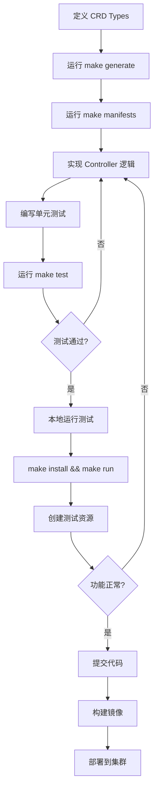

# API 开发入门指南

本指南将帮助您搭建 edge-apiserver 开发环境，理解项目结构，并创建第一个 CRD 和 Controller。

## 环境要求

### 必需工具

| 工具 | 最低版本 | 用途 | 安装命令 |
|------|---------|------|---------|
| **Go** | 1.19+ | 编程语言 | `brew install go` |
| **Docker** | 20.0+ | 容器构建 | `brew install docker` |
| **kubectl** | 1.25+ | K8s 客户端 | `brew install kubectl` |
| **kubebuilder** | 3.0+ | CRD 脚手架 | `brew install kubebuilder` |
| **make** | 3.8+ | 构建工具 | macOS 自带 |

### 可选工具

```bash
# goimports - 代码格式化
go install golang.org/x/tools/cmd/goimports@latest

# golangci-lint - 代码检查
brew install golangci-lint

# kustomize - 配置管理
brew install kustomize
```

### Kubernetes 集群

需要一个可用的 Kubernetes 集群用于测试：

```bash
# 选项 1: 本地 Kind 集群（推荐）
brew install kind
kind create cluster --name edge-dev

# 选项 2: 使用现有集群
export KUBECONFIG=/path/to/kubeconfig

# 验证集群连接
kubectl cluster-info
```

## 项目结构详解

```
edge-apiserver/
├── api/                          # CRD 定义
│   ├── iam/v1alpha1/            # IAM 相关 CRD
│   │   ├── iamrole_types.go
│   │   ├── roletemplate_types.go
│   │   └── reverseproxy_types.go
│   └── scope/v1alpha1/          # 作用域相关 CRD
│       └── workspace_types.go
│
├── internal/controller/          # Controller 实现
│   ├── roletemplate_controller.go
│   ├── scope_controller.go
│   └── cluster_controller.go
│
├── pkg/                          # 核心功能包
│   ├── apiserver/               # APIServer 实现
│   │   ├── authorization/       # 权限控制
│   │   ├── request/            # 请求处理
│   │   └── filters/            # 过滤器链
│   ├── constants/               # 常量定义
│   └── utils/                   # 工具函数
│
├── config/                       # 部署配置
│   ├── crd/bases/               # 生成的 CRD YAML
│   ├── rbac/                    # RBAC 配置
│   └── manager/                 # Controller Manager 配置
│
├── cmd/                          # 入口程序
│   ├── main.go                  # Controller 入口
│   └── apiserver/main.go        # APIServer 入口
│
├── build/                        # 构建脚本
│   ├── apiserver/Dockerfile
│   └── controller/Dockerfile
│
├── Makefile                      # 构建命令
└── go.mod                        # Go 模块定义
```

### 核心目录说明

#### 1. `api/` - CRD 定义层

所有自定义资源定义都在这里，按 API Group 组织：

```go
// api/iam/v1alpha1/iamrole_types.go
package v1alpha1

type IAMRole struct {
    metav1.TypeMeta   `json:",inline"`
    metav1.ObjectMeta `json:"metadata,omitempty"`
    Spec   IAMRoleSpec   `json:"spec,omitempty"`
    Status IAMRoleStatus `json:"status,omitempty"`
}
```

#### 2. `internal/controller/` - 控制器逻辑层

实现 Kubernetes Operator Pattern 的核心逻辑：

```go
// internal/controller/roletemplate_controller.go
func (r *RoleTemplateReconciler) Reconcile(ctx context.Context, req ctrl.Request) (ctrl.Result, error) {
    // 核心协调逻辑
}
```

#### 3. `pkg/apiserver/` - API 服务层

提供自定义 API 端点和权限控制：

```go
// pkg/apiserver/authorization/universal_authorizer.go
func (a *UniversalAuthorizer) Authorize(ctx context.Context, attrs authorizer.Attributes) (authorizer.Decision, string, error) {
    // 统一权限控制逻辑
}
```

## Makefile 常用命令

### 开发命令

```bash
# 生成 CRD 和 RBAC 配置
make manifests

# 生成 DeepCopy 代码
make generate

# 代码格式化
make fmt

# 代码检查
make vet

# 运行所有单元测试
make test

# 代码风格检查
make lint

# 自动修复代码风格问题
make lint-fix
```

### 构建命令

```bash
# 构建 Controller 二进制
make controller

# 构建 APIServer 二进制
make apiserver

# 同时构建两者
make build

# 构建 Docker 镜像
make docker-build-all

# 推送 Docker 镜像
make docker-push-all
```

### 运行命令

```bash
# 本地运行 Controller
make run

# 本地运行 APIServer
make run-apiserver

# 开发模式运行 APIServer（跳过权限检查）
make run-apiserver-dev
```

### 部署命令

```bash
# 安装 CRD 到集群
make install

# 卸载 CRD
make uninstall

# 部署 Controller 到集群
make deploy

# 从集群卸载
make undeploy
```

## Hello World: 创建第一个 CRD

让我们创建一个简单的 `EdgeDevice` CRD 来管理边缘设备。

### 步骤 1: 初始化 API

```bash
cd edge-apiserver

# 创建新的 API Group 和 Kind
kubebuilder create api \
  --group edge \
  --version v1alpha1 \
  --kind EdgeDevice \
  --resource \
  --controller

# 输出：
# Create Resource [y/n]
# y
# Create Controller [y/n]
# y
```

这会生成：
- `api/edge/v1alpha1/edgedevice_types.go` - CRD 定义
- `internal/controller/edgedevice_controller.go` - Controller 实现

### 步骤 2: 定义 CRD 结构

编辑 `api/edge/v1alpha1/edgedevice_types.go`:

```go
package v1alpha1

import (
    metav1 "k8s.io/apimachinery/pkg/apis/meta/v1"
)

// EdgeDeviceSpec 定义边缘设备的期望状态
type EdgeDeviceSpec struct {
    // DeviceType 设备类型 (gateway, sensor, camera)
    // +kubebuilder:validation:Enum=gateway;sensor;camera
    DeviceType string `json:"deviceType"`

    // IPAddress 设备 IP 地址
    // +kubebuilder:validation:Pattern=`^((25[0-5]|(2[0-4]|1\d|[1-9]|)\d)\.?\b){4}$`
    IPAddress string `json:"ipAddress"`

    // Location 设备物理位置
    // +optional
    Location string `json:"location,omitempty"`

    // Enabled 是否启用设备
    // +kubebuilder:default=true
    Enabled bool `json:"enabled"`
}

// EdgeDeviceStatus 定义边缘设备的观测状态
type EdgeDeviceStatus struct {
    // Phase 设备当前阶段 (Pending, Running, Failed)
    // +optional
    Phase string `json:"phase,omitempty"`

    // LastHeartbeat 最后心跳时间
    // +optional
    LastHeartbeat *metav1.Time `json:"lastHeartbeat,omitempty"`

    // Conditions 设备状况
    // +optional
    Conditions []metav1.Condition `json:"conditions,omitempty"`
}

//+kubebuilder:object:root=true
//+kubebuilder:subresource:status
//+kubebuilder:resource:scope=Cluster,shortName=edev
//+kubebuilder:printcolumn:name="Type",type="string",JSONPath=".spec.deviceType"
//+kubebuilder:printcolumn:name="IP",type="string",JSONPath=".spec.ipAddress"
//+kubebuilder:printcolumn:name="Phase",type="string",JSONPath=".status.phase"
//+kubebuilder:printcolumn:name="Age",type="date",JSONPath=".metadata.creationTimestamp"

// EdgeDevice 是边缘设备的 Schema
type EdgeDevice struct {
    metav1.TypeMeta   `json:",inline"`
    metav1.ObjectMeta `json:"metadata,omitempty"`

    Spec   EdgeDeviceSpec   `json:"spec,omitempty"`
    Status EdgeDeviceStatus `json:"status,omitempty"`
}

//+kubebuilder:object:root=true

// EdgeDeviceList 包含 EdgeDevice 列表
type EdgeDeviceList struct {
    metav1.TypeMeta `json:",inline"`
    metav1.ListMeta `json:"metadata,omitempty"`
    Items           []EdgeDevice `json:"items"`
}

func init() {
    SchemeBuilder.Register(&EdgeDevice{}, &EdgeDeviceList{})
}
```

### 步骤 3: 实现 Controller 逻辑

编辑 `internal/controller/edgedevice_controller.go`:

```go
package controller

import (
    "context"
    "time"

    metav1 "k8s.io/apimachinery/pkg/apis/meta/v1"
    "k8s.io/apimachinery/pkg/runtime"
    ctrl "sigs.k8s.io/controller-runtime"
    "sigs.k8s.io/controller-runtime/pkg/client"
    "sigs.k8s.io/controller-runtime/pkg/log"

    edgev1alpha1 "github.com/theriseunion/apiserver/api/edge/v1alpha1"
)

// EdgeDeviceReconciler reconciles a EdgeDevice object
type EdgeDeviceReconciler struct {
    client.Client
    Scheme *runtime.Scheme
}

//+kubebuilder:rbac:groups=edge.theriseunion.io,resources=edgedevices,verbs=get;list;watch;create;update;patch;delete
//+kubebuilder:rbac:groups=edge.theriseunion.io,resources=edgedevices/status,verbs=get;update;patch
//+kubebuilder:rbac:groups=edge.theriseunion.io,resources=edgedevices/finalizers,verbs=update

// Reconcile 实现设备状态同步逻辑
func (r *EdgeDeviceReconciler) Reconcile(ctx context.Context, req ctrl.Request) (ctrl.Result, error) {
    logger := log.FromContext(ctx)

    // 1. 获取 EdgeDevice 资源
    device := &edgev1alpha1.EdgeDevice{}
    if err := r.Get(ctx, req.NamespacedName, device); err != nil {
        return ctrl.Result{}, client.IgnoreNotFound(err)
    }

    logger.Info("Reconciling EdgeDevice", "name", device.Name, "type", device.Spec.DeviceType)

    // 2. 更新设备状态
    now := metav1.Now()
    device.Status.LastHeartbeat = &now

    if device.Spec.Enabled {
        device.Status.Phase = "Running"
    } else {
        device.Status.Phase = "Disabled"
    }

    // 3. 更新 Condition
    condition := metav1.Condition{
        Type:               "Ready",
        Status:             metav1.ConditionTrue,
        LastTransitionTime: now,
        Reason:             "DeviceHealthy",
        Message:            "Device is healthy and responding",
    }
    device.Status.Conditions = []metav1.Condition{condition}

    // 4. 保存状态
    if err := r.Status().Update(ctx, device); err != nil {
        logger.Error(err, "Failed to update EdgeDevice status")
        return ctrl.Result{}, err
    }

    logger.Info("Successfully reconciled EdgeDevice", "name", device.Name, "phase", device.Status.Phase)

    // 5. 定期重新协调（模拟健康检查）
    return ctrl.Result{RequeueAfter: 30 * time.Second}, nil
}

// SetupWithManager sets up the controller with the Manager.
func (r *EdgeDeviceReconciler) SetupWithManager(mgr ctrl.Manager) error {
    return ctrl.NewControllerManagedBy(mgr).
        For(&edgev1alpha1.EdgeDevice{}).
        Complete(r)
}
```

### 步骤 4: 生成代码和配置

```bash
# 生成 DeepCopy 方法
make generate

# 生成 CRD YAML
make manifests

# 检查生成的 CRD
cat config/crd/bases/edge.theriseunion.io_edgedevices.yaml
```

### 步骤 5: 安装和测试

```bash
# 安装 CRD 到集群
make install

# 验证 CRD 已安装
kubectl get crds | grep edgedevices

# 本地运行 Controller
make run
```

在另一个终端创建测试资源：

```yaml
# test-device.yaml
apiVersion: edge.theriseunion.io/v1alpha1
kind: EdgeDevice
metadata:
  name: gateway-001
spec:
  deviceType: gateway
  ipAddress: 192.168.1.100
  location: Building A - Floor 1
  enabled: true
```

```bash
# 创建设备
kubectl apply -f test-device.yaml

# 查看设备列表
kubectl get edgedevices
# 输出：
# NAME          TYPE      IP              PHASE     AGE
# gateway-001   gateway   192.168.1.100   Running   10s

# 查看详细信息
kubectl describe edgedevice gateway-001

# 查看状态更新
kubectl get edgedevice gateway-001 -o jsonpath='{.status}' | jq
```

## 调试技巧和工具

### 1. 启用详细日志

```bash
# Controller 日志级别
go run cmd/main.go --zap-log-level=debug

# APIServer 日志级别
./bin/apiserver --v=4
```

### 2. 使用 Delve 调试器

```bash
# 安装 Delve
go install github.com/go-delve/delve/cmd/dlv@latest

# 调试 Controller
dlv debug cmd/main.go -- --kubeconfig ~/.kube/config

# 在代码中设置断点
(dlv) break internal/controller/edgedevice_controller.go:30
(dlv) continue
```

### 3. 查看 Controller 事件

```bash
# 查看所有事件
kubectl get events --all-namespaces --sort-by='.lastTimestamp'

# 查看特定资源的事件
kubectl describe edgedevice gateway-001
```

### 4. 使用 kubebuilder 工具

```bash
# 检查 API 定义
kubebuilder create webhook --group edge --version v1alpha1 --kind EdgeDevice

# 验证 CRD 定义
kubectl explain edgedevice
kubectl explain edgedevice.spec
```

### 5. 常用调试命令

```bash
# 查看 CRD 定义
kubectl get crd edgedevices.edge.theriseunion.io -o yaml

# 测试字段验证
kubectl apply -f - <<EOF
apiVersion: edge.theriseunion.io/v1alpha1
kind: EdgeDevice
metadata:
  name: invalid-device
spec:
  deviceType: invalid  # 应该失败：不在枚举范围内
  ipAddress: 192.168.1.100
  enabled: true
EOF

# 查看 Controller 日志
kubectl logs -n edge-system deployment/edge-controller -f
```

## 开发工作流



## 项目配置文件

### `.golangci.yml` - 代码检查配置

```yaml
linters:
  enable:
    - gofmt
    - govet
    - staticcheck
    - gosimple
    - ineffassign
    - unused

linters-settings:
  govet:
    check-shadowing: true
  staticcheck:
    go: "1.19"
```

### `PROJECT` - Kubebuilder 项目配置

```yaml
domain: theriseunion.io
repo: github.com/theriseunion/apiserver
resources:
- api:
    crdVersion: v1
    namespaced: false
  controller: true
  domain: theriseunion.io
  group: edge
  kind: EdgeDevice
  version: v1alpha1
```

## 环境变量

常用环境变量配置：

```bash
# Go 环境
export GOPATH=$HOME/go
export PATH=$PATH:$GOPATH/bin

# Kubernetes 配置
export KUBECONFIG=~/.kube/config

# 开发模式（跳过权限检查）
export AlwaysAllow=1

# APIServer 端口
export PORT=8080

# Controller 日志级别
export LOG_LEVEL=debug
```

## 常见问题

### 1. CRD 安装失败

```bash
# 问题：CRD validation failed
# 解决：检查 kubebuilder markers 语法
make manifests
kubectl apply -f config/crd/bases/xxx.yaml --validate=false --dry-run=server
```

### 2. Controller 无法启动

```bash
# 问题：Failed to get API Group resources
# 解决：确保 CRD 已安装且 kubeconfig 正确
make install
kubectl get crds
```

### 3. 代码生成失败

```bash
# 问题：deepcopy-gen: error
# 解决：确保所有类型都实现了 runtime.Object
make generate
```

## 下一步阅读

- [CRD 开发指南](./crd-development.md) - 深入学习 CRD 设计模式
- [Controller 开发](./controller.md) - 掌握 Reconcile 循环实现
- [API Service 开发](./api-service.md) - 创建自定义 API 端点
- [核心概念](../concepts/crd-system.md) - 理解 CRD 系统架构

---

**提示**: 本示例展示了一个完整的 CRD 开发流程，实际项目中需要考虑更多因素如错误处理、性能优化、高可用等。
