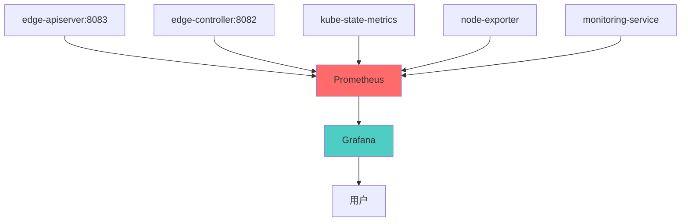

# Metrics 和监控指南

本指南讲解如何为 edge-apiserver 和 Controller 添加 Prometheus 监控指标，构建完整的可观测性体系。

## Prometheus 监控集成

### 监控栈架构

edge-platform 使用 Prometheus + Grafana 监控栈：



### 部署配置

```bash
# 部署监控栈（已部署到 observability-system 命名空间）
kubectl get all -n observability-system

# 输出：
# NAME                                   READY   STATUS    RESTARTS   AGE
# pod/edge-prometheus-...                1/1     Running   0          10d
# pod/edge-grafana-...                   1/1     Running   0          10d
# pod/edge-kube-state-metrics-...        1/1     Running   0          10d
# pod/edge-node-exporter-...             1/1     Running   0          10d

# 访问 Prometheus UI
kubectl port-forward -n observability-system service/edge-prometheus 9090:9090

# 访问 Grafana UI（默认密码：admin123）
kubectl port-forward -n observability-system service/edge-grafana 3000:3000
```

## 自定义指标定义和暴露

### Controller 指标

```go
// internal/controller/metrics.go
package controller

import (
    "github.com/prometheus/client_golang/prometheus"
    "sigs.k8s.io/controller-runtime/pkg/metrics"
)

var (
    // Reconcile 执行次数
    reconcileTotal = prometheus.NewCounterVec(
        prometheus.CounterOpts{
            Name: "controller_reconcile_total",
            Help: "Total number of reconciliations per controller",
        },
        []string{"controller", "result"},  // result: success/error
    )

    // Reconcile 执行时间
    reconcileDuration = prometheus.NewHistogramVec(
        prometheus.HistogramOpts{
            Name:    "controller_reconcile_duration_seconds",
            Help:    "Reconcile duration in seconds",
            Buckets: []float64{0.001, 0.01, 0.1, 0.5, 1.0, 2.0, 5.0, 10.0},
        },
        []string{"controller"},
    )

    // 工作队列深度
    workqueueDepth = prometheus.NewGaugeVec(
        prometheus.GaugeOpts{
            Name: "controller_workqueue_depth",
            Help: "Current depth of workqueue",
        },
        []string{"controller"},
    )

    // 资源计数
    resourceCount = prometheus.NewGaugeVec(
        prometheus.GaugeOpts{
            Name: "controller_resource_count",
            Help: "Number of resources managed by controller",
        },
        []string{"controller", "resource"},
    )
)

func init() {
    // 注册指标到 controller-runtime 的默认 registry
    metrics.Registry.MustRegister(
        reconcileTotal,
        reconcileDuration,
        workqueueDepth,
        resourceCount,
    )
}
```

### APIServer 指标

```go
// pkg/apiserver/metrics/metrics.go
package metrics

import (
    "github.com/prometheus/client_golang/prometheus"
    "github.com/prometheus/client_golang/prometheus/promauto"
)

var (
    // API 请求总数
    apiRequestsTotal = promauto.NewCounterVec(
        prometheus.CounterOpts{
            Name: "apiserver_request_total",
            Help: "Total number of API requests",
        },
        []string{"method", "path", "code"},
    )

    // API 请求延迟
    apiRequestDuration = promauto.NewHistogramVec(
        prometheus.HistogramOpts{
            Name:    "apiserver_request_duration_seconds",
            Help:    "API request duration in seconds",
            Buckets: prometheus.DefBuckets,
        },
        []string{"method", "path"},
    )

    // 当前活跃连接数
    apiActiveConnections = promauto.NewGauge(
        prometheus.GaugeOpts{
            Name: "apiserver_active_connections",
            Help: "Number of active connections",
        },
    )

    // 认证失败次数
    authFailuresTotal = promauto.NewCounterVec(
        prometheus.CounterOpts{
            Name: "apiserver_authentication_failures_total",
            Help: "Total number of authentication failures",
        },
        []string{"reason"},
    )

    // 授权失败次数
    authzFailuresTotal = promauto.NewCounterVec(
        prometheus.CounterOpts{
            Name: "apiserver_authorization_failures_total",
            Help: "Total number of authorization failures",
        },
        []string{"user", "resource", "verb"},
    )
)
```

## Controller 指标最佳实践

### 在 Reconcile 中使用指标

```go
package controller

import (
    "context"
    "time"

    ctrl "sigs.k8s.io/controller-runtime"
    "sigs.k8s.io/controller-runtime/pkg/log"
)

func (r *RoleTemplateReconciler) Reconcile(ctx context.Context, req ctrl.Request) (ctrl.Result, error) {
    logger := log.FromContext(ctx)
    start := time.Now()

    // 记录开始
    logger.V(4).Info("Starting reconciliation", "resource", req.NamespacedName)

    // 获取资源
    roleTemplate := &iamv1alpha1.RoleTemplate{}
    if err := r.Get(ctx, req.NamespacedName, roleTemplate); err != nil {
        // 记录失败指标
        reconcileTotal.WithLabelValues("roletemplate", "error").Inc()
        reconcileDuration.WithLabelValues("roletemplate").Observe(time.Since(start).Seconds())
        return ctrl.Result{}, client.IgnoreNotFound(err)
    }

    // 执行业务逻辑
    if err := r.updateIAMRolesWithAggregation(ctx, roleTemplate); err != nil {
        // 记录失败指标
        reconcileTotal.WithLabelValues("roletemplate", "error").Inc()
        reconcileDuration.WithLabelValues("roletemplate").Observe(time.Since(start).Seconds())
        return ctrl.Result{}, err
    }

    // 记录成功指标
    reconcileTotal.WithLabelValues("roletemplate", "success").Inc()
    reconcileDuration.WithLabelValues("roletemplate").Observe(time.Since(start).Seconds())

    logger.V(4).Info("Reconciliation completed", "duration", time.Since(start))
    return ctrl.Result{}, nil
}
```

### 监控队列深度

```go
func (r *RoleTemplateReconciler) SetupWithManager(mgr ctrl.Manager) error {
    // 启动后台 goroutine 定期更新队列深度
    go r.monitorQueueDepth()

    return ctrl.NewControllerManagedBy(mgr).
        For(&iamv1alpha1.RoleTemplate{}).
        Complete(r)
}

func (r *RoleTemplateReconciler) monitorQueueDepth() {
    ticker := time.NewTicker(10 * time.Second)
    defer ticker.Stop()

    for range ticker.C {
        // 获取队列深度（需要访问 workqueue）
        depth := r.getWorkqueueDepth()
        workqueueDepth.WithLabelValues("roletemplate").Set(float64(depth))
    }
}
```

### 监控资源数量

```go
func (r *RoleTemplateReconciler) updateResourceCounts(ctx context.Context) {
    // 统计 RoleTemplate 数量
    var templateList iamv1alpha1.RoleTemplateList
    if err := r.List(ctx, &templateList); err == nil {
        resourceCount.WithLabelValues("roletemplate", "total").Set(float64(len(templateList.Items)))
    }

    // 统计 IAMRole 数量
    var roleList iamv1alpha1.IAMRoleList
    if err := r.List(ctx, &roleList); err == nil {
        resourceCount.WithLabelValues("roletemplate", "iamroles").Set(float64(len(roleList.Items)))
    }
}
```

## Grafana Dashboard 设计

### 创建 Controller Dashboard

```json
{
  "dashboard": {
    "title": "Edge Controller Metrics",
    "panels": [
      {
        "title": "Reconcile Rate",
        "targets": [
          {
            "expr": "rate(controller_reconcile_total[5m])",
            "legendFormat": "{{controller}} - {{result}}"
          }
        ]
      },
      {
        "title": "Reconcile Duration (P95)",
        "targets": [
          {
            "expr": "histogram_quantile(0.95, rate(controller_reconcile_duration_seconds_bucket[5m]))",
            "legendFormat": "{{controller}}"
          }
        ]
      },
      {
        "title": "Workqueue Depth",
        "targets": [
          {
            "expr": "controller_workqueue_depth",
            "legendFormat": "{{controller}}"
          }
        ]
      },
      {
        "title": "Resource Count",
        "targets": [
          {
            "expr": "controller_resource_count",
            "legendFormat": "{{controller}} - {{resource}}"
          }
        ]
      }
    ]
  }
}
```

### 创建 APIServer Dashboard

```json
{
  "dashboard": {
    "title": "Edge APIServer Metrics",
    "panels": [
      {
        "title": "Request Rate by Path",
        "targets": [
          {
            "expr": "rate(apiserver_request_total[5m])",
            "legendFormat": "{{method}} {{path}} - {{code}}"
          }
        ]
      },
      {
        "title": "Request Duration (P50, P95, P99)",
        "targets": [
          {
            "expr": "histogram_quantile(0.50, rate(apiserver_request_duration_seconds_bucket[5m]))",
            "legendFormat": "P50"
          },
          {
            "expr": "histogram_quantile(0.95, rate(apiserver_request_duration_seconds_bucket[5m]))",
            "legendFormat": "P95"
          },
          {
            "expr": "histogram_quantile(0.99, rate(apiserver_request_duration_seconds_bucket[5m]))",
            "legendFormat": "P99"
          }
        ]
      },
      {
        "title": "Active Connections",
        "targets": [
          {
            "expr": "apiserver_active_connections"
          }
        ]
      },
      {
        "title": "Authentication Failures",
        "targets": [
          {
            "expr": "rate(apiserver_authentication_failures_total[5m])",
            "legendFormat": "{{reason}}"
          }
        ]
      },
      {
        "title": "Authorization Failures",
        "targets": [
          {
            "expr": "rate(apiserver_authorization_failures_total[5m])",
            "legendFormat": "{{user}} - {{resource}}/{{verb}}"
          }
        ]
      }
    ]
  }
}
```

## 监控告警规则

### Prometheus 告警规则

```yaml
# prometheus-rules.yaml
apiVersion: v1
kind: ConfigMap
metadata:
  name: prometheus-rules
  namespace: observability-system
data:
  edge-controller.rules: |
    groups:
      - name: edge-controller
        interval: 30s
        rules:
          # Reconcile 错误率过高
          - alert: HighReconcileErrorRate
            expr: |
              rate(controller_reconcile_total{result="error"}[5m])
              /
              rate(controller_reconcile_total[5m])
              > 0.1
            for: 5m
            labels:
              severity: warning
            annotations:
              summary: "High reconcile error rate for {{$labels.controller}}"
              description: "Controller {{$labels.controller}} has error rate {{$value | humanizePercentage}}"

          # Reconcile 耗时过长
          - alert: SlowReconcile
            expr: |
              histogram_quantile(0.95, rate(controller_reconcile_duration_seconds_bucket[5m])) > 5
            for: 10m
            labels:
              severity: warning
            annotations:
              summary: "Slow reconcile for {{$labels.controller}}"
              description: "P95 reconcile duration is {{$value}}s"

          # 队列积压
          - alert: WorkqueueBacklog
            expr: controller_workqueue_depth > 100
            for: 10m
            labels:
              severity: warning
            annotations:
              summary: "Workqueue backlog for {{$labels.controller}}"
              description: "Workqueue depth is {{$value}}"

  edge-apiserver.rules: |
    groups:
      - name: edge-apiserver
        interval: 30s
        rules:
          # API 请求错误率过高
          - alert: HighAPIErrorRate
            expr: |
              rate(apiserver_request_total{code=~"5.."}[5m])
              /
              rate(apiserver_request_total[5m])
              > 0.05
            for: 5m
            labels:
              severity: critical
            annotations:
              summary: "High API error rate"
              description: "API error rate is {{$value | humanizePercentage}}"

          # API 响应时间过长
          - alert: SlowAPIResponse
            expr: |
              histogram_quantile(0.95, rate(apiserver_request_duration_seconds_bucket[5m])) > 2
            for: 5m
            labels:
              severity: warning
            annotations:
              summary: "Slow API response"
              description: "P95 response time is {{$value}}s"

          # 认证失败率过高
          - alert: HighAuthFailureRate
            expr: rate(apiserver_authentication_failures_total[5m]) > 10
            for: 5m
            labels:
              severity: warning
            annotations:
              summary: "High authentication failure rate"
              description: "Auth failure rate is {{$value}}/s"
```

## Edge 平台标签集成

### 节点标签映射

Prometheus 已配置 Edge 平台标准标签映射：

```yaml
# prometheus-config.yaml
scrape_configs:
  - job_name: 'kubernetes-nodes'
    kubernetes_sd_configs:
      - role: node
    relabel_configs:
      # 映射 theriseunion.io/nodegroup → nodegroup
      - source_labels: [__meta_kubernetes_node_label_theriseunion_io_nodegroup]
        target_label: nodegroup

      # 映射 theriseunion.io/managed → edge_managed
      - source_labels: [__meta_kubernetes_node_label_theriseunion_io_managed]
        target_label: edge_managed

      # 映射 theriseunion.io/username → creator
      - source_labels: [__meta_kubernetes_node_label_theriseunion_io_username]
        target_label: creator
```

### 使用标签查询

```promql
# 查询特定 nodegroup 的 CPU 使用率
node_cpu_seconds_total{nodegroup="edge-workers"}

# 查询 Edge 管理的容器内存使用
container_memory_usage_bytes{edge_managed="true"}

# 查询特定工作空间的 Pod 信息
kube_pod_info{workspace="production"}

# 查询特定创建者的资源
up{creator="admin"}
```

## 实战：为 Controller 添加监控

### 步骤 1: 定义指标

```go
// internal/controller/roletemplate_metrics.go
package controller

import (
    "github.com/prometheus/client_golang/prometheus"
    "sigs.k8s.io/controller-runtime/pkg/metrics"
)

var (
    roleTemplateAggregationTotal = prometheus.NewCounterVec(
        prometheus.CounterOpts{
            Name: "roletemplate_aggregation_total",
            Help: "Total number of template aggregations",
        },
        []string{"result"},
    )

    roleTemplateAggregationDuration = prometheus.NewHistogram(
        prometheus.HistogramOpts{
            Name:    "roletemplate_aggregation_duration_seconds",
            Help:    "Template aggregation duration",
            Buckets: []float64{0.01, 0.05, 0.1, 0.5, 1.0, 2.0},
        },
    )

    iamRolesUpdated = prometheus.NewCounter(
        prometheus.CounterOpts{
            Name: "roletemplate_iamroles_updated_total",
            Help: "Total number of IAMRoles updated",
        },
    )
)

func init() {
    metrics.Registry.MustRegister(
        roleTemplateAggregationTotal,
        roleTemplateAggregationDuration,
        iamRolesUpdated,
    )
}
```

### 步骤 2: 在代码中使用

```go
func (r *RoleTemplateReconciler) updateIAMRolesWithAggregation(
    ctx context.Context,
    template *iamv1alpha1.RoleTemplate,
) error {
    start := time.Now()

    // 执行聚合逻辑
    var iamRoleList iamv1alpha1.IAMRoleList
    if err := r.List(ctx, &iamRoleList); err != nil {
        roleTemplateAggregationTotal.WithLabelValues("error").Inc()
        return err
    }

    updated := 0
    for _, iamRole := range iamRoleList.Items {
        if r.shouldAggregateTemplateForIAMRole(&iamRole, template) {
            if err := r.recomputeIAMRole(ctx, &iamRole); err != nil {
                roleTemplateAggregationTotal.WithLabelValues("error").Inc()
                return err
            }
            updated++
            iamRolesUpdated.Inc()
        }
    }

    // 记录成功指标
    roleTemplateAggregationTotal.WithLabelValues("success").Inc()
    roleTemplateAggregationDuration.Observe(time.Since(start).Seconds())

    return nil
}
```

### 步骤 3: 创建 Dashboard

```json
{
  "title": "RoleTemplate Controller",
  "panels": [
    {
      "title": "Aggregation Rate",
      "targets": [
        {
          "expr": "rate(roletemplate_aggregation_total[5m])",
          "legendFormat": "{{result}}"
        }
      ]
    },
    {
      "title": "Aggregation Duration",
      "targets": [
        {
          "expr": "histogram_quantile(0.95, rate(roletemplate_aggregation_duration_seconds_bucket[5m]))"
        }
      ]
    },
    {
      "title": "IAMRoles Updated",
      "targets": [
        {
          "expr": "rate(roletemplate_iamroles_updated_total[5m])"
        }
      ]
    }
  ]
}
```

### 步骤 4: 配置告警

```yaml
- alert: RoleTemplateAggregationFailing
  expr: |
    rate(roletemplate_aggregation_total{result="error"}[5m])
    /
    rate(roletemplate_aggregation_total[5m])
    > 0.1
  for: 5m
  labels:
    severity: warning
  annotations:
    summary: "RoleTemplate aggregation failing"
    description: "Error rate is {{$value | humanizePercentage}}"
```

## 常见问题

### 1. 指标未暴露

```bash
# 问题：/metrics 端点返回空
# 解决：检查指标注册

# 确保 init() 函数执行
func init() {
    metrics.Registry.MustRegister(myMetric)
}

# 访问 metrics 端点
curl http://localhost:8082/metrics | grep controller_reconcile_total
```

### 2. 指标重复注册

```go
// 问题：panic: duplicate metrics collector registration attempted
// 解决：使用 sync.Once 确保只注册一次

var registerOnce sync.Once

func RegisterMetrics() {
    registerOnce.Do(func() {
        metrics.Registry.MustRegister(myMetric)
    })
}
```

### 3. Grafana 无法查询到指标

```bash
# 问题：Grafana 查询返回 No data
# 解决：检查 Prometheus 配置

# 检查 Prometheus targets
kubectl port-forward -n observability-system svc/edge-prometheus 9090:9090
# 访问 http://localhost:9090/targets

# 检查指标是否存在
# 访问 http://localhost:9090/graph
# 输入查询: controller_reconcile_total
```

## 下一步阅读

- [入门指南](./getting-started.md) - 开始开发
- [最佳实践](../best-practices/monitoring.md) - 监控最佳实践
- [生产部署](../../deployment/production.md) - 生产环境部署

---

**提示**: 完善的监控是保证系统可靠性的关键，建议为所有关键路径添加监控指标和告警规则。
