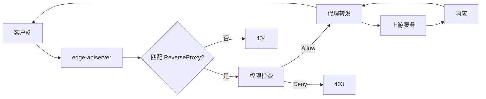

# Reverse Proxy 开发指南

本指南讲解如何使用 ReverseProxy CRD 将第三方服务集成到 edge-apiserver 统一权限体系中。

## ReverseProxy 设计概述

### 核心理念

ReverseProxy 允许将任何 HTTP 服务集成到 edge-platform 的权限管理体系中，实现：

- **统一认证授权**: 所有代理的 API 享受相同的认证授权机制
- **灵活路由配置**: 支持路径匹配、重写、头部处理等
- **企业级特性**: 连接池管理、健康检查、TLS 支持
- **传统系统集成**: 让传统 API 享受 Kubernetes 生态工具支持



## CRD 定义和字段说明

### 完整 CRD 定义

```go
// api/iam/v1alpha1/reverseproxy_types.go
package v1alpha1

type ReverseProxyMatcher struct {
    // Method HTTP 方法 (* 匹配所有方法)
    // +optional
    Method string `json:"method,omitempty"`

    // Path 路径模式（支持通配符）
    Path string `json:"path"`
}

type ReverseProxyUpstream struct {
    // Scheme 协议 (http/https)
    Scheme string `json:"scheme"`

    // Host 上游主机
    Host string `json:"host"`

    // Port 上游端口
    Port int32 `json:"port"`

    // InsecureSkipVerify 跳过 TLS 证书验证
    // +optional
    InsecureSkipVerify bool `json:"insecureSkipVerify,omitempty"`

    // CABundle CA 证书包 (Base64 编码)
    // +optional
    CABundle string `json:"caBundle,omitempty"`
}

type ReverseProxyDirectives struct {
    // AuthProxy 启用认证代理
    // +optional
    AuthProxy bool `json:"authProxy,omitempty"`

    // WrapTransport 包装传输层
    // +optional
    WrapTransport bool `json:"wrapTransport,omitempty"`

    // Method 重写 HTTP 方法
    // +optional
    Method string `json:"method,omitempty"`

    // StripPathPrefix 移除路径前缀
    // +optional
    StripPathPrefix string `json:"stripPathPrefix,omitempty"`

    // StripPathSuffix 移除路径后缀
    // +optional
    StripPathSuffix string `json:"stripPathSuffix,omitempty"`

    // HeaderUp 请求头修改
    // +optional
    HeaderUp []string `json:"headerUp,omitempty"`

    // HeaderDown 响应头修改
    // +optional
    HeaderDown []string `json:"headerDown,omitempty"`

    // Rewrite 路径重写规则
    // +optional
    Rewrite []ReverseProxyRewriteRule `json:"rewrite,omitempty"`

    // Replace 内容替换规则
    // +optional
    Replace []ReverseProxyReplaceRule `json:"replace,omitempty"`
}

type ReverseProxySpec struct {
    Matcher    ReverseProxyMatcher    `json:"matcher"`
    Upstream   ReverseProxyUpstream   `json:"upstream"`
    Directives ReverseProxyDirectives `json:"directives,omitempty"`
}

//+kubebuilder:object:root=true
//+kubebuilder:subresource:status
//+kubebuilder:printcolumn:name="Host",type="string",JSONPath=".spec.upstream.host"
//+kubebuilder:printcolumn:name="Port",type="integer",JSONPath=".spec.upstream.port"
//+kubebuilder:printcolumn:name="Path",type="string",JSONPath=".spec.matcher.path"
//+kubebuilder:printcolumn:name="State",type="string",JSONPath=".status.state"

type ReverseProxy struct {
    metav1.TypeMeta   `json:",inline"`
    metav1.ObjectMeta `json:"metadata,omitempty"`
    Spec   ReverseProxySpec   `json:"spec,omitempty"`
    Status ReverseProxyStatus `json:"status,omitempty"`
}
```

## 代理配置和路由规则

### 基础代理配置

```yaml
apiVersion: iam.theriseunion.io/v1alpha1
kind: ReverseProxy
metadata:
  name: example-api-proxy
spec:
  # 匹配规则
  matcher:
    method: "*"                    # 所有 HTTP 方法
    path: "/api/example/*"         # 前缀匹配

  # 上游服务
  upstream:
    scheme: http
    host: example-service.default.svc.cluster.local
    port: 8080

  # 基础指令
  directives:
    authProxy: true                # 启用认证传递
    stripPathPrefix: "/api/example"  # 移除路径前缀
```

### HTTPS 上游服务

```yaml
apiVersion: iam.theriseunion.io/v1alpha1
kind: ReverseProxy
metadata:
  name: https-api-proxy
spec:
  matcher:
    method: "GET"
    path: "/secure/*"

  upstream:
    scheme: https
    host: secure-api.example.com
    port: 443
    insecureSkipVerify: false      # 验证证书
    # Base64 编码的 CA 证书
    caBundle: LS0tLS1CRUdJTi...

  directives:
    authProxy: true
    wrapTransport: true            # 启用高级传输层功能
```

### 复杂路径重写

```yaml
spec:
  directives:
    # 路径裁剪
    stripPathPrefix: "/legacy"
    stripPathSuffix: ".json"

    # 正则重写规则
    rewrite:
      - from: "^/users/([0-9]+)$"
        to: "/api/user?id=$1"
      - from: "^/orders/([0-9]+)/items$"
        to: "/api/order/$1/items"
```

### 请求头处理

```yaml
spec:
  directives:
    # 上行请求头处理
    headerUp:
      - "X-Forwarded-Proto https"           # 替换
      - "+X-Custom-Header custom-value"     # 添加
      - "-User-Agent"                       # 删除
      - "-X-Forwarded-*"                    # 通配符删除

    # 下行响应头处理
    headerDown:
      - "X-Powered-By APIServer"            # 替换
      - "+Cache-Control no-cache"           # 添加
      - "-Server"                           # 删除服务器信息
```

## 权限过滤器实现

### 权限检查集成

ReverseProxy 自动与 UniversalAuthorizer 集成：

```go
// pkg/apiserver/filters/reverseproxy.go
func (f *ReverseProxyFilter) ServeHTTP(w http.ResponseWriter, req *http.Request) {
    ctx := req.Context()

    // 获取 RequestInfo
    requestInfo, ok := request.RequestInfoFrom(ctx)
    if !ok {
        http.Error(w, "RequestInfo not found", http.StatusInternalServerError)
        return
    }

    // 查找匹配的 ReverseProxy
    proxy := f.findMatchingProxy(requestInfo.Path)
    if proxy == nil {
        // 无匹配的代理，调用下一个 handler
        f.next.ServeHTTP(w, req)
        return
    }

    // 已经过 UniversalAuthorizer 检查，直接代理
    f.proxyRequest(w, req, proxy)
}
```

### 认证信息传递

```go
func (p *ProxyHandler) proxyRequest(w http.ResponseWriter, req *http.Request, proxy *ReverseProxy) {
    // 获取用户信息
    user, ok := request.UserFrom(req.Context())
    if !ok {
        http.Error(w, "Unauthorized", http.StatusUnauthorized)
        return
    }

    // 创建代理请求
    targetURL := fmt.Sprintf("%s://%s:%d%s",
        proxy.Spec.Upstream.Scheme,
        proxy.Spec.Upstream.Host,
        proxy.Spec.Upstream.Port,
        transformPath(req.URL.Path, proxy.Spec.Directives))

    proxyReq, err := http.NewRequest(req.Method, targetURL, req.Body)
    if err != nil {
        http.Error(w, err.Error(), http.StatusInternalServerError)
        return
    }

    // 复制原始请求头
    for key, values := range req.Header {
        for _, value := range values {
            proxyReq.Header.Add(key, value)
        }
    }

    // 添加认证信息
    if proxy.Spec.Directives.AuthProxy {
        proxyReq.Header.Set("X-Remote-User", user.GetName())
        proxyReq.Header.Set("X-Remote-Groups", strings.Join(user.GetGroups(), ","))
    }

    // 应用 HeaderUp 指令
    applyHeaderDirectives(proxyReq.Header, proxy.Spec.Directives.HeaderUp)

    // 执行代理
    client := p.getHTTPClient(proxy)
    resp, err := client.Do(proxyReq)
    if err != nil {
        http.Error(w, err.Error(), http.StatusBadGateway)
        return
    }
    defer resp.Body.Close()

    // 应用 HeaderDown 指令
    applyHeaderDirectives(resp.Header, proxy.Spec.Directives.HeaderDown)

    // 复制响应
    for key, values := range resp.Header {
        for _, value := range values {
            w.Header().Add(key, value)
        }
    }
    w.WriteHeader(resp.StatusCode)
    io.Copy(w, resp.Body)
}
```

## 监控和日志集成

### Prometheus 指标

```go
var (
    proxyRequestsTotal = prometheus.NewCounterVec(
        prometheus.CounterOpts{
            Name: "reverseproxy_requests_total",
            Help: "Total number of reverse proxy requests",
        },
        []string{"proxy_name", "method", "status_code"},
    )

    proxyRequestDuration = prometheus.NewHistogramVec(
        prometheus.HistogramOpts{
            Name:    "reverseproxy_request_duration_seconds",
            Help:    "Reverse proxy request duration in seconds",
            Buckets: prometheus.DefBuckets,
        },
        []string{"proxy_name", "method"},
    )
)

func (p *ProxyHandler) proxyWithMetrics(w http.ResponseWriter, req *http.Request, proxy *ReverseProxy) {
    start := time.Now()

    // 执行代理
    statusCode := p.doProxy(w, req, proxy)

    // 记录指标
    duration := time.Since(start).Seconds()
    proxyRequestsTotal.WithLabelValues(proxy.Name, req.Method, fmt.Sprintf("%d", statusCode)).Inc()
    proxyRequestDuration.WithLabelValues(proxy.Name, req.Method).Observe(duration)
}
```

### 结构化日志

```go
import "k8s.io/klog/v2"

func (p *ProxyHandler) proxyRequest(w http.ResponseWriter, req *http.Request, proxy *ReverseProxy) {
    logger := klog.FromContext(req.Context())

    logger.V(4).Info("Proxying request",
        "proxy", proxy.Name,
        "method", req.Method,
        "path", req.URL.Path,
        "upstream", proxy.Spec.Upstream.RawURL())

    // 执行代理...

    logger.V(4).Info("Proxy request completed",
        "proxy", proxy.Name,
        "status", statusCode,
        "duration", duration)
}
```

## 实战：集成第三方 API (Grafana)

### 场景：代理 Grafana API

将 Grafana 集成到 edge-platform，使用统一的权限控制。

#### 步骤 1: 创建 ReverseProxy

```yaml
apiVersion: iam.theriseunion.io/v1alpha1
kind: ReverseProxy
metadata:
  name: grafana-proxy
spec:
  # 匹配所有 /grafana/* 路径
  matcher:
    method: "*"
    path: "/grafana/*"

  # Grafana 服务配置
  upstream:
    scheme: http
    host: grafana.observability-system.svc.cluster.local
    port: 3000

  directives:
    # 启用认证传递
    authProxy: true

    # 移除 /grafana 前缀
    stripPathPrefix: "/grafana"

    # 添加 Grafana 所需的头部
    headerUp:
      - "+X-WEBAUTH-USER ${remote-user}"
      - "+X-Grafana-Org-Role Editor"

    # 移除敏感响应头
    headerDown:
      - "-X-Grafana-User-Id"
```

#### 步骤 2: 配置 RBAC 权限

```yaml
apiVersion: iam.theriseunion.io/v1alpha1
kind: RoleTemplate
metadata:
  name: grafana-viewer
  labels:
    iam.theriseunion.io/scope: cluster
spec:
  displayName: "Grafana Viewer"
  rules:
    - apiGroups: [""]
      resources: ["reverseproxies"]
      resourceNames: ["grafana-proxy"]
      verbs: ["get"]  # 允许访问 Grafana 代理
```

#### 步骤 3: 绑定权限

```yaml
apiVersion: iam.theriseunion.io/v1alpha1
kind: IAMRoleBinding
metadata:
  name: dev-team-grafana-access
spec:
  roleRef:
    name: grafana-viewer
  subjects:
    - kind: User
      name: alice
    - kind: Group
      name: developers
```

#### 步骤 4: 访问 Grafana

```bash
# 通过 edge-apiserver 访问 Grafana
curl -H "Authorization: Bearer $TOKEN" \
  http://edge-apiserver:8080/grafana/api/dashboards/home

# 权限检查流程:
# 1. edge-apiserver 验证 token
# 2. 解析 RequestInfo: path=/grafana/api/dashboards/home
# 3. 匹配 ReverseProxy: grafana-proxy
# 4. UniversalAuthorizer 检查权限: verb=get, resource=reverseproxies, name=grafana-proxy
# 5. 代理到 Grafana
```

## 使用场景

### 场景 1: 微服务 API 聚合

```yaml
# 用户服务代理
apiVersion: iam.theriseunion.io/v1alpha1
kind: ReverseProxy
metadata:
  name: user-service-proxy
spec:
  matcher:
    path: "/api/users/*"
  upstream:
    host: user-service.default.svc.cluster.local
    port: 8080
    scheme: http
  directives:
    authProxy: true
    stripPathPrefix: "/api/users"

---
# 订单服务代理
apiVersion: iam.theriseunion.io/v1alpha1
kind: ReverseProxy
metadata:
  name: order-service-proxy
spec:
  matcher:
    path: "/api/orders/*"
  upstream:
    host: order-service.default.svc.cluster.local
    port: 8080
    scheme: http
  directives:
    authProxy: true
    stripPathPrefix: "/api/orders"
```

### 场景 2: 传统系统集成

```yaml
apiVersion: iam.theriseunion.io/v1alpha1
kind: ReverseProxy
metadata:
  name: legacy-crm-proxy
spec:
  matcher:
    path: "/crm/*"
  upstream:
    host: legacy-crm.internal
    port: 3000
    scheme: http
  directives:
    authProxy: false  # 传统系统可能不支持
    stripPathPrefix: "/crm"

    # 请求转换
    headerUp:
      - "X-Legacy-System true"
      - "X-Integration-Version v2"

    # 路径适配
    rewrite:
      - from: "^/customers/([0-9]+)$"
        to: "/legacy/customer.php?id=$1"
```

### 场景 3: 外部 API 网关

```yaml
apiVersion: iam.theriseunion.io/v1alpha1
kind: ReverseProxy
metadata:
  name: external-api-proxy
spec:
  matcher:
    path: "/external/*"
  upstream:
    scheme: https
    host: api.external-service.com
    port: 443
  directives:
    authProxy: false
    stripPathPrefix: "/external"

    # API 密钥注入
    headerUp:
      - "Authorization Bearer ${API_KEY}"
      - "X-Client-ID ${CLIENT_ID}"

    # 移除内部头
    headerUp:
      - "-X-Internal-*"
```

## 性能调优

### 连接池配置

```go
// pkg/apiserver/reverseproxy/transport.go
func NewOptimizedTransport(proxy *ReverseProxy) *http.Transport {
    return &http.Transport{
        MaxIdleConnsPerHost: 100,      // 每个主机最大空闲连接
        IdleConnTimeout:     90 * time.Second,
        TLSHandshakeTimeout: 10 * time.Second,
        DialContext: (&net.Dialer{
            Timeout:   30 * time.Second,
            KeepAlive: 30 * time.Second,
        }).DialContext,
    }
}
```

### 健康检查

Controller 定期检查上游服务健康状态：

```go
func (r *ReverseProxyReconciler) checkUpstreamHealth(proxy *ReverseProxy) error {
    url := fmt.Sprintf("%s://%s:%d/", proxy.Spec.Upstream.Scheme, proxy.Spec.Upstream.Host, proxy.Spec.Upstream.Port)

    client := &http.Client{Timeout: 8 * time.Second}
    resp, err := client.Head(url)
    if err != nil {
        proxy.Status.State = ReverseProxyStateUnavailable
        proxy.Status.Message = fmt.Sprintf("Upstream unreachable: %v", err)
        return err
    }
    defer resp.Body.Close()

    if resp.StatusCode >= 500 {
        proxy.Status.State = ReverseProxyStateError
        proxy.Status.Message = fmt.Sprintf("Upstream error: %d", resp.StatusCode)
        return fmt.Errorf("upstream returned %d", resp.StatusCode)
    }

    proxy.Status.State = ReverseProxyStateAvailable
    proxy.Status.Message = "Upstream is healthy"
    return nil
}
```

## 常见问题

### 1. 代理不生效

```bash
# 问题：请求返回 404
# 解决：检查匹配规则

# 查看 ReverseProxy 列表
kubectl get reverseproxy

# 查看详细配置
kubectl describe reverseproxy grafana-proxy

# 检查路径匹配
# matcher.path: "/grafana/*"
# 请求路径: "/grafana/api/dashboards"  # 匹配
# 请求路径: "/api/grafana/dashboards"  # 不匹配
```

### 2. 上游服务不可达

```bash
# 问题：502 Bad Gateway
# 解决：检查上游服务

# 查看 ReverseProxy 状态
kubectl get reverseproxy grafana-proxy -o jsonpath='{.status}'

# 手动测试上游服务
kubectl run -it --rm debug --image=curlimages/curl --restart=Never -- \
  curl http://grafana.observability-system.svc.cluster.local:3000/
```

### 3. 认证传递失败

```yaml
# 问题：上游服务收不到用户信息
# 解决：检查 authProxy 和 headerUp 配置

spec:
  directives:
    authProxy: true  # 确保启用

    # 检查上游服务期望的头部格式
    headerUp:
      - "+X-Remote-User ${remote-user}"  # 添加用户信息
      - "+X-Remote-Groups ${remote-groups}"
```

## 下一步阅读

- [Metrics 监控](./metrics.md) - 添加 ReverseProxy 监控指标
- [权限体系](../permissions/overview.md) - 深入理解权限控制
- [最佳实践](../best-practices/api-design.md) - API 设计最佳实践

---

**提示**: ReverseProxy 是扩展 edge-platform 集成能力的关键机制，合理使用可以将任何 HTTP 服务无缝集成到统一的权限管理体系中。
