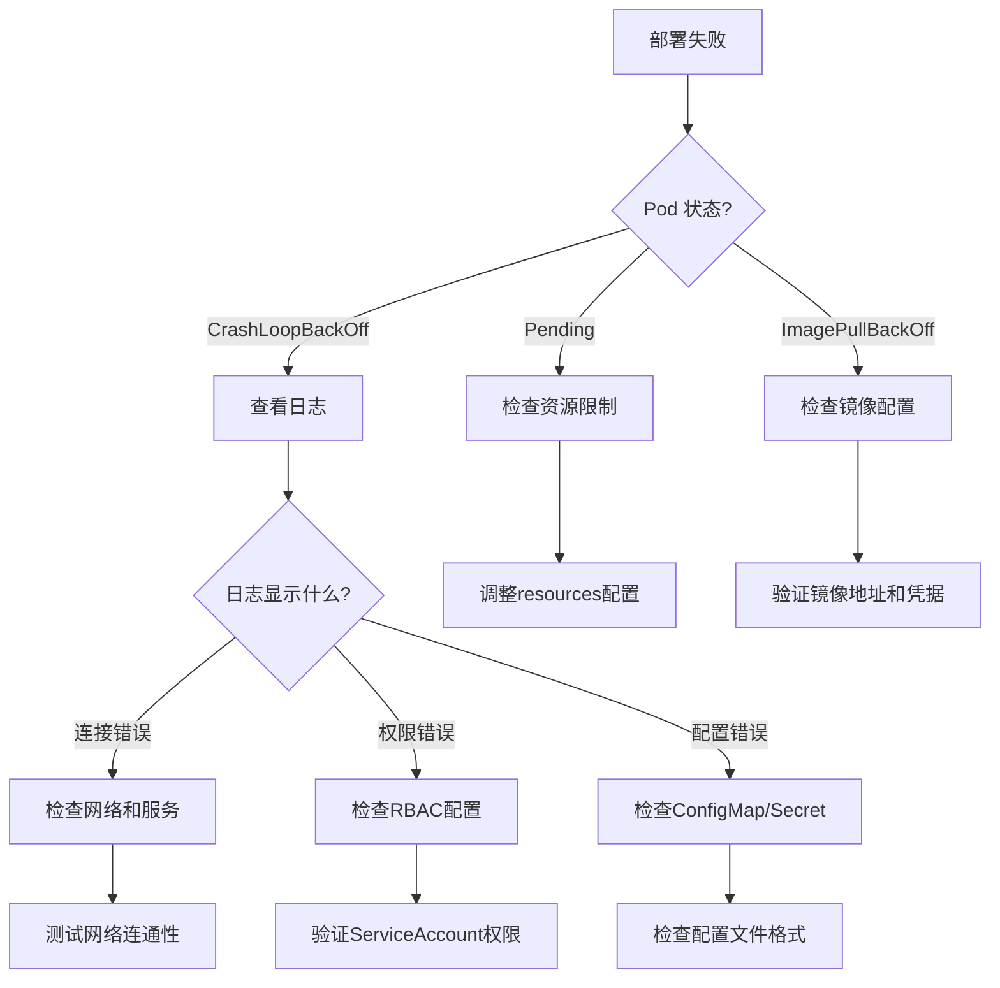

# 部署最佳实践

本文档介绍边缘平台的完整部署流程，包括 Helm Chart 配置、CI/CD 流程、多集群部署策略、健康检查配置和故障排查指南。

## Helm Chart 部署配置

### Chart 结构

```
edge-installer/
├── edge-apiserver/          # API Server Helm Chart
│   ├── Chart.yaml
│   ├── values.yaml
│   ├── templates/
│   │   ├── deployment.yaml
│   │   ├── service.yaml
│   │   ├── serviceaccount.yaml
│   │   ├── rbac.yaml
│   │   └── _helpers.tpl
│   └── .helmignore
├── edge-controller/         # Controller Helm Chart
│   └── ...
├── edge-console/            # Console Helm Chart
│   └── ...
└── edge-monitoring/         # Monitoring Stack
    └── ...
```

### values.yaml 配置详解

```yaml
# edge-installer/edge-apiserver/values.yaml
replicaCount: 2

image:
  repository: quanzhenglong.com/edge/apiserver
  pullPolicy: IfNotPresent
  tag: "main"

imagePullSecrets:
  - name: edge-registry-secret

serviceAccount:
  create: true
  annotations: {}
  name: "edge-apiserver"

rbac:
  create: true

service:
  type: ClusterIP
  port: 8080
  targetPort: 8080
  annotations:
    prometheus.io/scrape: "true"
    prometheus.io/port: "8080"
    prometheus.io/path: "/metrics"

ingress:
  enabled: true
  className: "nginx"
  annotations:
    cert-manager.io/cluster-issuer: "letsencrypt-prod"
    nginx.ingress.kubernetes.io/ssl-redirect: "true"
  hosts:
    - host: api.edge.example.com
      paths:
        - path: /
          pathType: Prefix
  tls:
    - secretName: edge-apiserver-tls
      hosts:
        - api.edge.example.com

resources:
  limits:
    cpu: 1000m
    memory: 1Gi
  requests:
    cpu: 100m
    memory: 256Mi

autoscaling:
  enabled: true
  minReplicas: 2
  maxReplicas: 10
  targetCPUUtilizationPercentage: 80
  targetMemoryUtilizationPercentage: 80

nodeSelector: {}

tolerations: []

affinity:
  podAntiAffinity:
    preferredDuringSchedulingIgnoredDuringExecution:
      - weight: 100
        podAffinityTerm:
          labelSelector:
            matchExpressions:
              - key: app
                operator: In
                values:
                  - edge-apiserver
          topologyKey: kubernetes.io/hostname

# 环境变量
env:
  - name: LOG_LEVEL
    value: "info"
  - name: AUTHORIZATION_MODE
    value: "RBAC"

# 配置文件
configMap:
  data:
    edge.yaml: |
      server:
        port: 8080
        readTimeout: 30s
        writeTimeout: 30s
      authentication:
        jwtSecret: "your-secret-key"
        tokenExpiration: 24h
      authorization:
        cacheEnabled: true
        cacheTTL: 5m

# 健康检查
livenessProbe:
  httpGet:
    path: /healthz
    port: 8080
  initialDelaySeconds: 15
  periodSeconds: 20
  timeoutSeconds: 5
  failureThreshold: 3

readinessProbe:
  httpGet:
    path: /readyz
    port: 8080
  initialDelaySeconds: 5
  periodSeconds: 10
  timeoutSeconds: 3
  failureThreshold: 3
```

### Deployment 模板

```yaml
# edge-installer/edge-apiserver/templates/deployment.yaml
apiVersion: apps/v1
kind: Deployment
metadata:
  name: {{ include "edge-apiserver.fullname" . }}
  labels:
    {{- include "edge-apiserver.labels" . | nindent 4 }}
spec:
  {{- if not .Values.autoscaling.enabled }}
  replicas: {{ .Values.replicaCount }}
  {{- end }}
  selector:
    matchLabels:
      {{- include "edge-apiserver.selectorLabels" . | nindent 6 }}
  template:
    metadata:
      annotations:
        checksum/config: {{ include (print $.Template.BasePath "/configmap.yaml") . | sha256sum }}
      labels:
        {{- include "edge-apiserver.selectorLabels" . | nindent 8 }}
    spec:
      {{- with .Values.imagePullSecrets }}
      imagePullSecrets:
        {{- toYaml . | nindent 8 }}
      {{- end }}
      serviceAccountName: {{ include "edge-apiserver.serviceAccountName" . }}
      securityContext:
        runAsNonRoot: true
        runAsUser: 1000
        fsGroup: 1000
      containers:
      - name: {{ .Chart.Name }}
        image: "{{ .Values.image.repository }}:{{ .Values.image.tag | default .Chart.AppVersion }}"
        imagePullPolicy: {{ .Values.image.pullPolicy }}
        ports:
        - name: http
          containerPort: {{ .Values.service.targetPort }}
          protocol: TCP
        livenessProbe:
          {{- toYaml .Values.livenessProbe | nindent 10 }}
        readinessProbe:
          {{- toYaml .Values.readinessProbe | nindent 10 }}
        resources:
          {{- toYaml .Values.resources | nindent 10 }}
        env:
        {{- toYaml .Values.env | nindent 8 }}
        volumeMounts:
        - name: config
          mountPath: /etc/edge
          readOnly: true
      volumes:
      - name: config
        configMap:
          name: {{ include "edge-apiserver.fullname" . }}
      {{- with .Values.nodeSelector }}
      nodeSelector:
        {{- toYaml . | nindent 8 }}
      {{- end }}
      {{- with .Values.affinity }}
      affinity:
        {{- toYaml . | nindent 8 }}
      {{- end }}
      {{- with .Values.tolerations }}
      tolerations:
        {{- toYaml . | nindent 8 }}
      {{- end }}
```

## edge-installer 使用指南

### 快速部署

```bash
# 使用默认配置部署
cd edge-installer
./deploy.sh

# 自定义配置部署
NAMESPACE=edge-prod \
REGISTRY=quanzhenglong.com/edge \
TAG=v1.0.0 \
ENABLE_MONITORING=true \
./deploy.sh
```

### deploy.sh 脚本详解

```bash
#!/bin/bash

# 配置变量
NAMESPACE=${NAMESPACE:-edge-system}
KUBECONFIG_PATH=${KUBECONFIG_PATH:-~/.kube/config}
REGISTRY=${REGISTRY:-quanzhenglong.com/edge}
TAG=${TAG:-main}
PULL_POLICY=${PULL_POLICY:-Always}
ENABLE_MONITORING=${ENABLE_MONITORING:-false}
INSTALL_OPENYURT=${INSTALL_OPENYURT:-false}

# 设置 kubeconfig
export KUBECONFIG=$KUBECONFIG_PATH

# 创建命名空间
kubectl create namespace $NAMESPACE --dry-run=client -o yaml | kubectl apply -f -

# 部署 Controller
echo "部署 Controller..."
helm upgrade --install controller ./edge-controller \
  --namespace $NAMESPACE \
  --set image.repository=$REGISTRY/controller \
  --set image.tag=$TAG \
  --set image.pullPolicy=$PULL_POLICY \
  --wait

# 部署 API Server
echo "部署 API Server..."
helm upgrade --install apiserver ./edge-apiserver \
  --namespace $NAMESPACE \
  --set image.repository=$REGISTRY/apiserver \
  --set image.tag=$TAG \
  --set image.pullPolicy=$PULL_POLICY \
  --wait

# 部署 Console
echo "部署 Console..."
helm upgrade --install console ./edge-console \
  --namespace $NAMESPACE \
  --set image.repository=$REGISTRY/console \
  --set image.tag=$TAG \
  --set image.pullPolicy=$PULL_POLICY \
  --set 'env[0].name=NEXT_PUBLIC_API_BASE_URL' \
  --set 'env[0].value=http://apiserver:8080' \
  --wait

# 可选：部署监控
if [ "$ENABLE_MONITORING" = "true" ]; then
  echo "部署监控套件..."
  kubectl create namespace observability-system --dry-run=client -o yaml | kubectl apply -f -

  helm upgrade --install edge-monitoring ./edge-monitoring \
    --namespace observability-system \
    --create-namespace \
    --wait \
    --timeout 10m
fi

echo "部署完成！"
kubectl get pods -n $NAMESPACE
```

## CI/CD 流程

### GitHub Actions 配置

```yaml
# .github/workflows/deploy.yaml
name: Build and Deploy

on:
  push:
    branches: [ main, develop ]
  pull_request:
    branches: [ main ]

env:
  REGISTRY: quanzhenglong.com/edge
  REGISTRY_USER: edge_admin

jobs:
  build-apiserver:
    name: Build API Server
    runs-on: ubuntu-latest
    steps:
    - uses: actions/checkout@v3

    - name: Set up Docker Buildx
      uses: docker/setup-buildx-action@v2

    - name: Log in to Registry
      uses: docker/login-action@v2
      with:
        registry: ${{ env.REGISTRY }}
        username: ${{ env.REGISTRY_USER }}
        password: ${{ secrets.REGISTRY_PASSWORD }}

    - name: Extract metadata
      id: meta
      uses: docker/metadata-action@v4
      with:
        images: ${{ env.REGISTRY }}/apiserver
        tags: |
          type=ref,event=branch
          type=ref,event=pr
          type=sha

    - name: Build and push
      uses: docker/build-push-action@v4
      with:
        context: ./edge-apiserver
        push: true
        tags: ${{ steps.meta.outputs.tags }}
        labels: ${{ steps.meta.outputs.labels }}
        cache-from: type=gha
        cache-to: type=gha,mode=max

  build-controller:
    name: Build Controller
    runs-on: ubuntu-latest
    steps:
    # 类似 apiserver

  build-console:
    name: Build Console
    runs-on: ubuntu-latest
    steps:
    - uses: actions/checkout@v3

    - name: Set up Node.js
      uses: actions/setup-node@v3
      with:
        node-version: '18'

    - name: Install pnpm
      run: npm install -g pnpm

    - name: Install dependencies
      run: |
        cd edge-console
        pnpm install

    - name: Build
      run: |
        cd edge-console
        pnpm build

    - name: Build Docker image
      uses: docker/build-push-action@v4
      with:
        context: ./edge-console
        push: true
        tags: ${{ env.REGISTRY }}/console:${{ github.sha }}

  deploy-dev:
    name: Deploy to Dev
    needs: [build-apiserver, build-controller, build-console]
    runs-on: ubuntu-latest
    if: github.ref == 'refs/heads/develop'
    steps:
    - uses: actions/checkout@v3

    - name: Set up kubectl
      uses: azure/setup-kubectl@v3

    - name: Configure kubeconfig
      run: |
        mkdir -p $HOME/.kube
        echo "${{ secrets.KUBECONFIG_DEV }}" > $HOME/.kube/config

    - name: Deploy
      run: |
        cd edge-installer
        NAMESPACE=edge-dev \
        TAG=${{ github.sha }} \
        ./deploy.sh

  deploy-prod:
    name: Deploy to Production
    needs: [build-apiserver, build-controller, build-console]
    runs-on: ubuntu-latest
    if: github.ref == 'refs/heads/main'
    environment: production
    steps:
    - uses: actions/checkout@v3

    - name: Set up kubectl
      uses: azure/setup-kubectl@v3

    - name: Configure kubeconfig
      run: |
        mkdir -p $HOME/.kube
        echo "${{ secrets.KUBECONFIG_PROD }}" > $HOME/.kube/config

    - name: Deploy with blue-green strategy
      run: |
        cd edge-installer
        # 部署到 green 环境
        NAMESPACE=edge-prod-green \
        TAG=${{ github.sha }} \
        ./deploy.sh

        # 等待健康检查
        kubectl wait --for=condition=ready pod \
          -l app=edge-apiserver \
          -n edge-prod-green \
          --timeout=300s

        # 切换流量
        kubectl patch service edge-apiserver \
          -n edge-prod \
          -p '{"spec":{"selector":{"version":"green"}}}'

        # 清理 blue 环境
        helm uninstall apiserver -n edge-prod-blue || true
```

### GitLab CI 配置

```yaml
# .gitlab-ci.yml
stages:
  - build
  - test
  - deploy

variables:
  REGISTRY: quanzhenglong.com/edge
  REGISTRY_USER: edge_admin

build:apiserver:
  stage: build
  image: docker:latest
  services:
    - docker:dind
  script:
    - docker login -u $REGISTRY_USER -p $REGISTRY_PASSWORD $REGISTRY
    - docker build -t $REGISTRY/apiserver:$CI_COMMIT_SHA edge-apiserver/
    - docker push $REGISTRY/apiserver:$CI_COMMIT_SHA
  only:
    - main
    - develop

test:unit:
  stage: test
  image: golang:1.21
  script:
    - cd edge-apiserver
    - make test
  coverage: '/coverage: \d+.\d+% of statements/'
  artifacts:
    reports:
      coverage_report:
        coverage_format: cobertura
        path: edge-apiserver/coverage.xml

deploy:dev:
  stage: deploy
  image: alpine/helm:latest
  script:
    - kubectl config use-context dev-cluster
    - cd edge-installer
    - NAMESPACE=edge-dev TAG=$CI_COMMIT_SHA ./deploy.sh
  only:
    - develop
  environment:
    name: development
    url: https://dev.edge.example.com

deploy:prod:
  stage: deploy
  image: alpine/helm:latest
  script:
    - kubectl config use-context prod-cluster
    - cd edge-installer
    - NAMESPACE=edge-prod TAG=$CI_COMMIT_SHA ./deploy.sh
  only:
    - main
  when: manual
  environment:
    name: production
    url: https://edge.example.com
```

## 多集群部署策略

### Karmada 集成

```yaml
# edge-installer/karmada/propagation-policy.yaml
apiVersion: policy.karmada.io/v1alpha1
kind: PropagationPolicy
metadata:
  name: edge-platform-policy
  namespace: edge-system
spec:
  resourceSelectors:
    - apiVersion: apps/v1
      kind: Deployment
      name: edge-apiserver
    - apiVersion: apps/v1
      kind: Deployment
      name: edge-controller
    - apiVersion: apps/v1
      kind: Deployment
      name: edge-console
  placement:
    clusterAffinity:
      clusterNames:
        - cluster-beijing
        - cluster-shanghai
        - cluster-guangzhou
    replicaScheduling:
      replicaDivisionPreference: Weighted
      replicaSchedulingType: Divided
      weightPreference:
        staticWeightList:
          - targetCluster:
              clusterNames:
                - cluster-beijing
            weight: 3
          - targetCluster:
              clusterNames:
                - cluster-shanghai
            weight: 2
          - targetCluster:
              clusterNames:
                - cluster-guangzhou
            weight: 1
```

## 滚动更新和蓝绿部署

### 滚动更新策略

```yaml
# edge-installer/edge-apiserver/templates/deployment.yaml
spec:
  strategy:
    type: RollingUpdate
    rollingUpdate:
      maxSurge: 1        # 最多额外创建1个 Pod
      maxUnavailable: 0  # 滚动更新期间0个 Pod 不可用
```

### 蓝绿部署

```bash
# scripts/blue-green-deploy.sh
#!/bin/bash

NAMESPACE="edge-prod"
NEW_VERSION="$1"
CURRENT_COLOR=$(kubectl get svc edge-apiserver -n $NAMESPACE -o jsonpath='{.spec.selector.version}')
NEW_COLOR=$([ "$CURRENT_COLOR" = "blue" ] && echo "green" || echo "blue")

echo "当前版本: $CURRENT_COLOR"
echo "新版本: $NEW_COLOR"

# 部署新版本
helm upgrade --install edge-apiserver-$NEW_COLOR ./edge-apiserver \
  --namespace $NAMESPACE \
  --set image.tag=$NEW_VERSION \
  --set labels.version=$NEW_COLOR \
  --wait

# 健康检查
kubectl wait --for=condition=ready pod \
  -l app=edge-apiserver,version=$NEW_COLOR \
  -n $NAMESPACE \
  --timeout=300s

# 运行烟雾测试
./scripts/smoke-test.sh edge-apiserver-$NEW_COLOR.$NAMESPACE.svc.cluster.local:8080

if [ $? -eq 0 ]; then
  echo "烟雾测试通过，切换流量..."

  # 切换流量
  kubectl patch svc edge-apiserver -n $NAMESPACE \
    -p "{\"spec\":{\"selector\":{\"version\":\"$NEW_COLOR\"}}}"

  echo "流量已切换到 $NEW_COLOR"

  # 等待一段时间确认稳定
  sleep 60

  # 清理旧版本
  helm uninstall edge-apiserver-$CURRENT_COLOR -n $NAMESPACE || true
else
  echo "烟雾测试失败，回滚..."
  helm uninstall edge-apiserver-$NEW_COLOR -n $NAMESPACE
  exit 1
fi
```

## 回滚策略

### Helm 回滚

```bash
# 查看发布历史
helm history edge-apiserver -n edge-system

# 回滚到上一版本
helm rollback edge-apiserver -n edge-system

# 回滚到指定版本
helm rollback edge-apiserver 5 -n edge-system
```

### Kubernetes 回滚

```bash
# 查看 Deployment 历史
kubectl rollout history deployment/edge-apiserver -n edge-system

# 回滚到上一版本
kubectl rollout undo deployment/edge-apiserver -n edge-system

# 回滚到指定版本
kubectl rollout undo deployment/edge-apiserver --to-revision=3 -n edge-system

# 查看回滚状态
kubectl rollout status deployment/edge-apiserver -n edge-system
```

## 健康检查和就绪探针

### 健康检查端点实现

```go
// cmd/apiserver/main.go
package main

import (
    "net/http"
    "github.com/gin-gonic/gin"
)

func setupHealthChecks(r *gin.Engine) {
    // Liveness Probe
    r.GET("/healthz", func(c *gin.Context) {
        c.JSON(http.StatusOK, gin.H{
            "status": "ok",
        })
    })

    // Readiness Probe
    r.GET("/readyz", func(c *gin.Context) {
        // 检查依赖服务
        if !checkKubernetesConnection() {
            c.JSON(http.StatusServiceUnavailable, gin.H{
                "status": "unavailable",
                "reason": "kubernetes connection failed",
            })
            return
        }

        if !checkRedisConnection() {
            c.JSON(http.StatusServiceUnavailable, gin.H{
                "status": "unavailable",
                "reason": "redis connection failed",
            })
            return
        }

        c.JSON(http.StatusOK, gin.H{
            "status": "ready",
        })
    })
}

func checkKubernetesConnection() bool {
    // 实现 Kubernetes API 连接检查
    _, err := k8sClient.ServerVersion()
    return err == nil
}

func checkRedisConnection() bool {
    // 实现 Redis 连接检查
    err := redisClient.Ping(context.Background()).Err()
    return err == nil
}
```

### 探针配置

```yaml
livenessProbe:
  httpGet:
    path: /healthz
    port: 8080
    scheme: HTTP
  initialDelaySeconds: 15   # 容器启动后等待15秒
  periodSeconds: 20          # 每20秒检查一次
  timeoutSeconds: 5          # 超时时间5秒
  successThreshold: 1        # 成功1次视为健康
  failureThreshold: 3        # 失败3次视为不健康

readinessProbe:
  httpGet:
    path: /readyz
    port: 8080
    scheme: HTTP
  initialDelaySeconds: 5     # 容器启动后等待5秒
  periodSeconds: 10          # 每10秒检查一次
  timeoutSeconds: 3          # 超时时间3秒
  successThreshold: 1        # 成功1次视为就绪
  failureThreshold: 3        # 失败3次视为未就绪
```

## 日志收集和分析

### Fluentd 配置

```yaml
# edge-installer/edge-monitoring/fluentd-configmap.yaml
apiVersion: v1
kind: ConfigMap
metadata:
  name: fluentd-config
  namespace: observability-system
data:
  fluent.conf: |
    # 收集 Kubernetes 日志
    <source>
      @type tail
      path /var/log/containers/edge-*.log
      pos_file /var/log/fluentd-containers.log.pos
      tag kubernetes.*
      read_from_head true
      <parse>
        @type json
        time_format %Y-%m-%dT%H:%M:%S.%NZ
      </parse>
    </source>

    # 添加 Kubernetes 元数据
    <filter kubernetes.**>
      @type kubernetes_metadata
      @id filter_kube_metadata
    </filter>

    # 输出到 Elasticsearch
    <match kubernetes.**>
      @type elasticsearch
      host elasticsearch.observability-system.svc.cluster.local
      port 9200
      logstash_format true
      logstash_prefix edge-platform
      <buffer>
        @type file
        path /var/log/fluentd-buffers/kubernetes.system.buffer
        flush_mode interval
        retry_type exponential_backoff
        flush_interval 5s
        retry_forever
        retry_max_interval 30
      </buffer>
    </match>
```

## 故障排查指南

### 常见问题排查流程



### 故障排查命令

```bash
# 1. 检查 Pod 状态
kubectl get pods -n edge-system
kubectl describe pod edge-apiserver-xxx -n edge-system

# 2. 查看日志
kubectl logs edge-apiserver-xxx -n edge-system
kubectl logs edge-apiserver-xxx -n edge-system --previous  # 查看上一次运行的日志

# 3. 进入容器调试
kubectl exec -it edge-apiserver-xxx -n edge-system -- /bin/sh

# 4. 检查事件
kubectl get events -n edge-system --sort-by='.lastTimestamp'

# 5. 检查网络
kubectl run -it --rm debug --image=nicolaka/netshoot --restart=Never -- /bin/bash
# 在容器内测试网络
nslookup edge-apiserver.edge-system.svc.cluster.local
curl http://edge-apiserver.edge-system.svc.cluster.local:8080/healthz

# 6. 检查资源使用
kubectl top pods -n edge-system
kubectl top nodes

# 7. 检查配置
kubectl get configmap edge-apiserver -n edge-system -o yaml
kubectl get secret edge-apiserver -n edge-system -o yaml

# 8. 检查RBAC
kubectl auth can-i list pods --as=system:serviceaccount:edge-system:edge-apiserver
kubectl describe clusterrole edge-apiserver
kubectl describe clusterrolebinding edge-apiserver
```

### 常见错误和解决方案

| 错误 | 原因 | 解决方案 |
|------|------|----------|
| ImagePullBackOff | 镜像拉取失败 | 检查镜像地址、凭据和网络 |
| CrashLoopBackOff | 容器启动后崩溃 | 查看日志，检查配置和依赖 |
| Pending | 资源不足或调度失败 | 增加节点资源或调整requests |
| 0/1 Ready | 就绪探针失败 | 检查健康检查端点和依赖服务 |
| ErrImagePull | 镜像不存在 | 确认镜像tag正确 |
| OOMKilled | 内存溢出 | 增加memory limits |

## 实战：完整的生产环境部署

### 1. 准备阶段

```bash
# 创建命名空间
kubectl create namespace edge-prod

# 创建镜像拉取凭据
kubectl create secret docker-registry edge-registry-secret \
  --docker-server=quanzhenglong.com \
  --docker-username=edge_admin \
  --docker-password=<password> \
  -n edge-prod

# 创建TLS证书（使用cert-manager）
kubectl apply -f - <<EOF
apiVersion: cert-manager.io/v1
kind: Certificate
metadata:
  name: edge-platform-tls
  namespace: edge-prod
spec:
  secretName: edge-platform-tls
  issuerRef:
    name: letsencrypt-prod
    kind: ClusterIssuer
  commonName: edge.example.com
  dnsNames:
  - edge.example.com
  - api.edge.example.com
EOF
```

### 2. 部署应用

```bash
cd edge-installer

# 部署 Controller
helm upgrade --install controller ./edge-controller \
  --namespace edge-prod \
  --set image.tag=v1.0.0 \
  --set replicaCount=2 \
  --set resources.limits.cpu=1 \
  --set resources.limits.memory=1Gi \
  --wait --timeout 10m

# 部署 API Server
helm upgrade --install apiserver ./edge-apiserver \
  --namespace edge-prod \
  --set image.tag=v1.0.0 \
  --set replicaCount=3 \
  --set autoscaling.enabled=true \
  --set autoscaling.minReplicas=3 \
  --set autoscaling.maxReplicas=10 \
  --set ingress.enabled=true \
  --set ingress.hosts[0].host=api.edge.example.com \
  --wait --timeout 10m

# 部署 Console
helm upgrade --install console ./edge-console \
  --namespace edge-prod \
  --set image.tag=v1.0.0 \
  --set replicaCount=2 \
  --set ingress.enabled=true \
  --set ingress.hosts[0].host=edge.example.com \
  --wait --timeout 10m
```

### 3. 验证部署

```bash
# 检查 Pod 状态
kubectl get pods -n edge-prod

# 检查服务
kubectl get svc -n edge-prod

# 检查 Ingress
kubectl get ingress -n edge-prod

# 健康检查
curl https://api.edge.example.com/healthz
curl https://api.edge.example.com/readyz

# 功能测试
curl -H "Authorization: Bearer $TOKEN" \
  https://api.edge.example.com/oapis/resources.theriseunion.io/v1alpha1/nodes
```

### 4. 监控部署

```bash
# 部署监控套件
helm upgrade --install edge-monitoring ./edge-monitoring \
  --namespace observability-system \
  --create-namespace \
  --wait --timeout 15m

# 访问 Grafana
kubectl port-forward svc/edge-grafana 3000:3000 -n observability-system

# 访问 Prometheus
kubectl port-forward svc/edge-prometheus 9090:9090 -n observability-system
```

## 最佳实践总结

1. **使用 Helm Charts**：统一管理配置和版本
2. **自动化部署**：CI/CD 管道自动化
3. **蓝绿部署**：零停机更新
4. **健康检查**：正确配置探针
5. **资源限制**：设置合理的 requests 和 limits
6. **日志收集**：集中式日志管理
7. **监控告警**：实时监控系统状态
8. **备份恢复**：定期备份关键数据

## 下一步阅读

- [性能优化](./performance.md) - 生产环境性能调优
- [安全实践](./security.md) - 生产环境安全加固
- [测试策略](./testing.md) - 部署前测试验证

## 参考资源

- [Helm 官方文档](https://helm.sh/docs/)
- [Kubernetes 部署最佳实践](https://kubernetes.io/docs/concepts/cluster-administration/manage-deployment/)
- [GitHub Actions 文档](https://docs.github.com/en/actions)
- [Karmada 文档](https://karmada.io/docs/)
