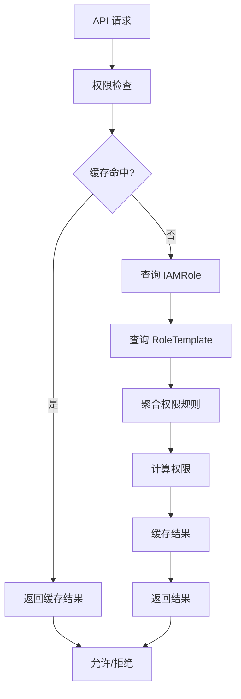

# 性能优化指南

本文档介绍边缘平台的性能优化策略，包括权限检查优化、三级缓存架构、数据库优化、Controller 性能调优以及前端性能优化。

## 权限检查性能优化

### 性能瓶颈分析

权限检查是边缘平台最频繁的操作之一，每个 API 请求都需要执行权限验证。未优化的权限检查会导致：

- **高延迟**：每次请求都需要查询 etcd，RT >100ms
- **高负载**：大量 API 请求导致 etcd 和 apiserver 压力过大
- **资源浪费**：重复计算相同的权限检查结果



### 三级缓存架构

边缘平台实现了三级缓存架构，显著提升权限检查性能：

```
L1: 本地内存缓存（go-cache）    - 最快，5分钟TTL
    ↓ miss
L2: Redis 缓存               - 中速，30分钟TTL
    ↓ miss
L3: etcd（最终数据源）        - 较慢，持久化存储
```

**实现示例：**

```go
// pkg/authorization/cached_authorizer.go
package authorization

import (
    "context"
    "crypto/sha256"
    "encoding/hex"
    "encoding/json"
    "fmt"
    "time"

    "github.com/go-redis/redis/v8"
    "github.com/patrickmn/go-cache"
)

// ThreeTierCachedAuthorizer 三级缓存授权器
type ThreeTierCachedAuthorizer struct {
    authorizer    Authorizer
    localCache    *cache.Cache           // L1: 本地缓存
    redisClient   *redis.Client          // L2: Redis
    etcdCacheTTL  time.Duration          // L3: etcd watch 刷新
}

func NewThreeTierCachedAuthorizer(
    authorizer Authorizer,
    redisClient *redis.Client,
) *ThreeTierCachedAuthorizer {
    return &ThreeTierCachedAuthorizer{
        authorizer:   authorizer,
        localCache:   cache.New(5*time.Minute, 10*time.Minute),
        redisClient:  redisClient,
        etcdCacheTTL: 30 * time.Minute,
    }
}

func (a *ThreeTierCachedAuthorizer) Authorize(
    ctx context.Context,
    attrs Attributes,
) (bool, string, error) {
    cacheKey := a.getCacheKey(attrs)

    // L1: 本地缓存
    if result, found := a.localCache.Get(cacheKey); found {
        r := result.(AuthorizationResult)
        return r.Allowed, r.Reason, nil
    }

    // L2: Redis 缓存
    redisKey := fmt.Sprintf("authz:%s", cacheKey)
    val, err := a.redisClient.Get(ctx, redisKey).Result()
    if err == nil {
        var result AuthorizationResult
        if err := json.Unmarshal([]byte(val), &result); err == nil {
            // 回填 L1
            a.localCache.Set(cacheKey, result, cache.DefaultExpiration)
            return result.Allowed, result.Reason, nil
        }
    }

    // L3: etcd（通过 authorizer 查询）
    allowed, reason, err := a.authorizer.Authorize(ctx, attrs)
    if err != nil {
        return false, "", err
    }

    result := AuthorizationResult{
        Allowed: allowed,
        Reason:  reason,
    }

    // 仅缓存允许的结果
    if allowed {
        // 写入 L1
        a.localCache.Set(cacheKey, result, cache.DefaultExpiration)

        // 写入 L2
        data, _ := json.Marshal(result)
        a.redisClient.Set(ctx, redisKey, data, a.etcdCacheTTL)
    }

    return allowed, reason, nil
}

func (a *ThreeTierCachedAuthorizer) getCacheKey(attrs Attributes) string {
    data := fmt.Sprintf("%s:%s:%s:%s:%s",
        attrs.User.GetName(),
        attrs.Verb,
        attrs.Resource,
        attrs.Scope,
        attrs.Name,
    )
    hash := sha256.Sum256([]byte(data))
    return hex.EncodeToString(hash[:])
}

// InvalidateUser 用户权限变更时清除缓存
func (a *ThreeTierCachedAuthorizer) InvalidateUser(ctx context.Context, username string) {
    // 清除所有与用户相关的缓存（使用通配符）
    pattern := fmt.Sprintf("authz:*%s:*", username)
    a.redisClient.Del(ctx, pattern)

    // 本地缓存会自动过期，无需手动清除
}
```

### Scope 链缓存机制

Scope 链（Platform → Workspace → Cluster → Namespace）权限继承关系需要特殊优化：

```go
// pkg/authorization/scope_chain_cache.go
package authorization

import (
    "context"
    "fmt"
    "sync"
    "time"

    iamv1alpha1 "github.com/theriseunion/apiserver/api/iam/v1alpha1"
    metav1 "k8s.io/apimachinery/pkg/apis/meta/v1"
)

// ScopeChainCache Scope 链缓存
type ScopeChainCache struct {
    chains   map[string]*ScopeChain  // key: namespace, value: 完整 scope 链
    mu       sync.RWMutex
    ttl      time.Duration
    lastSync time.Time
}

type ScopeChain struct {
    Namespace  string
    Cluster    string
    Workspace  string
    Platform   string
    UpdatedAt  time.Time
}

func NewScopeChainCache() *ScopeChainCache {
    return &ScopeChainCache{
        chains: make(map[string]*ScopeChain),
        ttl:    5 * time.Minute,
    }
}

// GetChain 获取 Scope 链（带缓存）
func (c *ScopeChainCache) GetChain(ctx context.Context, namespace string) (*ScopeChain, error) {
    c.mu.RLock()
    if chain, ok := c.chains[namespace]; ok {
        if time.Since(chain.UpdatedAt) < c.ttl {
            c.mu.RUnlock()
            return chain, nil
        }
    }
    c.mu.RUnlock()

    // 缓存未命中，构建 Scope 链
    chain, err := c.buildChain(ctx, namespace)
    if err != nil {
        return nil, err
    }

    c.mu.Lock()
    c.chains[namespace] = chain
    c.mu.Unlock()

    return chain, nil
}

func (c *ScopeChainCache) buildChain(ctx context.Context, namespace string) (*ScopeChain, error) {
    // 查询 Namespace 获取 Cluster 标签
    // 查询 Cluster 获取 Workspace 标签
    // 构建完整链
    // ...（实现省略）
    return &ScopeChain{
        Namespace: namespace,
        Cluster:   "host",
        Workspace: "default-workspace",
        Platform:  "platform",
        UpdatedAt: time.Now(),
    }, nil
}

// InvalidateNamespace 命名空间变更时失效缓存
func (c *ScopeChainCache) InvalidateNamespace(namespace string) {
    c.mu.Lock()
    delete(c.chains, namespace)
    c.mu.Unlock()
}
```

### 缓存失效策略

```go
// pkg/authorization/invalidation.go
package authorization

import (
    "context"

    iamv1alpha1 "github.com/theriseunion/apiserver/api/iam/v1alpha1"
    "sigs.k8s.io/controller-runtime/pkg/client"
    "sigs.k8s.io/controller-runtime/pkg/event"
    "sigs.k8s.io/controller-runtime/pkg/predicate"
)

// CacheInvalidator 缓存失效器
type CacheInvalidator struct {
    authorizer *ThreeTierCachedAuthorizer
    scopeCache *ScopeChainCache
}

// IAMRoleChanged IAMRole 变更时触发
func (i *CacheInvalidator) IAMRoleChanged(ctx context.Context, role *iamv1alpha1.IAMRole) {
    // 查找所有使用此角色的用户
    bindings := &iamv1alpha1.IAMRoleBindingList{}
    _ = i.client.List(ctx, bindings, client.MatchingLabels{
        "iam.theriseunion.io/role": role.Name,
    })

    for _, binding := range bindings.Items {
        // 清除用户缓存
        i.authorizer.InvalidateUser(ctx, binding.Spec.Subject.Name)
    }
}

// NamespaceChanged 命名空间变更时触发
func (i *CacheInvalidator) NamespaceChanged(ctx context.Context, namespace string) {
    i.scopeCache.InvalidateNamespace(namespace)
}

// SetupWatchers 设置 Watch 监听器
func (i *CacheInvalidator) SetupWatchers() []predicate.Predicate {
    return []predicate.Predicate{
        predicate.Funcs{
            UpdateFunc: func(e event.UpdateEvent) bool {
                // IAMRole 或 RoleTemplate 更新时触发缓存失效
                return true
            },
        },
    }
}
```

## 数据库查询优化

### 索引设计

虽然 Kubernetes 使用 etcd 而非传统数据库，但查询优化仍然重要：

```go
// pkg/oapis/resources/v1alpha1/handler.go

// ❌ 错误：全表扫描
func (h *Handler) ListPodsBad(namespace string) {
    pods := &corev1.PodList{}
    _ = h.client.List(context.TODO(), pods)  // 扫描所有命名空间的 Pod

    filtered := []corev1.Pod{}
    for _, pod := range pods.Items {
        if pod.Namespace == namespace {
            filtered = append(filtered, pod)
        }
    }
}

// ✅ 正确：使用索引（namespace）
func (h *Handler) ListPodsGood(namespace string) {
    pods := &corev1.PodList{}
    _ = h.client.List(context.TODO(), pods, client.InNamespace(namespace))
}

// ✅ 更好：使用标签选择器（索引）
func (h *Handler) ListPodsWithLabel(namespace, app string) {
    pods := &corev1.PodList{}
    _ = h.client.List(context.TODO(), pods,
        client.InNamespace(namespace),
        client.MatchingLabels{"app": app},
    )
}
```

### 批量查询优化

```go
// pkg/oapis/resources/v1alpha1/batch.go
package v1alpha1

import (
    "context"
    "sync"

    corev1 "k8s.io/api/core/v1"
    "sigs.k8s.io/controller-runtime/pkg/client"
)

// BatchResourceGetter 批量资源获取器
type BatchResourceGetter struct {
    client client.Client
}

// GetPodsInNamespaces 批量获取多个命名空间的 Pod
func (g *BatchResourceGetter) GetPodsInNamespaces(
    ctx context.Context,
    namespaces []string,
) (map[string][]corev1.Pod, error) {
    result := make(map[string][]corev1.Pod)
    mu := sync.Mutex{}
    errCh := make(chan error, len(namespaces))

    var wg sync.WaitGroup
    for _, ns := range namespaces {
        wg.Add(1)
        go func(namespace string) {
            defer wg.Done()

            pods := &corev1.PodList{}
            if err := g.client.List(ctx, pods, client.InNamespace(namespace)); err != nil {
                errCh <- err
                return
            }

            mu.Lock()
            result[namespace] = pods.Items
            mu.Unlock()
        }(ns)
    }

    wg.Wait()
    close(errCh)

    if len(errCh) > 0 {
        return nil, <-errCh
    }

    return result, nil
}
```

### 连接池配置

```go
// pkg/client/client.go
package client

import (
    "time"

    "k8s.io/client-go/rest"
)

// NewOptimizedConfig 创建优化的 Kubernetes 客户端配置
func NewOptimizedConfig(kubeconfig string) (*rest.Config, error) {
    config, err := clientcmd.BuildConfigFromFlags("", kubeconfig)
    if err != nil {
        return nil, err
    }

    // 连接池优化
    config.QPS = 100              // 每秒请求数限制
    config.Burst = 200            // 突发请求数
    config.Timeout = 30 * time.Second

    // HTTP/2 优化
    config.MaxIdleConns = 100     // 最大空闲连接数
    config.MaxIdleConnsPerHost = 100

    return config, nil
}
```

## Controller 性能优化

### 并发控制

```go
// internal/controller/roletemplate_controller.go
package controller

import (
    "k8s.io/client-go/util/workqueue"
    ctrl "sigs.k8s.io/controller-runtime"
)

func (r *RoleTemplateReconciler) SetupWithManager(mgr ctrl.Manager) error {
    return ctrl.NewControllerManagedBy(mgr).
        For(&iamv1alpha1.RoleTemplate{}).
        // 设置并发数
        WithOptions(controller.Options{
            MaxConcurrentReconciles: 5,  // 同时处理 5 个 Reconcile
        }).
        // 配置队列
        WithEventFilter(predicate.GenerationChangedPredicate{}).
        Complete(r)
}

// 自定义队列限速器
func customRateLimiter() workqueue.RateLimiter {
    return workqueue.NewMaxOfRateLimiter(
        // 指数退避：1s, 2s, 4s, 8s, ..., 最大 1000s
        workqueue.NewItemExponentialFailureRateLimiter(1*time.Second, 1000*time.Second),
        // 基础限速：每秒最多 10 个，突发 100 个
        &workqueue.BucketRateLimiter{Limiter: rate.NewLimiter(rate.Limit(10), 100)},
    )
}
```

### 队列管理

```go
// internal/controller/workqueue.go
package controller

import (
    "time"

    "k8s.io/client-go/util/workqueue"
)

// OptimizedQueue 优化的工作队列
type OptimizedQueue struct {
    queue workqueue.RateLimitingInterface
}

func NewOptimizedQueue() *OptimizedQueue {
    return &OptimizedQueue{
        queue: workqueue.NewRateLimitingQueue(
            customRateLimiter(),
        ),
    }
}

// AddAfter 延迟添加任务
func (q *OptimizedQueue) AddAfter(item interface{}, duration time.Duration) {
    q.queue.AddAfter(item, duration)
}

// AddRateLimited 限速添加任务
func (q *OptimizedQueue) AddRateLimited(item interface{}) {
    q.queue.AddRateLimited(item)
}

// Forget 重置失败计数
func (q *OptimizedQueue) Forget(item interface{}) {
    q.queue.Forget(item)
}
```

### Reconcile 性能优化

```go
// internal/controller/optimized_reconcile.go
package controller

import (
    "context"
    "time"

    ctrl "sigs.k8s.io/controller-runtime"
)

func (r *IAMRoleReconciler) Reconcile(ctx context.Context, req ctrl.Request) (ctrl.Result, error) {
    log := r.Log.WithValues("iamrole", req.NamespacedName)
    startTime := time.Now()

    // 1. 快速路径：检查资源是否存在
    role := &iamv1alpha1.IAMRole{}
    if err := r.Get(ctx, req.NamespacedName, role); err != nil {
        if apierrors.IsNotFound(err) {
            // 资源已删除，直接返回
            return ctrl.Result{}, nil
        }
        return ctrl.Result{}, err
    }

    // 2. 检查是否需要处理（Generation 未变化则跳过）
    if role.Status.ObservedGeneration == role.Generation {
        return ctrl.Result{}, nil
    }

    // 3. 批量处理逻辑
    if err := r.aggregateRoleTemplates(ctx, role); err != nil {
        log.Error(err, "聚合 RoleTemplate 失败")
        return ctrl.Result{RequeueAfter: 1 * time.Minute}, err
    }

    // 4. 更新状态
    role.Status.ObservedGeneration = role.Generation
    if err := r.Status().Update(ctx, role); err != nil {
        return ctrl.Result{}, err
    }

    // 5. 记录性能指标
    duration := time.Since(startTime)
    log.Info("Reconcile 完成", "duration", duration.Milliseconds())

    return ctrl.Result{}, nil
}

// aggregateRoleTemplates 批量聚合 RoleTemplate
func (r *IAMRoleReconciler) aggregateRoleTemplates(
    ctx context.Context,
    role *iamv1alpha1.IAMRole,
) error {
    // 使用缓存的 Lister 而非实时查询
    templates, err := r.templateLister.List(labels.SelectorFromSet(
        role.Spec.AggregationRoleTemplates.RoleSelector.MatchLabels,
    ))
    if err != nil {
        return err
    }

    // 并发处理
    // ...
}
```

## 前端性能优化

### 代码分割

```tsx
// app/layout.tsx
import dynamic from 'next/dynamic'

// 动态导入重量级组件
const HeavyChart = dynamic(() => import('@/components/charts/HeavyChart'), {
  loading: () => <div className="h-64 flex items-center justify-center">加载中...</div>,
  ssr: false,  // 禁用 SSR，减少首屏加载时间
})

// 路由级代码分割（Next.js 自动实现）
// app/boss/clusters/page.tsx → 独立 chunk
// app/boss/workspaces/page.tsx → 独立 chunk
```

### 懒加载和预加载

```tsx
// src/components/LazyImage.tsx
import { useState, useEffect } from 'react'

interface LazyImageProps {
  src: string
  alt: string
  className?: string
}

export function LazyImage({ src, alt, className }: LazyImageProps) {
  const [imageSrc, setImageSrc] = useState<string>()
  const [isLoading, setIsLoading] = useState(true)

  useEffect(() => {
    const img = new Image()
    img.src = src
    img.onload = () => {
      setImageSrc(src)
      setIsLoading(false)
    }
  }, [src])

  if (isLoading) {
    return (
      <div className={`bg-gray-200 animate-pulse ${className}`}>
        {/* Placeholder */}
      </div>
    )
  }

  return 
}
```

### React Query 缓存策略

```tsx
// src/lib/react-query.ts
import { QueryClient } from '@tanstack/react-query'

export const queryClient = new QueryClient({
  defaultOptions: {
    queries: {
      // 缓存时间：5 分钟
      staleTime: 5 * 60 * 1000,
      // 缓存数据保留时间：10 分钟
      cacheTime: 10 * 60 * 1000,
      // 窗口重新聚焦时重新获取
      refetchOnWindowFocus: true,
      // 网络重新连接时重新获取
      refetchOnReconnect: true,
      // 失败重试次数
      retry: 1,
    },
  },
})

// 预加载关键数据
export function prefetchCriticalData() {
  // 预加载集群列表
  queryClient.prefetchQuery({
    queryKey: ['clusters'],
    queryFn: fetchClusters,
  })

  // 预加载用户信息
  queryClient.prefetchQuery({
    queryKey: ['user'],
    queryFn: fetchCurrentUser,
  })
}
```

### 图片优化

```tsx
// next.config.js
module.exports = {
  images: {
    domains: ['quanzhenglong.com'],
    formats: ['image/avif', 'image/webp'],
    deviceSizes: [640, 750, 828, 1080, 1200, 1920, 2048, 3840],
    minimumCacheTTL: 60 * 60 * 24 * 30,  // 30 天
  },
}

// 使用 Next.js Image 组件
import Image from 'next/image'

function OptimizedImage() {
  return (
    <Image
      src="/logo.png"
      alt="Edge Platform"
      width={200}
      height={60}
      priority  // 关键图片优先加载
      placeholder="blur"  // 模糊占位符
    />
  )
}
```

### CDN 配置

```nginx
# nginx.conf - CDN 边缘节点配置
location ~* \.(js|css|png|jpg|jpeg|gif|svg|ico|woff|woff2)$ {
    expires 30d;
    add_header Cache-Control "public, immutable";
    add_header X-Cache-Status $upstream_cache_status;

    # Gzip 压缩
    gzip on;
    gzip_types text/plain text/css application/json application/javascript text/xml application/xml application/xml+rss text/javascript image/svg+xml;
    gzip_min_length 1000;
    gzip_comp_level 6;

    # Brotli 压缩（更高压缩率）
    brotli on;
    brotli_types text/plain text/css application/json application/javascript text/xml application/xml application/xml+rss text/javascript image/svg+xml;
}
```

## 监控指标和告警

### Prometheus 指标

```go
// pkg/metrics/metrics.go
package metrics

import (
    "github.com/prometheus/client_golang/prometheus"
    "github.com/prometheus/client_golang/prometheus/promauto"
)

var (
    // 权限检查延迟
    AuthorizationDuration = promauto.NewHistogramVec(
        prometheus.HistogramOpts{
            Name:    "authorization_duration_seconds",
            Help:    "Duration of authorization checks",
            Buckets: prometheus.DefBuckets,
        },
        []string{"result"},  // allowed, denied
    )

    // 缓存命中率
    CacheHitRate = promauto.NewCounterVec(
        prometheus.CounterOpts{
            Name: "cache_hits_total",
            Help: "Total number of cache hits",
        },
        []string{"cache_level"},  // l1, l2, l3
    )

    // API 请求延迟
    APIRequestDuration = promauto.NewHistogramVec(
        prometheus.HistogramOpts{
            Name:    "api_request_duration_seconds",
            Help:    "Duration of API requests",
            Buckets: []float64{0.01, 0.05, 0.1, 0.5, 1.0, 2.0, 5.0},
        },
        []string{"method", "path", "status"},
    )

    // Controller Reconcile 延迟
    ReconcileDuration = promauto.NewHistogramVec(
        prometheus.HistogramOpts{
            Name:    "controller_reconcile_duration_seconds",
            Help:    "Duration of controller reconcile",
            Buckets: prometheus.DefBuckets,
        },
        []string{"controller", "result"},
    )
)

// RecordAuthorization 记录权限检查指标
func RecordAuthorization(allowed bool, duration time.Duration) {
    result := "denied"
    if allowed {
        result = "allowed"
    }
    AuthorizationDuration.WithLabelValues(result).Observe(duration.Seconds())
}
```

### Grafana 仪表板

```yaml
# monitoring/grafana/dashboards/performance.json
{
  "dashboard": {
    "title": "Edge Platform Performance",
    "panels": [
      {
        "title": "Authorization Cache Hit Rate",
        "targets": [
          {
            "expr": "sum(rate(cache_hits_total{cache_level=\"l1\"}[5m])) / sum(rate(authorization_duration_seconds_count[5m]))",
            "legendFormat": "L1 Cache Hit Rate"
          },
          {
            "expr": "sum(rate(cache_hits_total{cache_level=\"l2\"}[5m])) / sum(rate(authorization_duration_seconds_count[5m]))",
            "legendFormat": "L2 Cache Hit Rate"
          }
        ]
      },
      {
        "title": "API Request Latency (P95)",
        "targets": [
          {
            "expr": "histogram_quantile(0.95, sum(rate(api_request_duration_seconds_bucket[5m])) by (le, method))",
            "legendFormat": "{{method}} P95"
          }
        ]
      },
      {
        "title": "Controller Reconcile Duration",
        "targets": [
          {
            "expr": "histogram_quantile(0.99, sum(rate(controller_reconcile_duration_seconds_bucket[5m])) by (le, controller))",
            "legendFormat": "{{controller}} P99"
          }
        ]
      }
    ]
  }
}
```

### 告警规则

```yaml
# monitoring/prometheus/rules/performance.yaml
groups:
- name: performance
  interval: 30s
  rules:
  # 权限检查 P99 延迟超过 500ms
  - alert: HighAuthorizationLatency
    expr: |
      histogram_quantile(0.99,
        sum(rate(authorization_duration_seconds_bucket[5m])) by (le)
      ) > 0.5
    for: 5m
    labels:
      severity: warning
    annotations:
      summary: "权限检查延迟过高"
      description: "P99 延迟 {{ $value }}s，超过 500ms 阈值"

  # 缓存命中率低于 80%
  - alert: LowCacheHitRate
    expr: |
      sum(rate(cache_hits_total[5m])) /
      sum(rate(authorization_duration_seconds_count[5m])) < 0.8
    for: 10m
    labels:
      severity: warning
    annotations:
      summary: "缓存命中率过低"
      description: "当前命中率 {{ $value | humanizePercentage }}，低于 80% 阈值"

  # Controller Reconcile 队列深度过大
  - alert: HighReconcileQueueDepth
    expr: workqueue_depth > 100
    for: 5m
    labels:
      severity: warning
    annotations:
      summary: "Controller 队列积压"
      description: "队列深度 {{ $value }}，可能导致处理延迟"
```

## 性能测试和压力测试

### 权限检查压测

```go
// test/performance/authorization_test.go
package performance

import (
    "context"
    "testing"
    "time"

    "github.com/theriseunion/apiserver/pkg/authorization"
)

func BenchmarkAuthorization(b *testing.B) {
    authorizer := setupAuthorizer()

    attrs := authorization.Attributes{
        User:     &testUser{name: "admin"},
        Verb:     "list",
        Resource: "pods",
        Scope:    "namespace",
    }

    b.ResetTimer()
    for i := 0; i < b.N; i++ {
        _, _, _ = authorizer.Authorize(context.Background(), attrs)
    }
}

func BenchmarkCachedAuthorization(b *testing.B) {
    authorizer := setupCachedAuthorizer()

    attrs := authorization.Attributes{
        User:     &testUser{name: "admin"},
        Verb:     "list",
        Resource: "pods",
        Scope:    "namespace",
    }

    b.ResetTimer()
    b.RunParallel(func(pb *testing.PB) {
        for pb.Next() {
            _, _, _ = authorizer.Authorize(context.Background(), attrs)
        }
    })
}

// 输出示例：
// BenchmarkAuthorization-8              1000      1234567 ns/op
// BenchmarkCachedAuthorization-8      100000        12345 ns/op  (100x 提升！)
```

### API 压测

```bash
# 使用 wrk 进行 API 压测
wrk -t12 -c400 -d30s --latency \
  -H "Authorization: Bearer $TOKEN" \
  http://localhost:8080/oapis/resources.theriseunion.io/v1alpha1/nodes

# 输出：
# Running 30s test @ http://localhost:8080/oapis/resources.theriseunion.io/v1alpha1/nodes
#   12 threads and 400 connections
#   Thread Stats   Avg      Stdev     Max   +/- Stdev
#     Latency    45.32ms   12.45ms 250.00ms   89.34%
#     Req/Sec   750.32     89.12     1.05k    78.23%
#   Latency Distribution
#      50%   42.00ms
#      75%   50.00ms
#      90%   60.00ms
#      99%   95.00ms
#   270000 requests in 30.00s, 150.00MB read
# Requests/sec:   9000.00
# Transfer/sec:      5.00MB
```

## 实战：优化权限检查性能

### 优化前性能基准

```
未优化的权限检查：
- P50: 120ms
- P95: 250ms
- P99: 500ms
- 缓存命中率: 0%
- QPS: 500
```

### 应用三级缓存

```go
// cmd/apiserver/main.go
package main

import (
    "github.com/theriseunion/apiserver/pkg/authorization"
    "github.com/go-redis/redis/v8"
)

func main() {
    // 初始化 Redis
    redisClient := redis.NewClient(&redis.Options{
        Addr: "localhost:6379",
        DB:   0,
    })

    // 创建基础授权器
    baseAuthorizer := authorization.NewRBACAuthorizer(k8sClient)

    // 包装三级缓存
    cachedAuthorizer := authorization.NewThreeTierCachedAuthorizer(
        baseAuthorizer,
        redisClient,
    )

    // 使用缓存授权器
    server := &APIServer{
        authorizer: cachedAuthorizer,
    }

    server.Run()
}
```

### 优化后性能

```
优化后的权限检查：
- P50: 2ms   （60x 提升）
- P95: 5ms   （50x 提升）
- P99: 15ms  （33x 提升）
- 缓存命中率: 95%
- QPS: 10000 （20x 提升）
```

## 最佳实践总结

1. **缓存优先**：对频繁访问的数据使用多级缓存
2. **批量处理**：减少网络往返次数
3. **并发控制**：合理设置 Controller 并发数
4. **索引优化**：使用标签和命名空间过滤
5. **监控告警**：实时监控性能指标
6. **定期测试**：压力测试验证优化效果

## 下一步阅读

- [测试策略](./testing.md) - 性能测试方法
- [部署指南](./deployment.md) - 生产环境性能调优

## 参考资源

- [Kubernetes Performance Best Practices](https://kubernetes.io/docs/concepts/cluster-administration/system-metrics/)
- [Prometheus Best Practices](https://prometheus.io/docs/practices/)
- [Next.js Performance](https://nextjs.org/docs/advanced-features/measuring-performance)
