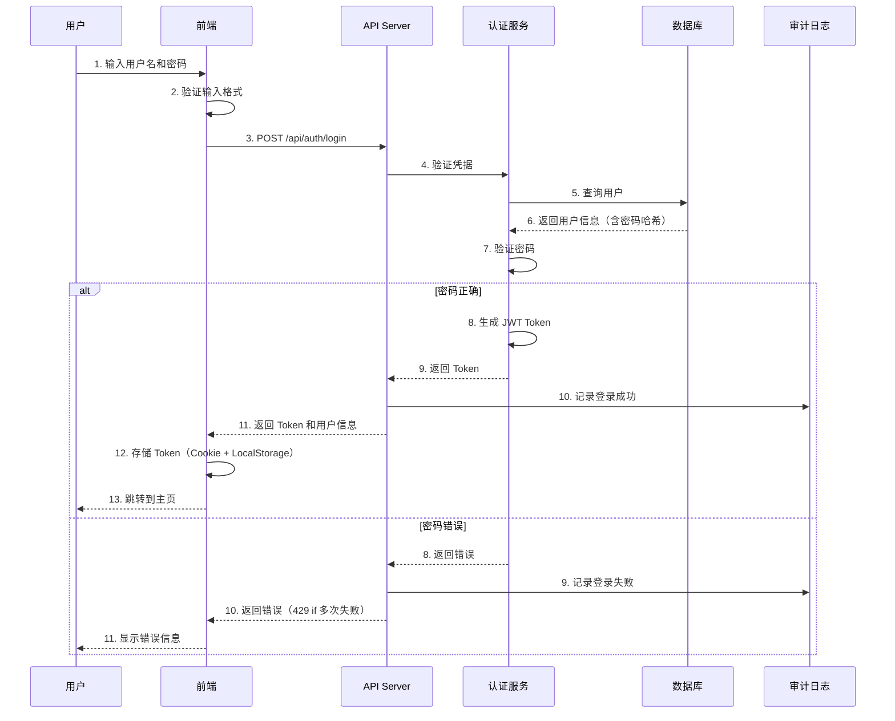

# 安全最佳实践

本文档详细介绍边缘平台的安全编码实践、权限设计原则、敏感信息处理规范，以及常见安全威胁的防护措施。

## 安全编码实践

### 输入验证

**原则：永远不要信任用户输入**

所有来自用户、外部系统或不可信源的输入都必须经过严格验证。

```go
// pkg/oapis/validation/validator.go
package validation

import (
    "fmt"
    "regexp"
    "strings"
)

// ValidateResourceName 验证 Kubernetes 资源名称
// 规则：
// - 只能包含小写字母、数字、连字符和点
// - 必须以字母数字开头和结尾
// - 长度不超过 253 个字符
func ValidateResourceName(name string) error {
    if name == "" {
        return fmt.Errorf("名称不能为空")
    }

    if len(name) > 253 {
        return fmt.Errorf("名称长度不能超过 253 个字符")
    }

    // DNS-1123 子域名规范
    pattern := `^[a-z0-9]([-a-z0-9]*[a-z0-9])?(\.[a-z0-9]([-a-z0-9]*[a-z0-9])?)*$`
    matched, err := regexp.MatchString(pattern, name)
    if err != nil {
        return fmt.Errorf("正则匹配失败: %v", err)
    }

    if !matched {
        return fmt.Errorf("名称格式不正确，只能包含小写字母、数字、连字符和点")
    }

    return nil
}

// ValidateLabelValue 验证标签值
func ValidateLabelValue(value string) error {
    if value == "" {
        return nil // 空值是允许的
    }

    if len(value) > 63 {
        return fmt.Errorf("标签值长度不能超过 63 个字符")
    }

    pattern := `^[a-zA-Z0-9]([-a-zA-Z0-9_.]*[a-zA-Z0-9])?$`
    matched, err := regexp.MatchString(pattern, value)
    if err != nil {
        return err
    }

    if !matched {
        return fmt.Errorf("标签值格式不正确")
    }

    return nil
}

// SanitizeInput 清理用户输入，移除潜在危险字符
func SanitizeInput(input string) string {
    // 移除控制字符
    input = strings.Map(func(r rune) rune {
        if r < 32 && r != '\n' && r != '\r' && r != '\t' {
            return -1
        }
        return r
    }, input)

    // 移除潜在的命令注入字符
    dangerousChars := []string{";", "|", "&", "$", "`", "\n", "\r"}
    for _, char := range dangerousChars {
        input = strings.ReplaceAll(input, char, "")
    }

    return strings.TrimSpace(input)
}
```

**API 处理器中的验证：**

```go
// pkg/oapis/resources/v1alpha1/handler.go
func (h *Handler) CreateNamespace(c *gin.Context) {
    var req CreateNamespaceRequest
    if err := c.ShouldBindJSON(&req); err != nil {
        c.JSON(http.StatusBadRequest, gin.H{
            "error": "请求参数格式错误",
            "details": err.Error(),
        })
        return
    }

    // 验证名称
    if err := validation.ValidateResourceName(req.Name); err != nil {
        c.JSON(http.StatusBadRequest, gin.H{
            "error": "命名空间名称不合法",
            "details": err.Error(),
        })
        return
    }

    // 验证别名
    if req.Alias != "" {
        req.Alias = validation.SanitizeInput(req.Alias)
        if len(req.Alias) > 256 {
            c.JSON(http.StatusBadRequest, gin.H{
                "error": "别名长度不能超过 256 个字符",
            })
            return
        }
    }

    // 验证描述
    if req.Description != "" {
        req.Description = validation.SanitizeInput(req.Description)
        if len(req.Description) > 1024 {
            c.JSON(http.StatusBadRequest, gin.H{
                "error": "描述长度不能超过 1024 个字符",
            })
            return
        }
    }

    // 创建资源
    // ...
}
```

### 输出编码

防止 XSS 攻击的关键是对输出进行正确编码。

**前端输出编码：**

```tsx
// src/components/SafeText.tsx
import DOMPurify from 'dompurify'

interface SafeTextProps {
  content: string
  allowHTML?: boolean
}

/**
 * 安全文本组件
 * 自动对用户输入进行清理，防止 XSS 攻击
 */
export function SafeText({ content, allowHTML = false }: SafeTextProps) {
  if (!allowHTML) {
    // 纯文本：React 自动转义
    return <span>{content}</span>
  }

  // 允许 HTML：使用 DOMPurify 清理
  const cleanHTML = DOMPurify.sanitize(content, {
    ALLOWED_TAGS: ['b', 'i', 'em', 'strong', 'a', 'p', 'br'],
    ALLOWED_ATTR: ['href', 'title'],
  })

  return <span dangerouslySetInnerHTML={{ __html: cleanHTML }} />
}

// 使用示例
function UserProfile({ user }: { user: User }) {
  return (
    <div>
      {/* ✅ 安全：React 自动转义 */}
      <h1>{user.name}</h1>

      {/* ✅ 安全：使用 SafeText 组件 */}
      <SafeText content={user.bio} />

      {/* ❌ 危险：直接渲染 HTML */}
      <div dangerouslySetInnerHTML={{ __html: user.bio }} />
    </div>
  )
}
```

**JSON 响应编码：**

```go
// pkg/utils/response/response.go
package response

import (
    "encoding/json"
    "html"
    "net/http"
)

// SafeJSON 安全的 JSON 响应
// 对字符串字段进行 HTML 编码，防止 XSS
func SafeJSON(w http.ResponseWriter, data interface{}) error {
    // 序列化为 JSON
    jsonData, err := json.Marshal(data)
    if err != nil {
        return err
    }

    // 设置响应头
    w.Header().Set("Content-Type", "application/json; charset=utf-8")
    w.Header().Set("X-Content-Type-Options", "nosniff")

    // 写入响应
    _, err = w.Write(jsonData)
    return err
}

// SanitizeForJSON 清理字符串用于 JSON 响应
func SanitizeForJSON(s string) string {
    return html.EscapeString(s)
}
```

## 权限最小化原则

### RBAC 规则设计

**遵循最小权限原则**：用户和服务账户只应拥有完成其工作所需的最小权限集。

```yaml
# api/iam/v1alpha1/roletemplate_types.go
apiVersion: iam.theriseunion.io/v1alpha1
kind: RoleTemplate
metadata:
  name: namespace-viewer
  labels:
    iam.theriseunion.io/scope: namespace
spec:
  # 只读权限
  rules:
  - apiGroups: [""]
    resources: ["pods", "services", "configmaps"]
    verbs: ["get", "list", "watch"]
  - apiGroups: ["apps"]
    resources: ["deployments", "statefulsets"]
    verbs: ["get", "list", "watch"]

  # UI 权限
  uiPermissions:
  - "namespace.workloads.view"
  - "namespace.services.view"
  - "namespace.configs.view"
```

**错误示例（过度授权）：**

```yaml
# ❌ 错误：授予了不必要的权限
spec:
  rules:
  - apiGroups: ["*"]
    resources: ["*"]
    verbs: ["*"]  # 完全权限，非常危险！
```

**正确示例（最小权限）：**

```yaml
# ✅ 正确：精确指定需要的权限
spec:
  rules:
  # 只能查看 Pod
  - apiGroups: [""]
    resources: ["pods"]
    verbs: ["get", "list", "watch"]

  # 只能查看 Pod 日志
  - apiGroups: [""]
    resources: ["pods/log"]
    verbs: ["get"]

  # 不能删除或修改任何资源
```

### Scope 链权限检查

```go
// pkg/server/filter/authorization.go
package filter

import (
    "context"
    "fmt"
    "net/http"

    "github.com/gin-gonic/gin"
    "github.com/theriseunion/apiserver/pkg/authorization"
)

// AuthorizationFilter 权限检查中间件
func AuthorizationFilter() gin.HandlerFunc {
    return func(c *gin.Context) {
        user := getUserFromContext(c)
        if user == nil {
            c.JSON(http.StatusUnauthorized, gin.H{"error": "未授权"})
            c.Abort()
            return
        }

        // 获取请求的资源和操作
        resource := getResourceFromRequest(c)
        verb := getVerbFromMethod(c.Request.Method)

        // 检查权限
        authorizer := authorization.NewAuthorizer()
        allowed, reason, err := authorizer.Authorize(context.Background(), authorization.Attributes{
            User:     user,
            Verb:     verb,
            Resource: resource.Resource,
            Scope:    resource.Scope,
            Name:     resource.Name,
        })

        if err != nil {
            c.JSON(http.StatusInternalServerError, gin.H{
                "error": "权限检查失败",
                "details": err.Error(),
            })
            c.Abort()
            return
        }

        if !allowed {
            c.JSON(http.StatusForbidden, gin.H{
                "error": "权限不足",
                "reason": reason,
            })
            c.Abort()
            return
        }

        c.Next()
    }
}

// getVerbFromMethod 从 HTTP 方法映射到 Kubernetes 动词
func getVerbFromMethod(method string) string {
    switch method {
    case http.MethodGet:
        return "get"
    case http.MethodPost:
        return "create"
    case http.MethodPut, http.MethodPatch:
        return "update"
    case http.MethodDelete:
        return "delete"
    default:
        return ""
    }
}
```

### 权限检查性能优化

```go
// pkg/authorization/cache.go
package authorization

import (
    "context"
    "crypto/sha256"
    "encoding/hex"
    "fmt"
    "time"

    "github.com/patrickmn/go-cache"
)

type CachedAuthorizer struct {
    authorizer Authorizer
    cache      *cache.Cache
}

func NewCachedAuthorizer(authorizer Authorizer) *CachedAuthorizer {
    return &CachedAuthorizer{
        authorizer: authorizer,
        cache:      cache.New(5*time.Minute, 10*time.Minute),
    }
}

func (ca *CachedAuthorizer) Authorize(ctx context.Context, attrs Attributes) (bool, string, error) {
    // 生成缓存 key
    cacheKey := ca.getCacheKey(attrs)

    // 检查缓存
    if cached, found := ca.cache.Get(cacheKey); found {
        result := cached.(AuthorizationResult)
        return result.Allowed, result.Reason, nil
    }

    // 执行真实权限检查
    allowed, reason, err := ca.authorizer.Authorize(ctx, attrs)
    if err != nil {
        return false, "", err
    }

    // 缓存结果（仅缓存成功的结果）
    if allowed {
        ca.cache.Set(cacheKey, AuthorizationResult{
            Allowed: allowed,
            Reason:  reason,
        }, cache.DefaultExpiration)
    }

    return allowed, reason, nil
}

func (ca *CachedAuthorizer) getCacheKey(attrs Attributes) string {
    data := fmt.Sprintf("%s:%s:%s:%s:%s",
        attrs.User.GetName(),
        attrs.Verb,
        attrs.Resource,
        attrs.Scope,
        attrs.Name,
    )

    hash := sha256.Sum256([]byte(data))
    return hex.EncodeToString(hash[:])
}

type AuthorizationResult struct {
    Allowed bool
    Reason  string
}
```

## 敏感信息处理

### 密码加密存储

**绝对不允许明文存储密码！**

```go
// pkg/auth/password.go
package auth

import (
    "crypto/rand"
    "crypto/subtle"
    "encoding/base64"
    "fmt"

    "golang.org/x/crypto/argon2"
)

const (
    // Argon2id 参数
    SaltLength  = 16
    KeyLength   = 32
    Time        = 1
    Memory      = 64 * 1024  // 64 MB
    Threads     = 4
)

// HashPassword 使用 Argon2id 哈希密码
func HashPassword(password string) (string, error) {
    // 生成随机盐
    salt := make([]byte, SaltLength)
    if _, err := rand.Read(salt); err != nil {
        return "", fmt.Errorf("生成盐失败: %w", err)
    }

    // 使用 Argon2id 哈希
    hash := argon2.IDKey(
        []byte(password),
        salt,
        Time,
        Memory,
        Threads,
        KeyLength,
    )

    // 编码为 base64 字符串
    // 格式: argon2id$v=19$m=65536,t=1,p=4$<salt>$<hash>
    encodedSalt := base64.RawStdEncoding.EncodeToString(salt)
    encodedHash := base64.RawStdEncoding.EncodeToString(hash)

    return fmt.Sprintf(
        "argon2id$v=19$m=%d,t=%d,p=%d$%s$%s",
        Memory, Time, Threads, encodedSalt, encodedHash,
    ), nil
}

// VerifyPassword 验证密码
func VerifyPassword(password, encodedHash string) (bool, error) {
    // 解析编码的哈希
    var memory, time uint32
    var threads uint8
    var encodedSalt, storedHash string

    _, err := fmt.Sscanf(
        encodedHash,
        "argon2id$v=19$m=%d,t=%d,p=%d$%s$%s",
        &memory, &time, &threads, &encodedSalt, &storedHash,
    )
    if err != nil {
        return false, fmt.Errorf("解析哈希失败: %w", err)
    }

    // 解码 salt 和 hash
    salt, err := base64.RawStdEncoding.DecodeString(encodedSalt)
    if err != nil {
        return false, err
    }

    expectedHash, err := base64.RawStdEncoding.DecodeString(storedHash)
    if err != nil {
        return false, err
    }

    // 使用相同参数哈希输入的密码
    actualHash := argon2.IDKey(
        []byte(password),
        salt,
        time,
        memory,
        threads,
        uint32(len(expectedHash)),
    )

    // 常量时间比较，防止时序攻击
    if subtle.ConstantTimeCompare(actualHash, expectedHash) == 1 {
        return true, nil
    }

    return false, nil
}
```

### Token 管理

```go
// pkg/auth/token.go
package auth

import (
    "crypto/rand"
    "encoding/base64"
    "fmt"
    "time"

    "github.com/golang-jwt/jwt/v5"
)

// TokenManager Token 管理器
type TokenManager struct {
    secretKey []byte
    issuer    string
}

// NewTokenManager 创建 Token 管理器
func NewTokenManager(secretKey []byte, issuer string) *TokenManager {
    return &TokenManager{
        secretKey: secretKey,
        issuer:    issuer,
    }
}

// GenerateToken 生成 JWT Token
func (tm *TokenManager) GenerateToken(username string, expiresIn time.Duration) (string, error) {
    now := time.Now()

    claims := jwt.MapClaims{
        "iss": tm.issuer,
        "sub": username,
        "iat": now.Unix(),
        "exp": now.Add(expiresIn).Unix(),
        "jti": generateJTI(),  // JWT ID，防止重放攻击
    }

    token := jwt.NewWithClaims(jwt.SigningMethodHS256, claims)

    tokenString, err := token.SignedString(tm.secretKey)
    if err != nil {
        return "", fmt.Errorf("签名 token 失败: %w", err)
    }

    return tokenString, nil
}

// ValidateToken 验证 Token
func (tm *TokenManager) ValidateToken(tokenString string) (*jwt.MapClaims, error) {
    token, err := jwt.Parse(tokenString, func(token *jwt.Token) (interface{}, error) {
        // 验证签名算法
        if _, ok := token.Method.(*jwt.SigningMethodHMAC); !ok {
            return nil, fmt.Errorf("非法的签名方法: %v", token.Header["alg"])
        }
        return tm.secretKey, nil
    })

    if err != nil {
        return nil, fmt.Errorf("解析 token 失败: %w", err)
    }

    if claims, ok := token.Claims.(jwt.MapClaims); ok && token.Valid {
        return &claims, nil
    }

    return nil, fmt.Errorf("token 无效")
}

// generateJTI 生成唯一的 JWT ID
func generateJTI() string {
    b := make([]byte, 16)
    rand.Read(b)
    return base64.URLEncoding.EncodeToString(b)
}
```

### 密钥轮换

```go
// pkg/auth/rotation.go
package auth

import (
    "context"
    "crypto/rand"
    "encoding/base64"
    "fmt"
    "time"

    corev1 "k8s.io/api/core/v1"
    metav1 "k8s.io/apimachinery/pkg/apis/meta/v1"
    "k8s.io/client-go/kubernetes"
)

const (
    SecretKeyLength = 32  // 256 位
    RotationInterval = 90 * 24 * time.Hour  // 90 天
)

// KeyRotator 密钥轮换器
type KeyRotator struct {
    clientset *kubernetes.Clientset
    namespace string
    secretName string
}

// RotateSecretKey 轮换密钥
func (kr *KeyRotator) RotateSecretKey(ctx context.Context) error {
    // 生成新密钥
    newKey, err := generateSecretKey()
    if err != nil {
        return fmt.Errorf("生成新密钥失败: %w", err)
    }

    // 获取当前 Secret
    secret, err := kr.clientset.CoreV1().Secrets(kr.namespace).Get(
        ctx,
        kr.secretName,
        metav1.GetOptions{},
    )
    if err != nil {
        return fmt.Errorf("获取 secret 失败: %w", err)
    }

    // 保存旧密钥作为备份
    if currentKey, exists := secret.Data["key"]; exists {
        secret.Data["previous-key"] = currentKey
    }

    // 更新为新密钥
    secret.Data["key"] = []byte(newKey)
    secret.Data["rotated-at"] = []byte(time.Now().Format(time.RFC3339))

    // 更新 Secret
    _, err = kr.clientset.CoreV1().Secrets(kr.namespace).Update(
        ctx,
        secret,
        metav1.UpdateOptions{},
    )
    if err != nil {
        return fmt.Errorf("更新 secret 失败: %w", err)
    }

    return nil
}

// generateSecretKey 生成随机密钥
func generateSecretKey() (string, error) {
    key := make([]byte, SecretKeyLength)
    if _, err := rand.Read(key); err != nil {
        return "", err
    }
    return base64.StdEncoding.EncodeToString(key), nil
}

// ShouldRotate 检查是否需要轮换
func (kr *KeyRotator) ShouldRotate(ctx context.Context) (bool, error) {
    secret, err := kr.clientset.CoreV1().Secrets(kr.namespace).Get(
        ctx,
        kr.secretName,
        metav1.GetOptions{},
    )
    if err != nil {
        return false, err
    }

    rotatedAtStr, exists := secret.Data["rotated-at"]
    if !exists {
        return true, nil  // 从未轮换过
    }

    rotatedAt, err := time.Parse(time.RFC3339, string(rotatedAtStr))
    if err != nil {
        return true, nil  // 解析失败，触发轮换
    }

    return time.Since(rotatedAt) > RotationInterval, nil
}
```

## 审计日志和访问控制

### 审计日志记录

```go
// pkg/audit/logger.go
package audit

import (
    "context"
    "time"

    "github.com/sirupsen/logrus"
    metav1 "k8s.io/apimachinery/pkg/apis/meta/v1"
)

// Event 审计事件
type Event struct {
    Timestamp    time.Time              `json:"timestamp"`
    User         string                 `json:"user"`
    UserAgent    string                 `json:"userAgent"`
    SourceIP     string                 `json:"sourceIPs"`
    Verb         string                 `json:"verb"`
    Resource     string                 `json:"resource"`
    Namespace    string                 `json:"namespace,omitempty"`
    Name         string                 `json:"name,omitempty"`
    StatusCode   int                    `json:"statusCode"`
    RequestURI   string                 `json:"requestURI"`
    ResponseTime time.Duration          `json:"responseTime"`
    Annotations  map[string]interface{} `json:"annotations,omitempty"`
}

// Logger 审计日志记录器
type Logger struct {
    logger *logrus.Logger
}

// NewLogger 创建审计日志记录器
func NewLogger() *Logger {
    logger := logrus.New()
    logger.SetFormatter(&logrus.JSONFormatter{
        TimestampFormat: time.RFC3339Nano,
        FieldMap: logrus.FieldMap{
            logrus.FieldKeyTime: "timestamp",
            logrus.FieldKeyMsg:  "message",
        },
    })

    return &Logger{logger: logger}
}

// LogEvent 记录审计事件
func (l *Logger) LogEvent(ctx context.Context, event *Event) {
    l.logger.WithFields(logrus.Fields{
        "user":         event.User,
        "userAgent":    event.UserAgent,
        "sourceIP":     event.SourceIP,
        "verb":         event.Verb,
        "resource":     event.Resource,
        "namespace":    event.Namespace,
        "name":         event.Name,
        "statusCode":   event.StatusCode,
        "requestURI":   event.RequestURI,
        "responseTime": event.ResponseTime.Milliseconds(),
        "annotations":  event.Annotations,
    }).Info("audit event")
}

// LogFailedAuth 记录认证失败
func (l *Logger) LogFailedAuth(username, sourceIP, reason string) {
    l.logger.WithFields(logrus.Fields{
        "username": username,
        "sourceIP": sourceIP,
        "reason":   reason,
        "event":    "auth_failed",
    }).Warn("authentication failed")
}

// LogPrivilegedAction 记录特权操作
func (l *Logger) LogPrivilegedAction(user, action, target string) {
    l.logger.WithFields(logrus.Fields{
        "user":   user,
        "action": action,
        "target": target,
        "event":  "privileged_action",
    }).Info("privileged action performed")
}
```

### 审计中间件

```go
// pkg/server/middleware/audit.go
package middleware

import (
    "time"

    "github.com/gin-gonic/gin"
    "github.com/theriseunion/apiserver/pkg/audit"
)

// AuditMiddleware 审计中间件
func AuditMiddleware(auditLogger *audit.Logger) gin.HandlerFunc {
    return func(c *gin.Context) {
        start := time.Now()

        // 处理请求
        c.Next()

        // 计算响应时间
        responseTime := time.Since(start)

        // 获取用户信息
        user, _ := c.Get("user")
        username := ""
        if user != nil {
            username = user.(string)
        }

        // 记录审计事件
        event := &audit.Event{
            Timestamp:    start,
            User:         username,
            UserAgent:    c.Request.UserAgent(),
            SourceIP:     c.ClientIP(),
            Verb:         c.Request.Method,
            RequestURI:   c.Request.RequestURI,
            StatusCode:   c.Writer.Status(),
            ResponseTime: responseTime,
        }

        // 解析资源信息
        if resource := extractResource(c.Request.URL.Path); resource != nil {
            event.Resource = resource.Resource
            event.Namespace = resource.Namespace
            event.Name = resource.Name
        }

        auditLogger.LogEvent(c.Request.Context(), event)
    }
}
```

## 防护措施

### SQL 注入防护

虽然边缘平台不直接使用 SQL，但通过 Kubernetes API 与 etcd 交互时，也需要防止注入攻击。

```go
// ✅ 正确：使用参数化查询
func (h *Handler) ListPods(namespace, labelSelector string) {
    // Kubernetes client-go 自动处理转义
    pods, err := h.clientset.CoreV1().Pods(namespace).List(context.TODO(), metav1.ListOptions{
        LabelSelector: labelSelector,  // 自动转义
    })
}

// ❌ 错误：字符串拼接（如果直接操作 etcd）
func dangerousQuery(key string) {
    query := fmt.Sprintf("/registry/pods/%s", key)  // 危险！
    // 如果 key 包含 "../"，可能访问其他资源
}
```

### XSS 防护

**前端防护：**

```tsx
// src/utils/security.ts

/**
 * 转义 HTML 字符，防止 XSS
 */
export function escapeHTML(str: string): string {
  const div = document.createElement('div')
  div.textContent = str
  return div.innerHTML
}

/**
 * 清理 URL，防止 javascript: 协议注入
 */
export function sanitizeURL(url: string): string {
  if (!url) return ''

  // 移除危险协议
  const dangerousProtocols = ['javascript:', 'data:', 'vbscript:']
  const lowerURL = url.toLowerCase().trim()

  for (const protocol of dangerousProtocols) {
    if (lowerURL.startsWith(protocol)) {
      return ''
    }
  }

  return url
}

// 使用示例
function SafeLink({ href, children }: { href: string; children: React.ReactNode }) {
  const safeHref = sanitizeURL(href)

  if (!safeHref) {
    return <span>{children}</span>
  }

  return <a href={safeHref} rel="noopener noreferrer">{children}</a>
}
```

**设置安全响应头：**

```go
// pkg/server/middleware/security.go
package middleware

import "github.com/gin-gonic/gin"

// SecurityHeaders 设置安全响应头
func SecurityHeaders() gin.HandlerFunc {
    return func(c *gin.Context) {
        // 防止 XSS
        c.Header("X-XSS-Protection", "1; mode=block")

        // 防止点击劫持
        c.Header("X-Frame-Options", "DENY")

        // 防止 MIME 类型嗅探
        c.Header("X-Content-Type-Options", "nosniff")

        // Content Security Policy
        c.Header("Content-Security-Policy",
            "default-src 'self'; "+
            "script-src 'self' 'unsafe-inline' 'unsafe-eval'; "+
            "style-src 'self' 'unsafe-inline'; "+
            "img-src 'self' data: https:; "+
            "font-src 'self' data:; "+
            "connect-src 'self' ws: wss:")

        // Referrer Policy
        c.Header("Referrer-Policy", "strict-origin-when-cross-origin")

        // Permissions Policy
        c.Header("Permissions-Policy", "geolocation=(), microphone=(), camera=()")

        c.Next()
    }
}
```

### CSRF 防护

```go
// pkg/server/middleware/csrf.go
package middleware

import (
    "crypto/subtle"
    "net/http"

    "github.com/gin-gonic/gin"
)

const (
    CSRFTokenHeader = "X-CSRF-Token"
    CSRFCookieName  = "csrf_token"
)

// CSRFProtection CSRF 防护中间件
func CSRFProtection() gin.HandlerFunc {
    return func(c *gin.Context) {
        // GET、HEAD、OPTIONS 请求不需要 CSRF Token
        if c.Request.Method == http.MethodGet ||
           c.Request.Method == http.MethodHead ||
           c.Request.Method == http.MethodOptions {
            c.Next()
            return
        }

        // 获取请求头中的 Token
        headerToken := c.GetHeader(CSRFTokenHeader)

        // 获取 Cookie 中的 Token
        cookieToken, err := c.Cookie(CSRFCookieName)
        if err != nil {
            c.JSON(http.StatusForbidden, gin.H{
                "error": "缺少 CSRF Token",
            })
            c.Abort()
            return
        }

        // 常量时间比较，防止时序攻击
        if subtle.ConstantTimeCompare(
            []byte(headerToken),
            []byte(cookieToken),
        ) != 1 {
            c.JSON(http.StatusForbidden, gin.H{
                "error": "CSRF Token 无效",
            })
            c.Abort()
            return
        }

        c.Next()
    }
}
```

### Rate Limiting（速率限制）

```go
// pkg/server/middleware/ratelimit.go
package middleware

import (
    "net/http"
    "sync"
    "time"

    "github.com/gin-gonic/gin"
    "golang.org/x/time/rate"
)

// RateLimiter 速率限制器
type RateLimiter struct {
    limiters map[string]*rate.Limiter
    mu       sync.RWMutex
    rate     rate.Limit
    burst    int
}

// NewRateLimiter 创建速率限制器
// rate: 每秒允许的请求数
// burst: 突发请求数
func NewRateLimiter(r rate.Limit, b int) *RateLimiter {
    return &RateLimiter{
        limiters: make(map[string]*rate.Limiter),
        rate:     r,
        burst:    b,
    }
}

// GetLimiter 获取或创建限制器
func (rl *RateLimiter) GetLimiter(key string) *rate.Limiter {
    rl.mu.Lock()
    defer rl.mu.Unlock()

    limiter, exists := rl.limiters[key]
    if !exists {
        limiter = rate.NewLimiter(rl.rate, rl.burst)
        rl.limiters[key] = limiter
    }

    return limiter
}

// RateLimitMiddleware 速率限制中间件
func RateLimitMiddleware(rl *RateLimiter) gin.HandlerFunc {
    return func(c *gin.Context) {
        // 使用 IP 地址作为限制 key
        key := c.ClientIP()

        // 获取限制器
        limiter := rl.GetLimiter(key)

        // 检查是否超过限制
        if !limiter.Allow() {
            c.JSON(http.StatusTooManyRequests, gin.H{
                "error": "请求过于频繁，请稍后再试",
            })
            c.Abort()
            return
        }

        c.Next()
    }
}

// 使用示例
func setupRouter() *gin.Engine {
    r := gin.Default()

    // 每秒最多 10 个请求，突发 20 个
    rateLimiter := NewRateLimiter(10, 20)
    r.Use(RateLimitMiddleware(rateLimiter))

    return r
}
```

## 实战：安全的用户认证流程

### 认证流程图



### 完整实现

**后端：认证服务**

```go
// pkg/auth/service.go
package auth

import (
    "context"
    "fmt"
    "time"

    "github.com/theriseunion/apiserver/pkg/audit"
)

type Service struct {
    userRepo    UserRepository
    tokenMgr    *TokenManager
    auditLogger *audit.Logger
    rateLimiter *LoginRateLimiter
}

// Login 用户登录
func (s *Service) Login(ctx context.Context, username, password, sourceIP string) (*LoginResult, error) {
    // 1. 速率限制检查
    if !s.rateLimiter.Allow(username, sourceIP) {
        s.auditLogger.LogFailedAuth(username, sourceIP, "rate_limit_exceeded")
        return nil, ErrTooManyAttempts
    }

    // 2. 查询用户
    user, err := s.userRepo.GetUserByName(ctx, username)
    if err != nil {
        s.auditLogger.LogFailedAuth(username, sourceIP, "user_not_found")
        return nil, ErrInvalidCredentials
    }

    // 3. 验证密码
    valid, err := VerifyPassword(password, user.PasswordHash)
    if err != nil || !valid {
        s.rateLimiter.RecordFailedAttempt(username, sourceIP)
        s.auditLogger.LogFailedAuth(username, sourceIP, "invalid_password")
        return nil, ErrInvalidCredentials
    }

    // 4. 生成 Token
    accessToken, err := s.tokenMgr.GenerateToken(username, 24*time.Hour)
    if err != nil {
        return nil, fmt.Errorf("生成 token 失败: %w", err)
    }

    refreshToken, err := s.tokenMgr.GenerateToken(username, 7*24*time.Hour)
    if err != nil {
        return nil, fmt.Errorf("生成刷新 token 失败: %w", err)
    }

    // 5. 重置失败计数
    s.rateLimiter.Reset(username, sourceIP)

    // 6. 记录成功登录
    s.auditLogger.LogEvent(ctx, &audit.Event{
        Timestamp: time.Now(),
        User:      username,
        SourceIP:  sourceIP,
        Verb:      "login",
        Resource:  "auth",
    })

    return &LoginResult{
        User: &UserInfo{
            Username: user.Username,
            Email:    user.Email,
            Roles:    user.Roles,
        },
        AccessToken:  accessToken,
        RefreshToken: refreshToken,
        ExpiresIn:    86400,  // 24 小时
    }, nil
}
```

**前端：登录组件**

```tsx
// src/app/login/page.tsx
'use client'

import { useState } from 'react'
import { useRouter } from 'next/navigation'
import { zodResolver } from '@hookform/resolvers/zod'
import { useForm } from 'react-hook-form'
import * as z from 'zod'
import { Button } from '@/components/ui/button'
import { toast } from 'sonner'

const loginSchema = z.object({
  username: z.string()
    .min(1, '用户名不能为空')
    .max(50, '用户名不能超过50个字符')
    .regex(/^[a-zA-Z0-9_-]+$/, '用户名只能包含字母、数字、下划线和连字符'),
  password: z.string()
    .min(8, '密码至少8个字符')
    .max(128, '密码不能超过128个字符'),
})

type LoginFormValues = z.infer<typeof loginSchema>

export default function LoginPage() {
  const router = useRouter()
  const [isSubmitting, setIsSubmitting] = useState(false)

  const form = useForm<LoginFormValues>({
    resolver: zodResolver(loginSchema),
    defaultValues: {
      username: '',
      password: '',
    },
  })

  const onSubmit = async (values: LoginFormValues) => {
    setIsSubmitting(true)

    try {
      const response = await fetch('/api/auth/login', {
        method: 'POST',
        headers: {
          'Content-Type': 'application/json',
        },
        body: JSON.stringify(values),
        credentials: 'include',  // 发送 Cookie
      })

      if (!response.ok) {
        const error = await response.json()

        if (response.status === 429) {
          toast.error('登录失败次数过多', {
            description: '请稍后再试',
          })
        } else {
          toast.error('登录失败', {
            description: error.message || '用户名或密码错误',
          })
        }
        return
      }

      const data = await response.json()

      // 存储 Token（双重保险）
      // 1. Cookie（主要方式，由服务器设置 httpOnly）
      // 2. LocalStorage（备用，用于 API 调用）
      localStorage.setItem('access_token', data.accessToken)
      localStorage.setItem('refresh_token', data.refreshToken)
      localStorage.setItem('username', data.user.username)

      // 获取重定向 URL
      const searchParams = new URLSearchParams(window.location.search)
      const redirectUrl = searchParams.get('redirect') || '/boss'

      // 跳转
      toast.success('登录成功')
      router.push(redirectUrl)
    } catch (error) {
      toast.error('登录失败', {
        description: '网络错误，请稍后再试',
      })
    } finally {
      setIsSubmitting(false)
    }
  }

  return (
    <div className="flex items-center justify-center min-h-screen bg-gray-100">
      <div className="w-full max-w-md bg-white rounded-lg shadow-md p-8">
        <h1 className="text-2xl font-bold text-center mb-6">
          边缘平台登录
        </h1>

        <form onSubmit={form.handleSubmit(onSubmit)} className="space-y-4">
          <div>
            <label className="block text-sm font-medium text-gray-700 mb-2">
              用户名
            </label>
            <input
              {...form.register('username')}
              type="text"
              className="w-full px-3 py-2 border border-gray-300 rounded focus:outline-none focus:ring-2 focus:ring-blue-500"
              placeholder="请输入用户名"
              autoComplete="username"
            />
            {form.formState.errors.username && (
              <p className="text-sm text-red-600 mt-1">
                {form.formState.errors.username.message}
              </p>
            )}
          </div>

          <div>
            <label className="block text-sm font-medium text-gray-700 mb-2">
              密码
            </label>
            <input
              {...form.register('password')}
              type="password"
              className="w-full px-3 py-2 border border-gray-300 rounded focus:outline-none focus:ring-2 focus:ring-blue-500"
              placeholder="请输入密码"
              autoComplete="current-password"
            />
            {form.formState.errors.password && (
              <p className="text-sm text-red-600 mt-1">
                {form.formState.errors.password.message}
              </p>
            )}
          </div>

          <Button
            type="submit"
            className="w-full"
            disabled={isSubmitting}
          >
            {isSubmitting ? '登录中...' : '登录'}
          </Button>
        </form>
      </div>
    </div>
  )
}
```

## 安全检查清单

### 代码审查清单

- [ ] 所有用户输入都经过验证和清理
- [ ] 密码使用强哈希算法（Argon2id）存储
- [ ] Token 使用 JWT 且设置合理的过期时间
- [ ] 实现了速率限制，防止暴力破解
- [ ] 设置了安全响应头（CSP、X-Frame-Options 等）
- [ ] 实现了 CSRF 防护
- [ ] 所有敏感操作都有审计日志
- [ ] 权限检查遵循最小权限原则
- [ ] 没有硬编码的密钥或密码
- [ ] 错误消息不泄露敏感信息

### 部署检查清单

- [ ] HTTPS 强制启用
- [ ] 密钥定期轮换
- [ ] 审计日志集中存储
- [ ] 定期进行安全扫描
- [ ] 及时更新依赖包
- [ ] 生产环境禁用调试模式
- [ ] 数据库使用最小权限账户
- [ ] 配置文件不包含敏感信息

## 下一步阅读

- [性能优化](./performance.md) - 权限检查性能优化
- [测试策略](./testing.md) - 安全测试方法
- [部署指南](./deployment.md) - 生产环境安全配置

## 参考资源

- [OWASP Top 10](https://owasp.org/www-project-top-ten/)
- [Kubernetes Security Best Practices](https://kubernetes.io/docs/concepts/security/overview/)
- [JWT Best Practices](https://tools.ietf.org/html/rfc8725)
- [Argon2 Password Hashing](https://github.com/P-H-C/phc-winner-argon2)
