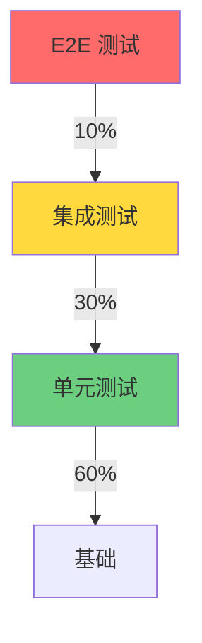

# 测试策略指南

本文档介绍边缘平台的测试策略、框架使用、测试覆盖率要求，以及完整的测试自动化流程。

## 测试金字塔和策略

### 测试金字塔



**测试分层原则：**

1. **单元测试（60%）**：快速、独立、聚焦单个函数或方法
2. **集成测试（30%）**：测试组件间交互，使用真实依赖
3. **E2E 测试（10%）**：端到端测试完整用户流程

### 测试覆盖率要求

| 代码类型 | 最低覆盖率 | 推荐覆盖率 |
|---------|----------|----------|
| Controller | 70% | 85% |
| API Handler | 75% | 90% |
| 业务逻辑 | 80% | 95% |
| 工具函数 | 90% | 100% |

## 单元测试（Ginkgo + Gomega）

### Ginkgo 框架介绍

Ginkgo 是 Go 的 BDD（行为驱动开发）测试框架，配合 Gomega 断言库使用。

**安装：**

```bash
go install github.com/onsi/ginkgo/v2/ginkgo@latest
go get github.com/onsi/gomega
```

### 基本测试结构

```go
// internal/controller/roletemplate_controller_test.go
package controller

import (
    "context"
    "time"

    . "github.com/onsi/ginkgo/v2"
    . "github.com/onsi/gomega"
    rbacv1 "k8s.io/api/rbac/v1"
    metav1 "k8s.io/apimachinery/pkg/apis/meta/v1"
    "k8s.io/apimachinery/pkg/types"
    "sigs.k8s.io/controller-runtime/pkg/reconcile"

    iamv1alpha1 "github.com/theriseunion/apiserver/api/iam/v1alpha1"
)

var _ = Describe("RoleTemplate Controller", func() {
    Context("When reconciling a resource", func() {
        const (
            RoleTemplateName = "test-roletemplate"
            IAMRoleName      = "test-iamrole"
            ScopeType        = "workspace"

            timeout  = time.Second * 10
            interval = time.Millisecond * 250
        )

        ctx := context.Background()

        roleTemplate := types.NamespacedName{
            Name: RoleTemplateName,
        }

        BeforeEach(func() {
            By("Creating the custom resource for the Kind RoleTemplate")
            resource := &iamv1alpha1.RoleTemplate{
                TypeMeta: metav1.TypeMeta{
                    APIVersion: "iam.theriseunion.io/v1alpha1",
                    Kind:       "RoleTemplate",
                },
                ObjectMeta: metav1.ObjectMeta{
                    Name: RoleTemplateName,
                    Labels: map[string]string{
                        "iam.theriseunion.io/scope": ScopeType,
                    },
                },
                Spec: iamv1alpha1.RoleTemplateSpec{
                    Rules: []rbacv1.PolicyRule{
                        {
                            APIGroups: []string{""},
                            Resources: []string{"pods"},
                            Verbs:     []string{"get", "list"},
                        },
                    },
                    UIPermissions: []string{"workspace.pods.view"},
                },
            }
            Expect(k8sClient.Create(ctx, resource)).To(Succeed())
        })

        AfterEach(func() {
            By("Cleanup the specific resource instance RoleTemplate")
            resource := &iamv1alpha1.RoleTemplate{}
            err := k8sClient.Get(ctx, roleTemplate, resource)
            if err == nil {
                Expect(k8sClient.Delete(ctx, resource)).To(Succeed())
            }
        })

        It("should successfully reconcile the resource", func() {
            By("Reconciling the created resource")
            controllerReconciler := &RoleTemplateReconciler{
                Client: k8sClient,
                Scheme: k8sClient.Scheme(),
            }

            _, err := controllerReconciler.Reconcile(ctx, reconcile.Request{
                NamespacedName: roleTemplate,
            })
            Expect(err).NotTo(HaveOccurred())

            By("Verifying the RoleTemplate was processed correctly")
            Eventually(func() bool {
                role := &iamv1alpha1.RoleTemplate{}
                err := k8sClient.Get(ctx, roleTemplate, role)
                return err == nil
            }, timeout, interval).Should(BeTrue())
        })
    })
})
```

### Gomega 常用断言

```go
// 基本断言
Expect(value).To(Equal(expected))
Expect(value).NotTo(Equal(unexpected))
Expect(value).To(BeNil())
Expect(value).NotTo(BeNil())

// 数值断言
Expect(count).To(BeNumerically(">=", 5))
Expect(count).To(BeNumerically("<", 100))

// 字符串断言
Expect(str).To(ContainSubstring("hello"))
Expect(str).To(MatchRegexp("^[a-z]+$"))
Expect(str).To(HavePrefix("edge-"))

// 集合断言
Expect(slice).To(HaveLen(5))
Expect(slice).To(ContainElement("item"))
Expect(slice).To(ConsistOf("a", "b", "c"))

// 布尔断言
Expect(result).To(BeTrue())
Expect(result).To(BeFalse())

// 错误断言
Expect(err).To(HaveOccurred())
Expect(err).NotTo(HaveOccurred())
Expect(err).To(MatchError("specific error"))

// 异步断言（轮询）
Eventually(func() bool {
    // 检查条件
    return condition
}, timeout, interval).Should(BeTrue())

Consistently(func() bool {
    // 持续检查条件
    return condition
}, duration, interval).Should(BeTrue())
```

### Table-Driven 测试

```go
// pkg/validation/validator_test.go
package validation

import (
    . "github.com/onsi/ginkgo/v2"
    . "github.com/onsi/gomega"
)

var _ = Describe("Resource Name Validation", func() {
    DescribeTable("ValidateResourceName",
        func(name string, shouldPass bool) {
            err := ValidateResourceName(name)
            if shouldPass {
                Expect(err).NotTo(HaveOccurred())
            } else {
                Expect(err).To(HaveOccurred())
            }
        },
        // Valid cases
        Entry("valid lowercase name", "my-namespace", true),
        Entry("valid with numbers", "ns-123", true),
        Entry("valid with dots", "my.namespace", true),

        // Invalid cases
        Entry("empty string", "", false),
        Entry("uppercase letters", "MyNamespace", false),
        Entry("starts with dash", "-namespace", false),
        Entry("ends with dash", "namespace-", false),
        Entry("too long", string(make([]byte, 254)), false),
        Entry("special characters", "ns@123", false),
    )
})
```

## Controller 测试（envtest）

### envtest 环境设置

```go
// internal/controller/suite_test.go
package controller

import (
    "path/filepath"
    "testing"

    . "github.com/onsi/ginkgo/v2"
    . "github.com/onsi/gomega"
    "k8s.io/client-go/kubernetes/scheme"
    "k8s.io/client-go/rest"
    ctrl "sigs.k8s.io/controller-runtime"
    "sigs.k8s.io/controller-runtime/pkg/client"
    "sigs.k8s.io/controller-runtime/pkg/envtest"
    logf "sigs.k8s.io/controller-runtime/pkg/log"
    "sigs.k8s.io/controller-runtime/pkg/log/zap"

    iamv1alpha1 "github.com/theriseunion/apiserver/api/iam/v1alpha1"
)

var (
    cfg       *rest.Config
    k8sClient client.Client
    testEnv   *envtest.Environment
)

func TestControllers(t *testing.T) {
    RegisterFailHandler(Fail)
    RunSpecs(t, "Controller Suite")
}

var _ = BeforeSuite(func() {
    logf.SetLogger(zap.New(zap.WriteTo(GinkgoWriter), zap.UseDevMode(true)))

    By("bootstrapping test environment")
    testEnv = &envtest.Environment{
        CRDDirectoryPaths:     []string{filepath.Join("..", "..", "config", "crd", "bases")},
        ErrorIfCRDPathMissing: true,
    }

    var err error
    cfg, err = testEnv.Start()
    Expect(err).NotTo(HaveOccurred())
    Expect(cfg).NotTo(BeNil())

    err = iamv1alpha1.AddToScheme(scheme.Scheme)
    Expect(err).NotTo(HaveOccurred())

    k8sClient, err = client.New(cfg, client.Options{Scheme: scheme.Scheme})
    Expect(err).NotTo(HaveOccurred())
    Expect(k8sClient).NotTo(BeNil())
})

var _ = AfterSuite(func() {
    By("tearing down the test environment")
    err := testEnv.Stop()
    Expect(err).NotTo(HaveOccurred())
})
```

### Mock 和 Stub 技巧

```go
// pkg/authorization/authorizer_test.go
package authorization

import (
    "context"

    . "github.com/onsi/ginkgo/v2"
    . "github.com/onsi/gomega"
    "github.com/stretchr/testify/mock"
)

// MockAuthorizer Mock 授权器
type MockAuthorizer struct {
    mock.Mock
}

func (m *MockAuthorizer) Authorize(ctx context.Context, attrs Attributes) (bool, string, error) {
    args := m.Called(ctx, attrs)
    return args.Bool(0), args.String(1), args.Error(2)
}

var _ = Describe("Cached Authorizer", func() {
    var (
        mockAuthorizer *MockAuthorizer
        cachedAuthorizer *CachedAuthorizer
    )

    BeforeEach(func() {
        mockAuthorizer = &MockAuthorizer{}
        cachedAuthorizer = NewCachedAuthorizer(mockAuthorizer)
    })

    It("should cache authorization results", func() {
        attrs := Attributes{
            User:     &testUser{name: "admin"},
            Verb:     "list",
            Resource: "pods",
        }

        // 第一次调用：未命中缓存
        mockAuthorizer.On("Authorize", mock.Anything, attrs).
            Return(true, "", nil).
            Once()

        allowed, reason, err := cachedAuthorizer.Authorize(context.Background(), attrs)
        Expect(err).NotTo(HaveOccurred())
        Expect(allowed).To(BeTrue())

        // 第二次调用：命中缓存，不应调用 mockAuthorizer
        allowed, reason, err = cachedAuthorizer.Authorize(context.Background(), attrs)
        Expect(err).NotTo(HaveOccurred())
        Expect(allowed).To(BeTrue())

        // 验证只调用了一次
        mockAuthorizer.AssertNumberOfCalls(GinkgoT(), "Authorize", 1)
    })
})
```

## 集成测试

### API 集成测试

```go
// test/integration/api_test.go
package integration

import (
    "bytes"
    "encoding/json"
    "net/http"
    "net/http/httptest"
    "testing"

    . "github.com/onsi/ginkgo/v2"
    . "github.com/onsi/gomega"
    "github.com/gin-gonic/gin"

    "github.com/theriseunion/apiserver/pkg/oapis/resources/v1alpha1"
)

var _ = Describe("Resources API", func() {
    var (
        router *gin.Engine
        handler *v1alpha1.Handler
    )

    BeforeEach(func() {
        gin.SetMode(gin.TestMode)
        router = gin.New()
        handler = v1alpha1.NewHandler(k8sClient)

        // 注册路由
        router.GET("/oapis/resources.theriseunion.io/v1alpha1/nodes", handler.ListNodes)
        router.GET("/oapis/resources.theriseunion.io/v1alpha1/nodes/:name", handler.GetNode)
    })

    Context("Node API", func() {
        It("should list nodes", func() {
            req, _ := http.NewRequest("GET", "/oapis/resources.theriseunion.io/v1alpha1/nodes", nil)
            resp := httptest.NewRecorder()

            router.ServeHTTP(resp, req)

            Expect(resp.Code).To(Equal(http.StatusOK))

            var result map[string]interface{}
            err := json.Unmarshal(resp.Body.Bytes(), &result)
            Expect(err).NotTo(HaveOccurred())

            items, ok := result["items"].([]interface{})
            Expect(ok).To(BeTrue())
            Expect(len(items)).To(BeNumerically(">", 0))
        })

        It("should get a specific node", func() {
            req, _ := http.NewRequest("GET", "/oapis/resources.theriseunion.io/v1alpha1/nodes/master-node", nil)
            resp := httptest.NewRecorder()

            router.ServeHTTP(resp, req)

            Expect(resp.Code).To(Equal(http.StatusOK))

            var node map[string]interface{}
            err := json.Unmarshal(resp.Body.Bytes(), &node)
            Expect(err).NotTo(HaveOccurred())
            Expect(node["metadata"].(map[string]interface{})["name"]).To(Equal("master-node"))
        })

        It("should return 404 for non-existent node", func() {
            req, _ := http.NewRequest("GET", "/oapis/resources.theriseunion.io/v1alpha1/nodes/non-existent", nil)
            resp := httptest.NewRecorder()

            router.ServeHTTP(resp, req)

            Expect(resp.Code).To(Equal(http.StatusNotFound))
        })
    })
})
```

### 数据库集成测试

```go
// test/integration/database_test.go
package integration

import (
    "context"

    . "github.com/onsi/ginkgo/v2"
    . "github.com/onsi/gomega"
    corev1 "k8s.io/api/core/v1"
    metav1 "k8s.io/apimachinery/pkg/apis/meta/v1"
)

var _ = Describe("Kubernetes Client Integration", func() {
    It("should create and retrieve a namespace", func() {
        ctx := context.Background()

        // 创建命名空间
        ns := &corev1.Namespace{
            ObjectMeta: metav1.ObjectMeta{
                Name: "test-namespace",
                Annotations: map[string]string{
                    "theriseunion.io/description": "Test namespace",
                },
            },
        }

        err := k8sClient.Create(ctx, ns)
        Expect(err).NotTo(HaveOccurred())

        // 获取命名空间
        retrieved := &corev1.Namespace{}
        err = k8sClient.Get(ctx, client.ObjectKey{Name: "test-namespace"}, retrieved)
        Expect(err).NotTo(HaveOccurred())
        Expect(retrieved.Annotations["theriseunion.io/description"]).To(Equal("Test namespace"))

        // 清理
        err = k8sClient.Delete(ctx, ns)
        Expect(err).NotTo(HaveOccurred())
    })
})
```

## E2E 测试（Playwright）

### Playwright 设置

```bash
cd edge-console
pnpm add -D @playwright/test
pnpm playwright install
```

**playwright.config.ts：**

```typescript
import { defineConfig, devices } from '@playwright/test'

export default defineConfig({
  testDir: './tests/e2e',
  fullyParallel: true,
  forbidOnly: !!process.env.CI,
  retries: process.env.CI ? 2 : 0,
  workers: process.env.CI ? 1 : undefined,
  reporter: 'html',

  use: {
    baseURL: 'http://localhost:3000',
    trace: 'on-first-retry',
    screenshot: 'only-on-failure',
  },

  projects: [
    {
      name: 'chromium',
      use: { ...devices['Desktop Chrome'] },
    },
    {
      name: 'firefox',
      use: { ...devices['Desktop Firefox'] },
    },
  ],

  webServer: {
    command: 'pnpm dev',
    url: 'http://localhost:3000',
    reuseExistingServer: !process.env.CI,
  },
})
```

### E2E 测试示例

```typescript
// tests/e2e/login.spec.ts
import { test, expect } from '@playwright/test'

test.describe('用户登录', () => {
  test('应该能够成功登录', async ({ page }) => {
    await page.goto('/login')

    // 填写表单
    await page.fill('input[name="username"]', 'admin')
    await page.fill('input[name="password"]', 'admin123')

    // 点击登录按钮
    await page.click('button[type="submit"]')

    // 验证跳转到主页
    await expect(page).toHaveURL('/boss')
    await expect(page.locator('h1')).toContainText('工作台')
  })

  test('应该显示错误信息当密码错误时', async ({ page }) => {
    await page.goto('/login')

    await page.fill('input[name="username"]', 'admin')
    await page.fill('input[name="password"]', 'wrong-password')
    await page.click('button[type="submit"]')

    // 验证错误提示
    await expect(page.locator('.error-message')).toBeVisible()
    await expect(page.locator('.error-message')).toContainText('用户名或密码错误')
  })
})

// tests/e2e/namespaces.spec.ts
test.describe('命名空间管理', () => {
  test.beforeEach(async ({ page }) => {
    // 登录
    await page.goto('/login')
    await page.fill('input[name="username"]', 'admin')
    await page.fill('input[name="password"]', 'admin123')
    await page.click('button[type="submit"]')
    await page.waitForURL('/boss')
  })

  test('应该能够创建命名空间', async ({ page }) => {
    await page.goto('/boss/clusters/host/namespaces')

    // 点击创建按钮
    await page.click('button:has-text("创建命名空间")')

    // 填写表单
    await page.fill('input[name="name"]', 'test-ns')
    await page.fill('input[name="alias"]', '测试命名空间')
    await page.fill('textarea[name="description"]', '这是一个测试命名空间')

    // 提交
    await page.click('button[type="submit"]')

    // 验证成功提示
    await expect(page.locator('.toast')).toContainText('创建成功')

    // 验证列表中出现新命名空间
    await expect(page.locator('table tbody tr:has-text("test-ns")')).toBeVisible()
  })

  test('应该能够删除命名空间', async ({ page }) => {
    await page.goto('/boss/clusters/host/namespaces')

    // 找到要删除的命名空间行
    const row = page.locator('table tbody tr:has-text("test-ns")')

    // 点击操作菜单
    await row.locator('button:has-text("更多")').click()

    // 点击删除
    await page.click('button:has-text("删除")')

    // 确认删除
    await page.click('button:has-text("确认删除")')

    // 验证成功提示
    await expect(page.locator('.toast')).toContainText('删除成功')

    // 验证列表中不再显示该命名空间
    await expect(row).not.toBeVisible()
  })
})
```

## CI 中的测试自动化

### GitHub Actions 配置

```yaml
# .github/workflows/test.yaml
name: Tests

on:
  push:
    branches: [ main, develop ]
  pull_request:
    branches: [ main, develop ]

jobs:
  backend-tests:
    name: Backend Tests
    runs-on: ubuntu-latest

    steps:
    - uses: actions/checkout@v3

    - name: Set up Go
      uses: actions/setup-go@v4
      with:
        go-version: '1.21'

    - name: Install dependencies
      run: |
        cd edge-apiserver
        go mod download

    - name: Run unit tests
      run: |
        cd edge-apiserver
        make test

    - name: Run integration tests
      run: |
        cd edge-apiserver
        make test-integration

    - name: Generate coverage report
      run: |
        cd edge-apiserver
        go test -coverprofile=coverage.out ./...
        go tool cover -html=coverage.out -o coverage.html

    - name: Upload coverage to Codecov
      uses: codecov/codecov-action@v3
      with:
        files: ./edge-apiserver/coverage.out

  frontend-tests:
    name: Frontend Tests
    runs-on: ubuntu-latest

    steps:
    - uses: actions/checkout@v3

    - name: Set up Node.js
      uses: actions/setup-node@v3
      with:
        node-version: '18'

    - name: Install pnpm
      run: npm install -g pnpm

    - name: Install dependencies
      run: |
        cd edge-console
        pnpm install

    - name: Run unit tests
      run: |
        cd edge-console
        pnpm test

    - name: Run E2E tests
      run: |
        cd edge-console
        pnpm playwright install --with-deps
        pnpm test:e2e

    - name: Upload test results
      if: always()
      uses: actions/upload-artifact@v3
      with:
        name: playwright-report
        path: edge-console/playwright-report/

  code-quality:
    name: Code Quality
    runs-on: ubuntu-latest

    steps:
    - uses: actions/checkout@v3

    - name: Run golangci-lint
      uses: golangci/golangci-lint-action@v3
      with:
        version: latest
        working-directory: edge-apiserver

    - name: Run ESLint
      run: |
        cd edge-console
        pnpm install
        pnpm lint
```

### Makefile 测试命令

```makefile
# edge-apiserver/Makefile

.PHONY: test
test:
    ginkgo -r --cover --coverprofile=coverage.out

.PHONY: test-unit
test-unit:
    ginkgo -r --label-filter="unit" --cover

.PHONY: test-integration
test-integration:
    ginkgo -r --label-filter="integration" --cover

.PHONY: test-verbose
test-verbose:
    ginkgo -r -v --cover

.PHONY: test-watch
test-watch:
    ginkgo watch -r

.PHONY: coverage
coverage:
    go tool cover -html=coverage.out

.PHONY: test-race
test-race:
    go test -race ./...
```

## 实战：为 RoleTemplate Controller 编写完整测试

### Controller 测试

已在上面的"单元测试"章节中展示完整代码。

### 单元测试覆盖率

```bash
cd edge-apiserver
make test

# 输出：
# Running Suite: Controller Suite - /path/to/controller
# Random Seed: 1234567890
#
# Will run 5 of 5 specs
# •••••
#
# Ran 5 of 5 Specs in 2.345 seconds
# SUCCESS! -- 5 Passed | 0 Failed | 0 Pending | 0 Skipped
#
# PASS
# coverage: 85.6% of statements
```

## 测试最佳实践

1. **测试命名清晰**：使用描述性的测试名称
2. **独立性**：每个测试应该独立运行
3. **可重复性**：测试结果应该稳定一致
4. **快速反馈**：单元测试应该在秒级完成
5. **真实场景**：集成测试模拟真实使用场景
6. **清理资源**：测试后清理创建的资源
7. **Mock 适度**：过度 Mock 会导致测试失去意义
8. **持续集成**：所有测试在 CI 中自动运行

## 下一步阅读

- [部署指南](./deployment.md) - 生产环境测试策略
- [性能优化](./performance.md) - 性能测试方法

## 参考资源

- [Ginkgo文档](https://onsi.github.io/ginkgo/)
- [Gomega文档](https://onsi.github.io/gomega/)
- [Playwright文档](https://playwright.dev/)
- [envtest文档](https://book.kubebuilder.io/reference/envtest.html)
