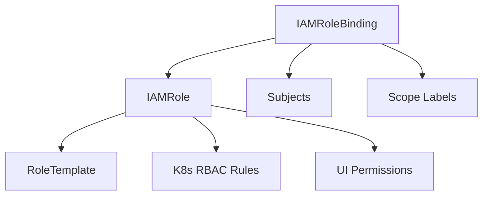
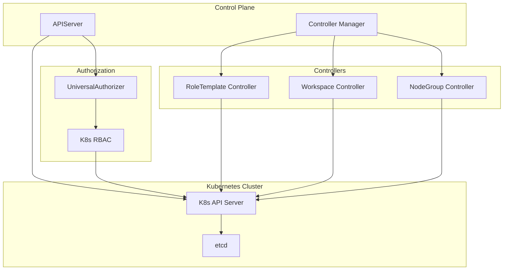
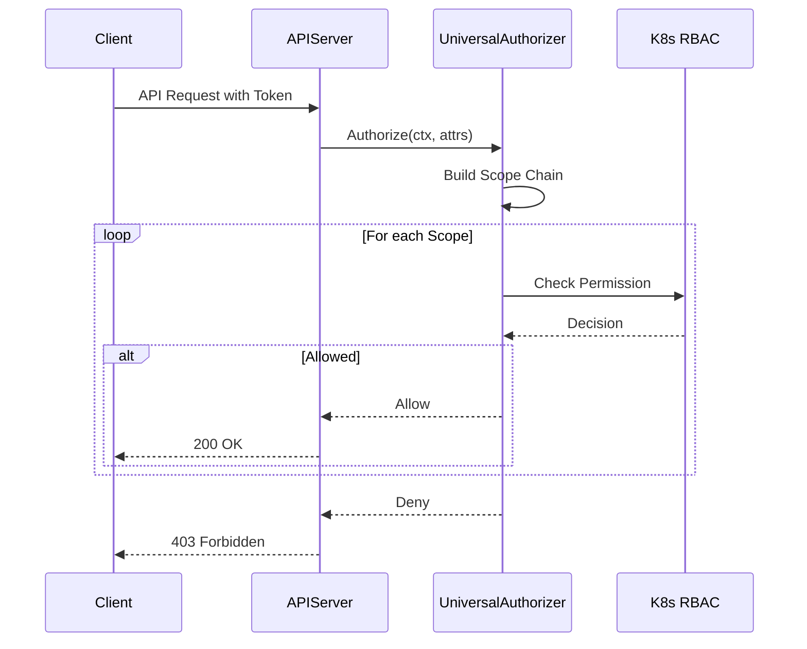
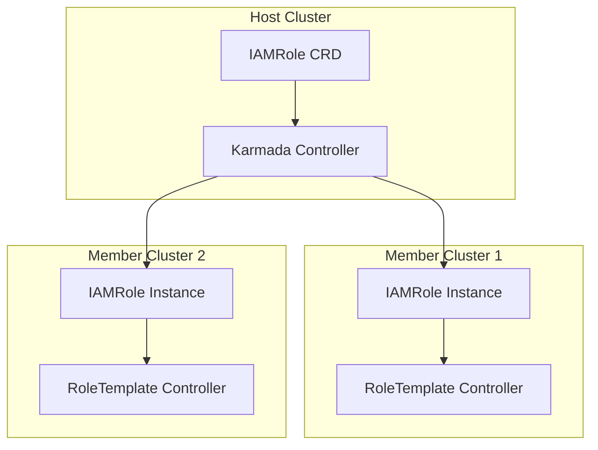

# 系统架构

## 概述

Edge Platform 采用云原生的统一权限管理架构，通过 Kubernetes 原生 API 和自定义资源定义（CRD）提供企业级的多租户权限控制。系统完全基于 Kubernetes 生态构建，充分利用 K8s RBAC 机制，同时扩展支持 Scope 感知的权限继承和管理。

## 核心设计理念

### Kubernetes 原生优先

Edge Platform 的权限系统遵循 "Kubernetes 原生优先" 的设计理念：

- **API 规范**: 所有权限操作通过标准 Kubernetes API 完成
- **CRD 扩展**: 使用 K8s CRD 定义权限资源，而非自定义数据库
- **RBAC 集成**: 完全兼容并扩展 K8s 标准 RBAC 机制
- **工具生态**: 支持 kubectl、helm、operator 等标准工具

### 统一权限模型

系统通过统一的 CRD 模型消除了传统多平台权限系统的复杂性：



- **IAMRole**: 权限角色定义，包含 API 权限和 UI 权限
- **RoleTemplate**: 可复用的权限模板，支持聚合
- **IAMRoleBinding**: 角色绑定，将角色分配给用户/组
- **Scope 标签**: 通过标签实现权限的范围控制

## 系统架构

### 双组件架构

Edge Platform 采用 APIServer + Controller 的双组件架构：



### APIServer 组件

**职责**:
- 扩展 Kubernetes API Server，提供权限管理 API
- 实现 OAuth2 认证服务
- 处理权限查询和验证请求
- 提供非 K8s 资源的代理和权限控制

**核心功能**:

1. **API 扩展**
   - 通过 APIService 机制扩展 K8s API
   - 提供 Scope 感知的权限查询接口
   - 支持自定义资源的 CRUD 操作

2. **认证服务**
   - 内置 OAuth2/OIDC 认证
   - JWT Token 生成和验证
   - 与 K8s User 资源集成

3. **权限检查**
   - UniversalAuthorizer 实现级联权限检查
   - 完全委托给 K8s RBAC 进行决策
   - 支持 Scope 层级的权限继承

### Controller 组件

**职责**:
- 监听 CRD 资源变化
- 自动聚合 RoleTemplate 到 IAMRole
- 同步 IAMRole 到 K8s Role/ClusterRole
- 管理 Workspace、NodeGroup 生命周期

**核心 Controllers**:

1. **RoleTemplateController**
   - 监听 IAMRole 的 `aggregationRoleTemplates` 变化
   - 从 RoleTemplate 聚合权限规则
   - 更新 IAMRole 的 `rules` 和 `uiPermissions`

2. **IAMRoleSyncController**
   - 将 IAMRole 转换为 K8s Role/ClusterRole
   - 根据 Scope 标签决定同步目标
   - 保持 IAMRole 与 K8s RBAC 的一致性

3. **WorkspaceController**
   - 管理 Workspace 生命周期
   - 创建和管理 Workspace 下的 Namespace
   - 同步 Workspace 标签到关联资源

4. **NodeGroupController**
   - 管理 NodeGroup 生命周期
   - 根据选择器匹配节点
   - 应用节点标签、注解和污点

## 与 Kubernetes 的集成

### APIService 扩展

Edge Platform 通过 Kubernetes APIService 机制扩展 API：

```yaml
apiVersion: apiregistration.k8s.io/v1
kind: APIService
metadata:
  name: v1alpha1.iam.theriseunion.io
spec:
  group: iam.theriseunion.io
  version: v1alpha1
  service:
    name: edge-apiserver
    namespace: edge-system
  groupPriorityMinimum: 1000
  versionPriority: 15
```

**优势**:
- 无缝集成到 K8s API 层级
- 支持标准的 kubectl 命令
- 自动获得 K8s 的认证和授权支持

### CRD Watch 和 Operator 模式

系统完全支持 Kubernetes Operator 模式：

```go
// Controller 监听 IAMRole 变化
func (r *RoleTemplateReconciler) Reconcile(ctx context.Context, req ctrl.Request) {
    var iamRole iamv1alpha1.IAMRole
    if err := r.Get(ctx, req.NamespacedName, &iamRole); err != nil {
        return ctrl.Result{}, err
    }

    // 聚合 RoleTemplate
    aggregatedRules := r.AggregateTemplates(ctx, &iamRole)

    // 更新 IAMRole
    iamRole.Spec.Rules = aggregatedRules
    return ctrl.Result{}, r.Update(ctx, &iamRole)
}
```

### RBAC 委托

UniversalAuthorizer 完全委托权限决策给 K8s RBAC：



## 多集群支持

### Karmada 集成

Edge Platform 通过 Karmada 实现权限资源的多集群分发：

```yaml
apiVersion: policy.karmada.io/v1alpha1
kind: PropagationPolicy
metadata:
  name: iamrole-propagation
spec:
  resourceSelectors:
    - apiVersion: iam.theriseunion.io/v1alpha1
      kind: IAMRole
      labelSelector:
        matchLabels:
          iam.theriseunion.io/scope: cluster
  placement:
    clusterAffinity:
      clusterNames:
        - cluster-beijing
        - cluster-shanghai
```

**功能特性**:
- 自动同步 IAMRole 到多个集群
- 支持 Scope 感知的选择性分发
- 保证权限配置的一致性

### 联邦权限管理



## 扩展性设计

### 非 K8s API 支持

通过 ReverseProxy 和 APIService 扩展支持非 K8s 资源的权限控制：

```yaml
apiVersion: iam.theriseunion.io/v1alpha1
kind: ReverseProxy
metadata:
  name: monitoring-api
spec:
  targetURL: http://monitoring-service:8080
  pathPrefix: /oapis/monitoring
  authentication:
    type: Bearer
  authorization:
    nonResourceURLs:
      - /oapis/monitoring/alerts/*
      - /oapis/monitoring/dashboards/*
```

### 前后端权限一体化

IAMRole 同时定义 API 权限和 UI 权限：

```yaml
apiVersion: iam.theriseunion.io/v1alpha1
kind: IAMRole
metadata:
  name: workspace-developer
spec:
  rules:
    - apiGroups: ["apps"]
      resources: ["deployments"]
      verbs: ["get", "list", "create", "update"]
  uiPermissions:
    - "workload/deployment/view"
    - "workload/deployment/create"
    - "workload/deployment/edit"
```

前端可以直接查询用户的 UI 权限：

```bash
GET /api/iam.theriseunion.io/v1alpha1/scopes/workspace/my-workspace/permissions
```

## 性能优化

### 缓存策略

- **Scope Chain 缓存**: 缓存用户的 Scope 层级关系
- **RoleBinding 缓存**: 缓存用户的角色绑定关系
- **权限决策缓存**: 缓存频繁的权限检查结果

### 短路机制

权限检查采用短路优化：
- 一旦在某个 Scope 层级找到允许权限，立即返回
- 避免不必要的下级 Scope 检查
- P95 延迟 < 10ms

## 安全性保证

### 认证和授权分离

- **认证**: OAuth2/OIDC，JWT Token
- **授权**: UniversalAuthorizer + K8s RBAC
- **审计**: K8s Audit Log 集成

### 最小权限原则

- 默认拒绝策略
- 显式授权要求
- 权限聚合最小化

### 多租户隔离

- Scope 标签强制隔离
- Namespace 边界保护
- 工作空间级别资源配额

## 下一步

了解了整体架构后，建议继续阅读：

- [权限模型](./permission-model.md) - 深入理解统一权限管理框架
- [Scope 系统](./scope-system.md) - 掌握 Scope 层级和权限继承
- [RoleTemplate](./roletemplate.md) - 学习权限模板的复用机制
- [OAuth 认证](./oauth.md) - 了解认证流程和集成方式
