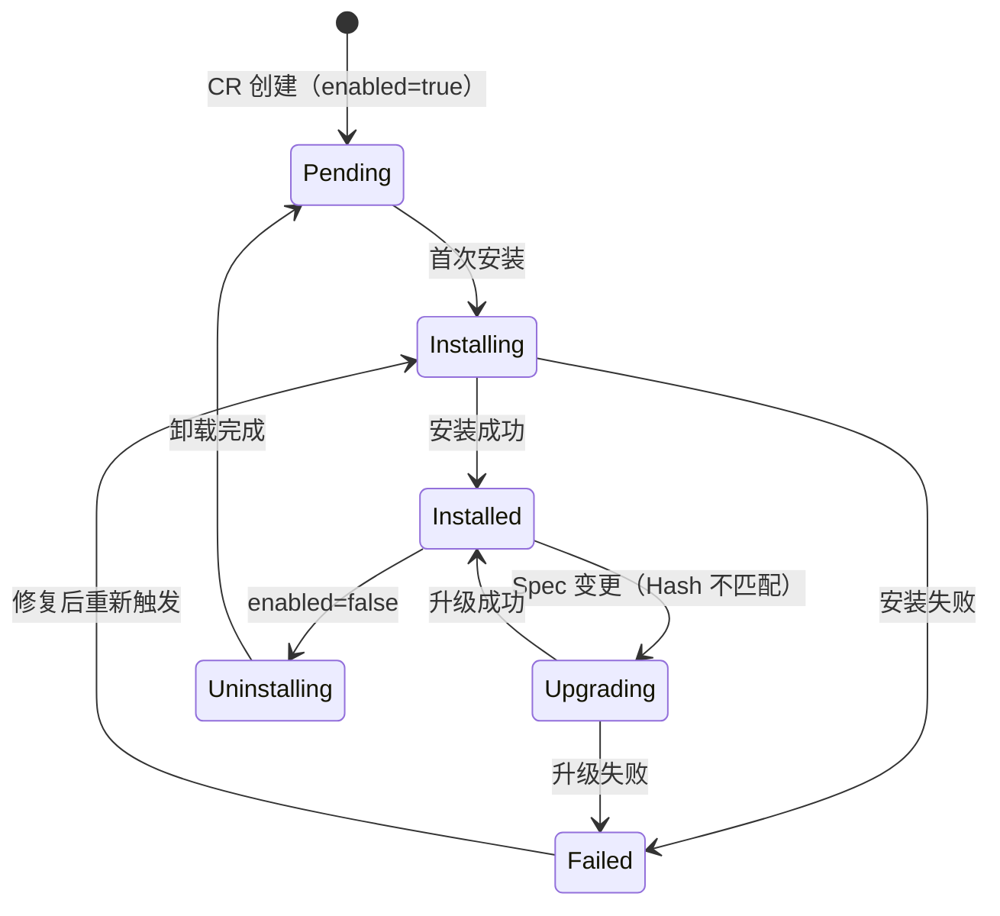
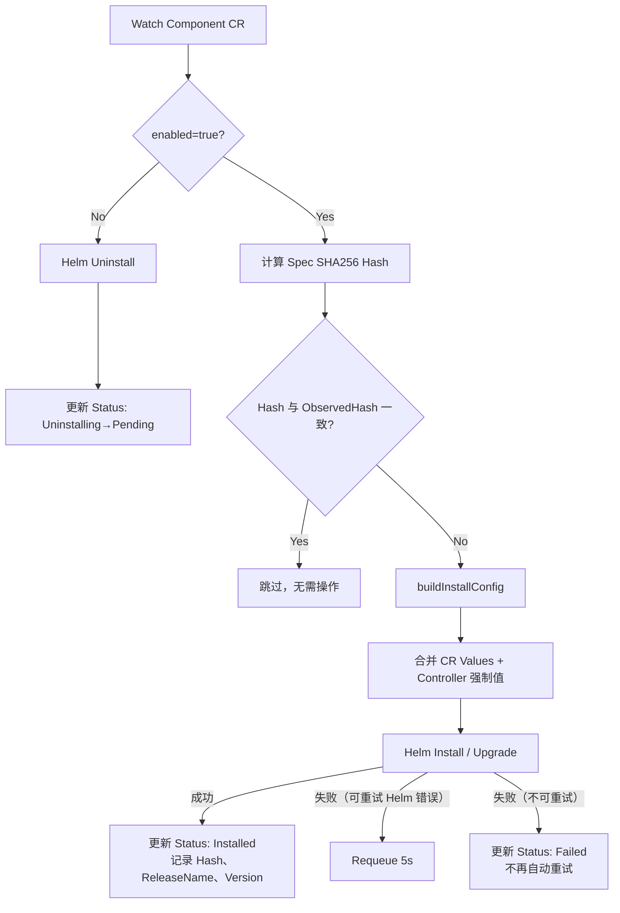
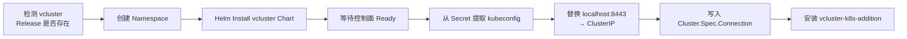
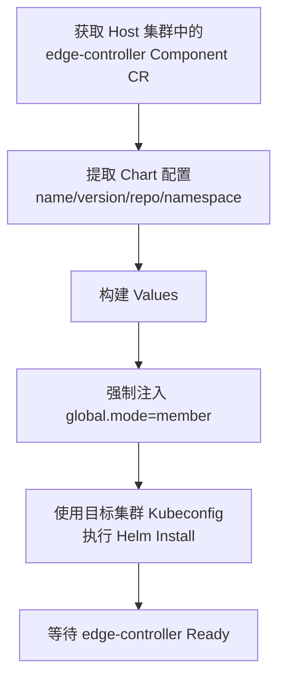
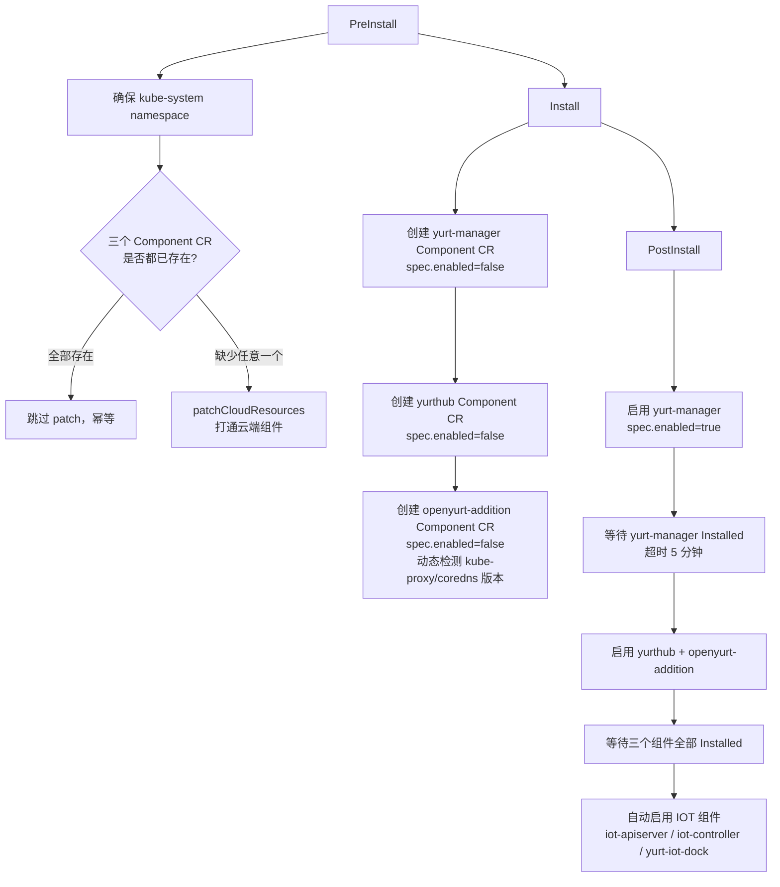

# Component 组件管理

## 概述

Component 是 Edge Platform 平台用于统一管理组件生命周期的核心 CRD，基于 Helm 实现组件的安装、升级和卸载。平台中所有可插拔的系统组件（如 edge-apiserver、edge-console、监控、边缘运行时等）都以 Component CR 的形式描述和管理，由 Component Controller 负责驱动实际的 Helm 操作。

Component 系统解决的核心问题：

- **声明式管理**：通过 CR 描述期望状态，Controller 负责向目标状态收敛
- **多集群差异化**：主集群、vCluster、托管 K8s 集群的组件配置自动差异化
- **变更检测**：基于 Spec Hash 精确检测配置变更，避免不必要的重装
- **可扩展性**：支持自定义 Helm Values 覆盖，适应不同部署环境

---

## CRD 定义

**API 路径**：`ext.theriseunion.io/v1alpha1`
**Kind**：`Component`
**源文件**：`api/ext/v1alpha1/component_types.go`

### Spec 字段

```go
type ComponentSpec struct {
    // Enabled 控制是否安装该组件，设为 false 时触发卸载
    Enabled bool `json:"enabled"`

    // Version 指定安装版本，留空时使用平台默认版本
    Version string `json:"version,omitempty"`

    // Chart 描述 Helm Chart 来源信息
    Chart ComponentChart `json:"chart,omitempty"`

    // Values 是透传给 Helm 的自定义配置，格式为任意 JSON 对象
    Values *runtime.RawExtension `json:"values,omitempty"`
}

type ComponentChart struct {
    // Name 为 Chart 名称，留空时与 Component name 相同
    Name string `json:"name,omitempty"`

    // Namespace 为组件安装目标命名空间，默认 edge-system
    Namespace string `json:"namespace,omitempty"`

    // ReleaseName 为 Helm Release 名称，留空时与 Chart name 相同
    ReleaseName string `json:"releaseName,omitempty"`

    // Repository 为 Chart 仓库 URL，支持多种来源（见下文）
    Repository string `json:"repository,omitempty"`
}
```

### Status 字段

```go
type ComponentStatus struct {
    // Phase 为当前生命周期阶段
    // 可选值：Pending / Installing / Installed / Upgrading / Failed / Uninstalling
    Phase ComponentPhase `json:"phase,omitempty"`

    // Conditions 为标准 K8s Condition 数组
    Conditions []metav1.Condition `json:"conditions,omitempty"`

    // ReleaseName 为实际使用的 Helm Release 名称
    ReleaseName string `json:"releaseName,omitempty"`

    // ReleaseVersion 为 Helm Release 的版本号（整数，每次升级递增）
    ReleaseVersion int `json:"releaseVersion,omitempty"`

    // ObservedHash 为上次成功安装时的 Spec SHA256 Hash，用于变更检测
    ObservedHash string `json:"observedHash,omitempty"`

    // Message 为错误或状态描述信息
    Message string `json:"message,omitempty"`

    // LastTransitionTime 为最后一次状态变更时间
    LastTransitionTime *metav1.Time `json:"lastTransitionTime,omitempty"`
}
```

### 完整示例

```yaml
apiVersion: ext.theriseunion.io/v1alpha1
kind: Component
metadata:
  name: edge-apiserver
  namespace: edge-system
spec:
  enabled: true
  version: "0.1.0"
  chart:
    name: edge-apiserver
    namespace: edge-system
    releaseName: edge-apiserver
    repository: "http://edge-museum.edge-system.svc:8080"
  values:
    replicaCount: 2
    image:
      tag: "v0.1.0"
status:
  phase: Installed
  releaseName: edge-apiserver
  releaseVersion: 3
  observedHash: "sha256:abc123..."
  lastTransitionTime: "2024-01-15T10:30:00Z"
```

---

## 生命周期状态机



---

## Component Controller 工作原理

**源文件**：`internal/controller/ext/component_controller.go`

### 核心调谐流程



### 变更检测机制

Controller 在每次调谐时对 `spec` 字段计算 SHA256 Hash，与 `status.observedHash` 比对：

- **Hash 相同**：跳过操作，避免幂等操作的开销
- **Hash 不同**：触发 Helm Upgrade（即使已处于 Installed 状态）

这确保了任何 `spec.values` 或 `spec.version` 的修改都能精确触发一次 Upgrade。

### 并发保护

Controller 使用实例级锁（Instance Lock），防止同一 Component CR 被并发调谐，避免 Helm 操作冲突。冲突时自动重新入队（5 秒后重试）。

### 失败处理策略

- **可重试错误**（如 `another operation is in progress`）：5 秒后重新入队，自动重试
- **不可重试错误**（如 Chart 不存在、Values 格式错误）：更新 Status 为 `Failed`，**不再自动重试**，需人工介入修复后触发新事件才会重新调谐（`ctrl.Result{}`）

---

## Chart 仓库解析优先级

`internal/component/helm/installer.go` 按以下优先级顺序解析 Chart 来源：

| 优先级 | 说明 | 示例 |
|--------|------|------|
| 1 | chartName 直接为 HTTP/HTTPS URL | `http://museum:8080/charts/edge-apiserver-0.1.0.tgz` |
| 2 | Component CR 中的 `chart.repository` | `http://chartmuseum.edge-system.svc:8080` |
| 3 | Controller 全局 Chart 仓库配置 | `http://chartmuseum:8080` |
| 4 | 本地文件系统路径 | `./charts/edge-apiserver` |
| 5 | 裸 Chart 名称（Helm 默认行为） | `edge-apiserver` |

---

## Values 覆盖机制

Component 的 Helm Values 由以下层次合并，优先级从低到高：

```
Chart 默认值（values.yaml）
    ↑
CR spec.values（用户自定义）
    ↑
Controller 强制注入值（不可覆盖）
  - global.mode: "host" | "member"
```

**`global.mode` 支持的值**：

| 值 | 含义 |
|----|------|
| `host` | 主集群，安装完整控制面（apiserver、console、monitoring、traefik 等） |
| `member` | 子集群，不安装 console，traefik 和 binDownloader 视是否 vCluster 而定 |
| `all` | 独立部署模式，等同于 host，安装所有组件 |
| `none` | 仅安装 controller 基础设施（ChartMuseum），不自动安装其他组件 |

Controller 强制注入此字段，Chart 内部通过它控制不同集群类型下的行为差异（详见下文各集群类型说明）。

---

## 各集群类型的组件安装

### 主集群（Host Cluster）

主集群是平台的主控集群，运行完整的平台控制面组件。

**安装入口**：`edge-installer/edge-controller/values.yaml`（`autoInstall` 字段）

> 注：历史版本中使用 `edge-installer/components/host-components.yaml`，已废弃并移除，当前统一由 `edge-controller` Chart 的 `autoInstall` 配置驱动。

**主集群 `autoInstall` 组件列表**：

| 组件 | Namespace | 说明 |
|------|-----------|------|
| `edge-apiserver` | `edge-system` | 平台 API Server |
| `edge-console` | `edge-system` | 前端控制台（仅 host/all 模式） |
| `edge-monitoring` | `observability-system` | 监控组件（Prometheus + Grafana） |
| `traefik` | `edge-system` | Ingress 控制器 |
| `bin-downloader` | `edge-system` | 边缘节点二进制文件下载服务 |
| `duty` | `observability-system` | 值班管理服务 |
| `postgresql` | `edge-system` | 数据库 |
| `vast` | `rise-vast-system` | VAST 算力平台（可选） |

**边缘运行时安装**：

主集群在配置了边缘运行时后，由 `cluster_controller_local_cluster.go` 自动安装对应组件：

```
cluster.theriseunion.io/edge-runtime: "kubeedge"   → 安装 KubeEdge
cluster.theriseunion.io/edge-runtime: "openyurt"   → 安装 OpenYurt（yurt-manager + yurthub + openyurt-addition）
```

安装通过各自的 `ComponentInstaller` 实现，支持 `ShouldInstall → PreInstall → Install → PostInstall` 四阶段生命周期（详见下文 OpenYurt 安装流程）。

---

### vCluster 子集群

vCluster 是在 Host 集群上通过虚拟化技术创建的轻量子集群，组件安装分为两层。

**第一层：vCluster 本身的创建**

由 `internal/component/vcluster/installer.go` 完成，流程如下：



**vCluster 相关配置项**（通过 Cluster Annotation 控制）：

| Annotation | 说明 | 默认值 |
|------------|------|--------|
| `cluster.theriseunion.io/vcluster-distro` | Kubernetes 发行版：`k3s` \| `k0s` \| `k8s` | `k8s` |
| `cluster.theriseunion.io/vcluster-version` | vCluster 版本号 | 平台默认版本 |
| `cluster.theriseunion.io/vcluster-namespace` | 在 Host 集群中的 Namespace | 自动生成 |
| `cluster.theriseunion.io/gateway-ip` | 网关 IP，由安装器回写 | 自动检测 |

**第二层：vCluster 内部组件（edge-controller）**

vCluster 创建完成后，由 `cluster_controller_member.go` 在 vCluster 内部安装 `edge-controller`，并强制以下差异化配置：

```go
// vCluster 专用配置（与托管 K8s 的主要差异）
globalValues["mode"] = "member"

autoInstall.traefik.enabled = false          // vCluster 不需要独立 Ingress
autoInstall.binDownloader.enabled = false    // 无需二进制下载器
monitoring.edgeTraefikRemoteWrite.enabled = false  // 由 Host 集群统一管理
hami-scheduler.imageTag = "v1.24.17"        // 固定调度器镜像版本
```

---

### 托管 K8s 子集群（Member Cluster）

托管 K8s 是将已有 Kubernetes 集群导入平台管理，组件安装通过 `installMemberController()` 完成。

**安装入口**：`edge-controller` Helm Chart（`global.mode=member` 时自动裁剪）

> 注：历史版本中使用 `edge-installer/components/member-components.yaml`，已废弃并移除，当前统一由 `edge-controller` Chart 的 `autoInstall` 配置驱动，通过 `global.mode` 区分主集群与子集群。

**安装流程**：



**组件列表**（与主集群的差异）：

| 组件 | 主集群 | 托管 K8s | 说明 |
|------|--------|----------|------|
| `edge-apiserver` | ✅ | ✅ | 必装，member 模式 |
| `edge-console` | ✅ | ❌ | 仅主集群部署 |
| `edge-monitoring` | ✅ | ✅ | 必装，member 模式 |
| `traefik` | ✅ | ✅ | 托管集群独立 Ingress |
| `binDownloader` | ✅ | ✅ | 支持二进制下载 |

**Helm Values 示例**（托管 K8s）：

```yaml
global:
  mode: member      # Controller 强制注入

# member 模式特有配置
console:
  enabled: false    # 不部署控制台

traefik:
  enabled: true     # 托管集群有独立 Ingress

monitoring:
  edgeTraefikRemoteWrite:
    enabled: true   # 托管集群有自己的 Traefik 监控
```

---

## 三种集群类型对比

| 特性 | 主集群 | vCluster | 托管 K8s |
|------|--------|----------|----------|
| `global.mode` | `host` | `member` | `member` |
| `edge-console` | ✅ | ❌ | ❌ |
| `traefik` | ✅ | ❌ | ✅ |
| `binDownloader` | ✅ | ❌ | ✅ |
| `edgeTraefikRemoteWrite` | ✅ | ❌ | ✅ |
| 边缘运行时（KubeEdge/OpenYurt） | 可选 | 可选 | 可选 |
| 安装入口 | `edge-controller autoInstall` (mode=host) | `vcluster installer` | `edge-controller autoInstall` (mode=member) |
| Kubeconfig 来源 | 本地集群 | vCluster Secret 自动提取 | 用户提供 |

---

## OpenYurt 安装流程详解

OpenYurt 边缘运行时的安装不同于普通 Helm 组件，采用**分阶段顺序启用**策略，避免 yurt-manager 未就绪时其他组件安装失败。

**源文件**：`internal/component/openyurt/installer.go`

### 安装的三个组件

| 组件 | Namespace | 版本 | 说明 |
|------|-----------|------|------|
| `yurt-manager` | `kube-system` | 1.6.0 | OpenYurt 核心控制器，**必须最先就绪** |
| `yurthub` | `kube-system` | 1.6.0 | 边缘节点本地代理缓存 |
| `openyurt-addition` | `kube-system` | 0.1.0 | 边缘节点补丁（kube-proxy / coredns / nodelocaldns） |

### 分阶段安装流程



> **为什么先装 yurt-manager 再装其他**：yurt-manager 包含 OpenYurt 的 Webhook 和 CRD，yurthub 的安装配置依赖这些资源。若同时启用，yurthub 可能因 Webhook 未就绪而安装失败。

### openyurt-addition 动态版本检测

`openyurt-addition` Chart 负责在边缘节点上部署与主集群版本一致的 kube-proxy、coredns 和 nodelocaldns。为避免版本不匹配，安装时自动从主集群检测：

```go
// GetOpenYurtAdditionValuesWithDetection 动态检测逻辑
// 1. 检测 kube-proxy DaemonSet 的镜像 tag 和 clusterCIDR
// 2. 检测 coredns Deployment 的镜像 tag
// 3. 检测 coredns Service 的 ClusterIP（作为 nodelocaldns 的上游 DNS）
```

检测失败时回退到默认值（`kube-proxy: v1.30.12`，`coredns: 1.9.3`）。

### IOT 组件自动启用

OpenYurt 核心组件全部就绪后，PostInstall 自动启用 IOT 相关组件：

| 组件 | Namespace |
|------|-----------|
| `iot-apiserver` | `edge-system` |
| `iot-controller` | `edge-system` |
| `yurt-iot-dock` | `kube-system` |

IOT 组件启用失败不会阻断安装流程（非致命错误），会在下次调谐时重试。

---

## 动态性与自定义机制

### 1. 通过 spec.values 自定义

任何 Component CR 都可以通过 `spec.values` 传入任意 Helm Values：

```yaml
spec:
  values:
    replicaCount: 3
    resources:
      requests:
        cpu: "500m"
        memory: "512Mi"
    extraEnv:
      - name: LOG_LEVEL
        value: "debug"
```

### 2. 跳过自动调谐

对于需要手动管理的组件，通过 Annotation 让 Controller 跳过调谐：

```yaml
metadata:
  annotations:
    ext.theriseunion.io/skip-reconcile: "true"
```

### 3. Chart 仓库动态切换

通过修改 `chart.repository` 字段可将组件切换到不同的 Chart 来源，支持内网 ChartMuseum、公有 Helm 仓库或直接 URL：

```yaml
spec:
  chart:
    repository: "http://my-private-chartmuseum.example.com"
```

### 4. 版本独立升级

修改 `spec.version` 即可触发单组件升级，不影响其他组件：

```bash
kubectl patch component edge-console -n edge-system \
  --type=merge \
  -p '{"spec":{"version":"0.2.0"}}'
```

### 5. 边缘运行时动态切换

通过修改 Cluster 的 Annotation 实现边缘运行时的切换，Controller 自动安装/卸载对应的 KubeEdge 或 OpenYurt 组件：

```bash
kubectl annotate cluster my-cluster \
  cluster.theriseunion.io/edge-runtime=openyurt --overwrite
```

---

## 实现参考

| 文件 | 说明 |
|------|------|
| `api/ext/v1alpha1/component_types.go` | CRD 类型定义 |
| `internal/controller/ext/component_controller.go` | Component Controller（核心调谐逻辑） |
| `internal/component/helm/installer.go` | Helm 安装器实现 |
| `internal/component/types.go` | ComponentInstaller 接口定义 |
| `internal/component/edgeruntime_helper.go` | 边缘运行时工具函数 |
| `internal/component/kubeedge/installer.go` | KubeEdge 安装器 |
| `internal/component/openyurt/installer.go` | OpenYurt 安装器 |
| `internal/component/vcluster/installer.go` | vCluster 安装器 |
| `internal/controller/cluster/cluster_controller_member.go` | Member 集群组件安装 |
| `internal/controller/cluster/cluster_controller_local_cluster.go` | 本地集群运行时安装 |
| `internal/component/openyurt/config.go` | OpenYurt 组件名称、版本常量、动态检测逻辑 |
| `edge-installer/edge-controller/values.yaml` | 主集群/子集群组件 autoInstall 配置（含 traefik、binDownloader、duty、postgresql、vast） |
| `edge-installer/openyurt-addition/values.yaml` | openyurt-addition Chart 默认值（kube-proxy/coredns/nodelocaldns） |
