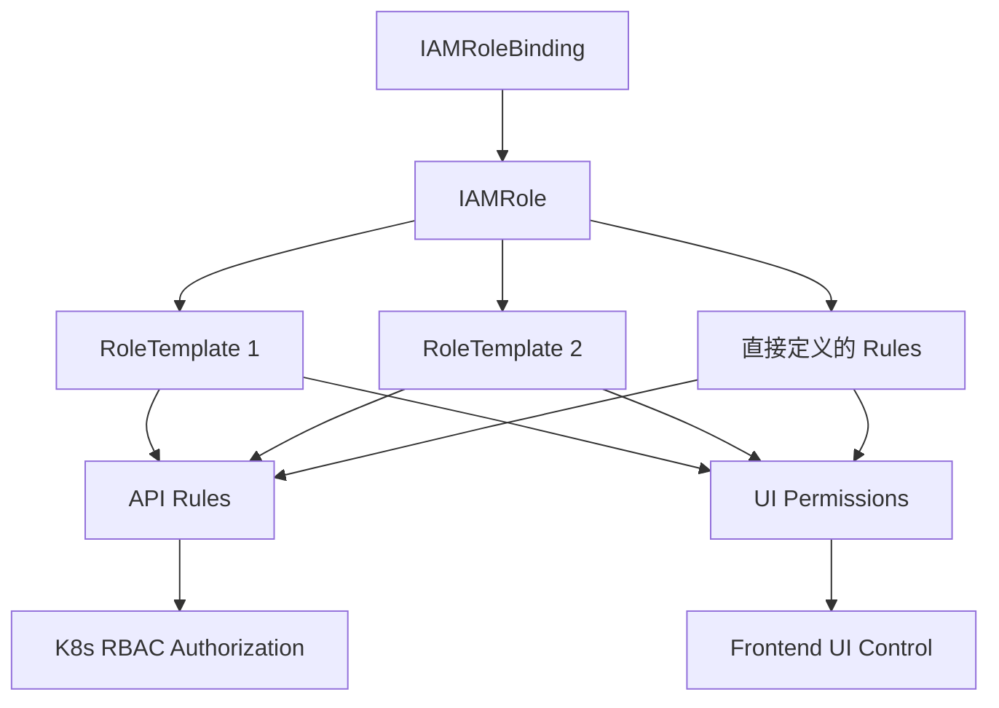
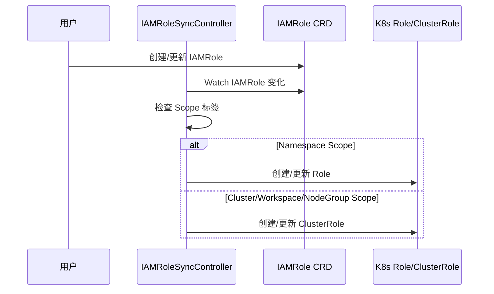
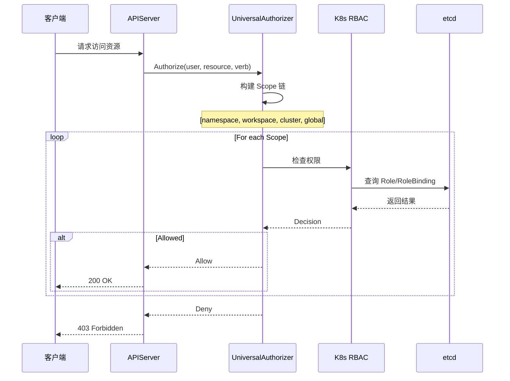

# 统一权限管理模型

## 设计理念

### 从 RBAC 到 Scope 感知权限

传统的 Kubernetes RBAC 回答的是 "**谁能访问什么**" 的问题：

```
User → Role → Resources
```

Edge Platform 扩展这个模型，回答 "**在什么范围内，谁能访问什么**" 的问题：

```
User → Scope → Role → Resources
```

这种扩展让权限系统能够：
- 支持多租户隔离（Workspace、NodeGroup）
- 实现权限继承（上级权限自动下传）
- 提供细粒度的访问控制
- 保持与 K8s RBAC 的完全兼容

### 核心设计原则

Edge Platform 的权限模型遵循以下核心原则：

1. **Kubernetes 原生**: 完全基于 K8s RBAC，而非重新发明授权机制
2. **统一抽象**: 单一的 CRD 模型通过标签实现 Scope 区分
3. **权限复用**: RoleTemplate 机制避免重复定义
4. **前后端一体**: 同时管理 API 权限和 UI 权限
5. **委托决策**: 所有权限检查委托给 K8s 标准 RBAC

## 核心资源

### IAMRole - 权限角色

IAMRole 是权限定义的核心资源，它扩展了 Kubernetes Role/ClusterRole 的能力：

```yaml
apiVersion: iam.theriseunion.io/v1alpha1
kind: IAMRole
metadata:
  name: workspace-developer
  labels:
    iam.theriseunion.io/scope: workspace
    iam.theriseunion.io/scope-value: ai-project
spec:
  # Kubernetes 标准 RBAC 规则
  rules:
    - apiGroups: ["apps"]
      resources: ["deployments", "statefulsets"]
      verbs: ["get", "list", "create", "update", "delete"]
    - apiGroups: [""]
      resources: ["pods", "services"]
      verbs: ["get", "list", "watch"]

  # 前端 UI 权限标识
  uiPermissions:
    - "workload/deployment/view"
    - "workload/deployment/create"
    - "workload/deployment/edit"
    - "workload/deployment/delete"
    - "workload/pod/view"
    - "service/view"

  # RoleTemplate 聚合配置
  aggregationRoleTemplates:
    templateNames:
      - "workload-manager"
      - "service-viewer"
```

**字段说明**:

- **rules**: 标准的 K8s `rbacv1.PolicyRule`，定义 API 访问权限
- **uiPermissions**: 字符串列表，定义前端 UI 元素的可见性和可操作性
- **aggregationRoleTemplates**: 从 RoleTemplate 聚合权限规则的配置

**Scope 标签**:

- `iam.theriseunion.io/scope`: 权限作用范围 (global、cluster、workspace、nodegroup、namespace)
- `iam.theriseunion.io/scope-value`: 具体的 Scope 实例标识

### RoleTemplate - 权限模板

RoleTemplate 提供可复用的权限规则集合：

```yaml
apiVersion: iam.theriseunion.io/v1alpha1
kind: RoleTemplate
metadata:
  name: workload-manager
  labels:
    iam.theriseunion.io/scope: global
    iam.theriseunion.io/category: workload
spec:
  displayName:
    zh-CN: "工作负载管理"
    en-US: "Workload Manager"

  description:
    zh-CN: "管理 Deployment、StatefulSet、DaemonSet 等工作负载"
    en-US: "Manage Deployments, StatefulSets, DaemonSets and other workloads"

  rules:
    - apiGroups: ["apps"]
      resources: ["deployments", "statefulsets", "daemonsets"]
      verbs: ["get", "list", "create", "update", "delete", "patch"]

  uiPermissions:
    - "workload/deployment/*"
    - "workload/statefulset/*"
    - "workload/daemonset/*"
```

**设计目的**:

1. **复用性**: 一次定义，多处使用
2. **组合性**: 通过聚合多个模板构建复杂角色
3. **国际化**: 支持多语言的显示名称和描述
4. **分类管理**: 通过 category 标签组织模板

### IAMRoleBinding - 角色绑定

IAMRoleBinding 将 IAMRole 绑定到用户或组：

```yaml
apiVersion: iam.theriseunion.io/v1alpha1
kind: IAMRoleBinding
metadata:
  name: alice-workspace-developer
  labels:
    iam.theriseunion.io/scope: workspace
    iam.theriseunion.io/scope-value: ai-project
spec:
  subjects:
    - kind: User
      name: alice
      apiGroup: rbac.authorization.k8s.io
  roleRef:
    apiGroup: iam.theriseunion.io
    kind: IAMRole
    name: workspace-developer
```

**关键特性**:

- 使用标准的 `rbacv1.Subject` 定义用户/组
- RoleRef 引用 IAMRole 而非 K8s Role
- Scope 标签必须与 IAMRole 保持一致

## 权限模型的三层关系



### 三层架构

1. **IAMRoleBinding 层**: 定义 "谁" 拥有权限
2. **IAMRole 层**: 定义 "什么" 权限，可以聚合 RoleTemplate
3. **RoleTemplate 层**: 提供可复用的权限模板

### 权限聚合流程

当 IAMRole 引用 RoleTemplate 时，RoleTemplateController 自动聚合：

```go
// 伪代码展示聚合逻辑
func (c *RoleTemplateController) AggregateRole(iamRole *IAMRole) {
    var aggregatedRules []rbacv1.PolicyRule
    var aggregatedUIPerms []string

    // 1. 添加 IAMRole 直接定义的规则
    aggregatedRules = append(aggregatedRules, iamRole.Spec.Rules...)
    aggregatedUIPerms = append(aggregatedUIPerms, iamRole.Spec.UIPermissions...)

    // 2. 遍历引用的 RoleTemplate
    for _, templateName := range iamRole.Spec.AggregationRoleTemplates.TemplateNames {
        template := c.GetRoleTemplate(templateName)

        // 3. 合并 RoleTemplate 的规则
        aggregatedRules = append(aggregatedRules, template.Spec.Rules...)
        aggregatedUIPerms = append(aggregatedUIPerms, template.Spec.UIPermissions...)
    }

    // 4. 更新 IAMRole（去重、合并）
    iamRole.Spec.Rules = deduplicateRules(aggregatedRules)
    iamRole.Spec.UIPermissions = deduplicatePerms(aggregatedUIPerms)
}
```

## 前后端权限一体化

### 传统权限系统的问题

在传统架构中，前端和后端的权限定义是分离的：

```
Backend:  API Permission Rules (in code/config)
Frontend: UI Permission Config (in another config)
```

这导致：
- 前后端权限不一致
- 维护两套权限配置
- 容易出现安全漏洞

### Edge Platform 的解决方案

IAMRole 同时定义 API 权限和 UI 权限：

```yaml
apiVersion: iam.theriseunion.io/v1alpha1
kind: IAMRole
metadata:
  name: workspace-viewer
spec:
  # 后端 API 权限
  rules:
    - apiGroups: ["apps"]
      resources: ["deployments"]
      verbs: ["get", "list"]

  # 前端 UI 权限
  uiPermissions:
    - "workload/deployment/view"
    - "workload/deployment/list"
```

### UI 权限命名规范

UI 权限使用层级化的命名：

```
<模块>/<资源>/<操作>
```

**示例**:

- `workload/deployment/view` - 查看部署详情
- `workload/deployment/list` - 列表页面访问
- `workload/deployment/create` - 创建按钮可见
- `workload/deployment/edit` - 编辑按钮可见
- `workload/deployment/delete` - 删除按钮可见
- `monitoring/alerts/*` - 监控告警模块所有权限

### 前端集成

前端通过 API 查询用户的 UI 权限：

```typescript
// 查询当前用户在特定 Scope 下的权限
async function getUserPermissions(scope: string, scopeValue: string) {
  const response = await fetch(
    `/api/iam.theriseunion.io/v1alpha1/scopes/${scope}/${scopeValue}/permissions`
  );
  const data = await response.json();
  return data.uiPermissions; // ["workload/deployment/view", ...]
}

// 检查权限
function hasPermission(permission: string): boolean {
  return userPermissions.includes(permission);
}

// 使用权限控制 UI 元素
<Button
  onClick={createDeployment}
  disabled={!hasPermission('workload/deployment/create')}
>
  创建部署
</Button>
```

## 与 Kubernetes RBAC 的关系

### 转换机制

IAMRole 最终会被转换为 Kubernetes Role 或 ClusterRole：



### 转换规则

| IAMRole Scope | K8s 资源类型 | 命名空间 |
|--------------|-------------|---------|
| namespace | Role | 指定 namespace |
| workspace | ClusterRole | 无 |
| nodegroup | ClusterRole | 无 |
| cluster | ClusterRole | 无 |
| global | ClusterRole | 无 |

### 为什么需要 IAMRole？

既然最终都转换为 K8s Role/ClusterRole，为什么还需要 IAMRole？

**1. Scope 感知**

IAMRole 通过标签携带 Scope 信息：

```yaml
labels:
  iam.theriseunion.io/scope: workspace
  iam.theriseunion.io/scope-value: ai-project
```

K8s Role/ClusterRole 本身无法表达这种层级关系。

**2. 权限聚合**

IAMRole 支持从多个 RoleTemplate 聚合权限：

```yaml
aggregationRoleTemplates:
  templateNames:
    - template-1
    - template-2
```

K8s ClusterRole 虽然支持聚合，但语义不同，且无法跨 namespace 聚合。

**3. UI 权限集成**

IAMRole 包含 `uiPermissions` 字段，而 K8s Role 不支持。

**4. 统一管理**

通过 IAMRole，用户只需管理一个资源，Controller 自动处理到 K8s 的转换。

## 权限检查流程

### UniversalAuthorizer 的角色

UniversalAuthorizer 是权限检查的入口，但它**不自己做权限决策**，而是：

1. 构建 Scope 层级链
2. 确保对应的 K8s Role/ClusterRole 已同步
3. 委托给 K8s RBAC 进行最终决策

```go
func (ua *UniversalAuthorizer) Authorize(ctx context.Context, attrs authorizer.Attributes) {
    // 1. 构建 Scope 链: namespace → workspace → cluster → global
    scopeChain := ua.buildScopeChain(ctx, attrs)

    // 2. 遍历 Scope 链，委托给 K8s RBAC
    for _, scope := range scopeChain {
        decision := ua.k8sRBACAuthorizer.Authorize(ctx, attrs)
        if decision == authorizer.DecisionAllow {
            return authorizer.DecisionAllow, "", nil
        }
    }

    return authorizer.DecisionDeny, "no permission", nil
}
```

### 完整权限检查流程



## 权限模型的优势

### 1. 生态兼容性

完全兼容 Kubernetes 生态工具：

```bash
# 使用 kubectl 查看 IAMRole
kubectl get iamroles

# 使用 kubectl 创建 IAMRoleBinding
kubectl apply -f rolebinding.yaml

# 使用 kubectl auth can-i 检查权限
kubectl auth can-i create deployments --as=alice
```

### 2. 权限复用

通过 RoleTemplate 避免重复定义：

```yaml
# 定义一次
apiVersion: iam.theriseunion.io/v1alpha1
kind: RoleTemplate
metadata:
  name: workload-manager

---
# 多处使用
apiVersion: iam.theriseunion.io/v1alpha1
kind: IAMRole
metadata:
  name: developer
spec:
  aggregationRoleTemplates:
    templateNames: ["workload-manager", "service-manager"]
```

### 3. 前后端一致性

单一来源定义所有权限，消除不一致：

```yaml
spec:
  rules: [...]           # 后端 API 权限
  uiPermissions: [...]   # 前端 UI 权限
```

### 4. Scope 感知

支持多租户场景下的权限隔离和继承。

### 5. 审计能力

所有权限操作通过 K8s Audit Log 记录，无需额外审计系统。

## 最佳实践

### 1. 合理划分 RoleTemplate

按功能模块划分 RoleTemplate：

```yaml
# 工作负载模板
- name: workload-manager
- name: workload-viewer

# 存储模板
- name: storage-manager
- name: storage-viewer

# 网络模板
- name: network-manager
- name: network-viewer
```

### 2. 使用 Category 标签

为 RoleTemplate 添加分类标签：

```yaml
labels:
  iam.theriseunion.io/category: workload
  iam.theriseunion.io/category: storage
  iam.theriseunion.io/category: network
```

### 3. 最小权限原则

IAMRole 只包含必要的权限：

```yaml
# 好的做法
rules:
  - apiGroups: ["apps"]
    resources: ["deployments"]
    verbs: ["get", "list"]

# 避免过度授权
rules:
  - apiGroups: ["*"]
    resources: ["*"]
    verbs: ["*"]
```

### 4. UI 权限粒度

UI 权限应该与实际功能对应：

```yaml
uiPermissions:
  - "workload/deployment/view"    # 详情页
  - "workload/deployment/list"    # 列表页
  - "workload/deployment/create"  # 创建按钮
```

## 下一步

理解了权限模型后，建议继续阅读：

- [Scope 系统](./scope-system.md) - 深入理解 Scope 层级和权限继承
- [RoleTemplate](./roletemplate.md) - 掌握权限模板的聚合机制
- [架构设计](./architecture.md) - 了解整体系统架构
