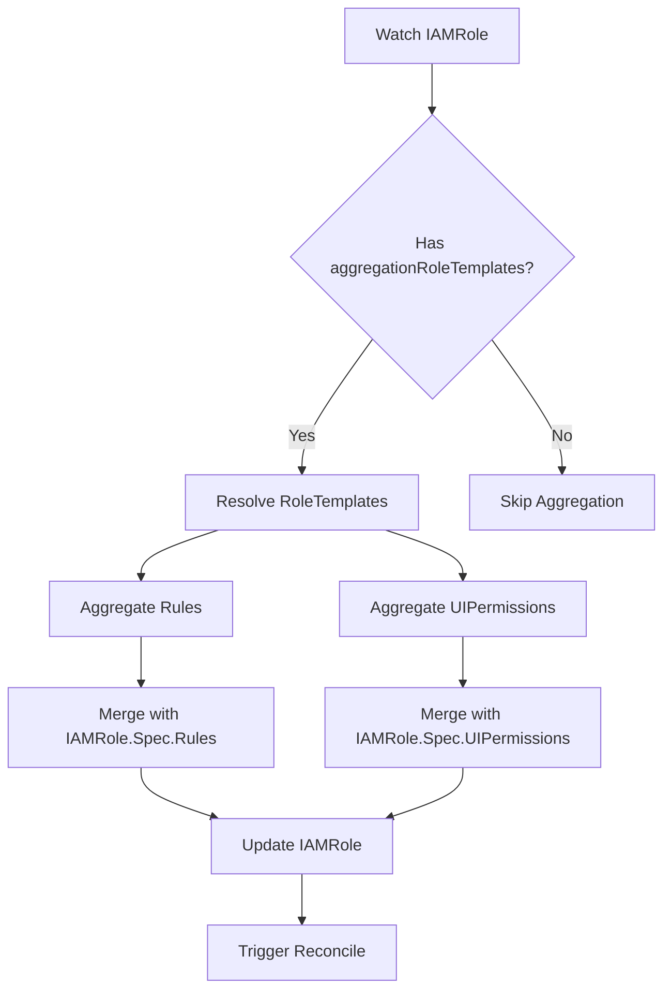
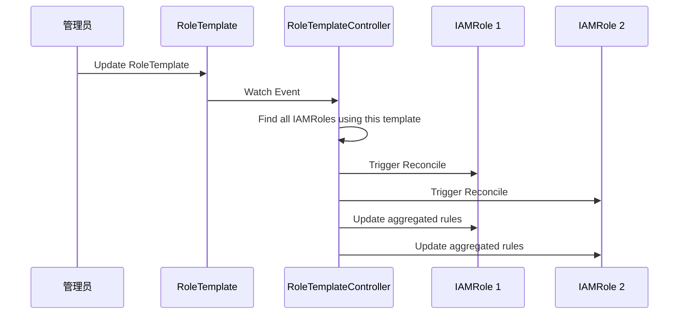

# RoleTemplate 权限模板

## 设计目的

### 权限复用的挑战

在传统的权限系统中，每个角色都需要完整地定义所有权限规则：

```yaml
# ❌ 重复定义问题
---
apiVersion: iam.theriseunion.io/v1alpha1
kind: IAMRole
metadata:
  name: developer-team-a
spec:
  rules:
    - apiGroups: ["apps"]
      resources: ["deployments"]
      verbs: ["get", "list", "create", "update"]
    - apiGroups: [""]
      resources: ["pods", "services"]
      verbs: ["get", "list"]

---
apiVersion: iam.theriseunion.io/v1alpha1
kind: IAMRole
metadata:
  name: developer-team-b
spec:
  rules:
    # 完全相同的权限定义，重复了！
    - apiGroups: ["apps"]
      resources: ["deployments"]
      verbs: ["get", "list", "create", "update"]
    - apiGroups: [""]
      resources: ["pods", "services"]
      verbs: ["get", "list"]
```

**问题**:
- 权限定义重复，维护成本高
- 权限更新需要修改多个 IAMRole
- 容易出现不一致

### RoleTemplate 的解决方案

RoleTemplate 提供可复用的权限规则集合：

```yaml
# ✅ 定义一次
apiVersion: iam.theriseunion.io/v1alpha1
kind: RoleTemplate
metadata:
  name: workload-developer
spec:
  displayName:
    zh-CN: "工作负载开发者"
    en-US: "Workload Developer"
  rules:
    - apiGroups: ["apps"]
      resources: ["deployments"]
      verbs: ["get", "list", "create", "update"]
    - apiGroups: [""]
      resources: ["pods", "services"]
      verbs: ["get", "list"]

---
# ✅ 多处使用
apiVersion: iam.theriseunion.io/v1alpha1
kind: IAMRole
metadata:
  name: developer-team-a
spec:
  aggregationRoleTemplates:
    templateNames:
      - workload-developer

---
apiVersion: iam.theriseunion.io/v1alpha1
kind: IAMRole
metadata:
  name: developer-team-b
spec:
  aggregationRoleTemplates:
    templateNames:
      - workload-developer
```

**优势**:
- 权限定义集中管理
- 一次修改，全局生效
- 支持权限组合和复用

## RoleTemplate 结构

### 核心字段

```yaml
apiVersion: iam.theriseunion.io/v1alpha1
kind: RoleTemplate
metadata:
  name: workload-manager
  labels:
    # Scope 标签
    iam.theriseunion.io/scope: global
    # 分类标签
    iam.theriseunion.io/category: workload
spec:
  # 国际化显示名称
  displayName:
    zh-CN: "工作负载管理"
    en-US: "Workload Manager"
    ja-JP: "ワークロード管理"

  # 国际化描述
  description:
    zh-CN: "管理 Deployment、StatefulSet、DaemonSet 等工作负载资源"
    en-US: "Manage Deployments, StatefulSets, DaemonSets and other workload resources"

  # K8s RBAC 规则
  rules:
    - apiGroups: ["apps"]
      resources: ["deployments", "statefulsets", "daemonsets"]
      verbs: ["get", "list", "create", "update", "delete", "patch"]
    - apiGroups: ["apps"]
      resources: ["deployments/scale", "statefulsets/scale"]
      verbs: ["get", "update"]

  # UI 权限标识
  uiPermissions:
    - "workload/deployment/*"
    - "workload/statefulset/*"
    - "workload/daemonset/*"
```

### 字段说明

| 字段 | 类型 | 说明 |
|------|------|------|
| `displayName` | map[string]string | 支持国际化的显示名称 |
| `description` | map[string]string | 支持国际化的描述信息 |
| `rules` | []rbacv1.PolicyRule | K8s 标准 RBAC 规则 |
| `uiPermissions` | []string | 前端 UI 权限标识 |

### 国际化支持

RoleTemplate 的 `displayName` 和 `description` 支持多语言：

```yaml
displayName:
  zh-CN: "工作负载管理"
  en-US: "Workload Manager"
  ja-JP: "ワークロード管理"
  ko-KR: "워크로드 관리자"
```

前端可以根据用户语言偏好显示对应的名称：

```typescript
function getDisplayName(template: RoleTemplate, locale: string): string {
  return template.spec.displayName[locale] || template.spec.displayName['en-US'];
}
```

## 模板聚合机制

### AggregationRoleTemplates 配置

IAMRole 通过 `aggregationRoleTemplates` 引用 RoleTemplate：

```yaml
apiVersion: iam.theriseunion.io/v1alpha1
kind: IAMRole
metadata:
  name: full-stack-developer
spec:
  # 聚合多个 RoleTemplate
  aggregationRoleTemplates:
    # 按名称引用
    templateNames:
      - workload-manager
      - storage-manager
      - network-viewer

    # 按标签选择器引用（可选）
    roleSelector:
      matchLabels:
        iam.theriseunion.io/category: monitoring
      matchExpressions:
        - key: iam.theriseunion.io/level
          operator: In
          values: ["basic", "advanced"]

  # 额外的直接定义的规则
  rules:
    - apiGroups: ["custom.io"]
      resources: ["customresources"]
      verbs: ["get", "list"]

  # 额外的 UI 权限
  uiPermissions:
    - "custom/dashboard/view"
```

### 聚合方式

**1. 按名称聚合 (templateNames)**

最常用的方式，直接指定 RoleTemplate 名称：

```yaml
aggregationRoleTemplates:
  templateNames:
    - workload-manager
    - storage-viewer
```

**2. 按标签选择器聚合 (roleSelector)**

通过标签动态选择 RoleTemplate：

```yaml
aggregationRoleTemplates:
  roleSelector:
    matchLabels:
      iam.theriseunion.io/category: storage
      iam.theriseunion.io/level: basic
```

这样可以自动包含所有符合条件的 RoleTemplate。

**3. 组合使用**

```yaml
aggregationRoleTemplates:
  templateNames:
    - workload-manager
  roleSelector:
    matchLabels:
      iam.theriseunion.io/category: monitoring
```

### 聚合优先级

权限规则按以下顺序聚合：

1. RoleTemplate 的 rules（按 templateNames 顺序）
2. RoleTemplate 的 rules（按 roleSelector 匹配）
3. IAMRole 直接定义的 rules

UI 权限按相同顺序聚合。

### 去重和合并

RoleTemplateController 会自动去重和合并规则：

```yaml
# Template 1
rules:
  - apiGroups: ["apps"]
    resources: ["deployments"]
    verbs: ["get", "list"]

# Template 2
rules:
  - apiGroups: ["apps"]
    resources: ["deployments"]
    verbs: ["get", "list", "create"]

# 聚合结果（合并 verbs）
rules:
  - apiGroups: ["apps"]
    resources: ["deployments"]
    verbs: ["get", "list", "create"]
```

## RoleTemplateController 工作原理

### Controller 架构



### Reconcile 流程

```go
func (r *RoleTemplateReconciler) Reconcile(ctx context.Context, req ctrl.Request) {
    // 1. 获取 IAMRole
    var iamRole iamv1alpha1.IAMRole
    if err := r.Get(ctx, req.NamespacedName, &iamRole); err != nil {
        return ctrl.Result{}, client.IgnoreNotFound(err)
    }

    // 2. 检查是否需要聚合
    if iamRole.Spec.AggregationRoleTemplates == nil {
        return ctrl.Result{}, nil
    }

    // 3. 解析 RoleTemplate
    templates := r.resolveTemplates(ctx, iamRole.Spec.AggregationRoleTemplates)

    // 4. 聚合 Rules
    aggregatedRules := r.aggregateRules(templates, iamRole.Spec.Rules)

    // 5. 聚合 UIPermissions
    aggregatedUIPerms := r.aggregateUIPermissions(templates, iamRole.Spec.UIPermissions)

    // 6. 更新 IAMRole
    iamRole.Spec.Rules = aggregatedRules
    iamRole.Spec.UIPermissions = aggregatedUIPerms

    return ctrl.Result{}, r.Update(ctx, &iamRole)
}
```

### Watch 机制

RoleTemplateController 监听两种资源：

1. **IAMRole**: 当 IAMRole 的 `aggregationRoleTemplates` 变化时触发
2. **RoleTemplate**: 当 RoleTemplate 变化时，触发所有引用它的 IAMRole 的 reconcile

```go
func (r *RoleTemplateReconciler) SetupWithManager(mgr ctrl.Manager) error {
    return ctrl.NewControllerManagedBy(mgr).
        For(&iamv1alpha1.IAMRole{}).
        Watches(
            &source.Kind{Type: &iamv1alpha1.RoleTemplate{}},
            handler.EnqueueRequestsFromMapFunc(r.findRolesUsingTemplate),
        ).
        Complete(r)
}

func (r *RoleTemplateReconciler) findRolesUsingTemplate(template client.Object) []reconcile.Request {
    // 查找所有引用该 RoleTemplate 的 IAMRole
    var roles iamv1alpha1.IAMRoleList
    r.List(context.Background(), &roles)

    var requests []reconcile.Request
    for _, role := range roles.Items {
        if r.usesTemplate(&role, template.GetName()) {
            requests = append(requests, reconcile.Request{
                NamespacedName: types.NamespacedName{
                    Name:      role.Name,
                    Namespace: role.Namespace,
                },
            })
        }
    }
    return requests
}
```

### 自动更新

当 RoleTemplate 更新时，所有引用它的 IAMRole 会自动更新：



## 模板分类和组织

### 按功能模块分类

使用 `category` 标签组织 RoleTemplate：

```yaml
# 工作负载类
apiVersion: iam.theriseunion.io/v1alpha1
kind: RoleTemplate
metadata:
  name: workload-manager
  labels:
    iam.theriseunion.io/category: workload

---
# 存储类
apiVersion: iam.theriseunion.io/v1alpha1
kind: RoleTemplate
metadata:
  name: storage-manager
  labels:
    iam.theriseunion.io/category: storage

---
# 网络类
apiVersion: iam.theriseunion.io/v1alpha1
kind: RoleTemplate
metadata:
  name: network-manager
  labels:
    iam.theriseunion.io/category: network

---
# 监控类
apiVersion: iam.theriseunion.io/v1alpha1
kind: RoleTemplate
metadata:
  name: monitoring-viewer
  labels:
    iam.theriseunion.io/category: monitoring
```

### 按权限级别分类

使用 `level` 标签区分权限级别：

```yaml
# 查看权限
apiVersion: iam.theriseunion.io/v1alpha1
kind: RoleTemplate
metadata:
  name: workload-viewer
  labels:
    iam.theriseunion.io/category: workload
    iam.theriseunion.io/level: viewer

---
# 编辑权限
apiVersion: iam.theriseunion.io/v1alpha1
kind: RoleTemplate
metadata:
  name: workload-editor
  labels:
    iam.theriseunion.io/category: workload
    iam.theriseunion.io/level: editor

---
# 管理权限
apiVersion: iam.theriseunion.io/v1alpha1
kind: RoleTemplate
metadata:
  name: workload-manager
  labels:
    iam.theriseunion.io/category: workload
    iam.theriseunion.io/level: manager
```

### 查询 RoleTemplate

```bash
# 查询所有 RoleTemplate
kubectl get roletemplates

# 按 category 查询
kubectl get roletemplates -l iam.theriseunion.io/category=workload

# 按 level 查询
kubectl get roletemplates -l iam.theriseunion.io/level=viewer

# 组合查询
kubectl get roletemplates \
  -l iam.theriseunion.io/category=workload,iam.theriseunion.io/level=manager
```

## 实战示例

### 场景 1: 创建标准开发者角色

**需求**: 开发者需要管理工作负载、查看存储和网络资源。

**实现**:

```yaml
# 1. 定义 RoleTemplate
---
apiVersion: iam.theriseunion.io/v1alpha1
kind: RoleTemplate
metadata:
  name: workload-manager
  labels:
    iam.theriseunion.io/category: workload
spec:
  displayName:
    zh-CN: "工作负载管理"
    en-US: "Workload Manager"
  rules:
    - apiGroups: ["apps"]
      resources: ["deployments", "statefulsets", "daemonsets"]
      verbs: ["get", "list", "create", "update", "delete"]
  uiPermissions:
    - "workload/deployment/*"
    - "workload/statefulset/*"

---
apiVersion: iam.theriseunion.io/v1alpha1
kind: RoleTemplate
metadata:
  name: storage-viewer
  labels:
    iam.theriseunion.io/category: storage
spec:
  displayName:
    zh-CN: "存储查看"
    en-US: "Storage Viewer"
  rules:
    - apiGroups: [""]
      resources: ["persistentvolumeclaims"]
      verbs: ["get", "list"]
  uiPermissions:
    - "storage/pvc/view"

---
apiVersion: iam.theriseunion.io/v1alpha1
kind: RoleTemplate
metadata:
  name: network-viewer
  labels:
    iam.theriseunion.io/category: network
spec:
  displayName:
    zh-CN: "网络查看"
    en-US: "Network Viewer"
  rules:
    - apiGroups: [""]
      resources: ["services", "endpoints"]
      verbs: ["get", "list"]
  uiPermissions:
    - "network/service/view"

---
# 2. 创建 IAMRole，聚合 RoleTemplate
apiVersion: iam.theriseunion.io/v1alpha1
kind: IAMRole
metadata:
  name: developer
  labels:
    iam.theriseunion.io/scope: workspace
spec:
  aggregationRoleTemplates:
    templateNames:
      - workload-manager
      - storage-viewer
      - network-viewer
```

### 场景 2: 动态角色组合

**需求**: 自动聚合所有 "monitoring" 类别的查看权限。

**实现**:

```yaml
# 1. 定义多个监控类 RoleTemplate
---
apiVersion: iam.theriseunion.io/v1alpha1
kind: RoleTemplate
metadata:
  name: prometheus-viewer
  labels:
    iam.theriseunion.io/category: monitoring
    iam.theriseunion.io/level: viewer
spec:
  displayName:
    zh-CN: "Prometheus 查看"
  rules:
    - apiGroups: ["monitoring.coreos.com"]
      resources: ["prometheuses", "servicemonitors"]
      verbs: ["get", "list"]

---
apiVersion: iam.theriseunion.io/v1alpha1
kind: RoleTemplate
metadata:
  name: grafana-viewer
  labels:
    iam.theriseunion.io/category: monitoring
    iam.theriseunion.io/level: viewer
spec:
  displayName:
    zh-CN: "Grafana 查看"
  rules:
    - apiGroups: ["grafana.integreatly.org"]
      resources: ["grafanas", "grafanadashboards"]
      verbs: ["get", "list"]

---
# 2. 创建 IAMRole，使用 roleSelector 自动聚合
apiVersion: iam.theriseunion.io/v1alpha1
kind: IAMRole
metadata:
  name: monitoring-viewer
spec:
  aggregationRoleTemplates:
    roleSelector:
      matchLabels:
        iam.theriseunion.io/category: monitoring
        iam.theriseunion.io/level: viewer
```

当添加新的监控类 RoleTemplate 时，`monitoring-viewer` 角色会自动包含新权限。

### 场景 3: 模板继承和扩展

**需求**: 基于基础角色，添加额外权限。

**实现**:

```yaml
# 1. 基础开发者模板
apiVersion: iam.theriseunion.io/v1alpha1
kind: RoleTemplate
metadata:
  name: basic-developer
spec:
  rules:
    - apiGroups: ["apps"]
      resources: ["deployments"]
      verbs: ["get", "list"]

---
# 2. 高级开发者角色 = 基础权限 + 额外权限
apiVersion: iam.theriseunion.io/v1alpha1
kind: IAMRole
metadata:
  name: senior-developer
spec:
  # 聚合基础模板
  aggregationRoleTemplates:
    templateNames:
      - basic-developer

  # 添加额外权限
  rules:
    - apiGroups: ["apps"]
      resources: ["deployments"]
      verbs: ["create", "update", "delete"]
    - apiGroups: ["apps"]
      resources: ["statefulsets", "daemonsets"]
      verbs: ["*"]

  # 添加额外 UI 权限
  uiPermissions:
    - "workload/deployment/delete"
    - "workload/statefulset/*"
```

## 最佳实践

### 1. 模板粒度

保持 RoleTemplate 的单一职责：

```yaml
# ✅ 好的做法：按资源类型划分
- workload-deployment-manager
- workload-statefulset-manager
- workload-daemonset-manager

# ❌ 避免：过于宽泛
- workload-all-manager
```

### 2. 命名规范

使用清晰的命名约定：

```
<模块>-<资源>-<级别>
```

例如：
- `workload-deployment-viewer`
- `storage-pvc-manager`
- `network-service-editor`

### 3. 标签管理

为 RoleTemplate 添加完整的标签：

```yaml
metadata:
  labels:
    iam.theriseunion.io/scope: global
    iam.theriseunion.io/category: workload
    iam.theriseunion.io/level: manager
    iam.theriseunion.io/module: apps
```

### 4. 文档化

在 description 字段提供详细说明：

```yaml
spec:
  description:
    zh-CN: |
      工作负载管理权限，包括：
      - Deployment 的完整管理
      - StatefulSet 的完整管理
      - DaemonSet 的完整管理
    en-US: |
      Workload management permissions, including:
      - Full management of Deployments
      - Full management of StatefulSets
      - Full management of DaemonSets
```

### 5. 版本管理

使用标签标记模板版本：

```yaml
metadata:
  labels:
    iam.theriseunion.io/version: v1
    iam.theriseunion.io/deprecated: "false"
```

## 常见问题

### Q1: RoleTemplate 更新后，IAMRole 多久生效？

**A**: RoleTemplateController 监听 RoleTemplate 变化，通常在 1-2 秒内触发所有引用该模板的 IAMRole 的 reconcile。

### Q2: 如何查看 IAMRole 实际聚合的权限？

**A**: 查看 IAMRole 的 `spec.rules` 和 `spec.uiPermissions` 字段：

```bash
kubectl get iamrole developer -o yaml | grep -A 20 "spec:"
```

### Q3: 可以动态添加 RoleTemplate 吗？

**A**: 可以。使用 `roleSelector` 方式引用时，新增符合条件的 RoleTemplate 会自动被聚合。

### Q4: RoleTemplate 之间的权限冲突如何处理？

**A**: 不存在冲突，所有权限会合并。例如：
- Template 1: `verbs: ["get", "list"]`
- Template 2: `verbs: ["get", "create"]`
- 聚合结果: `verbs: ["get", "list", "create"]`

### Q5: 如何禁用某个 RoleTemplate？

**A**: 删除 RoleTemplate 或从 IAMRole 的 `aggregationRoleTemplates` 中移除：

```bash
# 方法 1: 删除 RoleTemplate
kubectl delete roletemplate workload-manager

# 方法 2: 从 IAMRole 中移除
kubectl edit iamrole developer
# 删除 templateNames 中的对应项
```

## 下一步

理解了 RoleTemplate 后，建议继续阅读：

- [Scope 系统](./scope-system.md) - 了解 RoleTemplate 在不同 Scope 下的使用
- [权限模型](./permission-model.md) - 深入理解 IAMRole 和 RoleTemplate 的关系
- [架构设计](./architecture.md) - 了解 RoleTemplateController 的实现
