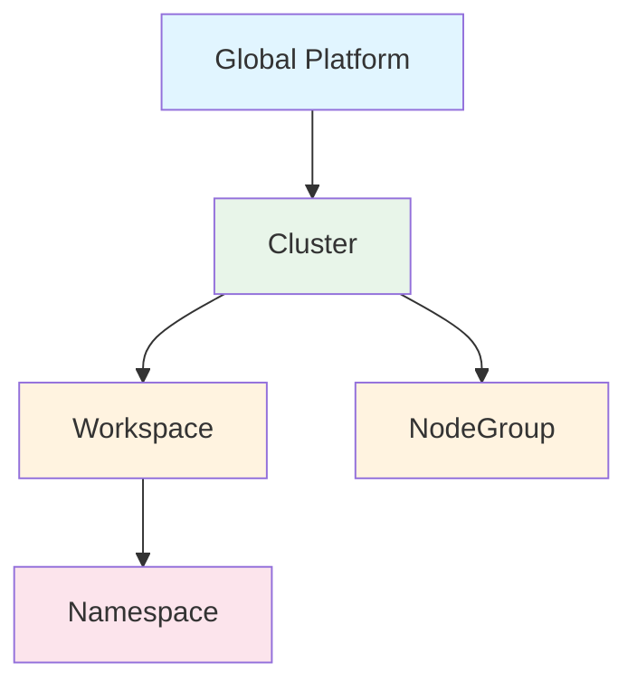
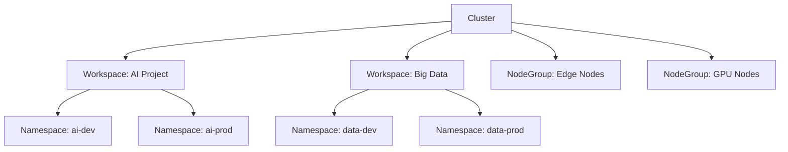
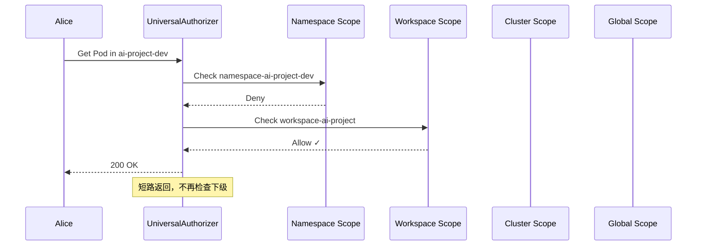

# Scope 层级系统

## 什么是 Scope？

Scope（作用域）定义了权限的生效范围。在 Edge Platform 中，Scope 系统解决了多租户环境下 "**在什么范围内授予权限**" 的核心问题。

### 传统 RBAC 的局限

Kubernetes 原生 RBAC 只有两个层级：

- **Namespace 级别**: Role + RoleBinding
- **Cluster 级别**: ClusterRole + ClusterRoleBinding

这在企业多租户场景下是不够的：

```
❌ 如何给某个团队管理他们的所有 namespace？
❌ 如何给某个部门管理特定的节点组？
❌ 如何实现工作空间级别的权限隔离？
```

### Edge Platform 的 Scope 层级

Edge Platform 扩展了 Scope 概念，提供 5 个层级：



| Scope | 说明 | 使用场景 | K8s 映射 |
|-------|------|---------|----------|
| **global** | 全局平台级别 | 平台管理员 | ClusterRole |
| **cluster** | 集群级别 | 集群管理员 | ClusterRole |
| **workspace** | 工作空间级别（应用视图） | 应用团队管理 | ClusterRole |
| **nodegroup** | 节点组级别（资源视图） | 资源池管理 | ClusterRole |
| **namespace** | 命名空间级别 | 开发人员 | Role |

## Scope 标签设计

### 标签规范

Edge Platform 使用两个标签定义 Scope：

```yaml
metadata:
  labels:
    # Scope 类型
    iam.theriseunion.io/scope: workspace

    # Scope 实例标识
    iam.theriseunion.io/scope-value: ai-project
```

### 标签应用示例

**1. Global Scope 的 IAMRole**

```yaml
apiVersion: iam.theriseunion.io/v1alpha1
kind: IAMRole
metadata:
  name: platform-admin
  labels:
    iam.theriseunion.io/scope: global
    iam.theriseunion.io/scope-value: platform
spec:
  rules:
    - apiGroups: ["*"]
      resources: ["*"]
      verbs: ["*"]
```

**2. Workspace Scope 的 IAMRole**

```yaml
apiVersion: iam.theriseunion.io/v1alpha1
kind: IAMRole
metadata:
  name: workspace-developer
  labels:
    iam.theriseunion.io/scope: workspace
    iam.theriseunion.io/scope-value: ai-project
spec:
  rules:
    - apiGroups: ["apps"]
      resources: ["deployments"]
      verbs: ["get", "list", "create", "update"]
```

**3. Namespace Scope 的 IAMRole**

```yaml
apiVersion: iam.theriseunion.io/v1alpha1
kind: IAMRole
metadata:
  name: namespace-developer
  labels:
    iam.theriseunion.io/scope: namespace
    iam.theriseunion.io/scope-value: ai-project-dev
spec:
  rules:
    - apiGroups: [""]
      resources: ["pods"]
      verbs: ["get", "list", "watch"]
```

## Scope 层级关系

### 垂直继承链

Namespace、Workspace、Cluster、Global 形成垂直的权限继承链：

```
global (platform)
  ↓
cluster (cluster-beijing)
  ↓
workspace (ai-project)
  ↓
namespace (ai-project-dev)
```

**继承原则**: 上级 Scope 的权限自动下传到下级 Scope。

**示例**:
- 如果用户在 `global` 有权限，则可以访问所有 cluster、workspace、namespace
- 如果用户在 `workspace-ai-project` 有权限，则可以访问该 workspace 下的所有 namespace
- 如果用户在 `namespace-dev` 有权限，则只能访问该 namespace

### 并行维度

Workspace 和 NodeGroup 是**平级关系**，不存在继承：



**关键点**:
- Workspace 和 NodeGroup 都从属于 Cluster
- 它们之间没有权限继承关系
- 一个用户可以同时在 Workspace A 和 NodeGroup B 拥有不同的权限

### 应用视图 vs 资源视图

| 维度 | Workspace | NodeGroup |
|------|-----------|-----------|
| **视角** | 应用/业务视角 | 基础设施视角 |
| **管理对象** | Namespace、Workload | Node、Pool |
| **典型用户** | 应用开发团队 | 运维/SRE 团队 |
| **权限范围** | 应用资源（Pod、Service、Deployment） | 节点资源（Node、NodePool） |
| **使用场景** | 多租户应用隔离 | 资源池管理 |

**示例场景**:

```yaml
# Alice 是 AI 项目的开发者
apiVersion: iam.theriseunion.io/v1alpha1
kind: IAMRoleBinding
metadata:
  name: alice-ai-developer
  labels:
    iam.theriseunion.io/scope: workspace
    iam.theriseunion.io/scope-value: ai-project
spec:
  subjects:
    - kind: User
      name: alice
  roleRef:
    kind: IAMRole
    name: workspace-developer

---
# Alice 同时是 GPU 节点组的查看者
apiVersion: iam.theriseunion.io/v1alpha1
kind: IAMRoleBinding
metadata:
  name: alice-gpu-viewer
  labels:
    iam.theriseunion.io/scope: nodegroup
    iam.theriseunion.io/scope-value: gpu-nodes
spec:
  subjects:
    - kind: User
      name: alice
  roleRef:
    kind: IAMRole
    name: nodegroup-viewer
```

在这个例子中：
- Alice 可以在 `ai-project` workspace 下创建和管理应用
- Alice 可以查看 `gpu-nodes` 节点组的节点信息
- 这两个权限是独立的，互不影响

## 级联权限检查

### 权限检查顺序

当用户访问某个资源时，UniversalAuthorizer 按以下顺序检查权限：

```
1. namespace scope    (最具体)
2. workspace scope
3. cluster scope
4. global scope       (最抽象)
```

**核心原则**: 任何一层允许 = 整体允许（短路机制）

### 检查流程示例

假设用户 Alice 请求访问 `namespace: ai-project-dev` 中的 Pod：



### 权限继承示例

**场景 1: Global 管理员**

```yaml
apiVersion: iam.theriseunion.io/v1alpha1
kind: IAMRoleBinding
metadata:
  name: admin-global
  labels:
    iam.theriseunion.io/scope: global
    iam.theriseunion.io/scope-value: platform
spec:
  subjects:
    - kind: User
      name: admin
  roleRef:
    kind: IAMRole
    name: platform-admin
```

结果：
- ✅ 可以访问所有 cluster
- ✅ 可以访问所有 workspace
- ✅ 可以访问所有 namespace
- ✅ 可以访问所有 nodegroup

**场景 2: Workspace 管理员**

```yaml
apiVersion: iam.theriseunion.io/v1alpha1
kind: IAMRoleBinding
metadata:
  name: alice-workspace-admin
  labels:
    iam.theriseunion.io/scope: workspace
    iam.theriseunion.io/scope-value: ai-project
spec:
  subjects:
    - kind: User
      name: alice
  roleRef:
    kind: IAMRole
    name: workspace-admin
```

结果：
- ❌ 不能访问其他 workspace
- ✅ 可以访问 `ai-project` workspace 下的所有 namespace
- ✅ 可以在 `ai-project` workspace 下创建 namespace
- ❌ 不能访问 cluster 级别资源（Node）

**场景 3: Namespace 开发者**

```yaml
apiVersion: iam.theriseunion.io/v1alpha1
kind: IAMRoleBinding
metadata:
  name: bob-namespace-developer
  labels:
    iam.theriseunion.io/scope: namespace
    iam.theriseunion.io/scope-value: ai-project-dev
spec:
  subjects:
    - kind: User
      name: bob
  roleRef:
    kind: IAMRole
    name: namespace-developer
```

结果：
- ❌ 不能访问其他 namespace
- ✅ 可以在 `ai-project-dev` namespace 中管理 Pod、Deployment
- ❌ 不能创建新的 namespace
- ❌ 不能访问 workspace 级别资源

## Scope 边界和隔离

### Workspace 隔离

Workspace 提供应用级别的多租户隔离：

```yaml
apiVersion: scope.theriseunion.io/v1alpha1
kind: Workspace
metadata:
  name: ai-project
  labels:
    scope.theriseunion.io/cluster: cluster-beijing
spec:
  manager: alice
  template:
    namespaces:
      - ai-project-dev
      - ai-project-test
      - ai-project-prod
    resourceQuotas:
      cpu: "100"
      memory: "200Gi"
```

**隔离特性**:
- 每个 Workspace 拥有独立的 Namespace 集合
- 资源配额在 Workspace 级别管理
- 权限边界清晰，互不干扰

### Namespace 标签同步

Workspace 会自动为其管理的 Namespace 添加标签：

```yaml
apiVersion: v1
kind: Namespace
metadata:
  name: ai-project-dev
  labels:
    # WorkspaceController 自动添加
    scope.theriseunion.io/workspace: ai-project
    scope.theriseunion.io/cluster: cluster-beijing
```

这样可以通过 Label Selector 快速查询 Workspace 下的所有 Namespace：

```bash
kubectl get namespaces -l scope.theriseunion.io/workspace=ai-project
```

### NodeGroup 隔离

NodeGroup 提供节点级别的资源池隔离：

```yaml
apiVersion: scope.theriseunion.io/v1alpha1
kind: NodeGroup
metadata:
  name: gpu-nodes
  labels:
    scope.theriseunion.io/cluster: cluster-beijing
spec:
  selector:
    matchLabels:
      node.theriseunion.io/type: gpu
  template:
    labels:
      nodegroup: gpu-nodes
    taints:
      - "nvidia.com/gpu=true:NoSchedule"
```

**隔离特性**:
- 通过节点选择器匹配节点
- 自动应用标签、注解、污点
- 权限管理独立于 Workspace

## Scope 与 K8s RBAC 的映射

### 映射规则

| IAMRole Scope | K8s 资源 | 命名空间 | RoleBinding 类型 |
|--------------|---------|---------|-----------------|
| global | ClusterRole | - | ClusterRoleBinding |
| cluster | ClusterRole | - | ClusterRoleBinding |
| workspace | ClusterRole | - | ClusterRoleBinding* |
| nodegroup | ClusterRole | - | ClusterRoleBinding* |
| namespace | Role | 指定 NS | RoleBinding |

\* Workspace 和 NodeGroup 的 ClusterRoleBinding 需要通过额外机制限制作用范围。

### 同步示例

**Namespace Scope 的转换**:

```yaml
# IAMRole (Source)
apiVersion: iam.theriseunion.io/v1alpha1
kind: IAMRole
metadata:
  name: dev-role
  labels:
    iam.theriseunion.io/scope: namespace
    iam.theriseunion.io/scope-value: ai-project-dev
spec:
  rules:
    - apiGroups: ["apps"]
      resources: ["deployments"]
      verbs: ["get", "list", "create"]

---
# K8s Role (Target)
apiVersion: rbac.authorization.k8s.io/v1
kind: Role
metadata:
  name: dev-role
  namespace: ai-project-dev
rules:
  - apiGroups: ["apps"]
    resources: ["deployments"]
    verbs: ["get", "list", "create"]
```

**Workspace Scope 的转换**:

```yaml
# IAMRole (Source)
apiVersion: iam.theriseunion.io/v1alpha1
kind: IAMRole
metadata:
  name: workspace-admin
  labels:
    iam.theriseunion.io/scope: workspace
    iam.theriseunion.io/scope-value: ai-project
spec:
  rules:
    - apiGroups: [""]
      resources: ["namespaces"]
      verbs: ["get", "list", "create"]

---
# K8s ClusterRole (Target)
apiVersion: rbac.authorization.k8s.io/v1
kind: ClusterRole
metadata:
  name: workspace-admin-ai-project
  labels:
    iam.theriseunion.io/scope: workspace
    iam.theriseunion.io/scope-value: ai-project
rules:
  - apiGroups: [""]
    resources: ["namespaces"]
    verbs: ["get", "list", "create"]
```

### RoleBinding 的作用范围

通过 RoleBinding 的 namespace 字段和 ClusterRoleBinding 的组合，实现 Scope 限制：

```yaml
# Workspace 范围的 ClusterRoleBinding
apiVersion: rbac.authorization.k8s.io/v1
kind: ClusterRoleBinding
metadata:
  name: alice-workspace-admin
  labels:
    iam.theriseunion.io/scope: workspace
    iam.theriseunion.io/scope-value: ai-project
subjects:
  - kind: User
    name: alice
roleRef:
  kind: ClusterRole
  name: workspace-admin-ai-project
```

在 UniversalAuthorizer 中，通过检查标签来确定权限是否适用于当前资源。

## 实战示例

### 场景：多团队协作

假设一个公司有三个团队：AI 团队、大数据团队、运维团队。

**1. 创建 Workspace**

```yaml
# AI 团队的工作空间
apiVersion: scope.theriseunion.io/v1alpha1
kind: Workspace
metadata:
  name: ai-project
spec:
  manager: alice
  template:
    namespaces:
      - ai-dev
      - ai-prod

---
# 大数据团队的工作空间
apiVersion: scope.theriseunion.io/v1alpha1
kind: Workspace
metadata:
  name: bigdata-project
spec:
  manager: bob
  template:
    namespaces:
      - bigdata-dev
      - bigdata-prod
```

**2. 创建 NodeGroup**

```yaml
# GPU 节点组
apiVersion: scope.theriseunion.io/v1alpha1
kind: NodeGroup
metadata:
  name: gpu-nodes
spec:
  selector:
    matchLabels:
      node-type: gpu

---
# 普通节点组
apiVersion: scope.theriseunion.io/v1alpha1
kind: NodeGroup
metadata:
  name: general-nodes
spec:
  selector:
    matchLabels:
      node-type: general
```

**3. 分配权限**

```yaml
# Alice 管理 AI 工作空间
apiVersion: iam.theriseunion.io/v1alpha1
kind: IAMRoleBinding
metadata:
  name: alice-workspace-admin
  labels:
    iam.theriseunion.io/scope: workspace
    iam.theriseunion.io/scope-value: ai-project
spec:
  subjects:
    - kind: User
      name: alice
  roleRef:
    kind: IAMRole
    name: workspace-admin

---
# Bob 管理大数据工作空间
apiVersion: iam.theriseunion.io/v1alpha1
kind: IAMRoleBinding
metadata:
  name: bob-workspace-admin
  labels:
    iam.theriseunion.io/scope: workspace
    iam.theriseunion.io/scope-value: bigdata-project
spec:
  subjects:
    - kind: User
      name: bob
  roleRef:
    kind: IAMRole
    name: workspace-admin

---
# 运维团队管理所有节点组
apiVersion: iam.theriseunion.io/v1alpha1
kind: IAMRoleBinding
metadata:
  name: ops-nodegroup-admin
  labels:
    iam.theriseunion.io/scope: cluster
    iam.theriseunion.io/scope-value: cluster-beijing
spec:
  subjects:
    - kind: Group
      name: ops-team
  roleRef:
    kind: IAMRole
    name: nodegroup-admin
```

**权限矩阵**:

|  | ai-dev | ai-prod | bigdata-dev | bigdata-prod | gpu-nodes | general-nodes |
|---|--------|---------|-------------|--------------|-----------|---------------|
| Alice | ✅ | ✅ | ❌ | ❌ | ❌ | ❌ |
| Bob | ❌ | ❌ | ✅ | ✅ | ❌ | ❌ |
| Ops Team | ❌* | ❌* | ❌* | ❌* | ✅ | ✅ |

\* 运维团队不能访问应用资源，但可以访问所有节点资源。

## 查询和调试

### 查询用户的 Scope 权限

```bash
# 查询用户在 workspace 下的权限
kubectl get iamrolebindings \
  -l iam.theriseunion.io/scope=workspace,iam.theriseunion.io/scope-value=ai-project

# 查询用户在 namespace 下的权限
kubectl get iamrolebindings \
  -l iam.theriseunion.io/scope=namespace,iam.theriseunion.io/scope-value=ai-dev
```

### 测试权限

```bash
# 测试用户是否有权限
kubectl auth can-i create deployments \
  --namespace=ai-dev \
  --as=alice

# 测试用户是否有节点权限
kubectl auth can-i get nodes \
  --as=ops-user
```

### 查看 Scope 链

```bash
# 查看 Namespace 所属的 Workspace
kubectl get namespace ai-dev -o yaml | grep scope.theriseunion.io/workspace

# 查看 Workspace 所属的 Cluster
kubectl get workspace ai-project -o yaml | grep scope.theriseunion.io/cluster
```

## 最佳实践

### 1. 合理划分 Scope

- **Global**: 只给平台管理员
- **Cluster**: 给集群管理员和 SRE
- **Workspace**: 给应用团队负责人
- **NodeGroup**: 给基础设施团队
- **Namespace**: 给开发人员

### 2. 使用 Workspace 隔离应用

为每个团队或项目创建独立的 Workspace：

```yaml
# 不要所有团队共享一个 Workspace
❌ workspace: shared-workspace

# 为每个团队创建独立 Workspace
✅ workspace: team-ai
✅ workspace: team-bigdata
✅ workspace: team-frontend
```

### 3. 使用 NodeGroup 管理资源池

按资源类型划分 NodeGroup：

```yaml
✅ nodegroup: gpu-nodes
✅ nodegroup: cpu-nodes
✅ nodegroup: edge-nodes
✅ nodegroup: high-memory-nodes
```

### 4. 避免过度授权

不要在高层级 Scope 授予过多权限：

```yaml
# 避免在 global 授予普通用户权限
❌ global scope → developer role

# 在合适的 Scope 授予权限
✅ workspace scope → developer role
✅ namespace scope → developer role
```

## 下一步

理解了 Scope 系统后，建议继续阅读：

- [RoleTemplate](./roletemplate.md) - 学习如何使用模板复用权限
- [权限模型](./permission-model.md) - 深入理解 IAMRole 和权限聚合
- [OAuth 认证](./oauth.md) - 了解认证流程和 Token 管理
