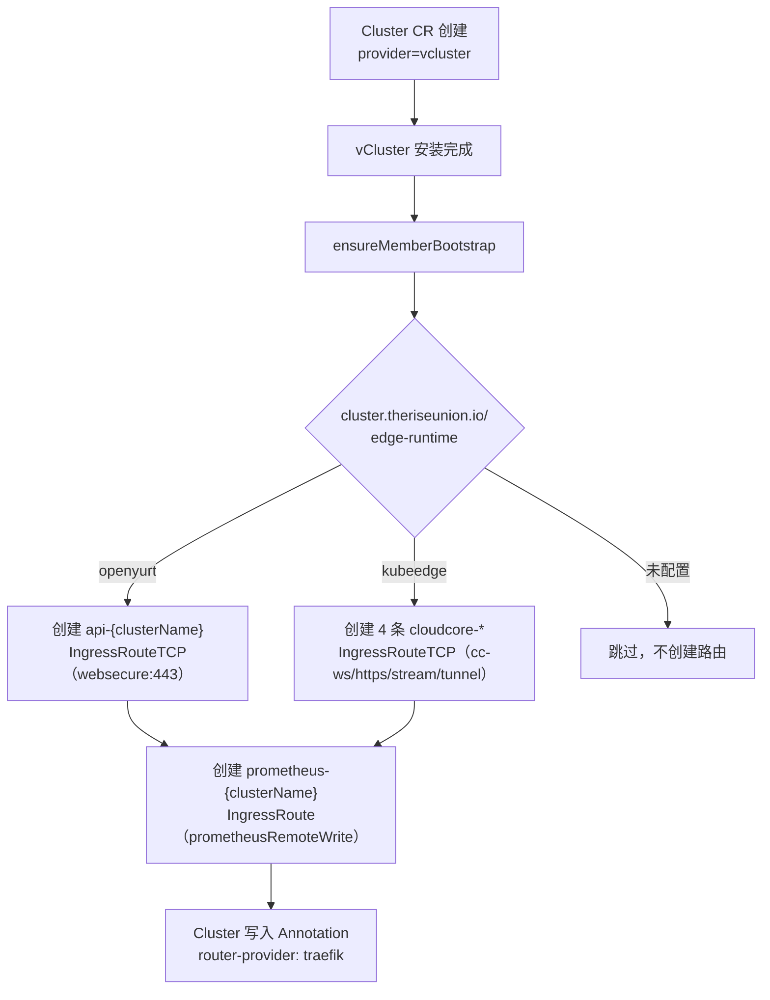

# Traefik 路由体系

## 概述

Traefik 是平台的统一流量入口，承担以下核心职责：

- **多集群 API 访问**：通过 SNI 路由将外部流量分发到各 vCluster 的 Kubernetes API Server
- **边缘运行时通道**：为 KubeEdge CloudCore 暴露专用端口，允许边缘节点建立云边通信
- **监控数据收集**：为 Prometheus Remote Write 提供 HTTP 入口，汇聚各子集群的指标数据
- **平台服务暴露**：暴露 edge-console 控制台和 bin-downloader 等 HTTP 服务

平台使用 Traefik v3.x，以 NodePort Service 形式部署在主集群的 `traefik` 命名空间。所有路由规则通过 Traefik CRD（`IngressRoute` / `IngressRouteTCP`）声明，由 Traefik 的 Kubernetes CRD Provider 动态加载。

> 在 `config.sg.yd-001` 集群查看当前所有路由规则：
> ```bash
> kubectl --kubeconfig ~/.kube/config.sg.yd-001 --context config.sg.yd-001 \
>   get ingressroute,ingressroutetcp -A
> ```

---

## 入口点（EntryPoints）

Traefik 监听以下端口，每个端口对应一个 EntryPoint，承载不同类型的流量：

| EntryPoint 名称 | 容器端口 | NodePort | 协议 | 用途 |
|----------------|---------|----------|------|------|
| `web` | 80 | 30080 | TCP | 普通 HTTP 流量（控制台、bin-downloader） |
| `websecure` | 443 | 30443 | TCP | HTTPS/TLS（vCluster API Server、OpenYurt） |
| `websocket` | 8080 | 30808 | TCP | WebSocket 流量 |
| `cc-ws` | 10000 | 30000 | TCP | KubeEdge CloudCore WebSocket（cloudhub） |
| `cc-https` | 10002 | 30002 | TCP | KubeEdge CloudCore HTTPS（cloudhub-https） |
| `cc-stream` | 10003 | 30003 | TCP | KubeEdge CloudCore 流传输（cloudstream） |
| `cc-tunnel` | 10004 | 30004 | TCP | KubeEdge CloudCore 隧道（tunnelport） |
| `prometheusRemoteWrite` | — | — | TCP | Prometheus Remote Write |

**配置文件**：`edge-installer/traefik/values.yaml`

---

## 当前路由规则（config.sg.yd-001）

以下是从真实集群获取的路由规则，直观体现了命名规律和路由目标。

### IngressRoute（HTTP）

```
NAMESPACE              NAME                                          ENTRYPOINT              MATCH
--------------------   -------------------------------------------   ---------------------   ------------------------------
observability-system   prometheus-remote-write                       prometheusRemoteWrite   Host(`host.rise.io`)
edge-system            console                                       web                     PathPrefix(`/`)
edge-system            bin-downloader                                web                     Host(`bin-downloader.rise.io`)
edge-system            prometheus-v-oy-001                           prometheusRemoteWrite   Host(`v-oy-001.rise.io`)
edge-system            prometheus-v-oy-002                           prometheusRemoteWrite   Host(`v-oy-002.rise.io`)
edge-system            prometheus-v-oy-003                           prometheusRemoteWrite   Host(`v-oy-003.rise.io`)
edge-system            prometheus-v-oy-005                           prometheusRemoteWrite   Host(`v-oy-005.rise.io`)
edge-system            prometheus-v-oy-101                           prometheusRemoteWrite   Host(`v-oy-101.rise.io`)
edge-system            prometheus-v-ke-001                           prometheusRemoteWrite   Host(`v-ke-001.rise.io`)
edge-system            prometheus-v-ke-002                           prometheusRemoteWrite   Host(`v-ke-002.rise.io`)
edge-system            prometheus-v-ke-101                           prometheusRemoteWrite   Host(`v-ke-101.rise.io`)
edge-system            prometheus-test-vcluster                      prometheusRemoteWrite   Host(`test-vcluster.rise.io`)
edge-system            prometheus-test-vcluster-001                  prometheusRemoteWrite   Host(`test-vcluster-001.rise.io`)
edge-system            prometheus-test-vcluster-002                  prometheusRemoteWrite   Host(`test-vcluster-002.rise.io`)
```

### IngressRouteTCP

```
NAMESPACE     NAME                               ENTRYPOINT   MATCH
----------    ---------------------------------   ----------   ---------------------------------
edge-system   api-v-oy-001                       websecure    HostSNI(`v-oy-001.rise.io`)
edge-system   api-v-oy-002                       websecure    HostSNI(`v-oy-002.rise.io`)
edge-system   api-v-oy-003                       websecure    HostSNI(`v-oy-003.rise.io`)
edge-system   api-v-oy-005                       websecure    HostSNI(`v-oy-005.rise.io`)
edge-system   api-v-oy-101                       websecure    HostSNI(`v-oy-101.rise.io`)
edge-system   api-test-vcluster                  websecure    HostSNI(`test-vcluster.rise.io`)
edge-system   api-test-vcluster-001              websecure    HostSNI(`test-vcluster-001.rise.io`)
edge-system   api-test-vcluster-002              websecure    HostSNI(`test-vcluster-002.rise.io`)
edge-system   cloudcore-cc-ws-v-ke-101           cc-ws        HostSNI(`v-ke-101.rise.io`)
edge-system   cloudcore-cc-https-v-ke-101        cc-https     HostSNI(`v-ke-101.rise.io`)
edge-system   cloudcore-cc-stream-v-ke-101       cc-stream    HostSNI(`v-ke-101.rise.io`)
edge-system   cloudcore-cc-tunnel-v-ke-101       cc-tunnel    HostSNI(`v-ke-101.rise.io`)
edge-system   cloudcore-cc-ws-v-ke-002           cc-ws        HostSNI(`v-ke-002.rise.io`)
edge-system   cloudcore-cc-https-v-ke-002        cc-https     HostSNI(`v-ke-002.rise.io`)
edge-system   cloudcore-cc-stream-v-ke-002       cc-stream    HostSNI(`v-ke-002.rise.io`)
edge-system   cloudcore-cc-tunnel-v-ke-002       cc-tunnel    HostSNI(`v-ke-002.rise.io`)
edge-system   cloudcore-cc-ws-v-ke-001           cc-ws        HostSNI(`v-ke-001.rise.io`)
edge-system   cloudcore-cc-https-v-ke-001        cc-https     HostSNI(`v-ke-001.rise.io`)
edge-system   cloudcore-cc-stream-v-ke-001       cc-stream    HostSNI(`v-ke-001.rise.io`)
edge-system   cloudcore-cc-tunnel-v-ke-001       cc-tunnel    HostSNI(`v-ke-001.rise.io`)
```

---

## 路由规则详解

### 1. 主集群 Prometheus（固定规则）

**资源**：`observability-system/prometheus-remote-write`（由 `edge-monitoring` Helm Chart 创建）

```yaml
apiVersion: traefik.io/v1alpha1
kind: IngressRoute
metadata:
  name: prometheus-remote-write
  namespace: observability-system
spec:
  entryPoints:
    - prometheusRemoteWrite
  routes:
    - match: Host(`host.rise.io`)
      kind: Rule
      services:
        - name: prometheus-operated
          namespace: observability-system
          port: 9090
```

**流向**：任意写入方 → `host.rise.io` → 主集群 `prometheus-operated:9090`

**用途**：作为全局 Prometheus Remote Write 入口，主集群自身及其他组件可向此地址写入指标。

---

### 2. vCluster API Server（OpenYurt 运行时）

**资源类型**：`IngressRouteTCP`
**命名规则**：`api-{clusterName}`
**创建位置**：`edge-system` 命名空间

```yaml
# 示例：集群 v-oy-001
apiVersion: traefik.io/v1alpha1
kind: IngressRouteTCP
metadata:
  name: api-v-oy-001
  namespace: edge-system
spec:
  entryPoints:
    - websecure            # 端口 443 / NodePort 30443
  routes:
    - match: HostSNI(`v-oy-001.rise.io`)
      services:
        - name: vcluster-vcluster-v-oy-001   # 命名规则：vcluster-{vclusterNamespace}
          namespace: vcluster-v-oy-001
          port: 443
  tls:
    passthrough: true      # TLS 透传，不在 Traefik 层终止
```

**流向**：

```
边缘节点（yurtadm join）
  → Traefik NodePort :30443
  → vCluster Service vcluster-vcluster-{namespace}:443
  → vCluster API Server（kube-apiserver）
```

**Service 命名规律**：`vcluster-{vclusterNamespace}`，其中 `vclusterNamespace = "vcluster-" + clusterName`，所以完整名称为 `vcluster-vcluster-{clusterName}`。

**为什么用 TLS Passthrough**：边缘节点的 yurtadm 需要验证 API Server 证书，证书中的 SAN 绑定了 vCluster Service 的 ClusterIP 和 `{clusterName}.rise.io`。若 Traefik 终止 TLS 并转发明文，证书验证会失败。

---

### 3. KubeEdge CloudCore（KubeEdge 运行时）

**资源类型**：`IngressRouteTCP`（每个 vCluster 集群创建 4 条）
**命名规则**：`cloudcore-{entrypoint}-{clusterName}`
**创建位置**：`edge-system` 命名空间

```yaml
# 示例：集群 v-ke-101，WebSocket 端口
apiVersion: traefik.io/v1alpha1
kind: IngressRouteTCP
metadata:
  name: cloudcore-cc-ws-v-ke-101
  namespace: edge-system
spec:
  entryPoints:
    - cc-ws                # 端口 10000 / NodePort 30000
  routes:
    - match: HostSNI(`v-ke-101.rise.io`)
      services:
        - name: cloudcore-x-kubeedge-x-vcluster-vcluster-v-ke-101
          namespace: vcluster-v-ke-101
          port: cloudhub
  tls:
    passthrough: true
```

四条路由详情：

| 路由名称后缀 | EntryPoint | NodePort | 目标端口名 | 用途 |
|-------------|------------|---------|-----------|------|
| `-cc-ws-{clusterName}` | `cc-ws` | 30000 | `cloudhub` | 边缘节点 WebSocket 长连接 |
| `-cc-https-{clusterName}` | `cc-https` | 30002 | `cloudhub-https` | HTTPS 通信 |
| `-cc-stream-{clusterName}` | `cc-stream` | 30003 | `cloudstream` | kubectl exec/logs 流传输 |
| `-cc-tunnel-{clusterName}` | `cc-tunnel` | 30004 | `tunnelport` | 隧道端口 |

**Service 命名规律**：`cloudcore-x-kubeedge-x-vcluster-{vclusterNamespace}`

vCluster 内运行的 CloudCore Service 被 vCluster Syncer 同步到主集群后，名称按 `{originalName}-x-{originalNamespace}-x-{vclusterReleaseName}` 规则重写，因此完整名称为 `cloudcore-x-kubeedge-x-vcluster-vcluster-{clusterName}`。

**流向**：

```
边缘节点 EdgeCore（keadm join）
  → Traefik NodePort :30000/:30002/:30003/:30004
  → vCluster-synced CloudCore Service
  → vCluster 内 CloudCore（cloudhub/cloudstream/tunnelport）
```

---

### 4. vCluster Prometheus Remote Write

**资源**：`edge-system/prometheus-{clusterName}`（Controller 自动创建）

每创建一个 vCluster 子集群，Controller 就为其创建对应的 Prometheus IngressRoute，**统一路由到主集群的 `prometheus-operated`**：

```yaml
# 当前所有新建 vCluster 均使用此方式（commit a31c668）
spec:
  routes:
    - match: Host(`{clusterName}.rise.io`)
      services:
        - name: prometheus-operated
          namespace: observability-system   # 直接写主集群 Prometheus
          port: 9090
```

> **历史遗留**：早期版本通过 vCluster Syncer 的 `fromHost mapService` 将主集群的 `prometheus-operated` 映射到 vCluster namespace，IngressRoute 目标服务名为 `prometheus-operated-x-observability-system-x-{vclusterRelease}`（如集群中仍存在的 `prometheus-v-oy-001`、`prometheus-v-ke-101` 等）。此方式已废弃，当前代码统一直接路由主集群 `observability-system/prometheus-operated`，功能等价。

**流向**：

```
vCluster 内 prometheus-agent（remote_write 配置 {clusterName}.rise.io）
  → Traefik prometheusRemoteWrite 端口
  → 主集群 observability-system/prometheus-operated:9090
```

---

### 5. Edge Console

**资源**：`edge-system/console`（由 `edge-console` Helm Chart 创建）

```yaml
spec:
  entryPoints:
    - web                  # 端口 80 / NodePort 30080
  routes:
    - match: PathPrefix(`/`)
      priority: 1
      services:
        - name: console
          namespace: edge-system
          port: 3000
    - match: Path(`/`)
      priority: 1
      services:
        - name: console
          namespace: edge-system
          port: 3000
```

使用 `PathPrefix` 兜底匹配，所有发往 Traefik 80 端口的 HTTP 请求均路由到控制台。

---

### 6. Bin Downloader

**资源**：`edge-system/bin-downloader`（由 Helm Chart 创建）

```yaml
spec:
  entryPoints:
    - web                  # 端口 80 / NodePort 30080
  routes:
    - match: Host(`bin-downloader.rise.io`)
      priority: 10         # 优先级高于 console 的 PathPrefix
      services:
        - name: bin-downloader
          namespace: edge-system
          port: 80
```

边缘节点加入集群时，安装脚本通过 `bin-downloader.rise.io` 下载 yurtadm/keadm 等二进制文件。

---

## 路由规则创建时机



**触发条件**（`internal/controller/cluster/cluster_controller_member.go`）：

1. Cluster CR 满足 `spec.provider == "vcluster"` 时触发 `ensureTraefikIngressRoutes()`
2. 读取 `cluster.theriseunion.io/edge-runtime` Annotation 决定创建哪类 TCP 路由
3. 无论运行时类型，均创建 Prometheus IngressRoute
4. 完成后在 Cluster 上打 `router-provider: traefik` Annotation 作为幂等标记（已存在的路由不重复创建）

非 vCluster 的托管 K8s 集群**不会**自动创建 Traefik 路由（无需 Traefik 代理，边缘节点直连 CloudCore/yurt-hub）。

---

## 域名规则

所有动态路由统一使用 `{clusterName}.rise.io` 格式，通过 **EntryPoint** 区分不同协议/服务：

| 域名 | EntryPoint | 流量类型 |
|------|------------|---------|
| `host.rise.io` | `prometheusRemoteWrite` | 主集群 Prometheus 写入 |
| `{clusterName}.rise.io` | `websecure` (443) | vCluster API Server（OpenYurt） |
| `{clusterName}.rise.io` | `cc-ws` (10000) | KubeEdge CloudCore WebSocket |
| `{clusterName}.rise.io` | `cc-https` (10002) | KubeEdge CloudCore HTTPS |
| `{clusterName}.rise.io` | `cc-stream` (10003) | KubeEdge CloudCore 流传输 |
| `{clusterName}.rise.io` | `cc-tunnel` (10004) | KubeEdge CloudCore 隧道 |
| `{clusterName}.rise.io` | `prometheusRemoteWrite` | vCluster Prometheus 写入 |
| `bin-downloader.rise.io` | `web` (80) | 二进制下载 |

域名后缀定义（`pkg/constants/constants.go`）：

```go
// 所有服务使用 {clusterName}.rise.io，通过 entryPoint 区分
DomainSuffix = "rise.io"
```

---

## TLS 策略

| 路由类型 | TLS 策略 | 原因 |
|---------|---------|------|
| vCluster API（IngressRouteTCP） | `passthrough: true` | API Server 自签证书，需端到端 TLS 保证证书验证 |
| KubeEdge CloudCore（IngressRouteTCP） | `passthrough: true` | CloudCore 自管理证书，EdgeCore 需验证 CloudHub TLS |
| Prometheus Remote Write（IngressRoute） | 无 TLS | 内网流量，指标数据无需加密 |
| Edge Console（IngressRoute） | 无（HTTP） | 由 entryPoint 决定，当前走 web:80 |

---

## Provider 配置

Traefik 通过两个 Provider 加载路由规则：

```yaml
providers:
  kubernetesCRD:
    enabled: true
    allowCrossNamespace: true        # 允许跨 Namespace 引用 Service（关键：edge-system 路由 → vcluster-* 命名空间）
    allowExternalNameServices: true

  file:
    enabled: true
    directory: /etc/traefik/dynamic  # ConfigMap 挂载，用于静态 TLS 配置等
    watch: true                      # 文件变化自动热加载
```

`allowCrossNamespace: true` 是关键配置：所有 IngressRoute 创建在 `edge-system`，但实际路由的目标 Service 在 `vcluster-*` 命名空间，跨 Namespace 引用必须开启。

---

## Traefik 的安装方式

Traefik 自身也是一个 Component，通过 `edge-controller` Chart 的 `autoInstall` 机制在主集群和托管 K8s 集群中自动安装：

```yaml
# edge-installer/edge-controller/values.yaml
autoInstall:
  traefik:
    enabled: true
    version: "0.1.0"
    namespace: "edge-system"
```

vCluster 内部**不安装** Traefik（`autoInstall.traefik.enabled = false`），由主集群统一代理其流量。

---

## 实现参考

| 文件 | 说明 |
|------|------|
| `internal/controller/cluster/cluster_controller_member.go` | IngressRoute/IngressRouteTCP 创建逻辑（`ensureTraefikIngressRoutes`，约 800–1053 行） |
| `pkg/constants/constants.go:82-89` | `DomainSuffix`、EntryPoint 常量定义 |
| `edge-installer/traefik/values.yaml` | Traefik 部署配置，EntryPoints 端口定义 |
| `edge-installer/traefik/templates/deployment.yaml` | Traefik Deployment，ConfigMap 挂载 |
| `edge-installer/traefik/templates/configmap.yaml` | Traefik 静态配置与动态配置目录 |
| `edge-installer/edge-controller/values.yaml` | autoInstall.traefik 配置（控制是否安装及版本） |
| `edge-installer/kubeedge/templates/ingress-traefik.yaml` | 非 vCluster 场景的 KubeEdge IngressRouteTCP 模板 |
| `edge-installer/edge-console/templates/ingressroute.yaml` | 控制台 IngressRoute Helm 模板 |
| `edge-installer/bin-downloader/templates/ingressroute.yaml` | Bin Downloader IngressRoute Helm 模板 |
