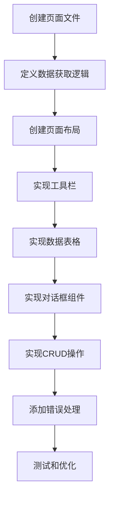

# 前端组件开发指南

本文档详细介绍边缘平台前端组件开发规范、目录结构、常用组件库的使用方法，以及完整的页面开发流程。

## 组件开发规范

### 组件目录结构

```
edge-console/src/components/
├── ui/                      # 基础 UI 组件（shadcn/ui）
│   ├── button.tsx          # 按钮组件
│   ├── dialog.tsx          # 对话框组件
│   ├── table.tsx           # 表格组件
│   ├── input.tsx           # 输入框组件
│   └── ...
├── dialogs/                 # 业务对话框组件
│   ├── CreateNamespaceDialog.tsx
│   ├── EditInfoDialog.tsx
│   └── ...
├── workloads/              # 工作负载相关组件
│   ├── CreateDeploymentModal.tsx
│   ├── WorkloadsList.tsx
│   └── steps/              # 多步骤表单组件
│       ├── BasicInfoStep.tsx
│       ├── PodSpecStep.tsx
│       └── ...
├── monitoring/             # 监控相关组件
│   ├── MetricCard.tsx
│   ├── ClusterOverviewMetrics.tsx
│   └── ...
├── layout/                 # 布局组件
│   ├── tenant-sidebar.tsx
│   ├── top-nav.tsx
│   └── ...
└── providers/              # 上下文提供者
    ├── auth-provider.tsx
    ├── query-client-provider.tsx
    └── ...
```

### 组件命名规范

**文件命名：**
- UI 基础组件：小写 + 连字符（如 `button.tsx`、`dialog.tsx`）
- 业务组件：大驼峰命名（如 `CreateNamespaceDialog.tsx`）
- 页面组件：`page.tsx`（Next.js 约定）

**组件命名：**
```tsx
// ✅ 正确：使用 PascalCase
export function CreateNamespaceDialog() { }
export const UserSelector = () => { }

// ❌ 错误：使用 camelCase
export function createNamespaceDialog() { }
```

**Props 接口命名：**
```tsx
// ✅ 正确：组件名 + Props 后缀
interface CreateNamespaceDialogProps {
  open: boolean
  onOpenChange: (open: boolean) => void
}

export function CreateNamespaceDialog({
  open,
  onOpenChange
}: CreateNamespaceDialogProps) {
  // ...
}
```

## shadcn/ui 组件库

### 组件安装和使用

边缘平台使用 [shadcn/ui](https://ui.shadcn.com/) 作为基础组件库。shadcn/ui 不是传统的 npm 包，而是可复制的组件代码。

**安装新组件：**
```bash
# 安装单个组件
pnpm dlx shadcn-ui@latest add button

# 安装多个组件
pnpm dlx shadcn-ui@latest add dialog alert table
```

**组件自动添加到 `src/components/ui/` 目录。**

### Button 组件

```tsx
import { Button } from "@/components/ui/button"

// 基本用法
<Button>点击我</Button>

// 变体（variant）
<Button variant="default">默认按钮</Button>
<Button variant="destructive">危险按钮</Button>
<Button variant="outline">轮廓按钮</Button>
<Button variant="secondary">次要按钮</Button>
<Button variant="ghost">幽灵按钮</Button>
<Button variant="link">链接按钮</Button>

// 尺寸（size）
<Button size="default">默认尺寸</Button>
<Button size="sm">小按钮</Button>
<Button size="lg">大按钮</Button>
<Button size="icon">图标按钮</Button>

// 带图标
import { Plus, Trash2 } from "lucide-react"

<Button>
  <Plus className="h-4 w-4 mr-2" />
  创建资源
</Button>

<Button variant="outline" size="sm" className="h-8 w-8 p-0">
  <Trash2 className="h-4 w-4" />
</Button>
```

**Button 组件实现：**
```tsx
// src/components/ui/button.tsx
import * as React from "react"
import { cva, type VariantProps } from "class-variance-authority"

const buttonVariants = cva(
  "inline-flex items-center justify-center whitespace-nowrap rounded-md text-sm font-medium transition-colors focus-visible:outline-none disabled:pointer-events-none disabled:opacity-50",
  {
    variants: {
      variant: {
        default: "bg-primary text-primary-foreground hover:bg-primary/90",
        destructive: "bg-destructive text-destructive-foreground hover:bg-destructive/90",
        outline: "border border-input bg-background hover:bg-accent",
        // ...
      },
      size: {
        default: "h-10 px-4 py-2",
        sm: "h-9 rounded-md px-3",
        lg: "h-11 rounded-md px-8",
        icon: "h-10 w-10",
      },
    },
  }
)

export interface ButtonProps
  extends React.ButtonHTMLAttributes<HTMLButtonElement>,
    VariantProps<typeof buttonVariants> {
  asChild?: boolean
}

const Button = React.forwardRef<HTMLButtonElement, ButtonProps>(
  ({ className, variant, size, asChild = false, ...props }, ref) => {
    const Comp = asChild ? Slot : "button"
    return (
      <Comp
        className={cn(buttonVariants({ variant, size, className }))}
        ref={ref}
        {...props}
      />
    )
  }
)
Button.displayName = "Button"

export { Button, buttonVariants }
```

### Dialog 组件

Dialog 用于创建模态对话框，是最常用的组件之一。

```tsx
import {
  Dialog,
  DialogContent,
  DialogDescription,
  DialogHeader,
  DialogTitle,
} from "@/components/ui/dialog"

function MyDialog() {
  const [open, setOpen] = useState(false)

  return (
    <Dialog open={open} onOpenChange={setOpen}>
      <DialogContent className="sm:max-w-[500px]">
        <DialogHeader>
          <DialogTitle>对话框标题</DialogTitle>
          <DialogDescription>
            对话框描述信息
          </DialogDescription>
        </DialogHeader>

        {/* 对话框内容 */}
        <div className="space-y-4">
          {/* 表单字段 */}
        </div>

        {/* 操作按钮 */}
        <div className="flex justify-end gap-3">
          <Button variant="outline" onClick={() => setOpen(false)}>
            取消
          </Button>
          <Button onClick={handleSubmit}>
            确认
          </Button>
        </div>
      </DialogContent>
    </Dialog>
  )
}
```

**完整示例：创建命名空间对话框**

```tsx
// src/components/dialogs/CreateNamespaceDialog.tsx
"use client"

import { useState } from "react"
import { Folder, X } from "lucide-react"
import { Button } from "@/components/ui/button"
import {
  Dialog,
  DialogContent,
  DialogDescription,
  DialogHeader,
  DialogTitle,
} from "@/components/ui/dialog"

interface CreateNamespaceDialogProps {
  open: boolean
  onOpenChange: (open: boolean) => void
  onCreateNamespace: (data: {
    name: string
    alias?: string
    description?: string
  }) => Promise<void>
}

export function CreateNamespaceDialog({
  open,
  onOpenChange,
  onCreateNamespace
}: CreateNamespaceDialogProps) {
  const [name, setName] = useState("")
  const [alias, setAlias] = useState("")
  const [description, setDescription] = useState("")
  const [isSubmitting, setIsSubmitting] = useState(false)
  const [error, setError] = useState<string | null>(null)

  const handleSubmit = async (e: React.FormEvent) => {
    e.preventDefault()

    // 验证
    if (!name.trim()) {
      setError("请输入命名空间名称")
      return
    }

    const nameRegex = /^[a-z0-9]([a-z0-9-]*[a-z0-9])?$/
    if (!nameRegex.test(name)) {
      setError("命名空间名称格式不正确")
      return
    }

    setIsSubmitting(true)
    setError(null)

    try {
      await onCreateNamespace({
        name: name.trim(),
        alias: alias.trim() || undefined,
        description: description.trim() || undefined
      })

      // 重置表单
      setName("")
      setAlias("")
      setDescription("")
      onOpenChange(false)
    } catch (err) {
      setError(err instanceof Error ? err.message : '创建失败')
    } finally {
      setIsSubmitting(false)
    }
  }

  return (
    <Dialog open={open} onOpenChange={onOpenChange}>
      <DialogContent className="sm:max-w-[500px]">
        <DialogHeader>
          <DialogTitle className="flex items-center gap-2">
            <Folder className="h-5 w-5 text-blue-600" />
            创建命名空间
          </DialogTitle>
          <DialogDescription>
            创建一个新的 Kubernetes 命名空间来组织和隔离资源
          </DialogDescription>
        </DialogHeader>

        <form onSubmit={handleSubmit} className="space-y-6 mt-6">
          {error && (
            <div className="p-3 bg-red-50 border border-red-200 rounded text-sm text-red-600">
              {error}
            </div>
          )}

          <div className="space-y-4">
            <div>
              <label className="block text-sm font-medium text-gray-700 mb-2">
                命名空间名称 <span className="text-red-500">*</span>
              </label>
              <input
                type="text"
                value={name}
                onChange={(e) => setName(e.target.value)}
                placeholder="例如: my-namespace"
                className="w-full px-3 py-2 border border-gray-200 rounded focus:outline-none focus:ring-1 focus:ring-blue-500 text-sm"
                disabled={isSubmitting}
                autoFocus
              />
            </div>

            <div>
              <label className="block text-sm font-medium text-gray-700 mb-2">
                别名
              </label>
              <input
                type="text"
                value={alias}
                onChange={(e) => setAlias(e.target.value)}
                placeholder="请输入别名"
                className="w-full px-3 py-2 border border-gray-200 rounded focus:outline-none focus:ring-1 focus:ring-blue-500 text-sm"
                disabled={isSubmitting}
              />
            </div>

            <div>
              <label className="block text-sm font-medium text-gray-700 mb-2">
                描述
              </label>
              <textarea
                value={description}
                onChange={(e) => setDescription(e.target.value)}
                placeholder="请输入描述"
                rows={3}
                className="w-full px-3 py-2 border border-gray-200 rounded focus:outline-none focus:ring-1 focus:ring-blue-500 text-sm resize-none"
                disabled={isSubmitting}
              />
            </div>
          </div>

          <div className="flex justify-end gap-3 pt-6 border-t border-gray-200">
            <Button
              type="button"
              variant="outline"
              onClick={() => onOpenChange(false)}
              disabled={isSubmitting}
            >
              <X className="h-4 w-4 mr-2" />
              取消
            </Button>
            <Button type="submit" disabled={isSubmitting || !name.trim()}>
              <Folder className="h-4 w-4 mr-2" />
              {isSubmitting ? '创建中...' : '创建命名空间'}
            </Button>
          </div>
        </form>
      </DialogContent>
    </Dialog>
  )
}
```

### Table 组件

Table 组件用于展示列表数据。

```tsx
import {
  Table,
  TableHeader,
  TableBody,
  TableHead,
  TableRow,
  TableCell,
} from "@/components/ui/table"

function DataTable({ data }: { data: any[] }) {
  return (
    <div className="bg-white rounded border border-gray-200">
      <table className="w-full text-sm">
        <thead>
          <tr className="border-b border-gray-200 bg-white h-12">
            <th className="text-left px-4 font-medium text-gray-700">
              名称
            </th>
            <th className="text-left px-4 font-medium text-gray-700">
              状态
            </th>
            <th className="text-left px-4 font-medium text-gray-700">
              创建时间
            </th>
            <th className="w-10 px-4"></th>
          </tr>
        </thead>
        <tbody>
          {data.map((item) => (
            <tr key={item.id} className="border-b border-gray-200 h-12 hover:bg-gray-50">
              <td className="px-4">
                <span className="font-medium text-blue-600">{item.name}</span>
              </td>
              <td className="px-4">
                <span className="text-gray-900">{item.status}</span>
              </td>
              <td className="px-4">
                <span className="text-gray-600">{item.createdAt}</span>
              </td>
              <td className="px-4">
                {/* 操作按钮 */}
              </td>
            </tr>
          ))}
        </tbody>
      </table>
    </div>
  )
}
```

## 表单组件开发

### react-hook-form + Zod 验证

边缘平台使用 `react-hook-form` 管理表单状态，使用 `Zod` 进行数据验证。

**安装依赖：**
```bash
pnpm add react-hook-form zod @hookform/resolvers
```

**基本使用：**

```tsx
import { useForm } from "react-hook-form"
import { zodResolver } from "@hookform/resolvers/zod"
import * as z from "zod"

// 1. 定义验证 schema
const formSchema = z.object({
  name: z.string()
    .min(1, "名称不能为空")
    .max(63, "名称不能超过63个字符")
    .regex(/^[a-z0-9]([a-z0-9-]*[a-z0-9])?$/, "名称格式不正确"),
  alias: z.string().optional(),
  description: z.string().optional(),
  replicas: z.number().min(1, "副本数至少为1").max(100, "副本数不能超过100"),
})

// 2. 推导类型
type FormValues = z.infer<typeof formSchema>

function MyForm() {
  // 3. 初始化 form
  const form = useForm<FormValues>({
    resolver: zodResolver(formSchema),
    defaultValues: {
      name: "",
      alias: "",
      description: "",
      replicas: 1,
    },
  })

  // 4. 提交处理
  const onSubmit = async (values: FormValues) => {
    console.log(values)
    // 调用 API
  }

  return (
    <form onSubmit={form.handleSubmit(onSubmit)} className="space-y-4">
      {/* 名称字段 */}
      <div>
        <label className="block text-sm font-medium text-gray-700 mb-2">
          名称 <span className="text-red-500">*</span>
        </label>
        <input
          {...form.register("name")}
          className="w-full px-3 py-2 border border-gray-200 rounded focus:outline-none focus:ring-1 focus:ring-blue-500"
        />
        {form.formState.errors.name && (
          <p className="text-sm text-red-600 mt-1">
            {form.formState.errors.name.message}
          </p>
        )}
      </div>

      {/* 副本数字段 */}
      <div>
        <label className="block text-sm font-medium text-gray-700 mb-2">
          副本数
        </label>
        <input
          type="number"
          {...form.register("replicas", { valueAsNumber: true })}
          className="w-full px-3 py-2 border border-gray-200 rounded"
        />
        {form.formState.errors.replicas && (
          <p className="text-sm text-red-600 mt-1">
            {form.formState.errors.replicas.message}
          </p>
        )}
      </div>

      <Button type="submit" disabled={form.formState.isSubmitting}>
        {form.formState.isSubmitting ? '提交中...' : '提交'}
      </Button>
    </form>
  )
}
```

### 复杂表单示例

**多步骤表单：**

```tsx
// src/components/workloads/CreateWorkloadDialog.tsx
import { useState } from "react"
import { useForm } from "react-hook-form"
import { zodResolver } from "@hookform/resolvers/zod"
import * as z from "zod"

const workloadSchema = z.object({
  // 基本信息
  name: z.string().min(1).max(63).regex(/^[a-z0-9-]+$/),
  namespace: z.string().min(1),
  replicas: z.number().min(1).max(100),

  // 容器配置
  image: z.string().min(1, "镜像不能为空"),
  ports: z.array(z.object({
    name: z.string(),
    containerPort: z.number().min(1).max(65535),
    protocol: z.enum(["TCP", "UDP"]),
  })),

  // 资源限制
  resources: z.object({
    requests: z.object({
      cpu: z.string(),
      memory: z.string(),
    }),
    limits: z.object({
      cpu: z.string(),
      memory: z.string(),
    }),
  }),
})

type WorkloadFormValues = z.infer<typeof workloadSchema>

export function CreateWorkloadDialog() {
  const [step, setStep] = useState(1)

  const form = useForm<WorkloadFormValues>({
    resolver: zodResolver(workloadSchema),
    defaultValues: {
      name: "",
      namespace: "",
      replicas: 1,
      image: "",
      ports: [],
      resources: {
        requests: { cpu: "100m", memory: "128Mi" },
        limits: { cpu: "500m", memory: "512Mi" },
      },
    },
  })

  const onSubmit = async (values: WorkloadFormValues) => {
    console.log("提交数据:", values)
    // 调用 API 创建工作负载
  }

  return (
    <Dialog>
      <DialogContent className="sm:max-w-[600px]">
        <DialogHeader>
          <DialogTitle>创建工作负载</DialogTitle>
        </DialogHeader>

        <form onSubmit={form.handleSubmit(onSubmit)}>
          {/* 步骤指示器 */}
          <div className="flex items-center justify-between mb-6">
            {[1, 2, 3].map((s) => (
              <div key={s} className={`flex items-center ${s < 3 ? 'flex-1' : ''}`}>
                <div className={`w-8 h-8 rounded-full flex items-center justify-center ${
                  step >= s ? 'bg-blue-600 text-white' : 'bg-gray-200 text-gray-600'
                }`}>
                  {s}
                </div>
                {s < 3 && <div className="flex-1 h-0.5 bg-gray-200 mx-2" />}
              </div>
            ))}
          </div>

          {/* 步骤 1: 基本信息 */}
          {step === 1 && (
            <div className="space-y-4">
              <div>
                <label className="block text-sm font-medium mb-2">
                  名称 <span className="text-red-500">*</span>
                </label>
                <input
                  {...form.register("name")}
                  className="w-full px-3 py-2 border rounded"
                />
                {form.formState.errors.name && (
                  <p className="text-sm text-red-600 mt-1">
                    {form.formState.errors.name.message}
                  </p>
                )}
              </div>

              <div>
                <label className="block text-sm font-medium mb-2">
                  命名空间 <span className="text-red-500">*</span>
                </label>
                <select
                  {...form.register("namespace")}
                  className="w-full px-3 py-2 border rounded"
                >
                  <option value="">选择命名空间</option>
                  <option value="default">default</option>
                  <option value="kube-system">kube-system</option>
                </select>
              </div>

              <div>
                <label className="block text-sm font-medium mb-2">
                  副本数
                </label>
                <input
                  type="number"
                  {...form.register("replicas", { valueAsNumber: true })}
                  className="w-full px-3 py-2 border rounded"
                />
              </div>
            </div>
          )}

          {/* 步骤 2: 容器配置 */}
          {step === 2 && (
            <div className="space-y-4">
              <div>
                <label className="block text-sm font-medium mb-2">
                  镜像 <span className="text-red-500">*</span>
                </label>
                <input
                  {...form.register("image")}
                  placeholder="例如: nginx:latest"
                  className="w-full px-3 py-2 border rounded"
                />
                {form.formState.errors.image && (
                  <p className="text-sm text-red-600 mt-1">
                    {form.formState.errors.image.message}
                  </p>
                )}
              </div>
            </div>
          )}

          {/* 步骤 3: 资源配置 */}
          {step === 3 && (
            <div className="space-y-4">
              <h3 className="font-medium">资源请求（Requests）</h3>
              <div className="grid grid-cols-2 gap-4">
                <div>
                  <label className="block text-sm font-medium mb-2">CPU</label>
                  <input
                    {...form.register("resources.requests.cpu")}
                    placeholder="100m"
                    className="w-full px-3 py-2 border rounded"
                  />
                </div>
                <div>
                  <label className="block text-sm font-medium mb-2">内存</label>
                  <input
                    {...form.register("resources.requests.memory")}
                    placeholder="128Mi"
                    className="w-full px-3 py-2 border rounded"
                  />
                </div>
              </div>

              <h3 className="font-medium mt-4">资源限制（Limits）</h3>
              <div className="grid grid-cols-2 gap-4">
                <div>
                  <label className="block text-sm font-medium mb-2">CPU</label>
                  <input
                    {...form.register("resources.limits.cpu")}
                    placeholder="500m"
                    className="w-full px-3 py-2 border rounded"
                  />
                </div>
                <div>
                  <label className="block text-sm font-medium mb-2">内存</label>
                  <input
                    {...form.register("resources.limits.memory")}
                    placeholder="512Mi"
                    className="w-full px-3 py-2 border rounded"
                  />
                </div>
              </div>
            </div>
          )}

          {/* 导航按钮 */}
          <div className="flex justify-between mt-6 pt-6 border-t">
            <Button
              type="button"
              variant="outline"
              onClick={() => setStep(Math.max(1, step - 1))}
              disabled={step === 1}
            >
              上一步
            </Button>

            {step < 3 ? (
              <Button
                type="button"
                onClick={() => setStep(step + 1)}
              >
                下一步
              </Button>
            ) : (
              <Button type="submit" disabled={form.formState.isSubmitting}>
                {form.formState.isSubmitting ? '创建中...' : '创建'}
              </Button>
            )}
          </div>
        </form>
      </DialogContent>
    </Dialog>
  )
}
```

## TanStack Table

TanStack Table（原 React Table）是强大的表格组件库，支持排序、筛选、分页等功能。

**安装：**
```bash
pnpm add @tanstack/react-table
```

**基本示例：**

```tsx
import {
  useReactTable,
  getCoreRowModel,
  getSortedRowModel,
  getPaginationRowModel,
  flexRender,
  ColumnDef,
} from "@tanstack/react-table"

type Namespace = {
  name: string
  status: string
  createdAt: string
}

const columns: ColumnDef<Namespace>[] = [
  {
    accessorKey: "name",
    header: "名称",
    cell: (info) => (
      <span className="font-medium text-blue-600">
        {info.getValue()}
      </span>
    ),
  },
  {
    accessorKey: "status",
    header: "状态",
  },
  {
    accessorKey: "createdAt",
    header: "创建时间",
  },
]

function NamespaceTable({ data }: { data: Namespace[] }) {
  const table = useReactTable({
    data,
    columns,
    getCoreRowModel: getCoreRowModel(),
    getSortedRowModel: getSortedRowModel(),
    getPaginationRowModel: getPaginationRowModel(),
  })

  return (
    <div className="bg-white rounded border border-gray-200">
      <table className="w-full text-sm">
        <thead>
          {table.getHeaderGroups().map((headerGroup) => (
            <tr key={headerGroup.id} className="border-b bg-white h-12">
              {headerGroup.headers.map((header) => (
                <th key={header.id} className="text-left px-4 font-medium text-gray-700">
                  {header.isPlaceholder
                    ? null
                    : flexRender(
                        header.column.columnDef.header,
                        header.getContext()
                      )}
                </th>
              ))}
            </tr>
          ))}
        </thead>
        <tbody>
          {table.getRowModel().rows.map((row) => (
            <tr key={row.id} className="border-b h-12 hover:bg-gray-50">
              {row.getVisibleCells().map((cell) => (
                <td key={cell.id} className="px-4">
                  {flexRender(cell.column.columnDef.cell, cell.getContext())}
                </td>
              ))}
            </tr>
          ))}
        </tbody>
      </table>

      {/* 分页控件 */}
      <div className="p-4 flex items-center justify-between" style={{backgroundColor: '#F9FBFD'}}>
        <div className="text-sm text-gray-600">
          共 {table.getFilteredRowModel().rows.length} 条数据
        </div>
        <div className="flex items-center gap-2">
          <Button
            variant="outline"
            size="sm"
            onClick={() => table.previousPage()}
            disabled={!table.getCanPreviousPage()}
          >
            上一页
          </Button>
          <Button
            variant="outline"
            size="sm"
            onClick={() => table.nextPage()}
            disabled={!table.getCanNextPage()}
          >
            下一页
          </Button>
        </div>
      </div>
    </div>
  )
}
```

## Toast 通知和确认对话框

### Toast 通知

使用 `sonner` 库实现 Toast 通知。

**安装：**
```bash
pnpm add sonner
```

**使用：**
```tsx
import { toast } from "sonner"

// 成功通知
toast.success('创建成功', {
  description: '命名空间已成功创建',
})

// 错误通知
toast.error('创建失败', {
  description: error.message,
})

// 加载中
const toastId = toast.loading('正在创建...')
// 完成后更新
toast.success('创建成功', { id: toastId })

// 警告通知
toast.warning('请检查配置', {
  description: '某些字段可能不正确',
})

// 信息通知
toast.info('提示信息', {
  description: '这是一条提示信息',
})
```

### 确认对话框

```tsx
import { useState } from "react"
import {
  AlertDialog,
  AlertDialogAction,
  AlertDialogCancel,
  AlertDialogContent,
  AlertDialogDescription,
  AlertDialogFooter,
  AlertDialogHeader,
  AlertDialogTitle,
} from "@/components/ui/alert-dialog"

function DeleteConfirmDialog({
  open,
  onOpenChange,
  onConfirm,
  resourceName,
}: {
  open: boolean
  onOpenChange: (open: boolean) => void
  onConfirm: () => Promise<void>
  resourceName: string
}) {
  const [isDeleting, setIsDeleting] = useState(false)

  const handleConfirm = async () => {
    setIsDeleting(true)
    try {
      await onConfirm()
      onOpenChange(false)
      toast.success('删除成功')
    } catch (error) {
      toast.error('删除失败', {
        description: error instanceof Error ? error.message : '未知错误'
      })
    } finally {
      setIsDeleting(false)
    }
  }

  return (
    <AlertDialog open={open} onOpenChange={onOpenChange}>
      <AlertDialogContent>
        <AlertDialogHeader>
          <AlertDialogTitle>确认删除</AlertDialogTitle>
          <AlertDialogDescription>
            您确定要删除 <strong>{resourceName}</strong> 吗？
            此操作无法撤销。
          </AlertDialogDescription>
        </AlertDialogHeader>
        <AlertDialogFooter>
          <AlertDialogCancel disabled={isDeleting}>
            取消
          </AlertDialogCancel>
          <AlertDialogAction
            onClick={handleConfirm}
            disabled={isDeleting}
            className="bg-red-600 hover:bg-red-700"
          >
            {isDeleting ? '删除中...' : '确认删除'}
          </AlertDialogAction>
        </AlertDialogFooter>
      </AlertDialogContent>
    </AlertDialog>
  )
}
```

## 页面开发完整流程

### 流程图



### 实战：创建完整的CRUD页面

让我们创建一个完整的命名空间管理页面，包含列表、创建、编辑、删除功能。

**1. 创建页面文件**

```tsx
// app/(boss)/boss/namespaces/page.tsx
'use client'

import { useState } from "react"
import { Plus, RotateCw, Search, MoreHorizontal, Trash2, Edit } from "lucide-react"
import { Button } from "@/components/ui/button"
import { useNamespaces, useCreateNamespace, useDeleteNamespace } from "@/hooks/useNamespaces"
import { CreateNamespaceDialog } from "@/components/dialogs/CreateNamespaceDialog"
import { EditNamespaceDialog } from "@/components/dialogs/EditNamespaceDialog"
import { DeleteConfirmDialog } from "@/components/dialogs/DeleteConfirmDialog"
import { toast } from "sonner"

export default function NamespacesPage() {
  const [searchTerm, setSearchTerm] = useState("")
  const [createDialogOpen, setCreateDialogOpen] = useState(false)
  const [editDialogOpen, setEditDialogOpen] = useState(false)
  const [deleteDialogOpen, setDeleteDialogOpen] = useState(false)
  const [selectedNamespace, setSelectedNamespace] = useState<any>(null)

  // 数据获取
  const { data: namespaces, isLoading, refetch } = useNamespaces()
  const createMutation = useCreateNamespace()
  const deleteMutation = useDeleteNamespace()

  // 搜索过滤
  const filteredNamespaces = namespaces?.filter((ns: any) =>
    ns.name.toLowerCase().includes(searchTerm.toLowerCase())
  ) || []

  // 创建命名空间
  const handleCreate = async (data: any) => {
    await createMutation.mutateAsync(data)
    toast.success('创建成功')
    refetch()
  }

  // 删除命名空间
  const handleDelete = async () => {
    if (!selectedNamespace) return
    await deleteMutation.mutateAsync(selectedNamespace.name)
    toast.success('删除成功')
    refetch()
  }

  if (isLoading) {
    return (
      <div className="flex items-center justify-center h-64">
        <div className="text-gray-500">正在加载...</div>
      </div>
    )
  }

  return (
    <div className="absolute inset-0 flex flex-col">
      {/* 标题栏 */}
      <div className="bg-white border-b border-gray-200 px-6 py-4 flex-shrink-0">
        <div className="flex items-center space-x-2">
          <Folder className="h-5 w-5 text-gray-600" />
          <h1 className="text-lg font-medium text-gray-900">命名空间管理</h1>
        </div>
      </div>

      {/* 主内容区域 */}
      <div className="flex-1 overflow-auto" style={{ backgroundColor: '#EFF4F9' }}>
        <div className="p-6">
          <div className="bg-white rounded border border-gray-200">
            {/* 工具栏 */}
            <div className="p-4" style={{ backgroundColor: '#F9FBFD' }}>
              <div className="flex items-center justify-between gap-3">
                <div className="flex-1 relative">
                  <Search className="absolute left-3 top-2 h-4 w-4 text-gray-400" />
                  <input
                    type="text"
                    value={searchTerm}
                    onChange={(e) => setSearchTerm(e.target.value)}
                    placeholder="搜索命名空间..."
                    className="w-full h-8 pl-9 pr-3 text-sm border border-gray-200 rounded focus:outline-none focus:ring-1 focus:ring-blue-500"
                  />
                </div>
                <div className="flex items-center gap-2">
                  <Button
                    variant="outline"
                    size="sm"
                    className="h-8 w-8 p-0"
                    onClick={() => refetch()}
                  >
                    <RotateCw className="h-4 w-4" />
                  </Button>
                  <Button
                    variant="outline"
                    size="sm"
                    className="h-8"
                    onClick={() => setCreateDialogOpen(true)}
                  >
                    <Plus className="h-4 w-4 mr-2" />
                    创建命名空间
                  </Button>
                </div>
              </div>
            </div>

            {/* 表格 */}
            <table className="w-full text-sm">
              <thead>
                <tr className="border-b border-gray-200 bg-white h-12">
                  <th className="text-left px-4 font-medium text-gray-700">名称</th>
                  <th className="text-left px-4 font-medium text-gray-700">状态</th>
                  <th className="text-left px-4 font-medium text-gray-700">创建时间</th>
                  <th className="w-10 px-4"></th>
                </tr>
              </thead>
              <tbody>
                {filteredNamespaces.map((ns: any) => (
                  <tr key={ns.name} className="border-b border-gray-200 h-12 hover:bg-gray-50">
                    <td className="px-4">
                      <span className="font-medium text-blue-600">{ns.name}</span>
                    </td>
                    <td className="px-4">
                      <span className={`text-sm ${
                        ns.status === 'Active' ? 'text-green-600' : 'text-gray-600'
                      }`}>
                        {ns.status}
                      </span>
                    </td>
                    <td className="px-4">
                      <span className="text-gray-600">{ns.createdAt}</span>
                    </td>
                    <td className="px-4">
                      <DropdownMenu>
                        <DropdownMenuTrigger asChild>
                          <Button variant="ghost" size="sm" className="h-8 w-8 p-0">
                            <MoreHorizontal className="h-4 w-4" />
                          </Button>
                        </DropdownMenuTrigger>
                        <DropdownMenuContent align="end">
                          <DropdownMenuItem
                            onClick={() => {
                              setSelectedNamespace(ns)
                              setEditDialogOpen(true)
                            }}
                          >
                            <Edit className="h-4 w-4 mr-2" />
                            编辑
                          </DropdownMenuItem>
                          <DropdownMenuItem
                            onClick={() => {
                              setSelectedNamespace(ns)
                              setDeleteDialogOpen(true)
                            }}
                            className="text-red-600"
                          >
                            <Trash2 className="h-4 w-4 mr-2" />
                            删除
                          </DropdownMenuItem>
                        </DropdownMenuContent>
                      </DropdownMenu>
                    </td>
                  </tr>
                ))}
              </tbody>
            </table>

            {/* 分页 */}
            <div className="p-4" style={{ backgroundColor: '#F9FBFD' }}>
              <div className="flex items-center justify-between text-sm">
                <div className="text-gray-600">
                  共 {filteredNamespaces.length} 个命名空间
                </div>
              </div>
            </div>
          </div>
        </div>
      </div>

      {/* 对话框 */}
      <CreateNamespaceDialog
        open={createDialogOpen}
        onOpenChange={setCreateDialogOpen}
        onCreateNamespace={handleCreate}
      />

      <EditNamespaceDialog
        open={editDialogOpen}
        onOpenChange={setEditDialogOpen}
        namespace={selectedNamespace}
        onUpdate={async (data) => {
          // 更新逻辑
          toast.success('更新成功')
          refetch()
        }}
      />

      <DeleteConfirmDialog
        open={deleteDialogOpen}
        onOpenChange={setDeleteDialogOpen}
        onConfirm={handleDelete}
        resourceName={selectedNamespace?.name || ''}
      />
    </div>
  )
}
```

## 最佳实践

### 组件拆分原则

1. **单一职责**：每个组件只负责一个功能
2. **可复用性**：提取通用逻辑为独立组件
3. **文件大小**：单个文件不超过 500 行

**示例：拆分复杂表单**

```tsx
// ❌ 不好：所有逻辑在一个文件
function CreateDeploymentDialog() {
  // 500+ 行代码
}

// ✅ 好：拆分为多个步骤组件
function CreateDeploymentDialog() {
  return (
    <Dialog>
      {step === 1 && <BasicInfoStep />}
      {step === 2 && <ContainerStep />}
      {step === 3 && <ResourceStep />}
    </Dialog>
  )
}

// src/components/workloads/steps/BasicInfoStep.tsx
export function BasicInfoStep({ form }: { form: UseFormReturn }) {
  // 50-100 行代码
}
```

### 状态管理

1. **本地状态**：使用 `useState`
2. **表单状态**：使用 `react-hook-form`
3. **服务器状态**：使用 `React Query`
4. **全局状态**：使用 `Context API` 或 `Zustand`

```tsx
// 本地 UI 状态
const [isOpen, setIsOpen] = useState(false)

// 表单状态
const form = useForm()

// 服务器状态
const { data, isLoading } = useQuery({
  queryKey: ['namespaces'],
  queryFn: fetchNamespaces,
})

// 全局用户状态
const { user } = useAuth()
```

### 错误处理

```tsx
function DataTable() {
  const { data, error, isLoading } = useQuery({
    queryKey: ['data'],
    queryFn: fetchData,
  })

  if (isLoading) {
    return <div className="flex items-center justify-center h-64">加载中...</div>
  }

  if (error) {
    return (
      <div className="flex items-center justify-center h-64">
        <div className="text-center">
          <p className="text-red-600 mb-2">加载失败</p>
          <Button onClick={() => refetch()}>重试</Button>
        </div>
      </div>
    )
  }

  return <Table data={data} />
}
```

### 性能优化

1. **使用 React.memo**：避免不必要的重渲染
2. **useMemo 和 useCallback**：缓存计算结果和函数
3. **虚拟滚动**：大列表使用 `react-virtual`
4. **代码分割**：使用动态导入

```tsx
// React.memo
const MemoizedRow = React.memo(function Row({ data }: { data: any }) {
  return <tr>{/* ... */}</tr>
})

// useMemo
const filteredData = useMemo(() => {
  return data.filter(item => item.name.includes(searchTerm))
}, [data, searchTerm])

// useCallback
const handleDelete = useCallback(async (id: string) => {
  await deleteItem(id)
}, [])

// 代码分割
const HeavyComponent = dynamic(() => import('./HeavyComponent'), {
  loading: () => <div>加载中...</div>,
})
```

## 常见错误

### 1. 忘记处理加载和错误状态

```tsx
// ❌ 错误
function MyComponent() {
  const { data } = useQuery({ queryKey: ['data'], queryFn: fetchData })
  return <div>{data.map(/* ... */)}</div>  // data 可能是 undefined
}

// ✅ 正确
function MyComponent() {
  const { data, isLoading, error } = useQuery({
    queryKey: ['data'],
    queryFn: fetchData,
  })

  if (isLoading) return <div>加载中...</div>
  if (error) return <div>错误: {error.message}</div>
  if (!data) return null

  return <div>{data.map(/* ... */)}</div>
}
```

### 2. 状态更新不正确

```tsx
// ❌ 错误：直接修改状态
const [items, setItems] = useState([])
items.push(newItem)  // 不会触发重渲染

// ✅ 正确：创建新数组
setItems([...items, newItem])
setItems(prev => [...prev, newItem])
```

### 3. 缺少依赖项

```tsx
// ❌ 错误：缺少依赖
useEffect(() => {
  fetchData(userId)
}, [])  // 警告：缺少 userId 依赖

// ✅ 正确
useEffect(() => {
  fetchData(userId)
}, [userId])
```

## 下一步阅读

- [API 集成指南](./api-integration.md) - 学习如何调用后端 API
- [状态管理](./state-management.md) - 深入了解状态管理方案
- [性能优化最佳实践](../best-practices/performance.md) - 前端性能优化技巧

## 参考资源

- [shadcn/ui 官方文档](https://ui.shadcn.com/)
- [React Hook Form 文档](https://react-hook-form.com/)
- [Zod 验证库](https://zod.dev/)
- [TanStack Table 文档](https://tanstack.com/table)
- [Lucide React 图标库](https://lucide.dev/guide/packages/lucide-react)
