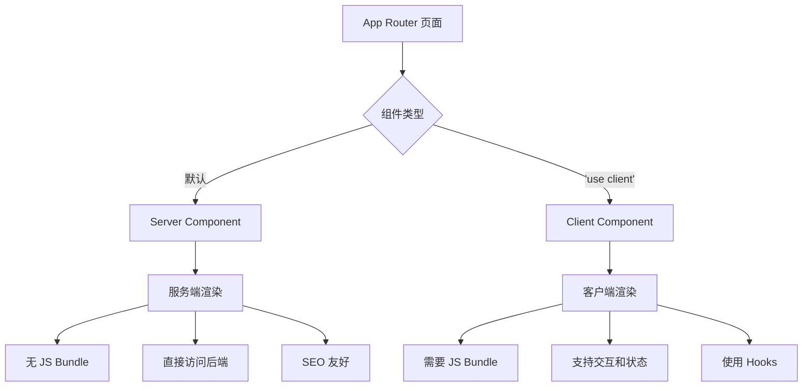
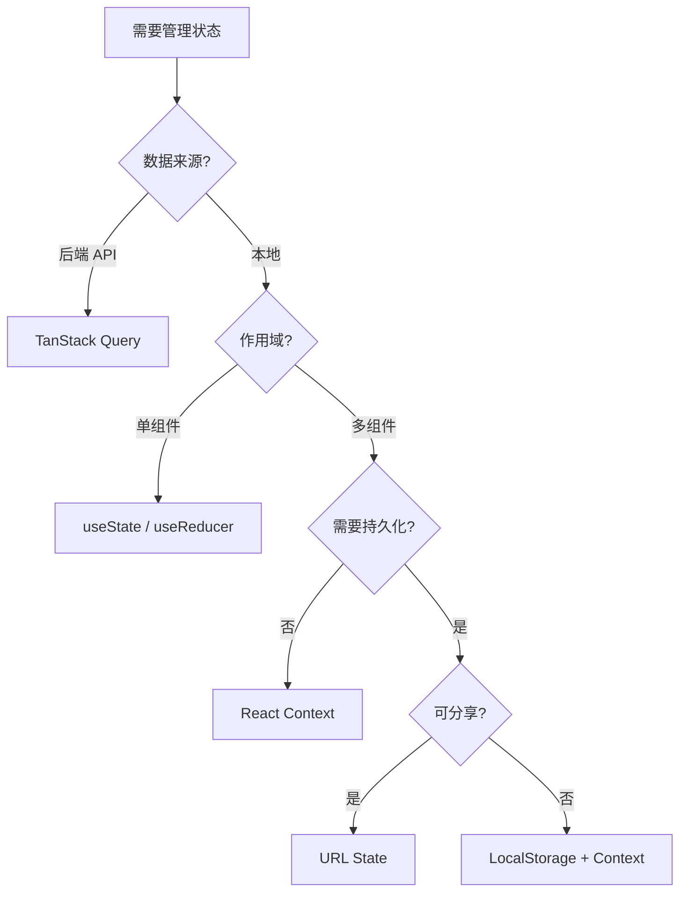

# 控制台架构

edge-console 采用 Next.js 14 的 App Router 架构,结合 React Server Components (RSC) 和 Client Components,实现高性能的现代化 Web 应用。本文档深入介绍控制台的架构设计、路由组织、布局系统和状态管理。

## Next.js 14 App Router 架构

### App Router vs Pages Router

Next.js 14 引入的 App Router 是对传统 Pages Router 的重大升级:

| 特性 | Pages Router (旧) | App Router (新) |
|------|-------------------|-----------------|
| 路由文件 | `pages/*.tsx` | `app/**/page.tsx` |
| 布局系统 | `_app.tsx` 全局布局 | 嵌套 `layout.tsx` |
| 数据获取 | `getServerSideProps` | Server Components + `fetch` |
| 加载状态 | 手动实现 | `loading.tsx` 自动处理 |
| 错误处理 | `_error.tsx` | `error.tsx` 错误边界 |
| 流式渲染 | 不支持 | 原生支持 Suspense |
| React 版本 | React 17/18 | React 18 必需 |

edge-console 全面采用 App Router,充分利用其性能优势和开发体验改进。

### Server Components vs Client Components

Next.js 14 引入了 React Server Components (RSC),允许在服务端和客户端混合渲染:



**Server Components 特性**:
- 默认在服务端渲染,不发送 JavaScript 到客户端
- 可以直接访问后端资源 (数据库、文件系统等)
- 不能使用 React Hooks (useState, useEffect 等)
- 不能添加事件处理器 (onClick, onChange 等)

**Client Components 特性**:
- 需要添加 `'use client'` 指令
- 在客户端渲染,可使用全部 React 特性
- 支持交互、状态管理和浏览器 API
- 会增加 JavaScript Bundle 大小

**edge-console 的使用原则**:

```typescript
// ❌ 错误: Server Component 不能使用 hooks
export default function ServerPage() {
  const [count, setCount] = useState(0)  // 错误!
  return <div>{count}</div>
}

// ✅ 正确: 在顶部添加 'use client'
'use client'
export default function ClientPage() {
  const [count, setCount] = useState(0)  // 正确
  return <div>{count}</div>
}
```

在 edge-console 中,几乎所有页面和组件都是 Client Components,因为需要:
- 使用 React Query 获取数据
- 响应用户交互 (点击、表单提交等)
- 管理客户端状态 (菜单展开、对话框等)

## 页面路由组织

### 路由组 (Route Groups)

edge-console 使用路由组 `(boss)` 来组织管理员相关的路由,而不影响 URL 结构:

```
app/
├── (boss)/                    # 路由组 (括号表示不出现在 URL 中)
│   └── boss/
│       ├── clusters/          # URL: /boss/clusters
│       ├── workspaces/        # URL: /boss/workspaces
│       ├── access/            # URL: /boss/access
│       ├── images/            # URL: /boss/images
│       └── telemetry/         # URL: /boss/telemetry
│
├── marketplace/               # URL: /marketplace
├── login/                     # URL: /login
└── page.tsx                   # URL: /
```

**路由组的作用**:
1. **逻辑分组**: 将相关路由放在同一文件夹,便于管理
2. **共享布局**: 路由组可以有自己的 `layout.tsx`,但不影响 URL
3. **代码组织**: 清晰的目录结构,反映应用的功能模块

### 动态路由 (Dynamic Routes)

edge-console 大量使用动态路由来处理资源详情页面:

```
app/(boss)/boss/clusters/
├── [id]/                      # 动态集群 ID
│   ├── page.tsx               # /boss/clusters/host
│   ├── layout.tsx             # 集群详情布局
│   ├── overview/
│   │   └── page.tsx           # /boss/clusters/host/overview
│   ├── nodes/
│   │   ├── page.tsx           # /boss/clusters/host/nodes
│   │   └── [nodeId]/          # 动态节点 ID
│   │       └── page.tsx       # /boss/clusters/host/nodes/master01
│   ├── namespaces/
│   │   └── [namespace]/       # 动态命名空间
│   │       └── page.tsx       # /boss/clusters/host/namespaces/default
│   └── deployments/
│       └── page.tsx
```

**动态路由参数获取**:

```typescript
// app/(boss)/boss/clusters/[id]/page.tsx
interface ClusterPageProps {
  params: {
    id: string  // URL 参数: /boss/clusters/host -> id = "host"
  }
  searchParams: {
    tab?: string  // 查询参数: ?tab=overview
  }
}

export default function ClusterPage({ params, searchParams }: ClusterPageProps) {
  const clusterId = params.id  // "host"
  const activeTab = searchParams.tab || 'overview'

  return <div>集群: {clusterId}</div>
}
```

### 嵌套路由和 Catch-all 路由

```typescript
// 嵌套动态路由
// /boss/clusters/[id]/namespaces/[namespace]/deployments/[deploymentId]
app/(boss)/boss/clusters/
  [id]/
    namespaces/
      [namespace]/
        deployments/
          [deploymentId]/
            page.tsx

// Catch-all 路由 (匹配任意层级)
// /docs/a, /docs/a/b, /docs/a/b/c 都匹配
app/docs/
  [...slug]/
    page.tsx

// 可选 Catch-all 路由 (包含根路由)
// /docs, /docs/a, /docs/a/b 都匹配
app/docs/
  [[...slug]]/
    page.tsx
```

## 布局和嵌套路由

### 布局系统 (Layout System)

Next.js App Router 的布局系统支持嵌套,自动共享 UI 和状态:

```mermaid
graph TD
    A[根布局 app/layout.tsx] --> B[Boss 路由组布局]
    B --> C[集群详情布局 clusters/[id]/layout.tsx]
    C --> D[命名空间布局 namespaces/[namespace]/layout.tsx]
    D --> E[具体页面 page.tsx]

    style A fill:#e3f2fd
    style B fill:#bbdefb
    style C fill:#90caf9
    style D fill:#64b5f6
    style E fill:#42a5f5
```

**布局嵌套示例**:

```typescript
// 1. 根布局 (app/layout.tsx) - 全局应用
export default function RootLayout({ children }) {
  return (
    <html lang="zh-CN">
      <body>
        <ReactQueryProvider>
          <MenuProvider>
            {children}
          </MenuProvider>
        </ReactQueryProvider>
      </body>
    </html>
  )
}

// 2. 集群详情布局 (app/(boss)/boss/clusters/[id]/layout.tsx)
'use client'
export default function ClusterLayout({ children, params }) {
  const clusterId = params.id
  return (
    <div className="flex">
      {/* 左侧菜单: 概览、节点、项目、工作负载... */}
      <ClusterSidebar clusterId={clusterId} />

      {/* 右侧内容: 渲染子页面 */}
      <main>{children}</main>
    </div>
  )
}

// 3. 具体页面 (app/(boss)/boss/clusters/[id]/nodes/page.tsx)
'use client'
export default function NodesPage({ params }) {
  // 自动继承上层布局
  return <div>节点列表</div>
}
```

### 标准布局模式: Shell Layout

edge-console 中带侧边栏的页面遵循标准的 Shell Layout 三层架构:

```typescript
// 第一层: Layout (app/(boss)/boss/telemetry/layout.tsx)
'use client'
export default function TelemetryLayout({ children }) {
  return (
    <div className="absolute inset-0 flex">
      {/* 左侧可折叠侧边栏 */}
      <CollapsibleSidebar />

      {/* 右侧主内容区域 - 关键: flex-1 overflow-hidden relative */}
      <main className="flex-1 overflow-hidden relative">
        {children}
      </main>
    </div>
  )
}

// 第二层: Page (app/(boss)/boss/telemetry/monitoring/page.tsx)
'use client'
export default function MonitoringPage() {
  return (
    <div className="absolute inset-0 flex flex-col">
      {/* 固定标题栏 */}
      <div className="flex-shrink-0 px-6 py-4 border-b">
        <h1>监控概览</h1>
      </div>

      {/* 可滚动内容区域 */}
      <div className="flex-1 overflow-auto" style={{backgroundColor: '#EFF4F9'}}>
        <div className="p-6">
          {/* 实际内容 */}
        </div>
      </div>
    </div>
  )
}
```

**布局关键点**:
- `main` 使用 `flex-1 overflow-hidden relative` 三个类缺一不可
- `page` 使用 `absolute inset-0 flex flex-col` 填充父容器
- 内容区使用 `flex-1 overflow-auto` 实现滚动

## React Server Components vs Client Components

### 使用场景划分

在 edge-console 中,组件类型的选择遵循以下原则:

```typescript
// Server Component: 静态内容、SEO 优化
// app/about/page.tsx
export default function AboutPage() {
  return (
    <div>
      <h1>关于我们</h1>
      <p>边缘计算管理平台...</p>
    </div>
  )
}

// Client Component: 交互、状态、数据获取
// app/(boss)/boss/clusters/page.tsx
'use client'
import { useListClusters } from '@/gen/hooks'

export default function ClustersPage() {
  const { data, isLoading } = useListClusters()

  if (isLoading) return <Loading />

  return (
    <div>
      {data?.items.map(cluster => (
        <ClusterCard key={cluster.id} cluster={cluster} />
      ))}
    </div>
  )
}
```

### 混合使用模式

**模式 1: Server Component 中嵌入 Client Component**

```typescript
// Server Component (默认)
export default function DashboardPage() {
  return (
    <div>
      <h1>控制台首页</h1>
      {/* 静态内容 */}
      <section>
        <p>欢迎使用边缘计算管理平台</p>
      </section>

      {/* 交互组件使用 Client Component */}
      <StatsCards />  {/* 'use client' */}
      <RecentActivity />  {/* 'use client' */}
    </div>
  )
}

// Client Component
'use client'
function StatsCards() {
  const { data } = useStats()
  return <div>{/* 渲染统计卡片 */}</div>
}
```

**模式 2: Client Component 组合**

```typescript
// Client Component (需要交互)
'use client'
export default function ClusterDetailPage({ params }) {
  const [activeTab, setActiveTab] = useState('overview')

  return (
    <div>
      <Tabs value={activeTab} onValueChange={setActiveTab}>
        {/* Tab 内容也是 Client Components */}
        <OverviewTab />
        <NodesTab />
        <WorkloadsTab />
      </Tabs>
    </div>
  )
}
```

## 状态管理

edge-console 采用多层状态管理策略,根据状态的作用域和生命周期选择合适的方案。

### 1. 服务端状态: TanStack Query (React Query)

用于管理从后端 API 获取的数据,提供缓存、自动重试、后台更新等功能。

```typescript
// 自动生成的 React Query Hook
import { useListClusters } from '@/gen/hooks/useListClusters'

function ClusterList() {
  const {
    data,           // API 响应数据
    isLoading,      // 首次加载状态
    isFetching,     // 后台刷新状态
    error,          // 错误信息
    refetch         // 手动刷新函数
  } = useListClusters({
    params: {
      limit: -1,
      sortBy: 'createTime'
    }
  })

  // React Query 自动处理:
  // - 数据缓存 (避免重复请求)
  // - 后台自动更新
  // - 错误重试
  // - 分页和无限滚动

  return (
    <div>
      <button onClick={() => refetch()}>刷新</button>
      {data?.items.map(cluster => (
        <div key={cluster.id}>{cluster.name}</div>
      ))}
    </div>
  )
}
```

**React Query 配置**:

```typescript
// src/app/layout.tsx
'use client'
import { QueryClient, QueryClientProvider } from '@tanstack/react-query'

const queryClient = new QueryClient({
  defaultOptions: {
    queries: {
      staleTime: 1000 * 60 * 5,        // 5分钟内数据视为新鲜
      cacheTime: 1000 * 60 * 10,       // 缓存保留10分钟
      retry: 3,                        // 失败自动重试3次
      refetchOnWindowFocus: false,     // 窗口聚焦不自动刷新
    }
  }
})

export default function RootLayout({ children }) {
  return (
    <QueryClientProvider client={queryClient}>
      {children}
    </QueryClientProvider>
  )
}
```

### 2. 客户端状态: React Hooks

用于组件内部的临时状态,如表单输入、UI 控制等。

```typescript
'use client'
import { useState } from 'react'

function ClusterFilter() {
  // UI 状态: 搜索关键词
  const [searchTerm, setSearchTerm] = useState('')

  // UI 状态: 对话框是否打开
  const [isDialogOpen, setIsDialogOpen] = useState(false)

  // UI 状态: 选中的集群
  const [selectedClusters, setSelectedClusters] = useState<string[]>([])

  return (
    <div>
      <input
        value={searchTerm}
        onChange={(e) => setSearchTerm(e.target.value)}
        placeholder="搜索集群..."
      />

      <button onClick={() => setIsDialogOpen(true)}>
        批量删除 ({selectedClusters.length})
      </button>

      <ConfirmDialog
        open={isDialogOpen}
        onClose={() => setIsDialogOpen(false)}
      />
    </div>
  )
}
```

### 3. 全局状态: React Context

用于跨组件共享的全局状态,如用户信息、菜单状态、主题设置等。

```typescript
// src/context/MenuContext.tsx
'use client'
import { createContext, useContext, useState } from 'react'

interface MenuContextType {
  isCollapsed: boolean
  toggleCollapse: () => void
  activeKey: string
  setActiveKey: (key: string) => void
}

const MenuContext = createContext<MenuContextType | undefined>(undefined)

export function MenuProvider({ children }) {
  const [isCollapsed, setIsCollapsed] = useState(false)
  const [activeKey, setActiveKey] = useState('')

  const toggleCollapse = () => setIsCollapsed(!isCollapsed)

  return (
    <MenuContext.Provider value={{
      isCollapsed,
      toggleCollapse,
      activeKey,
      setActiveKey
    }}>
      {children}
    </MenuContext.Provider>
  )
}

export function useMenu() {
  const context = useContext(MenuContext)
  if (!context) {
    throw new Error('useMenu must be used within MenuProvider')
  }
  return context
}

// 使用 Context
function Sidebar() {
  const { isCollapsed, toggleCollapse } = useMenu()

  return (
    <div className={isCollapsed ? 'w-16' : 'w-64'}>
      <button onClick={toggleCollapse}>
        {isCollapsed ? '展开' : '折叠'}
      </button>
    </div>
  )
}
```

### 4. URL 状态: useSearchParams

用于可书签化、可分享的状态,如筛选条件、排序方式等。

```typescript
'use client'
import { useSearchParams, useRouter } from 'next/navigation'

function ClusterTable() {
  const searchParams = useSearchParams()
  const router = useRouter()

  // 从 URL 读取状态
  const sortBy = searchParams.get('sortBy') || 'name'
  const order = searchParams.get('order') || 'asc'
  const page = parseInt(searchParams.get('page') || '1')

  // 更新 URL 状态
  const handleSort = (field: string) => {
    const params = new URLSearchParams(searchParams)
    params.set('sortBy', field)
    params.set('order', order === 'asc' ? 'desc' : 'asc')
    router.push(`?${params.toString()}`)
  }

  return (
    <table>
      <thead>
        <tr>
          <th onClick={() => handleSort('name')}>
            名称 {sortBy === 'name' && (order === 'asc' ? '↑' : '↓')}
          </th>
        </tr>
      </thead>
    </table>
  )
}
```

### 状态管理决策树



## 路由导航

### 声明式导航: Link 组件

```typescript
import Link from 'next/link'

function Navigation() {
  return (
    <nav>
      {/* 基础链接 */}
      <Link href="/boss/clusters">集群管理</Link>

      {/* 动态链接 */}
      <Link href={`/boss/clusters/${clusterId}`}>
        集群详情
      </Link>

      {/* 带查询参数 */}
      <Link href={{
        pathname: '/boss/clusters',
        query: { sortBy: 'name', order: 'asc' }
      }}>
        排序查看
      </Link>

      {/* 条件样式 */}
      <Link
        href="/boss/nodes"
        className={pathname === '/boss/nodes' ? 'active' : ''}
      >
        节点管理
      </Link>
    </nav>
  )
}
```

### 编程式导航: useRouter

```typescript
'use client'
import { useRouter } from 'next/navigation'

function CreateClusterButton() {
  const router = useRouter()

  const handleCreate = async () => {
    try {
      const cluster = await createCluster(formData)

      // 导航到新创建的集群
      router.push(`/boss/clusters/${cluster.id}`)

      // 或替换当前历史记录 (不可返回)
      // router.replace(`/boss/clusters/${cluster.id}`)

      // 或返回上一页
      // router.back()

      // 刷新当前页面数据
      router.refresh()
    } catch (error) {
      console.error(error)
    }
  }

  return <button onClick={handleCreate}>创建集群</button>
}
```

### 路由拦截和中间件

```typescript
// src/middleware.ts
import { NextResponse } from 'next/server'
import type { NextRequest } from 'next/server'

export function middleware(request: NextRequest) {
  const token = request.cookies.get('token')
  const pathname = request.nextUrl.pathname

  // 认证拦截: 未登录访问受保护页面
  if (!token && pathname.startsWith('/boss')) {
    return NextResponse.redirect(
      new URL(`/login?redirect=${encodeURIComponent(pathname)}`, request.url)
    )
  }

  // 已登录访问登录页,重定向到首页
  if (token && pathname === '/login') {
    return NextResponse.redirect(new URL('/boss/clusters', request.url))
  }

  return NextResponse.next()
}

// 配置中间件匹配路径
export const config = {
  matcher: [
    '/((?!api|_next/static|_next/image|favicon.ico).*)',
  ]
}
```

## 实战示例

### 示例 1: 集群详情页面架构

```typescript
// 布局: app/(boss)/boss/clusters/[id]/layout.tsx
'use client'
export default function ClusterLayout({ children, params }) {
  const clusterId = params.id
  const { data: clusters } = useClusters()
  const [isCollapsed, setIsCollapsed] = useState(false)

  return (
    <div className="absolute inset-0 flex">
      {/* 左侧菜单 */}
      <div className={cn(
        "border-r transition-all",
        isCollapsed ? "w-16" : "w-64"
      )}>
        {/* 集群切换器 */}
        <ClusterSwitcher
          currentId={clusterId}
          clusters={clusters}
        />

        {/* 菜单项 */}
        <nav>
          <MenuItem href={`/boss/clusters/${clusterId}/overview`}>
            概览
          </MenuItem>
          <MenuItem href={`/boss/clusters/${clusterId}/nodes`}>
            节点
          </MenuItem>
          {/* ...更多菜单 */}
        </nav>
      </div>

      {/* 右侧内容 */}
      <main className="flex-1 overflow-hidden relative">
        {children}
      </main>
    </div>
  )
}

// 页面: app/(boss)/boss/clusters/[id]/nodes/page.tsx
'use client'
export default function NodesPage({ params }) {
  const { data, isLoading } = useListNodes({
    params: { clusterId: params.id }
  })

  return (
    <div className="absolute inset-0 flex flex-col">
      {/* 标题栏 */}
      <header className="flex-shrink-0 px-6 py-4 border-b">
        <h1>集群节点</h1>
      </header>

      {/* 内容区 */}
      <div className="flex-1 overflow-auto bg-gray-50">
        <div className="p-6">
          <NodesTable data={data?.items || []} />
        </div>
      </div>
    </div>
  )
}
```

### 示例 2: 可观测性模块架构

```typescript
// 布局: app/(boss)/boss/telemetry/layout.tsx
'use client'
export default function TelemetryLayout({ children }) {
  const pathname = usePathname()
  const [isCollapsed, setIsCollapsed] = useState(false)

  const menuItems = [
    { key: 'monitoring', label: '监控服务', href: '/boss/telemetry/monitoring' },
    { key: 'alerts', label: '告警服务', href: '/boss/telemetry/alerts' },
    { key: 'logs', label: '服务日志', href: '/boss/telemetry/logs' },
    { key: 'audit', label: '审计记录', href: '/boss/telemetry/audit' }
  ]

  return (
    <div className="absolute inset-0 flex">
      <CollapsibleSidebar
        isCollapsed={isCollapsed}
        onToggle={() => setIsCollapsed(!isCollapsed)}
      >
        {menuItems.map(item => (
          <MenuItem
            key={item.key}
            href={item.href}
            active={pathname === item.href}
          >
            {item.label}
          </MenuItem>
        ))}
      </CollapsibleSidebar>

      <main className="flex-1 overflow-hidden relative">
        {children}
      </main>
    </div>
  )
}
```

## 性能优化

### 1. 代码分割 (Code Splitting)

App Router 自动进行路由级代码分割:

```typescript
// 每个 page.tsx 自动分割为独立的 JavaScript chunk
// 用户访问时才加载对应的代码

// 进一步优化: 动态导入重量级组件
import dynamic from 'next/dynamic'

const MonacoEditor = dynamic(
  () => import('@monaco-editor/react'),
  {
    ssr: false,  // 禁用服务端渲染
    loading: () => <div>加载编辑器...</div>
  }
)

function YamlEditor() {
  return <MonacoEditor language="yaml" />
}
```

### 2. 数据预获取

```typescript
'use client'
import { useQueryClient } from '@tanstack/react-query'

function ClusterCard({ cluster }) {
  const queryClient = useQueryClient()

  // 鼠标悬停时预获取节点数据
  const handleMouseEnter = () => {
    queryClient.prefetchQuery({
      queryKey: ['nodes', cluster.id],
      queryFn: () => fetchNodes(cluster.id)
    })
  }

  return (
    <Link
      href={`/boss/clusters/${cluster.id}`}
      onMouseEnter={handleMouseEnter}
    >
      {cluster.name}
    </Link>
  )
}
```

### 3. 并行数据获取

```typescript
'use client'
function DashboardPage() {
  // 并行发起多个请求
  const clusters = useListClusters()
  const nodes = useListNodes()
  const pods = useListPods()

  // 等待所有数据加载完成
  if (clusters.isLoading || nodes.isLoading || pods.isLoading) {
    return <Loading />
  }

  return (
    <div>
      <StatsCard title="集群" count={clusters.data?.total} />
      <StatsCard title="节点" count={nodes.data?.total} />
      <StatsCard title="容器组" count={pods.data?.total} />
    </div>
  )
}
```

## 下一步阅读

- [API 客户端](./api-client.md) - 了解如何调用后端 API 和代码生成
- [前端权限控制](./permissions.md) - 实现基于角色的 UI 权限管理
- [组件开发](./components.md) - 学习如何开发可复用组件
- [性能优化](../best-practices/performance.md) - 深入了解前端性能优化技巧

## 参考资源

- [Next.js App Router 文档](https://nextjs.org/docs/app) - 官方文档
- [React Server Components](https://react.dev/blog/2023/03/22/react-labs-what-we-have-been-working-on-march-2023#react-server-components) - RSC 介绍
- [Next.js 路由系统](https://nextjs.org/docs/app/building-your-application/routing) - 路由详解
- [TanStack Query 文档](https://tanstack.com/query/latest) - 数据获取和缓存
