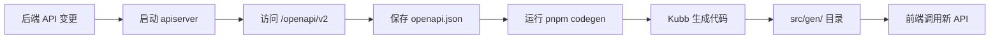

# 前端开发概览

edge-console 是 edge-platform 的前端应用程序,基于 Next.js 14、React 18 和 TypeScript 构建,提供现代化的 Web 界面来管理边缘计算集群、工作空间、用户权限和监控数据。

## 技术栈

### 核心框架

- **Next.js 14**: 使用最新的 App Router 架构,提供服务端渲染 (SSR)、静态站点生成 (SSG) 和客户端渲染 (CSR) 的混合能力
- **React 18**: 现代化的 React 版本,支持 Server Components 和并发渲染
- **TypeScript 5.x**: 提供完整的类型安全保障

### UI 和样式

- **Tailwind CSS 3.x**: 实用优先的 CSS 框架,基于 8px 栅格系统
- **Radix UI**: 无样式、可访问的 UI 组件库,包括:
  - Dialog、DropdownMenu、Select、Tabs 等交互组件
  - Toast、Alert、Tooltip 等反馈组件
- **lucide-react**: 现代化的图标库
- **shadcn/ui**: 基于 Radix UI 的可复用组件集合

### 状态管理和数据获取

- **TanStack Query (React Query) 5.x**: 服务端状态管理和数据同步
- **Axios 1.x**: HTTP 客户端,支持请求/响应拦截器
- **React Context**: 轻量级的客户端状态管理

### 开发工具

- **Kubb 2.x**: 基于 OpenAPI 规范的代码生成器
- **ESLint**: 代码质量检查
- **Prettier**: 代码格式化 (集成在 ESLint 中)

## 项目结构

edge-console 遵循 Next.js 14 App Router 的标准目录结构:

```
edge-console/
├── src/
│   ├── app/                          # Next.js App Router 页面
│   │   ├── (boss)/                   # 管理员路由组
│   │   │   └── boss/
│   │   │       ├── clusters/         # 集群管理
│   │   │       ├── workspaces/       # 工作空间管理
│   │   │       ├── access/           # 权限管理
│   │   │       ├── images/           # 镜像管理
│   │   │       └── telemetry/        # 可观测性
│   │   ├── marketplace/              # 应用市场
│   │   ├── login/                    # 登录页面
│   │   ├── layout.tsx                # 根布局
│   │   └── page.tsx                  # 首页
│   │
│   ├── components/                   # 可复用组件
│   │   ├── ui/                       # 基础 UI 组件 (shadcn/ui)
│   │   ├── layout/                   # 布局组件
│   │   ├── providers/                # Context 提供者
│   │   ├── auth/                     # 认证相关组件
│   │   ├── dialogs/                  # 对话框组件
│   │   ├── nodes/                    # 节点相关组件
│   │   ├── roles/                    # 角色相关组件
│   │   ├── users/                    # 用户相关组件
│   │   ├── workloads/                # 工作负载组件
│   │   ├── terminal/                 # 终端组件 (xterm.js)
│   │   ├── monitoring/               # 监控组件
│   │   └── telemetry/                # 可观测性组件
│   │
│   ├── hooks/                        # 自定义 React Hooks
│   │   ├── useClusters.ts            # 集群数据获取
│   │   ├── useNodes.ts               # 节点数据获取
│   │   ├── usePods.ts                # Pod 数据获取
│   │   ├── useWorkloads.ts           # 工作负载数据获取
│   │   └── useMonitoring.ts          # 监控数据获取
│   │
│   ├── lib/                          # 工具库
│   │   ├── api-client.ts             # Axios 实例和拦截器
│   │   ├── auth.ts                   # 认证工具函数
│   │   └── utils.ts                  # 通用工具函数
│   │
│   ├── types/                        # 全局类型定义
│   │   ├── menu.ts                   # 菜单类型
│   │   └── notification.ts           # 通知类型
│   │
│   ├── context/                      # React Context
│   │   └── MenuContext.tsx           # 菜单状态管理
│   │
│   ├── gen/                          # 自动生成的代码 (不要手动修改)
│   │   ├── client/                   # API 客户端函数
│   │   ├── hooks/                    # React Query Hooks
│   │   └── types/                    # TypeScript 类型定义
│   │
│   └── middleware.ts                 # Next.js 中间件 (认证拦截)
│
├── public/                           # 静态资源
│   ├── images/                       # 图片
│   └── fonts/                        # 字体
│
├── charts/                           # Helm Charts 部署配置
│   └── edge-console/
│       ├── Chart.yaml
│       ├── values.yaml
│       └── templates/
│
├── build/                            # 构建配置
│   └── Dockerfile                    # Docker 镜像构建
│
├── .env.local                        # 本地环境变量 (不提交到 git)
├── next.config.js                    # Next.js 配置
├── tailwind.config.js                # Tailwind CSS 配置
├── tsconfig.json                     # TypeScript 配置
├── kubb.config.ts                    # 代码生成器配置
├── package.json                      # 依赖管理
└── pnpm-lock.yaml                    # 锁定依赖版本
```

### 目录说明

#### `/src/app` - App Router 页面

Next.js 14 使用基于文件系统的路由。每个文件夹代表一个路由段:

- **路由组**: `(boss)` 使用括号包裹,不会出现在 URL 中,用于组织路由
- **动态路由**: `[id]` 表示动态参数,如 `/clusters/[id]` 匹配 `/clusters/host`
- **布局**: `layout.tsx` 定义共享布局,支持嵌套
- **页面**: `page.tsx` 定义路由的实际内容

#### `/src/gen` - 自动生成的代码

此目录的代码由 Kubb 根据后端 OpenAPI 规范自动生成,提供:

- **类型安全的 API 函数**: 每个后端接口对应一个 TypeScript 函数
- **React Query Hooks**: 自动生成的 `useQuery` 和 `useMutation` hooks
- **完整类型定义**: 请求参数和响应数据的 TypeScript 类型

**重要**: 永远不要手动修改 `/src/gen` 目录下的文件,所有更改应通过重新生成代码完成。

## 开发环境搭建

### 前置要求

1. **Node.js**: 18.x 或更高版本,推荐使用 20.x LTS
2. **pnpm**: 8.x 或更高版本
3. **后端服务**: edge-apiserver 需要运行并可访问

### 安装 Node.js

使用 nvm (Node Version Manager) 管理 Node.js 版本:

```bash
# 安装 nvm
curl -o- https://raw.githubusercontent.com/nvm-sh/nvm/v0.39.0/install.sh | bash

# 安装 Node.js 20 LTS
nvm install 20
nvm use 20
nvm alias default 20

# 验证安装
node --version  # 应输出 v20.x.x
```

### 安装 pnpm

```bash
# 使用 npm 全局安装 pnpm
npm install -g pnpm

# 或使用 Homebrew (macOS)
brew install pnpm

# 验证安装
pnpm --version  # 应输出 8.x.x 或更高
```

### 克隆和初始化项目

```bash
# 克隆仓库
git clone <repository-url>
cd edge-console

# 安装依赖
pnpm install

# 或使用 Makefile
make install
```

### 配置环境变量

创建 `.env.local` 文件配置后端 API 地址:

```bash
# 开发环境 - 本地运行的 apiserver
NEXT_PUBLIC_API_BASE_URL=http://localhost:8080

# 或连接到远程 Kubernetes 集群的 apiserver
# NEXT_PUBLIC_API_BASE_URL=http://192.168.1.100:30080
```

**环境变量说明**:

- `NEXT_PUBLIC_API_BASE_URL`: 后端 API 服务器地址
  - 本地开发: `http://localhost:8080`
  - Kubernetes NodePort: `http://<node-ip>:30080`
  - Kubernetes LoadBalancer: `http://<lb-ip>:8080`

### 启动开发服务器

```bash
# 使用 Makefile (推荐)
make dev

# 或使用 pnpm
pnpm dev

# 或使用 npm
npm run dev
```

开发服务器将在 `http://localhost:3000` 启动,支持:

- **热重载 (Hot Reload)**: 代码更改自动刷新浏览器
- **快速刷新 (Fast Refresh)**: 保留 React 组件状态
- **即时编译**: 只编译访问的页面,提升启动速度

### 访问应用

打开浏览器访问: `http://localhost:3000`

**默认登录凭据**:

- **管理员**: 用户名 `admin`,密码由后端配置
- **普通用户**: 任何非 admin 的用户名

## 本地开发流程

### 1. 启动后端服务

edge-console 需要连接到 edge-apiserver。在开发环境中,通常在本地启动 apiserver:

```bash
# 进入 apiserver 目录
cd /path/to/edge-apiserver

# 启动 apiserver 和 controller (跳过认证,简化开发)
AlwaysAllow=1 make dev
```

apiserver 将在 `http://localhost:8080` 启动。

### 2. 启动前端开发服务器

```bash
cd edge-console
make dev
```

### 3. 开发调试

#### 浏览器开发工具

- **React Developer Tools**: 查看组件树和 props/state
- **Network 面板**: 监控 API 请求和响应
- **Console 面板**: 查看日志和错误信息

#### Next.js 调试功能

- **Fast Refresh**: 编辑组件后自动刷新,保留状态
- **错误覆盖层**: 编译错误和运行时错误直接显示在页面上
- **源码映射**: 在浏览器中调试原始 TypeScript 代码

#### 常用调试技巧

```typescript
// 1. 使用 console.log 调试
console.log('API response:', data)

// 2. 使用 debugger 语句设置断点
function handleSubmit(data: FormData) {
  debugger  // 浏览器将在此处暂停
  // ...处理逻辑
}

// 3. React Query Devtools (已集成)
// 在页面右下角会显示 React Query 状态面板
```

### 4. 代码提交前检查

```bash
# 运行 TypeScript 类型检查
pnpm tsc --noEmit

# 运行 ESLint 检查
pnpm lint

# 修复可自动修复的问题
pnpm lint --fix
```

## 与后端 API 集成

edge-console 通过自动生成的 TypeScript SDK 与后端通信,实现类型安全的 API 调用。

### API 代码生成流程



### 更新 API 客户端

当后端 API 发生变化时:

```bash
# 1. 确保 apiserver 正在运行
cd /path/to/edge-apiserver
make dev

# 2. 在前端项目中重新生成代码
cd edge-console
pnpm codegen

# 生成过程:
# - 从 http://localhost:8080/openapi/v2 获取最新 OpenAPI 规范
# - 保存为 openapi.json
# - 使用 Kubb 生成 TypeScript 代码
# - 输出到 src/gen/ 目录
```

### 调用后端 API 示例

```typescript
// 1. 导入自动生成的 hook
import { useListClusters } from '@/gen/hooks/useListClusters'

// 2. 在组件中使用
function ClusterList() {
  // React Query hook,自动处理加载、错误和缓存
  const { data, isLoading, error, refetch } = useListClusters({
    params: {
      limit: -1,
      sortBy: 'createTime'
    }
  })

  if (isLoading) return <div>加载中...</div>
  if (error) return <div>错误: {error.message}</div>

  return (
    <div>
      <button onClick={() => refetch()}>刷新</button>
      <ul>
        {data?.items.map(cluster => (
          <li key={cluster.name}>{cluster.name}</li>
        ))}
      </ul>
    </div>
  )
}
```

### 认证集成

edge-console 使用 JWT Token 认证,token 自动添加到所有 API 请求:

```typescript
// src/lib/api-client.ts 中的请求拦截器自动处理认证
axiosInstance.interceptors.request.use((config) => {
  // 从 cookie 或 localStorage 获取 token
  const token = getAuthToken()

  if (token && config.headers) {
    // 自动添加 Authorization 头
    config.headers.Authorization = `Bearer ${token}`
  }

  return config
})
```

开发者无需手动处理认证,只需使用生成的 hooks 即可。

### 错误处理

API 错误通过响应拦截器统一处理:

```typescript
// 401 未授权 - 自动跳转到登录页
if (error.response?.status === 401) {
  // 清除认证信息
  localStorage.removeItem('access_token')

  // 重定向到登录页,保存当前路径用于登录后返回
  window.location.href = `/login?redirect=${encodeURIComponent(currentPath)}`
}

// 403 禁止访问 - 权限不足
if (error.response?.status === 403) {
  // 提示用户权限不足
  toast.error('权限不足,请联系管理员')
}
```

## 构建和部署

### 开发构建

```bash
# 创建生产构建
pnpm build

# 构建产物位于 .next/ 目录
# 包含优化的 HTML、CSS、JavaScript 和静态资源
```

### 生产部署

#### 1. Docker 镜像

```bash
# 构建 Docker 镜像
make docker-build

# 推送到镜像仓库
make docker-push

# 运行容器
make docker-run
```

#### 2. Kubernetes 部署

使用 Helm Chart 部署到 Kubernetes:

```bash
# 部署 console
helm upgrade --install console ./charts/edge-console \
  --namespace edge-system \
  --set image.repository=quanzhenglong.com/edge/console \
  --set image.tag=main \
  --set 'env[0].name=NEXT_PUBLIC_API_BASE_URL' \
  --set 'env[0].value=http://apiserver:8080'

# 查看 Pod 状态
kubectl get pods -n edge-system -l app=console

# 访问服务
kubectl port-forward svc/console 3000:3000 -n edge-system
```

## 常见问题

### Q: 代码生成失败怎么办?

**A**: 确保 apiserver 正在运行并可访问:

```bash
# 检查 apiserver 是否启动
curl http://localhost:8080/healthz

# 检查 OpenAPI 规范是否可访问
curl http://localhost:8080/openapi/v2 | jq .

# 如果无法访问,启动 apiserver
cd /path/to/edge-apiserver
make dev
```

### Q: 热重载不工作?

**A**: 检查以下配置:

```bash
# 1. 检查文件监听限制 (Linux/macOS)
echo fs.inotify.max_user_watches=524288 | sudo tee -a /etc/sysctl.conf
sudo sysctl -p

# 2. 重启开发服务器
# 停止当前服务器 (Ctrl+C)
make dev
```

### Q: API 请求 CORS 错误?

**A**: edge-console 使用 Next.js rewrites 代理 API 请求,避免 CORS 问题。确保 `next.config.js` 中的 rewrites 配置正确:

```javascript
// next.config.js
async rewrites() {
  return [
    {
      source: '/oapis/:path*',
      destination: `${apiBaseUrl}/oapis/:path*`
    },
    // ...其他路由
  ]
}
```

### Q: TypeScript 类型错误?

**A**: 确保生成的代码是最新的:

```bash
# 重新生成 API 客户端
pnpm codegen

# 重启 TypeScript 服务器 (VSCode)
# 命令面板 (Cmd+Shift+P) -> "TypeScript: Restart TS Server"
```

## 下一步阅读

- [控制台架构](./console-arch.md) - 了解 Next.js App Router 和组件架构
- [API 客户端](./api-client.md) - 深入了解 API 调用和代码生成
- [前端权限控制](./permissions.md) - 实现基于角色的 UI 权限管理
- [组件开发](./components.md) - 学习如何开发可复用组件

## 参考资源

- [Next.js 14 文档](https://nextjs.org/docs) - 官方文档
- [React 18 文档](https://react.dev/) - React 新特性
- [TypeScript 手册](https://www.typescriptlang.org/docs/) - TypeScript 语法
- [TanStack Query 文档](https://tanstack.com/query/latest) - 数据获取和缓存
- [Tailwind CSS 文档](https://tailwindcss.com/docs) - 样式工具类
- [Radix UI 文档](https://www.radix-ui.com/docs/primitives/overview/introduction) - 无样式组件
