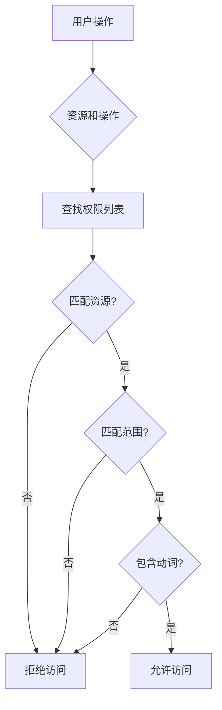

# 前端权限控制

edge-console 实现了细粒度的前端权限控制系统,基于后端的 RBAC (Role-Based Access Control) 模型,确保用户只能访问其被授权的功能和资源。

## UIPermissions 概述

### UIPermissions 数据结构

后端通过 `UIPermissions` API 向前端提供用户的权限列表:

```typescript
// 权限数据结构
interface UIPermission {
  resource: string        // 资源类型,如 "clusters", "nodes", "deployments"
  scope: string          // 权限范围,如 "global", "cluster:host", "workspace:prod"
  verbs: string[]        // 允许的操作: "get", "list", "create", "update", "delete"
}

// 权限响应示例
{
  "permissions": [
    {
      "resource": "clusters",
      "scope": "global",
      "verbs": ["get", "list", "create", "update", "delete"]
    },
    {
      "resource": "deployments",
      "scope": "cluster:host",
      "verbs": ["get", "list", "create", "update"]
    },
    {
      "resource": "nodes",
      "scope": "cluster:host",
      "verbs": ["get", "list"]
    }
  ]
}
```

### 权限检查逻辑

前端权限检查遵循以下规则:



## 权限 Hook 实现

### usePermissions Hook

```typescript
// src/hooks/usePermissions.ts
'use client'
import { useQuery } from '@tanstack/react-query'
import { getUserPermissions } from '@/gen/client'

interface Permission {
  resource: string
  scope: string
  verbs: string[]
}

export function usePermissions() {
  // 获取当前用户权限
  const { data, isLoading } = useQuery({
    queryKey: ['userPermissions'],
    queryFn: getUserPermissions,
    staleTime: 1000 * 60 * 5  // 5分钟缓存
  })

  const permissions = data?.permissions || []

  /**
   * 检查是否有特定资源的权限
   * @param resource 资源类型,如 "clusters", "nodes"
   * @param verb 操作类型,如 "get", "create", "delete"
   * @param scope 可选的范围过滤,如 "cluster:host"
   */
  const hasPermission = (
    resource: string,
    verb: string,
    scope?: string
  ): boolean => {
    return permissions.some(p => {
      // 1. 资源匹配
      if (p.resource !== resource) return false

      // 2. 范围匹配 (如果指定)
      if (scope && p.scope !== 'global' && p.scope !== scope) return false

      // 3. 动词匹配
      return p.verbs.includes(verb) || p.verbs.includes('*')
    })
  }

  /**
   * 检查是否对资源有任意权限
   */
  const hasAnyPermission = (resource: string, scope?: string): boolean => {
    return permissions.some(p => {
      if (p.resource !== resource) return false
      if (scope && p.scope !== 'global' && p.scope !== scope) return false
      return true
    })
  }

  /**
   * 获取资源的所有允许操作
   */
  const getResourceVerbs = (resource: string, scope?: string): string[] => {
    const matchedPermissions = permissions.filter(p => {
      if (p.resource !== resource) return false
      if (scope && p.scope !== 'global' && p.scope !== scope) return false
      return true
    })

    // 合并所有匹配的权限的 verbs
    const allVerbs = matchedPermissions.flatMap(p => p.verbs)
    return [...new Set(allVerbs)]  // 去重
  }

  return {
    permissions,
    isLoading,
    hasPermission,
    hasAnyPermission,
    getResourceVerbs
  }
}
```

## 按钮和菜单权限控制

### 按钮权限包装组件

```typescript
// src/components/PermissionButton.tsx
'use client'
import { usePermissions } from '@/hooks/usePermissions'
import { Button } from '@/components/ui/button'
import { Tooltip } from '@/components/ui/tooltip'

interface PermissionButtonProps {
  resource: string
  verb: string
  scope?: string
  children: React.ReactNode
  onClick?: () => void
  variant?: 'default' | 'outline' | 'ghost'
  disabled?: boolean
}

export function PermissionButton({
  resource,
  verb,
  scope,
  children,
  onClick,
  variant = 'default',
  disabled = false
}: PermissionButtonProps) {
  const { hasPermission } = usePermissions()

  const allowed = hasPermission(resource, verb, scope)

  // 无权限时隐藏按钮
  if (!allowed) return null

  return (
    <Button
      variant={variant}
      onClick={onClick}
      disabled={disabled}
    >
      {children}
    </Button>
  )
}

// 或者显示禁用状态并提示无权限
export function PermissionButtonWithTooltip({
  resource,
  verb,
  scope,
  children,
  onClick,
  variant = 'default',
  disabled = false
}: PermissionButtonProps) {
  const { hasPermission } = usePermissions()

  const allowed = hasPermission(resource, verb, scope)

  if (!allowed) {
    return (
      <Tooltip content="您没有执行此操作的权限">
        <Button variant={variant} disabled={true}>
          {children}
        </Button>
      </Tooltip>
    )
  }

  return (
    <Button variant={variant} onClick={onClick} disabled={disabled}>
      {children}
    </Button>
  )
}
```

### 使用示例

```typescript
'use client'
import { PermissionButton } from '@/components/PermissionButton'
import { Plus, Trash2 } from 'lucide-react'

export default function ClusterListPage() {
  return (
    <div>
      {/* 创建集群按钮 - 需要 create 权限 */}
      <PermissionButton
        resource="clusters"
        verb="create"
        onClick={() => router.push('/boss/clusters/create')}
      >
        <Plus className="h-4 w-4 mr-2" />
        创建集群
      </PermissionButton>

      {/* 删除按钮 - 需要特定集群的 delete 权限 */}
      <PermissionButton
        resource="clusters"
        verb="delete"
        scope="cluster:host"
        onClick={() => handleDelete('host')}
        variant="outline"
      >
        <Trash2 className="h-4 w-4 mr-2" />
        删除
      </PermissionButton>
    </div>
  )
}
```

### 菜单项权限控制

```typescript
// src/components/Sidebar.tsx
'use client'
import { usePermissions } from '@/hooks/usePermissions'
import Link from 'next/link'

interface MenuItem {
  key: string
  label: string
  href: string
  icon: React.ComponentType
  permission?: {
    resource: string
    verb: string
  }
}

const menuItems: MenuItem[] = [
  {
    key: 'clusters',
    label: '集群管理',
    href: '/boss/clusters',
    icon: Server,
    permission: { resource: 'clusters', verb: 'list' }
  },
  {
    key: 'workspaces',
    label: '工作空间',
    href: '/boss/workspaces',
    icon: FolderOpen,
    permission: { resource: 'workspaces', verb: 'list' }
  },
  {
    key: 'users',
    label: '用户管理',
    href: '/boss/access/users',
    icon: Users,
    permission: { resource: 'users', verb: 'list' }
  }
]

export function Sidebar() {
  const { hasPermission } = usePermissions()

  // 过滤出用户有权限访问的菜单项
  const visibleMenuItems = menuItems.filter(item => {
    if (!item.permission) return true
    return hasPermission(item.permission.resource, item.permission.verb)
  })

  return (
    <nav>
      {visibleMenuItems.map(item => {
        const Icon = item.icon
        return (
          <Link key={item.key} href={item.href}>
            <Icon className="h-4 w-4" />
            {item.label}
          </Link>
        )
      })}
    </nav>
  )
}
```

## 页面级权限拦截

### 权限保护高阶组件

```typescript
// src/components/withPermission.tsx
'use client'
import { usePermissions } from '@/hooks/usePermissions'
import { useRouter } from 'next/navigation'
import { useEffect } from 'react'

interface WithPermissionOptions {
  resource: string
  verb: string
  scope?: string
  fallback?: React.ReactNode
}

export function withPermission<P extends object>(
  Component: React.ComponentType<P>,
  options: WithPermissionOptions
) {
  return function PermissionWrapper(props: P) {
    const { hasPermission, isLoading } = usePermissions()
    const router = useRouter()

    const allowed = hasPermission(options.resource, options.verb, options.scope)

    useEffect(() => {
      if (!isLoading && !allowed) {
        // 无权限时重定向到 403 页面
        router.push('/403')
      }
    }, [isLoading, allowed, router])

    // 加载中
    if (isLoading) {
      return (
        <div className="flex items-center justify-center h-screen">
          <div className="text-gray-500">加载权限信息...</div>
        </div>
      )
    }

    // 无权限
    if (!allowed) {
      return options.fallback || (
        <div className="flex items-center justify-center h-screen">
          <div className="text-center">
            <h1 className="text-4xl font-bold text-gray-900 mb-4">403</h1>
            <p className="text-gray-600">您没有访问此页面的权限</p>
          </div>
        </div>
      )
    }

    // 有权限,渲染组件
    return <Component {...props} />
  }
}
```

### 使用示例

```typescript
// app/(boss)/boss/clusters/create/page.tsx
'use client'
import { withPermission } from '@/components/withPermission'

function CreateClusterPage() {
  return (
    <div>
      <h1>创建集群</h1>
      <CreateClusterForm />
    </div>
  )
}

// 导出受权限保护的组件
export default withPermission(CreateClusterPage, {
  resource: 'clusters',
  verb: 'create'
})
```

## 表格操作列权限

### 动态操作列

```typescript
'use client'
import { usePermissions } from '@/hooks/usePermissions'
import { MoreHorizontal, Edit2, Trash2, Eye } from 'lucide-react'
import {
  DropdownMenu,
  DropdownMenuContent,
  DropdownMenuItem,
  DropdownMenuTrigger
} from '@/components/ui/dropdown-menu'

interface ClusterRowActionsProps {
  cluster: Cluster
}

export function ClusterRowActions({ cluster }: ClusterRowActionsProps) {
  const { hasPermission } = usePermissions()

  // 根据权限构建操作列表
  const actions = [
    {
      key: 'view',
      label: '查看',
      icon: Eye,
      onClick: () => router.push(`/boss/clusters/${cluster.id}`),
      permission: { resource: 'clusters', verb: 'get' }
    },
    {
      key: 'edit',
      label: '编辑',
      icon: Edit2,
      onClick: () => router.push(`/boss/clusters/${cluster.id}/edit`),
      permission: { resource: 'clusters', verb: 'update' }
    },
    {
      key: 'delete',
      label: '删除',
      icon: Trash2,
      onClick: () => handleDelete(cluster.id),
      permission: { resource: 'clusters', verb: 'delete' },
      className: 'text-red-600'
    }
  ].filter(action => {
    // 过滤出用户有权限的操作
    if (!action.permission) return true
    return hasPermission(
      action.permission.resource,
      action.permission.verb,
      `cluster:${cluster.id}`
    )
  })

  // 如果没有任何操作,不显示操作列
  if (actions.length === 0) return null

  return (
    <DropdownMenu>
      <DropdownMenuTrigger asChild>
        <button className="h-8 w-8 p-0">
          <MoreHorizontal className="h-4 w-4" />
        </button>
      </DropdownMenuTrigger>
      <DropdownMenuContent align="end">
        {actions.map(action => {
          const Icon = action.icon
          return (
            <DropdownMenuItem
              key={action.key}
              onClick={action.onClick}
              className={action.className}
            >
              <Icon className="h-4 w-4 mr-2" />
              {action.label}
            </DropdownMenuItem>
          )
        })}
      </DropdownMenuContent>
    </DropdownMenu>
  )
}
```

## 权限与路由集成

### 中间件权限检查

```typescript
// src/middleware.ts
import { NextResponse } from 'next/server'
import type { NextRequest } from 'next/server'

// 路由权限映射
const routePermissions: Record<string, { resource: string; verb: string }> = {
  '/boss/clusters/create': { resource: 'clusters', verb: 'create' },
  '/boss/workspaces/create': { resource: 'workspaces', verb: 'create' },
  '/boss/access/users': { resource: 'users', verb: 'list' },
  '/boss/access/roles': { resource: 'roles', verb: 'list' }
}

export async function middleware(request: NextRequest) {
  const pathname = request.nextUrl.pathname

  // 获取 token
  const token = request.cookies.get('token')?.value
  if (!token) {
    return NextResponse.redirect(
      new URL(`/login?redirect=${encodeURIComponent(pathname)}`, request.url)
    )
  }

  // 检查路由权限
  const requiredPermission = routePermissions[pathname]
  if (requiredPermission) {
    // 从后端验证权限 (可选,也可以在客户端验证)
    try {
      const response = await fetch(`${process.env.API_BASE_URL}/api/v1/permissions/check`, {
        headers: {
          'Authorization': `Bearer ${token}`,
          'Content-Type': 'application/json'
        },
        method: 'POST',
        body: JSON.stringify({
          resource: requiredPermission.resource,
          verb: requiredPermission.verb
        })
      })

      if (!response.ok) {
        // 无权限,重定向到 403 页面
        return NextResponse.redirect(new URL('/403', request.url))
      }
    } catch (error) {
      console.error('权限检查失败:', error)
    }
  }

  return NextResponse.next()
}

export const config = {
  matcher: ['/boss/:path*']
}
```

## 实战场景

### 场景 1: 集群管理页面完整权限控制

```typescript
'use client'
import { usePermissions } from '@/hooks/usePermissions'
import { PermissionButton } from '@/components/PermissionButton'
import { useListClusters, useDeleteCluster } from '@/gen/hooks'

export default function ClustersPage() {
  const { hasPermission } = usePermissions()
  const { data } = useListClusters()
  const deleteMutation = useDeleteCluster()

  // 检查是否有创建权限
  const canCreate = hasPermission('clusters', 'create')

  // 检查是否有删除权限
  const canDelete = hasPermission('clusters', 'delete')

  return (
    <div>
      {/* 工具栏 */}
      <div className="flex justify-between mb-4">
        <h1>集群管理</h1>

        {/* 创建按钮 - 仅对有权限的用户显示 */}
        {canCreate && (
          <PermissionButton
            resource="clusters"
            verb="create"
            onClick={() => router.push('/boss/clusters/create')}
          >
            创建集群
          </PermissionButton>
        )}
      </div>

      {/* 集群列表 */}
      <table>
        <thead>
          <tr>
            <th>名称</th>
            <th>描述</th>
            <th>状态</th>
            {canDelete && <th>操作</th>}
          </tr>
        </thead>
        <tbody>
          {data?.items.map(cluster => (
            <tr key={cluster.id}>
              <td>
                {/* 链接 - 检查查看权限 */}
                {hasPermission('clusters', 'get', `cluster:${cluster.id}`) ? (
                  <Link href={`/boss/clusters/${cluster.id}`}>
                    {cluster.name}
                  </Link>
                ) : (
                  <span>{cluster.name}</span>
                )}
              </td>
              <td>{cluster.description}</td>
              <td>{cluster.status}</td>
              {canDelete && (
                <td>
                  <PermissionButton
                    resource="clusters"
                    verb="delete"
                    scope={`cluster:${cluster.id}`}
                    onClick={() => deleteMutation.mutate({ clusterId: cluster.id })}
                    variant="ghost"
                  >
                    删除
                  </PermissionButton>
                </td>
              )}
            </tr>
          ))}
        </tbody>
      </table>
    </div>
  )
}
```

### 场景 2: 节点详情页多层级权限

```typescript
'use client'
import { usePermissions } from '@/hooks/usePermissions'
import { withPermission } from '@/components/withPermission'

function NodeDetailPage({ params }: { params: { clusterId: string; nodeId: string } }) {
  const { hasPermission, getResourceVerbs } = usePermissions()

  const scope = `cluster:${params.clusterId}`

  // 获取节点的所有允许操作
  const nodeVerbs = getResourceVerbs('nodes', scope)

  return (
    <div>
      <h1>节点详情: {params.nodeId}</h1>

      {/* Tab 导航 - 根据权限显示不同 Tab */}
      <Tabs>
        <TabsList>
          <TabsTrigger value="overview">概览</TabsTrigger>

          {/* 监控 Tab - 需要监控权限 */}
          {hasPermission('monitoring', 'get', scope) && (
            <TabsTrigger value="monitoring">监控</TabsTrigger>
          )}

          {/* 配置 Tab - 需要更新权限 */}
          {nodeVerbs.includes('update') && (
            <TabsTrigger value="config">配置</TabsTrigger>
          )}
        </TabsList>

        <TabsContent value="overview">
          <NodeOverview node={node} />
        </TabsContent>

        {hasPermission('monitoring', 'get', scope) && (
          <TabsContent value="monitoring">
            <NodeMonitoring nodeId={params.nodeId} />
          </TabsContent>
        )}

        {nodeVerbs.includes('update') && (
          <TabsContent value="config">
            <NodeConfig node={node} />
          </TabsContent>
        )}
      </Tabs>

      {/* 操作按钮 */}
      <div className="flex gap-2 mt-4">
        <PermissionButton
          resource="nodes"
          verb="update"
          scope={scope}
          onClick={() => router.push(`/boss/clusters/${params.clusterId}/nodes/${params.nodeId}/edit`)}
        >
          编辑
        </PermissionButton>

        <PermissionButton
          resource="nodes"
          verb="delete"
          scope={scope}
          onClick={() => handleDelete()}
          variant="outline"
        >
          删除
        </PermissionButton>

        {/* 污点管理 - 特殊权限 */}
        <PermissionButton
          resource="nodes/taints"
          verb="update"
          scope={scope}
          onClick={() => setTaintDialogOpen(true)}
        >
          管理污点
        </PermissionButton>
      </div>
    </div>
  )
}

// 导出受保护的页面 - 需要 get 权限才能访问
export default withPermission(NodeDetailPage, {
  resource: 'nodes',
  verb: 'get'
})
```

## 最佳实践

### 1. 缓存权限数据

```typescript
// ✅ 正确: 在应用启动时获取权限并缓存
function RootLayout({ children }) {
  return (
    <QueryClientProvider client={queryClient}>
      <PermissionsProvider>  {/* 在顶层提供权限 Context */}
        {children}
      </PermissionsProvider>
    </QueryClientProvider>
  )
}

// ❌ 错误: 在每个组件中重复获取权限
function BadComponent() {
  const { data: permissions } = useQuery({
    queryKey: ['permissions'],
    queryFn: getPermissions  // 每个组件都会触发请求
  })
}
```

### 2. 优雅降级

```typescript
// ✅ 正确: 无权限时隐藏或禁用,而不是报错
function GoodButton() {
  const { hasPermission } = usePermissions()

  if (!hasPermission('clusters', 'create')) {
    return null  // 或返回禁用的按钮
  }

  return <button>创建集群</button>
}

// ❌ 错误: 无权限时抛出错误
function BadButton() {
  const { hasPermission } = usePermissions()

  if (!hasPermission('clusters', 'create')) {
    throw new Error('No permission')  // 错误!
  }

  return <button>创建集群</button>
}
```

### 3. 细粒度权限检查

```typescript
// ✅ 正确: 使用 scope 参数进行细粒度控制
hasPermission('deployments', 'update', `cluster:${clusterId}`)

// ❌ 错误: 忽略 scope,可能授予过多权限
hasPermission('deployments', 'update')  // 会匹配所有范围的权限
```

### 4. 权限变更时刷新

```typescript
// ✅ 正确: 角色变更后刷新权限
const updateRoleMutation = useUpdateRole({
  mutation: {
    onSuccess: () => {
      // 刷新权限缓存
      queryClient.invalidateQueries({ queryKey: ['userPermissions'] })
      toast.success('角色更新成功,权限已刷新')
    }
  }
})
```

## 下一步阅读

- [组件开发](./components.md) - 学习如何开发权限感知的可复用组件
- [安全最佳实践](../best-practices/security.md) - 深入了解前端安全实践
- [API 权限体系](../permissions/rbac-model.md) - 了解后端 RBAC 模型

## 参考资源

- [RBAC 权限模型](../permissions/rbac-model.md)
- [Scope 链权限](../permissions/scope-permissions.md)
- [React Query 文档](https://tanstack.com/query/latest)
