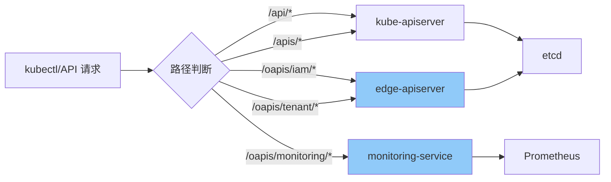

# API 扩展支持

## 概述

Edge Platform 的权限系统不仅支持标准的 Kubernetes API,还通过 APIService 和 ReverseProxy 机制扩展了对非 K8s 资源和第三方 API 的权限控制。本文介绍如何为自定义 API 和外部服务配置统一的权限管理。

## API 组织结构

### oapis 路径设计

Edge Platform 使用 `/oapis` (Organization APIs) 前缀区分自定义 API 和标准 K8s API:

```
标准 K8s API:
/api/v1/*                           # Core API
/apis/{group}/{version}/*           # Extended API

组织自定义 API (oapis):
/oapis/{module}/{version}/*         # Edge Platform API
```

### 当前 API 模块

| API 模块 | 路径 | 描述 | 资源 |
|---------|------|------|------|
| **iam** | `/oapis/iam/v1alpha1/*` | 身份访问管理 | roletemplates, iamroles, iamrolebindings |
| **tenant** | `/oapis/tenant/v1/*` | 多租户管理 | workspaces, clusters |
| **resources** | `/oapis/resources/v1alpha1/*` | 资源管理 | nodes, nodegroups |

### 未来扩展模块

| API 模块 | 路径 | 描述 | 计划资源 |
|---------|------|------|---------|
| **monitoring** | `/oapis/monitoring/v1/*` | 监控告警 | alerts, metrics, dashboards |
| **storage** | `/oapis/storage/v1/*` | 存储管理 | volumes, snapshots |
| **network** | `/oapis/network/v1/*` | 网络管理 | vpcs, subnets |

## APIService 机制

### APIService 注册

通过 Kubernetes APIService 机制扩展 API:

```yaml
apiVersion: apiregistration.k8s.io/v1
kind: APIService
metadata:
  name: v1alpha1.iam.theriseunion.io
  labels:
    app: edge-apiserver
spec:
  # API 组信息
  group: iam.theriseunion.io
  version: v1alpha1

  # 服务后端
  service:
    name: edge-apiserver
    namespace: edge-system
    port: 443

  # 优先级配置
  groupPriorityMinimum: 1000
  versionPriority: 15

  # TLS 配置
  insecureSkipTLSVerify: false
  caBundle: LS0tLS1CRUdJTi...
```

**关键特性**:
- 无缝集成到 K8s API 层级
- 支持标准的 kubectl 命令
- 自动获得 K8s 的认证和授权支持

### APIService 路由



### 权限检查集成

UniversalAuthorizer 会检查所有 oapis 路径的权限:

```go
func (ua *UniversalAuthorizer) Authorize(ctx context.Context, attrs authorizer.Attributes) (authorizer.Decision, string, error) {
    path := attrs.GetPath()

    // 判断是否为 oapis 请求
    if strings.HasPrefix(path, "/oapis/") {
        // 提取 API 组信息
        apiGroup, version, resource := ua.parseOapisPath(path)

        // 构造新的属性用于权限检查
        oapisAttrs := &OapisAttributes{
            Attributes: attrs,
            APIGroup:   apiGroup,
            Version:    version,
            Resource:   resource,
        }

        // 执行权限检查
        return ua.checkOapisPermission(ctx, oapisAttrs)
    }

    // 标准 K8s API 请求
    return ua.checkKubernetesPermission(ctx, attrs)
}

// 解析 oapis 路径
func (ua *UniversalAuthorizer) parseOapisPath(path string) (apiGroup, version, resource string) {
    // /oapis/iam/v1alpha1/roletemplates
    parts := strings.Split(strings.TrimPrefix(path, "/oapis/"), "/")
    if len(parts) >= 3 {
        return parts[0], parts[1], parts[2]
    }
    return "", "", ""
}
```

## ReverseProxy CRD

### 设计概述

ReverseProxy 是一个 CRD,用于将外部 API 代理到 Edge Platform,并应用统一的权限控制:

```yaml
apiVersion: iam.theriseunion.io/v1alpha1
kind: ReverseProxy
metadata:
  name: monitoring-api
spec:
  # 匹配规则
  matcher:
    method: "*"
    path: "/oapis/monitoring/*"

  # 上游服务
  upstream:
    scheme: http
    host: monitoring-service.observability-system.svc.cluster.local
    port: 8080

  # 代理指令
  directives:
    authProxy: true
    stripPathPrefix: "/oapis/monitoring"
```

### CRD 结构

```go
// ReverseProxyMatcher defines request matching rules
type ReverseProxyMatcher struct {
    // HTTP method to match (* for all methods)
    Method string `json:"method,omitempty"`

    // Path pattern to match (supports wildcards)
    Path string `json:"path"`
}

// ReverseProxyUpstream defines upstream service configuration
type ReverseProxyUpstream struct {
    // Protocol scheme (http/https)
    Scheme string `json:"scheme"`

    // Upstream host
    Host string `json:"host"`

    // Upstream port
    Port int32 `json:"port"`

    // Skip TLS certificate verification
    InsecureSkipVerify bool `json:"insecureSkipVerify,omitempty"`

    // CA certificate bundle (Base64 encoded)
    CABundle string `json:"caBundle,omitempty"`
}

// ReverseProxyDirectives defines proxy behavior
type ReverseProxyDirectives struct {
    // Enable authentication proxy
    AuthProxy bool `json:"authProxy,omitempty"`

    // Remove path prefix
    StripPathPrefix string `json:"stripPathPrefix,omitempty"`

    // Request header modifications
    HeaderUp []string `json:"headerUp,omitempty"`

    // Response header modifications
    HeaderDown []string `json:"headerDown,omitempty"`
}
```

### 使用示例

**场景 1: 监控 API 代理**

```yaml
apiVersion: iam.theriseunion.io/v1alpha1
kind: ReverseProxy
metadata:
  name: monitoring-api-proxy
spec:
  matcher:
    method: "*"
    path: "/oapis/monitoring/v1/*"

  upstream:
    scheme: http
    host: prometheus-server.observability-system.svc.cluster.local
    port: 9090

  directives:
    authProxy: true
    stripPathPrefix: "/oapis/monitoring/v1"

    # 添加自定义头
    headerUp:
      - "X-Forwarded-Proto https"
      - "X-Edge-Platform true"

    # 移除敏感头
    headerDown:
      - "-Server"
```

**配置权限规则**:

```yaml
apiVersion: iam.theriseunion.io/v1alpha1
kind: IAMRole
metadata:
  name: monitoring-viewer
spec:
  rules:
    # 非资源 URL 权限
    - nonResourceURLs:
        - "/oapis/monitoring/v1/query"
        - "/oapis/monitoring/v1/query_range"
      verbs: ["get"]

  uiPermissions:
    - "monitoring/metrics/view"
```

**场景 2: 传统系统集成**

```yaml
apiVersion: iam.theriseunion.io/v1alpha1
kind: ReverseProxy
metadata:
  name: legacy-api-proxy
spec:
  matcher:
    method: "*"
    path: "/oapis/legacy/*"

  upstream:
    scheme: https
    host: legacy-system.example.com
    port: 443
    insecureSkipVerify: false
    caBundle: LS0tLS1CRUdJTi...

  directives:
    authProxy: true
    stripPathPrefix: "/oapis/legacy"

    # 路径重写
    rewrite:
      - from: "^/users/([0-9]+)$"
        to: "/api/user.php?id=$1"

    # API 密钥注入
    headerUp:
      - "Authorization Bearer ${LEGACY_API_KEY}"
      - "X-Client-ID ${CLIENT_ID}"
```

## NonResourceURLs 支持

### 什么是 NonResourceURLs

NonResourceURLs 是 K8s RBAC 中用于控制非资源路径访问的机制,适用于:
- 系统端点: `/healthz`, `/metrics`, `/version`
- 自定义 API: `/oapis/monitoring/query`
- 管理端点: `/debug/*`, `/admin/*`

### 配置 NonResourceURLs 权限

**示例 1: 监控查询权限**

```yaml
apiVersion: iam.theriseunion.io/v1alpha1
kind: IAMRole
metadata:
  name: monitoring-user
spec:
  rules:
    - nonResourceURLs:
        - "/oapis/monitoring/v1/query"
        - "/oapis/monitoring/v1/query_range"
        - "/oapis/monitoring/v1/series"
      verbs: ["get", "post"]

  uiPermissions:
    - "monitoring/query"
```

**示例 2: 管理端点权限**

```yaml
apiVersion: iam.theriseunion.io/v1alpha1
kind: IAMRole
metadata:
  name: platform-operator
spec:
  rules:
    # 系统管理端点
    - nonResourceURLs:
        - "/oapis/admin/*"
        - "/debug/*"
        - "/metrics"
      verbs: ["get"]

    # 资源管理权限
    - apiGroups: ["*"]
      resources: ["*"]
      verbs: ["get", "list"]

  uiPermissions:
    - "admin/system/view"
```

### NonResourceURLs 权限检查

```go
func (ua *UniversalAuthorizer) checkNonResourceURLs(ctx context.Context, attrs authorizer.Attributes) (authorizer.Decision, string, error) {
    // 构建 Scope 链
    scopeChain, err := ua.scopeChainBuilder.Build(ctx, attrs)
    if err != nil {
        return authorizer.DecisionDeny, "failed to build scope chain", err
    }

    // 向上级联检查 NonResourceURLs 权限
    for _, scope := range scopeChain {
        // 查找该 Scope 的角色绑定
        bindings, err := ua.findRoleBindings(ctx, attrs.GetUser(), scope)
        if err != nil {
            continue
        }

        for _, binding := range bindings {
            // 获取对应的 IAMRole
            role, err := ua.getIAMRole(ctx, binding.Spec.RoleRef, scope)
            if err != nil {
                continue
            }

            // 检查 NonResourceURLs 规则
            for _, rule := range role.Spec.Rules {
                if ua.matchNonResourceURLs(attrs.GetPath(), rule.NonResourceURLs) &&
                    ua.matchVerb(attrs.GetVerb(), rule.Verbs) {
                    return authorizer.DecisionAllow, "allowed by non-resource URL rule", nil
                }
            }
        }
    }

    return authorizer.DecisionDeny, "no non-resource URL permissions found", nil
}

// 匹配 NonResourceURLs
func (ua *UniversalAuthorizer) matchNonResourceURLs(path string, patterns []string) bool {
    for _, pattern := range patterns {
        // 支持通配符匹配
        if matched, _ := filepath.Match(pattern, path); matched {
            return true
        }
    }
    return false
}
```

## 实战场景

### 场景 1: 集成 Grafana API

**需求**: 将 Grafana API 集成到 Edge Platform,统一权限管理

**步骤 1: 创建 ReverseProxy**

```yaml
apiVersion: iam.theriseunion.io/v1alpha1
kind: ReverseProxy
metadata:
  name: grafana-api-proxy
spec:
  matcher:
    method: "*"
    path: "/oapis/grafana/*"

  upstream:
    scheme: http
    host: grafana.observability-system.svc.cluster.local
    port: 3000

  directives:
    authProxy: true
    stripPathPrefix: "/oapis/grafana"

    # 注入 Grafana API Key
    headerUp:
      - "Authorization Bearer ${GRAFANA_API_KEY}"
```

**步骤 2: 定义权限**

```yaml
apiVersion: iam.theriseunion.io/v1alpha1
kind: IAMRole
metadata:
  name: grafana-viewer
spec:
  rules:
    - nonResourceURLs:
        - "/oapis/grafana/api/dashboards/*"
        - "/oapis/grafana/api/datasources"
      verbs: ["get"]

  uiPermissions:
    - "grafana/dashboard/view"

---
apiVersion: iam.theriseunion.io/v1alpha1
kind: IAMRole
metadata:
  name: grafana-editor
spec:
  rules:
    - nonResourceURLs:
        - "/oapis/grafana/api/dashboards/*"
      verbs: ["get", "post", "put", "delete"]

  uiPermissions:
    - "grafana/dashboard/view"
    - "grafana/dashboard/edit"
```

**步骤 3: 授予权限**

```yaml
apiVersion: iam.theriseunion.io/v1alpha1
kind: IAMRoleBinding
metadata:
  name: dev-team-grafana
  labels:
    iam.theriseunion.io/scope: workspace
    iam.theriseunion.io/scope-value: dev-team
spec:
  subjects:
    - kind: Group
      name: developers
  roleRef:
    kind: IAMRole
    name: grafana-viewer
```

### 场景 2: 自定义资源管理 API

**需求**: 为自定义的资源管理服务配置权限

**步骤 1: 注册 APIService**

```yaml
apiVersion: apiregistration.k8s.io/v1
kind: APIService
metadata:
  name: v1alpha1.resources.theriseunion.io
spec:
  group: resources.theriseunion.io
  version: v1alpha1

  service:
    name: resource-manager
    namespace: edge-system
    port: 8080

  groupPriorityMinimum: 1000
  versionPriority: 15
```

**步骤 2: 定义权限**

```yaml
apiVersion: iam.theriseunion.io/v1alpha1
kind: IAMRole
metadata:
  name: resource-manager
spec:
  rules:
    # 标准资源权限
    - apiGroups: ["resources.theriseunion.io"]
      resources: ["nodes", "nodegroups"]
      verbs: ["get", "list", "watch", "create", "update", "patch", "delete"]

  uiPermissions:
    - "resources/node/manage"
    - "resources/nodegroup/manage"
```

## 监控和调试

### 关键指标

```yaml
# ReverseProxy 请求统计
reverse_proxy_requests_total{proxy="monitoring-api", status="200|403|500"}
reverse_proxy_request_duration_seconds{proxy="monitoring-api"}

# NonResourceURLs 权限检查
permission_non_resource_checks_total{path="/oapis/monitoring/*", result="allow|deny"}
```

### 调试工具

**1. 查看 ReverseProxy 状态**

```bash
# 列出所有 ReverseProxy
kubectl get reverseproxy

# 查看详细状态
kubectl describe reverseproxy monitoring-api-proxy
```

**2. 测试 NonResourceURLs 权限**

```bash
# 测试监控 API 访问
curl -H "Authorization: Bearer $TOKEN" \
  "$API_SERVER/oapis/monitoring/v1/query?query=up"

# 检查权限
kubectl auth can-i get --as=alice /oapis/monitoring/v1/query
```

**3. 查看权限检查日志**

```bash
# 查看 APIServer 日志
kubectl logs -n edge-system deployment/edge-apiserver | grep "non-resource"

# 查看 ReverseProxy 日志
kubectl logs -n edge-system deployment/edge-apiserver | grep "reverse-proxy"
```

## 最佳实践

### 1. 使用 APIService 而非 ReverseProxy

**推荐**: 对于自定义资源,优先使用 APIService

```yaml
# 推荐: 使用 APIService
apiVersion: apiregistration.k8s.io/v1
kind: APIService
metadata:
  name: v1alpha1.monitoring.theriseunion.io
spec:
  group: monitoring.theriseunion.io
  version: v1alpha1
  service:
    name: monitoring-service
    namespace: observability-system
```

**原因**:
- 完全兼容 K8s API 机制
- 支持标准的 RBAC 规则
- 更好的性能和稳定性

### 2. 合理使用 NonResourceURLs

**推荐**: 为特定路径配置精确权限

```yaml
rules:
  - nonResourceURLs:
      - "/oapis/monitoring/v1/query"
      - "/oapis/monitoring/v1/query_range"
    verbs: ["get", "post"]
```

**不推荐**: 使用过宽的通配符

```yaml
rules:
  - nonResourceURLs:
      - "/oapis/*"  # 过宽
    verbs: ["*"]
```

### 3. 限制 ReverseProxy 的使用范围

ReverseProxy 适用于:
- ✓ 第三方 API 集成 (Grafana, Prometheus)
- ✓ 传统系统适配
- ✓ 临时的 API 代理

ReverseProxy 不适用于:
- ✗ 自定义 K8s 资源 (应使用 APIService)
- ✗ 高性能场景 (直接集成更好)
- ✗ 需要复杂权限控制的场景

### 4. 监控 API 扩展的性能

```bash
# 检查 ReverseProxy 延迟
curl $API_SERVER/metrics | grep reverse_proxy_request_duration

# 检查 APIService 延迟
curl $API_SERVER/metrics | grep apiserver_request_duration_seconds{handler="aggregator"}
```

## 下一步阅读

- [权限体系总览](./overview.md) - 回顾整体权限架构
- [RBAC 集成](./rbac.md) - 深入理解 K8s RBAC 集成
- [API 开发指南](../api/api-service.md) - 学习如何开发自定义 APIService
