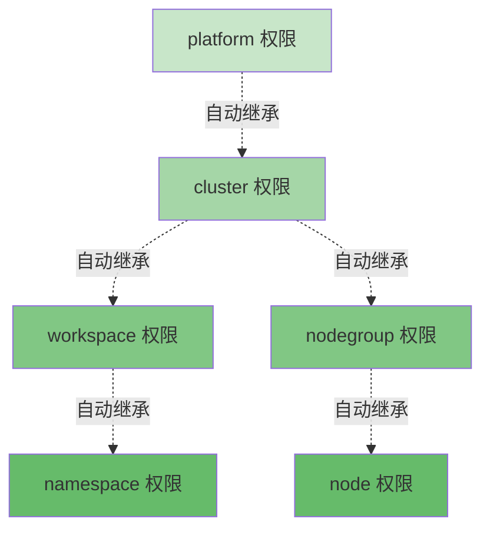
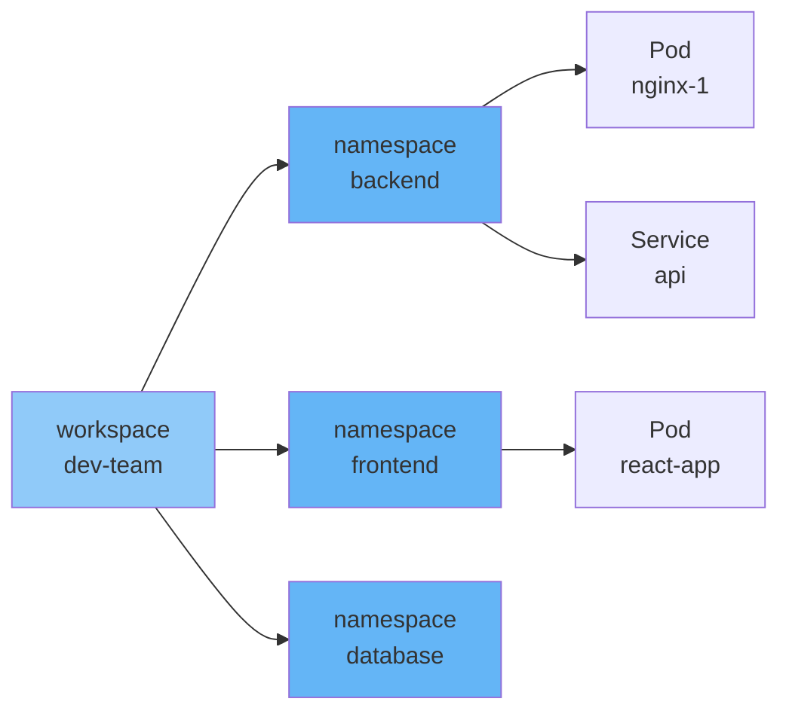
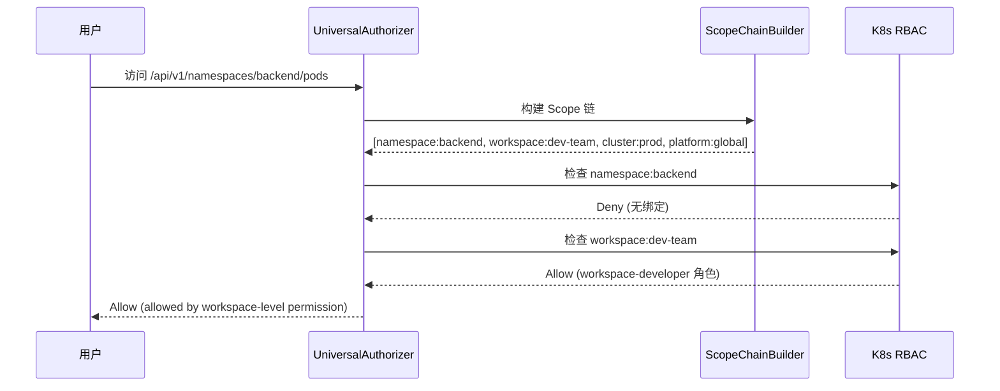

# 级联权限继承

## 概述

级联权限继承是 Edge Platform 权限系统的关键特性,它实现了权限从上级 Scope 向下级 Scope 的自动传递。通过这种机制,管理员可以在高层级授予权限,自动覆盖所有下级资源,极大简化了权限管理的复杂度。

## 核心原理

### 向下传递原则

权限在 Scope 层级中遵循**向下传递**原则:



**关键规则**:
- 在上级 Scope 拥有权限 → 自动拥有所有下级 Scope 的相同权限
- 权限只能向下传递,不能向上传递
- 下级权限不会影响上级权限

### 权限继承示例

**场景**: 用户在 workspace 级别拥有 `workspace-developer` 角色

```yaml
apiVersion: iam.theriseunion.io/v1alpha1
kind: IAMRoleBinding
metadata:
  name: alice-dev-team
  labels:
    iam.theriseunion.io/scope: workspace
    iam.theriseunion.io/scope-value: dev-team
spec:
  subjects:
    - kind: User
      name: alice
  roleRef:
    kind: IAMRole
    name: workspace-developer
```

**自动继承的权限**:



**权限效果**:
- ✓ 可以访问 workspace `dev-team`
- ✓ 可以访问 namespace `backend`, `frontend`, `database`
- ✓ 可以访问这些 namespace 中的所有资源 (Pods, Services, Deployments)

## 向上级联检查算法

### 检查流程

当用户访问资源时,系统采用**向上级联**的检查策略:



**算法特点**:
1. **从当前 Scope 开始**: 首先检查资源所在的最具体 Scope
2. **向上逐级查找**: 如果当前 Scope 无权限,向上级 Scope 查找
3. **短路优化**: 一旦找到允许权限,立即返回,不再检查上级
4. **性能优化**: 大多数权限检查在前两级 Scope 就能完成

### 实现代码

```go
package authorizer

import (
    "context"
    "k8s.io/apiserver/pkg/authorization/authorizer"
)

// Authorize 实现级联权限检查
func (ua *UniversalAuthorizer) Authorize(ctx context.Context, attrs authorizer.Attributes) (authorizer.Decision, string, error) {
    // 1. 构建 Scope 链 (从具体到抽象)
    scopeChain, err := ua.scopeChainBuilder.Build(ctx, attrs)
    if err != nil {
        return authorizer.DecisionDeny, "failed to build scope chain", err
    }

    // 2. 向上级联检查
    for i, scope := range scopeChain {
        // 查找用户在该 Scope 的角色绑定
        bindings, err := ua.findRoleBindings(ctx, attrs.GetUser(), scope)
        if err != nil {
            continue
        }

        // 没有绑定,继续检查上级
        if len(bindings) == 0 {
            continue
        }

        // 委托给 K8s RBAC 检查
        for _, binding := range bindings {
            decision, reason, err := ua.checkBinding(ctx, attrs, binding, scope)
            if err != nil {
                continue
            }

            if decision == authorizer.DecisionAllow {
                // 记录权限来源
                ua.auditLog(attrs, scope, "allow")

                return authorizer.DecisionAllow,
                    fmt.Sprintf("allowed by %s-level permission", scope.Type),
                    nil
            }
        }

        // 当前 Scope 拒绝,继续检查上级
        ua.auditLog(attrs, scope, "deny")
    }

    // 所有 Scope 都拒绝
    return authorizer.DecisionDeny, "no permissions found in scope chain", nil
}
```

## 实战场景

### 场景 1: Workspace 管理员

**需求**: 团队负责人需要管理整个工作空间

**权限配置**:

```yaml
# 1. 定义 workspace-admin 角色
apiVersion: iam.theriseunion.io/v1alpha1
kind: IAMRole
metadata:
  name: workspace-admin
  labels:
    iam.theriseunion.io/scope: workspace
spec:
  displayName:
    zh: "工作空间管理员"
  rules:
    - apiGroups: ["*"]
      resources: ["*"]
      verbs: ["*"]
  uiPermissions:
    - "workspace/*"

---
# 2. 授予团队负责人 workspace-admin 角色
apiVersion: iam.theriseunion.io/v1alpha1
kind: IAMRoleBinding
metadata:
  name: team-lead-admin
  labels:
    iam.theriseunion.io/scope: workspace
    iam.theriseunion.io/scope-value: dev-team
spec:
  subjects:
    - kind: User
      name: team-lead
  roleRef:
    kind: IAMRole
    name: workspace-admin
```

**权限效果**:

```bash
# team-lead 可以管理 dev-team 下的所有 namespace
kubectl get namespaces -l theriseunion.io/workspace=dev-team --as=team-lead
# backend, frontend, database

# 可以在任何 namespace 中操作资源
kubectl get pods --namespace=backend --as=team-lead
kubectl create deployment nginx --namespace=frontend --image=nginx --as=team-lead
kubectl delete service api --namespace=backend --as=team-lead
```

### 场景 2: Cluster 级别权限

**需求**: SRE 需要查看整个集群的资源状态

**权限配置**:

```yaml
# 1. 定义 cluster-viewer 角色
apiVersion: iam.theriseunion.io/v1alpha1
kind: IAMRole
metadata:
  name: cluster-viewer
  labels:
    iam.theriseunion.io/scope: cluster
spec:
  displayName:
    zh: "集群查看者"
  rules:
    - apiGroups: ["*"]
      resources: ["*"]
      verbs: ["get", "list", "watch"]
  uiPermissions:
    - "cluster/view"
    - "workspace/view"
    - "node/view"

---
# 2. 授予 SRE 团队 cluster-viewer 角色
apiVersion: iam.theriseunion.io/v1alpha1
kind: IAMRoleBinding
metadata:
  name: sre-cluster-viewer
  labels:
    iam.theriseunion.io/scope: cluster
    iam.theriseunion.io/scope-value: prod-cluster
spec:
  subjects:
    - kind: Group
      name: sre-team
  roleRef:
    kind: IAMRole
    name: cluster-viewer
```

**权限效果**:

```bash
# SRE 可以查看整个集群的所有资源
kubectl get nodes --as=sre-alice
kubectl get pods --all-namespaces --as=sre-alice
kubectl get workspaces --as=sre-alice
kubectl get nodegroups --as=sre-alice

# 但不能修改或删除资源
kubectl delete pod nginx --namespace=backend --as=sre-alice
# Error: Forbidden
```

### 场景 3: Platform 管理员

**需求**: 平台管理员需要全局管理权限

**权限配置**:

```yaml
# 1. 定义 platform-admin 角色
apiVersion: iam.theriseunion.io/v1alpha1
kind: IAMRole
metadata:
  name: platform-admin
  labels:
    iam.theriseunion.io/scope: platform
spec:
  displayName:
    zh: "平台管理员"
  rules:
    - apiGroups: ["*"]
      resources: ["*"]
      verbs: ["*"]
    - nonResourceURLs: ["*"]
      verbs: ["*"]
  uiPermissions:
    - "*"

---
# 2. 授予管理员 platform-admin 角色
apiVersion: iam.theriseunion.io/v1alpha1
kind: IAMRoleBinding
metadata:
  name: admin-platform
  labels:
    iam.theriseunion.io/scope: platform
    iam.theriseunion.io/scope-value: global
spec:
  subjects:
    - kind: User
      name: admin
  roleRef:
    kind: IAMRole
    name: platform-admin
```

**权限效果**:

```bash
# admin 可以管理所有集群、工作空间、节点组
kubectl get clusters --as=admin
kubectl get workspaces --all-clusters --as=admin
kubectl get nodegroups --all-clusters --as=admin

# 可以管理所有 namespace 的资源
kubectl get pods --all-namespaces --all-clusters --as=admin
kubectl delete deployment nginx --namespace=any-namespace --as=admin
```

## 性能优化

### 短路机制

级联检查采用短路优化,一旦找到权限立即返回:

```go
// 短路优化示例
for i, scope := range scopeChain {
    decision, reason, err := ua.checkScope(ctx, attrs, scope)

    if decision == authorizer.DecisionAllow {
        // 找到权限,立即返回,不再检查上级
        metrics.RecordScopeCheckLevel(i) // 记录在第几级找到权限
        return decision, reason, nil
    }

    // 当前 Scope 拒绝,继续检查上级
}
```

**性能表现**:

| Scope 层级 | 检查次数 | 平均延迟 |
|------------|----------|----------|
| namespace 直接命中 | 1 | 3-5ms |
| workspace 命中 | 2 | 8-10ms |
| cluster 命中 | 3 | 15-20ms |
| platform 命中 | 4 | 25-30ms |

### 缓存策略

```go
type ScopeCache struct {
    // 缓存 Scope 链
    scopeChainCache *lru.Cache

    // 缓存权限决策
    decisionCache *lru.Cache
}

// 缓存 Scope 链
func (sc *ScopeCache) GetScopeChain(key string) ([]Scope, bool) {
    if value, found := sc.scopeChainCache.Get(key); found {
        return value.([]Scope), true
    }
    return nil, false
}

// 缓存权限决策
func (sc *ScopeCache) GetDecision(key string) (authorizer.Decision, bool) {
    if value, found := sc.decisionCache.Get(key); found {
        return value.(authorizer.Decision), true
    }
    return authorizer.DecisionNoOpinion, false
}
```

**缓存效果**:
- Scope 链缓存命中率: > 90%
- 权限决策缓存命中率: > 95%
- 平均延迟降低: 70-80%

## 权限继承可视化

### 查看用户的完整权限树

```bash
# 查看用户在所有 Scope 的权限
kubectl get iamrolebindings -A -o json \
  | jq '.items[] | select(.spec.subjects[].name=="alice") | {
      scope: .metadata.labels."iam.theriseunion.io/scope",
      scopeValue: .metadata.labels."iam.theriseunion.io/scope-value",
      role: .spec.roleRef.name
    }'
```

**输出示例**:

```json
[
  {
    "scope": "workspace",
    "scopeValue": "dev-team",
    "role": "workspace-developer"
  },
  {
    "scope": "cluster",
    "scopeValue": "prod-cluster",
    "role": "cluster-viewer"
  }
]
```

### 权限继承关系图

```bash
# 获取权限继承关系
curl -H "Authorization: Bearer $TOKEN" \
  "$API_SERVER/debug/permission/inheritance?user=alice"
```

**响应**:

```json
{
  "user": "alice",
  "permissions": [
    {
      "scope": {"type": "cluster", "value": "prod-cluster"},
      "role": "cluster-viewer",
      "inherited": {
        "workspaces": ["dev-team", "ops-team"],
        "nodegroups": ["edge-beijing", "edge-shanghai"],
        "namespaces": ["backend", "frontend", "database"]
      }
    },
    {
      "scope": {"type": "workspace", "value": "dev-team"},
      "role": "workspace-developer",
      "inherited": {
        "namespaces": ["backend", "frontend"]
      }
    }
  ]
}
```

## 最佳实践

### 1. 合理选择授权层级

**推荐**: 在合适的层级授权

```yaml
# 团队开发 → 使用 workspace 级别
apiVersion: iam.theriseunion.io/v1alpha1
kind: IAMRoleBinding
metadata:
  labels:
    iam.theriseunion.io/scope: workspace
    iam.theriseunion.io/scope-value: dev-team
spec:
  subjects:
    - kind: User
      name: developer
  roleRef:
    kind: IAMRole
    name: workspace-developer
```

**不推荐**: 过度使用高层级权限

```yaml
# 仅需 workspace 权限却授予 cluster 权限
apiVersion: iam.theriseunion.io/v1alpha1
kind: IAMRoleBinding
metadata:
  labels:
    iam.theriseunion.io/scope: cluster  # 过宽
    iam.theriseunion.io/scope-value: prod-cluster
spec:
  subjects:
    - kind: User
      name: developer
  roleRef:
    kind: IAMRole
    name: cluster-admin  # 过宽
```

### 2. 利用权限继承简化管理

通过在上级 Scope 授权,自动覆盖所有下级资源:

```yaml
# 在 workspace 级别授予查看权限
# 自动继承到所有 namespace
apiVersion: iam.theriseunion.io/v1alpha1
kind: IAMRoleBinding
metadata:
  labels:
    iam.theriseunion.io/scope: workspace
    iam.theriseunion.io/scope-value: dev-team
spec:
  subjects:
    - kind: Group
      name: interns
  roleRef:
    kind: IAMRole
    name: workspace-viewer
```

**效果**: `interns` 组的所有成员自动拥有 `dev-team` 下所有 namespace 的查看权限,无需为每个 namespace 单独配置。

### 3. 监控权限继承深度

过深的 Scope 链会影响性能:

```bash
# 监控 Scope 链深度分布
curl $API_SERVER/metrics | grep permission_scope_chain_length

# 输出示例:
# permission_scope_chain_length{quantile="0.5"} 2
# permission_scope_chain_length{quantile="0.95"} 3
# permission_scope_chain_length{quantile="0.99"} 4
```

**优化建议**: 大多数权限检查应在 2-3 级 Scope 内完成。

## 常见问题

### 问题 1: 权限继承不生效

**症状**: 在上级 Scope 授予权限,但下级资源无法访问

**排查步骤**:

```bash
# 1. 检查 Scope 链是否正确构建
curl -H "Authorization: Bearer $TOKEN" \
  "$API_SERVER/debug/permission/scope-chain?path=/api/v1/namespaces/backend/pods"

# 2. 检查 IAMRoleBinding 的 Scope 标签
kubectl describe iamrolebinding alice-dev-team

# 3. 检查对应的 K8s ClusterRoleBinding
kubectl get clusterrolebindings -l \
  iam.theriseunion.io/scope=workspace,\
  iam.theriseunion.io/scope-value=dev-team

# 4. 验证 K8s RBAC 规则
kubectl auth can-i get pods --namespace=backend --as=alice
```

### 问题 2: 权限过宽

**症状**: 用户拥有不应该有的权限

**排查步骤**:

```bash
# 查找用户的所有权限绑定
kubectl get iamrolebindings -A -o json \
  | jq '.items[] | select(.spec.subjects[].name=="alice") | {
      scope: .metadata.labels."iam.theriseunion.io/scope",
      scopeValue: .metadata.labels."iam.theriseunion.io/scope-value",
      role: .spec.roleRef.name
    }'

# 检查是否有过高层级的权限
# 如果在 cluster 或 platform 级别有绑定,会继承到所有下级资源
```

### 问题 3: 性能问题

**症状**: 权限检查延迟过高

**排查步骤**:

```bash
# 1. 检查 Scope 链长度
curl $API_SERVER/metrics | grep permission_scope_chain_length

# 2. 检查缓存命中率
curl $API_SERVER/metrics | grep permission_cache_hit_ratio

# 3. 检查权限检查延迟
curl $API_SERVER/metrics | grep permission_check_duration
```

**优化建议**:
- 减少不必要的 Scope 层级
- 启用并优化缓存
- 合并相似的权限绑定

## 下一步阅读

- [API 扩展](./api-extension.md) - 了解如何为非 K8s API 实现权限控制
- [权限体系总览](./overview.md) - 回顾整体权限架构
- [Scope 感知授权](./scope-aware.md) - 深入理解 Scope 检查算法
