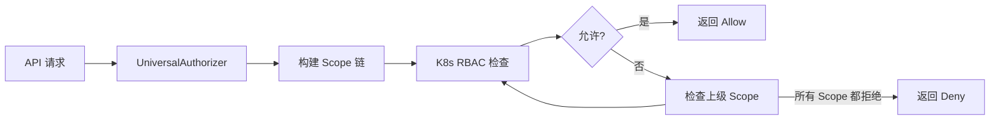
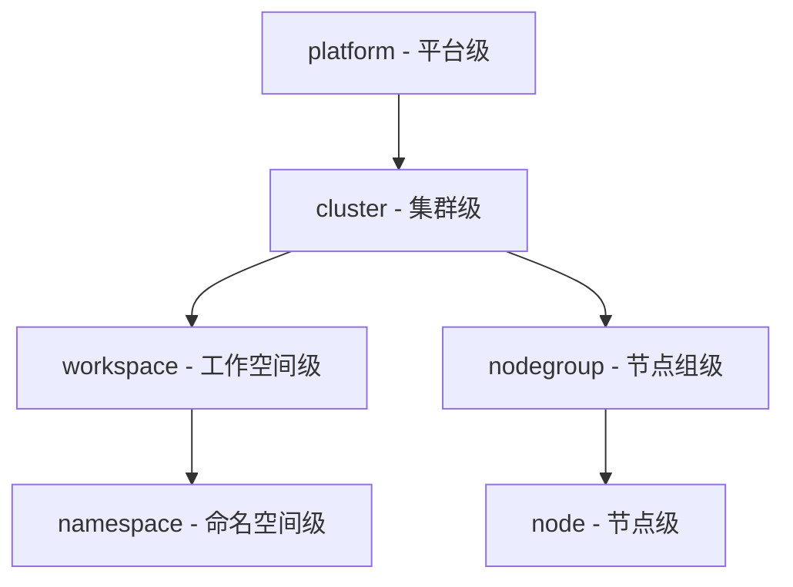
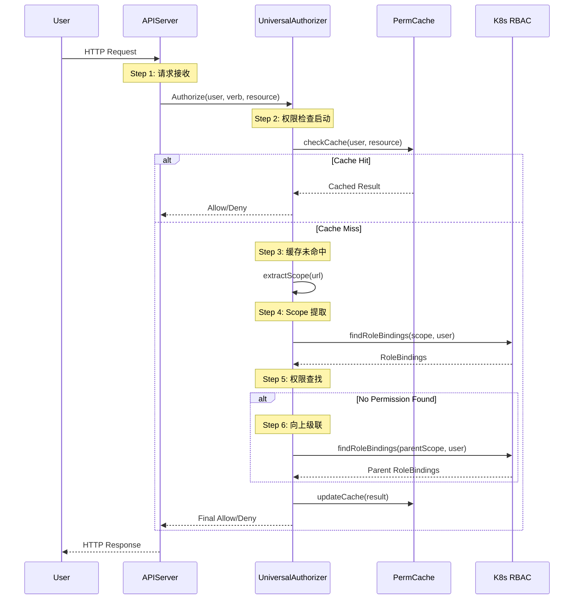

# 权限体系总览

## 概述

Edge Platform 的权限体系是一个基于 Kubernetes RBAC 的企业级多租户权限管理系统。它通过自定义资源定义 (CRD) 扩展了 K8s 标准 RBAC,提供了 Scope 感知的权限继承、级联检查和统一的前后端权限管理能力。

## 核心设计理念

### Kubernetes 原生委托

Edge Platform 的权限系统**完全委托**给 Kubernetes RBAC 进行权限决策,而非实现独立的权限引擎:



**优势**:
- 完全兼容 K8s 生态工具 (kubectl、helm)
- 复用 K8s 的权限决策逻辑,避免重复实现
- 自动获得 K8s 的审计日志支持
- 简化系统架构,减少维护成本

### 统一权限模型

系统通过统一的 CRD 模型消除了传统多平台权限系统的复杂性:

```yaml
apiVersion: iam.theriseunion.io/v1alpha1
kind: IAMRole
metadata:
  name: workspace-developer
  labels:
    iam.theriseunion.io/scope: workspace
spec:
  # API 权限 - 委托给 K8s RBAC
  rules:
    - apiGroups: ["apps"]
      resources: ["deployments"]
      verbs: ["get", "list", "create", "update"]

  # UI 权限 - 前端权限控制
  uiPermissions:
    - "workload/deployment/view"
    - "workload/deployment/create"

  # 角色模板聚合
  aggregationRoleTemplates:
    - name: deployment-manager
```

## 权限体系组件

### 1. IAMRole - 权限角色定义

IAMRole 是权限系统的核心资源,定义了用户可以执行的操作:

**资源结构**:
```yaml
apiVersion: iam.theriseunion.io/v1alpha1
kind: IAMRole
metadata:
  name: cluster-admin
  labels:
    iam.theriseunion.io/scope: cluster
    iam.theriseunion.io/managed: "true"
spec:
  displayName:
    en: "Cluster Administrator"
    zh: "集群管理员"

  rules:
    - apiGroups: ["*"]
      resources: ["*"]
      verbs: ["*"]

  uiPermissions:
    - "cluster/*"

  aggregationRoleTemplates:
    - name: cluster-admin-template
```

**关键特性**:
- 支持多语言显示名称
- API 权限和 UI 权限统一管理
- 支持从 RoleTemplate 聚合权限
- 通过标签标识 Scope 层级

### 2. RoleTemplate - 权限模板

RoleTemplate 是可复用的权限模板,用于快速组装角色:

```yaml
apiVersion: iam.theriseunion.io/v1alpha1
kind: RoleTemplate
metadata:
  name: deployment-manager
  labels:
    iam.theriseunion.io/scope: namespace
    iam.theriseunion.io/category: workload
spec:
  displayName:
    zh: "部署管理"

  rules:
    - apiGroups: ["apps"]
      resources: ["deployments"]
      verbs: ["get", "list", "watch", "create", "update", "patch", "delete"]

  uiPermissions:
    - "workload/deployment/view"
    - "workload/deployment/create"
    - "workload/deployment/edit"
    - "workload/deployment/delete"
```

**使用场景**:
- 按功能模块划分权限 (workload、network、storage)
- 在多个角色中复用相同的权限集
- 简化角色定义,提高可维护性

### 3. IAMRoleBinding - 角色绑定

IAMRoleBinding 将角色分配给用户或用户组:

```yaml
apiVersion: iam.theriseunion.io/v1alpha1
kind: IAMRoleBinding
metadata:
  name: alice-workspace-dev
  labels:
    iam.theriseunion.io/scope: workspace
    iam.theriseunion.io/scope-value: dev-team
spec:
  subjects:
    - kind: User
      name: alice

  roleRef:
    kind: IAMRole
    name: workspace-developer
```

**标签说明**:
- `iam.theriseunion.io/scope`: 权限的作用域类型 (platform/cluster/workspace/namespace/nodegroup)
- `iam.theriseunion.io/scope-value`: 权限的作用域实例 (如具体的 workspace 名称)

### 4. UniversalAuthorizer - 级联权限检查器

UniversalAuthorizer 是权限检查的核心组件,负责:

1. **构建 Scope 链**: 根据请求路径构建从具体到抽象的 Scope 层级
2. **级联检查**: 从当前 Scope 向上逐级检查权限
3. **委托决策**: 完全委托给 K8s RBAC 进行权限判断
4. **缓存优化**: 缓存常见的权限检查结果

```go
// UniversalAuthorizer 的核心流程
func (a *UniversalAuthorizer) Authorize(ctx context.Context, attr authorizer.Attributes) (authorizer.Decision, string, error) {
    // 1. 构建 Scope 链
    scopeChain := a.buildScopeChain(attr)

    // 2. 按层级检查权限
    for _, scope := range scopeChain {
        // 3. 委托给 K8s RBAC
        decision, reason, err := a.checkWithKubeRBAC(ctx, attr, scope)

        if decision == authorizer.DecisionAllow {
            return authorizer.DecisionAllow, reason, nil
        }
    }

    return authorizer.DecisionDeny, "no permissions found", nil
}
```

## Scope 层级系统

Edge Platform 定义了五级 Scope 层级:



**权限继承原则**:
- 权限从上级 Scope 向下级 Scope 继承
- 用户在任何一级 Scope 拥有权限,即可访问下级资源
- 权限检查从当前 Scope 开始,向上逐级查找

### Scope 层级详解

**1. platform (平台级)**
- 全局管理员权限
- 管理所有集群和资源
- 典型角色: platform-admin

**2. cluster (集群级)**
- 单个集群的管理权限
- 管理集群内所有工作空间和节点组
- 典型角色: cluster-admin

**3. workspace (工作空间级)**
- 工作空间内的应用管理权限
- 管理工作空间下的所有命名空间
- 典型角色: workspace-admin, workspace-developer

**4. namespace (命名空间级)**
- K8s 命名空间级别的权限
- 管理命名空间内的应用资源
- 典型角色: namespace-developer

**5. nodegroup (节点组级)**
- 节点组的管理权限
- 管理节点组内的所有节点
- 典型角色: nodegroup-operator

**6. node (节点级)**
- 单个节点的操作权限
- 最细粒度的基础设施权限
- 典型角色: node-operator

## 权限检查完整流程

### 7 步权限验证流程



**详细步骤说明**:

1. **请求接收**: APIServer 接收 HTTP 请求,提取用户身份和操作信息
2. **权限检查启动**: 调用 UniversalAuthorizer 开始权限验证
3. **缓存检查**: 查询权限缓存,如果命中直接返回结果
4. **Scope 提取**: 从请求路径中提取 Scope 信息
5. **权限查找**: 在当前 Scope 查找用户的角色绑定
6. **级联检查**: 如果当前 Scope 无权限,向上级 Scope 查找
7. **结果返回**: 返回最终的权限决策结果

## 快速开始示例

### 场景 1: 创建工作空间开发者角色

**步骤 1: 创建 RoleTemplate**

```yaml
apiVersion: iam.theriseunion.io/v1alpha1
kind: RoleTemplate
metadata:
  name: workload-manager
  labels:
    iam.theriseunion.io/scope: namespace
    iam.theriseunion.io/category: workload
spec:
  displayName:
    zh: "工作负载管理"

  rules:
    - apiGroups: ["apps"]
      resources: ["deployments", "statefulsets", "daemonsets"]
      verbs: ["get", "list", "watch", "create", "update", "patch"]

  uiPermissions:
    - "workload/deployment/view"
    - "workload/deployment/create"
    - "workload/statefulset/view"
```

**步骤 2: 创建 IAMRole**

```yaml
apiVersion: iam.theriseunion.io/v1alpha1
kind: IAMRole
metadata:
  name: workspace-developer
  labels:
    iam.theriseunion.io/scope: workspace
spec:
  displayName:
    zh: "工作空间开发者"

  aggregationRoleTemplates:
    - name: workload-manager
    - name: service-manager
```

**步骤 3: 创建 IAMRoleBinding**

```yaml
apiVersion: iam.theriseunion.io/v1alpha1
kind: IAMRoleBinding
metadata:
  name: alice-dev-team
  labels:
    iam.theriseunion.io/scope: workspace
    iam.theriseunion.io/scope-value: dev-team
spec:
  subjects:
    - kind: User
      name: alice

  roleRef:
    kind: IAMRole
    name: workspace-developer
```

**步骤 4: 验证权限**

```bash
# 使用 kubectl 验证
kubectl auth can-i list deployments --namespace=dev-namespace --as=alice
# yes

# 使用 API 验证
curl -H "Authorization: Bearer $ALICE_TOKEN" \
  $API_SERVER/api/v1/namespaces/dev-namespace/deployments
```

### 场景 2: 查询用户的 UI 权限

**API 调用**:

```bash
GET /oapis/iam.theriseunion.io/v1alpha1/scopes/workspace/dev-team/permissions?user=alice
```

**响应**:

```json
{
  "permissions": [
    "workload/deployment/view",
    "workload/deployment/create",
    "workload/statefulset/view",
    "service/view"
  ]
}
```

**前端使用**:

```typescript
import { useUserPermissions } from '@/hooks/usePermissions'

function DeploymentPage() {
  const { hasPermission } = useUserPermissions()

  return (
    <div>
      {hasPermission('workload/deployment/view') && (
        <DeploymentList />
      )}

      {hasPermission('workload/deployment/create') && (
        <Button>创建 Deployment</Button>
      )}
    </div>
  )
}
```

## 性能优化

### 多级缓存体系

```go
type PermissionCache struct {
    // L1: 内存缓存 (最快,容量小)
    memCache *lru.Cache

    // L2: 权限决策缓存 (中等,容量大)
    decisionCache map[string]*CachedDecision

    // L3: RBAC 规则缓存 (慢,但避免 etcd 查询)
    rbacCache map[string]*rbacv1.ClusterRole
}
```

**缓存策略**:
- TTL: 5 分钟
- 容量: 10000 条记录
- 失效触发: IAMRoleBinding 变更时主动失效

### 短路机制

权限检查采用短路优化:
- 一旦在某个 Scope 层级找到允许权限,立即返回
- 避免不必要的下级 Scope 检查
- P95 延迟 < 10ms

## 监控和调试

### 关键指标

```yaml
# 权限检查总数和成功率
permission_checks_total{result="allow|deny"}
permission_check_success_rate

# 性能指标
permission_check_duration_seconds{quantile="0.5|0.95|0.99"}
permission_cache_hit_ratio

# 缓存指标
permission_cache_size_bytes
permission_cache_evictions_total

# 错误指标
permission_errors_total{type="scope_pattern|rbac_lookup|cache_error"}
```

### 调试工具

**1. 权限被拒绝排查**

```bash
# 检查用户的所有权限绑定
kubectl get clusterrolebindings -l iam.theriseunion.io/managed=true --show-labels | grep alice

# 验证 Scope 链构建
curl -H "Authorization: Bearer $TOKEN" \
  "$API_SERVER/debug/permission-chain?path=/api/v1/namespaces/app-ns/pods"
```

**2. 性能问题排查**

```bash
# 检查缓存命中率
curl $API_SERVER/metrics | grep permission_cache

# 查看权限检查延迟
curl $API_SERVER/metrics | grep permission_check_duration
```

## 安全性保证

### 认证和授权分离

- **认证**: OAuth2/OIDC,JWT Token
- **授权**: UniversalAuthorizer + K8s RBAC
- **审计**: K8s Audit Log 集成

### 最小权限原则

- 默认拒绝策略
- 显式授权要求
- 权限聚合最小化

### 多租户隔离

- Scope 标签强制隔离
- Namespace 边界保护
- 工作空间级别资源配额

## 下一步阅读

- [RBAC 集成](./rbac.md) - 深入了解 K8s RBAC 集成机制
- [Scope 感知授权](./scope-aware.md) - 掌握 Scope 级联检查算法
- [角色绑定](./role-binding.md) - 学习用户-角色-Scope 关联
- [级联权限](./cascading.md) - 理解权限继承原则
- [API 扩展](./api-extension.md) - 了解非 K8s API 的权限控制
