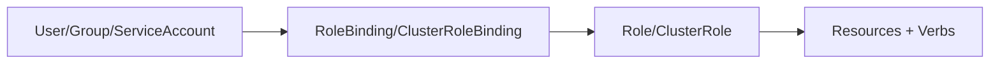
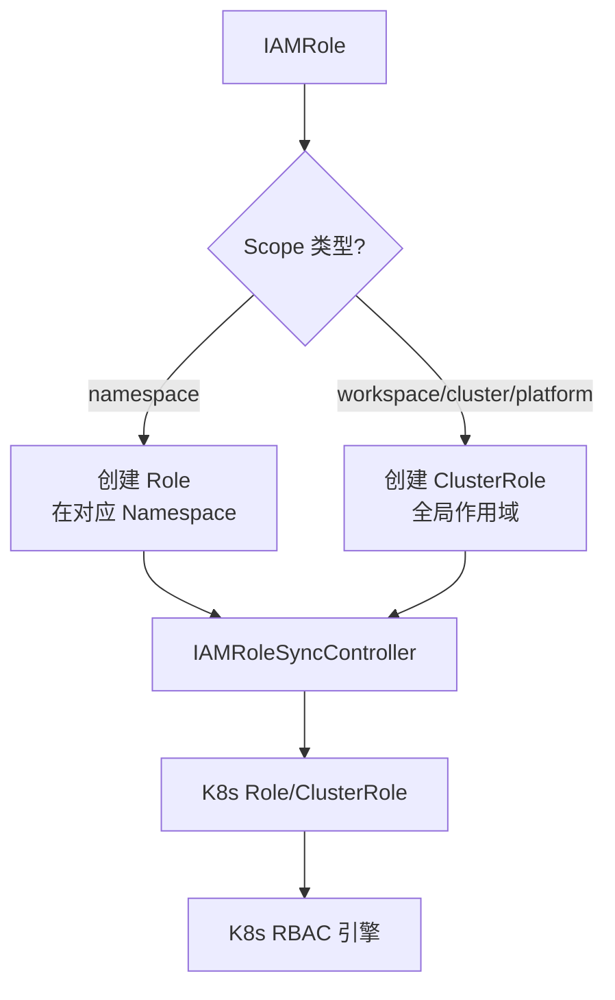
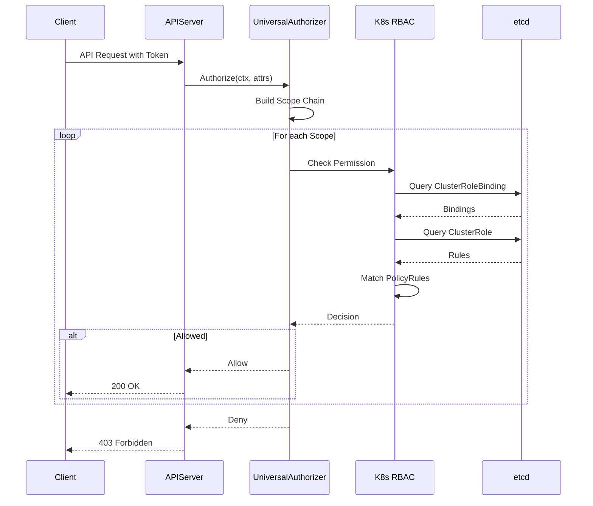

# RBAC 集成

## 概述

Edge Platform 的权限系统完全基于 Kubernetes RBAC 构建,通过 IAMRole 和 IAMRoleBinding 提供更高层次的抽象,同时保持与 K8s 原生 RBAC 的 100% 兼容性。

## K8s RBAC 基础

### RBAC 核心概念

Kubernetes RBAC (Role-Based Access Control) 包含四个核心资源:



**1. Role 和 ClusterRole**

```yaml
# Role: 命名空间级别的权限
apiVersion: rbac.authorization.k8s.io/v1
kind: Role
metadata:
  namespace: default
  name: pod-reader
rules:
  - apiGroups: [""]
    resources: ["pods"]
    verbs: ["get", "list"]

---
# ClusterRole: 集群级别的权限
apiVersion: rbac.authorization.k8s.io/v1
kind: ClusterRole
metadata:
  name: cluster-admin
rules:
  - apiGroups: ["*"]
    resources: ["*"]
    verbs: ["*"]
```

**2. RoleBinding 和 ClusterRoleBinding**

```yaml
# RoleBinding: 在命名空间中授予权限
apiVersion: rbac.authorization.k8s.io/v1
kind: RoleBinding
metadata:
  name: read-pods
  namespace: default
subjects:
  - kind: User
    name: alice
roleRef:
  kind: Role
  name: pod-reader
  apiGroup: rbac.authorization.k8s.io

---
# ClusterRoleBinding: 在整个集群授予权限
apiVersion: rbac.authorization.k8s.io/v1
kind: ClusterRoleBinding
metadata:
  name: cluster-admin-binding
subjects:
  - kind: User
    name: admin
roleRef:
  kind: ClusterRole
  name: cluster-admin
  apiGroup: rbac.authorization.k8s.io
```

### PolicyRule 语法

PolicyRule 定义了具体的权限规则:

```yaml
rules:
  # 示例 1: 基本资源权限
  - apiGroups: [""]  # 核心 API 组
    resources: ["pods", "services"]
    verbs: ["get", "list", "watch"]

  # 示例 2: 特定资源名称
  - apiGroups: ["apps"]
    resources: ["deployments"]
    resourceNames: ["nginx"]  # 仅限特定资源
    verbs: ["get", "update"]

  # 示例 3: 子资源
  - apiGroups: [""]
    resources: ["pods/log"]  # Pod 的日志子资源
    verbs: ["get"]

  # 示例 4: 非资源 URL
  - nonResourceURLs: ["/metrics", "/healthz"]
    verbs: ["get"]
```

**Verbs 说明**:
- `get`: 获取单个资源
- `list`: 列出资源集合
- `watch`: 监听资源变化
- `create`: 创建资源
- `update`: 更新资源
- `patch`: 部分更新资源
- `delete`: 删除资源
- `deletecollection`: 批量删除资源

## IAMRole 到 K8s RBAC 的转换

### 转换机制

Edge Platform 的 Controller 自动将 IAMRole 转换为 K8s Role/ClusterRole:



### 转换示例

**IAMRole 定义**:

```yaml
apiVersion: iam.theriseunion.io/v1alpha1
kind: IAMRole
metadata:
  name: workspace-developer
  labels:
    iam.theriseunion.io/scope: workspace
    iam.theriseunion.io/scope-value: dev-team
spec:
  rules:
    - apiGroups: ["apps"]
      resources: ["deployments"]
      verbs: ["get", "list", "create", "update"]
    - apiGroups: [""]
      resources: ["pods", "services"]
      verbs: ["get", "list"]

  uiPermissions:
    - "workload/deployment/view"
    - "workload/deployment/create"
```

**自动生成的 ClusterRole**:

```yaml
apiVersion: rbac.authorization.k8s.io/v1
kind: ClusterRole
metadata:
  name: rs:iam:workspace:dev-team:workspace-developer
  labels:
    iam.theriseunion.io/managed: "true"
    iam.theriseunion.io/scope: workspace
    iam.theriseunion.io/scope-value: dev-team
    iam.theriseunion.io/role: workspace-developer
rules:
  - apiGroups: ["apps"]
    resources: ["deployments"]
    verbs: ["get", "list", "create", "update"]
  - apiGroups: [""]
    resources: ["pods", "services"]
    verbs: ["get", "list"]
```

**命名规范**:
- 格式: `rs:iam:{scope}:{scope-value}:{role-name}`
- 示例: `rs:iam:workspace:dev-team:workspace-developer`
- `rs`: Role Scope 的缩写
- 通过名称即可识别 Scope 层级和值

### IAMRoleBinding 到 K8s Binding 的转换

**IAMRoleBinding 定义**:

```yaml
apiVersion: iam.theriseunion.io/v1alpha1
kind: IAMRoleBinding
metadata:
  name: alice-workspace-dev
  labels:
    iam.theriseunion.io/scope: workspace
    iam.theriseunion.io/scope-value: dev-team
spec:
  subjects:
    - kind: User
      name: alice
  roleRef:
    kind: IAMRole
    name: workspace-developer
```

**自动生成的 ClusterRoleBinding**:

```yaml
apiVersion: rbac.authorization.k8s.io/v1
kind: ClusterRoleBinding
metadata:
  name: rs:iamrb:workspace:dev-team:alice
  labels:
    iam.theriseunion.io/managed: "true"
    iam.theriseunion.io/scope: workspace
    iam.theriseunion.io/scope-value: dev-team
subjects:
  - kind: User
    name: alice
roleRef:
  kind: ClusterRole
  name: rs:iam:workspace:dev-team:workspace-developer
  apiGroup: rbac.authorization.k8s.io
```

## UniversalAuthorizer 委托机制

### 委托架构

UniversalAuthorizer 不实现独立的权限判断逻辑,而是完全委托给 K8s RBAC:



### 委托实现

```go
package authorizer

import (
    "context"
    "k8s.io/apiserver/pkg/authorization/authorizer"
    rbacv1 "k8s.io/api/rbac/v1"
)

type UniversalAuthorizer struct {
    // K8s 原生 RBAC Authorizer
    rbacAuthorizer authorizer.Authorizer

    // Scope 链构建器
    scopeChainBuilder *ScopeChainBuilder

    // 权限缓存
    cache *PermissionCache
}

func (ua *UniversalAuthorizer) Authorize(ctx context.Context, attr authorizer.Attributes) (authorizer.Decision, string, error) {
    // 1. 检查缓存
    if decision, cached := ua.cache.Get(attr); cached {
        return decision, "cached decision", nil
    }

    // 2. 构建 Scope 链
    scopeChain, err := ua.scopeChainBuilder.Build(ctx, attr)
    if err != nil {
        return authorizer.DecisionDeny, "failed to build scope chain", err
    }

    // 3. 按 Scope 链逐级检查
    for _, scope := range scopeChain {
        // 构造带 Scope 标签的属性
        scopedAttr := ua.buildScopedAttributes(attr, scope)

        // 4. 委托给 K8s RBAC (关键步骤)
        decision, reason, err := ua.rbacAuthorizer.Authorize(ctx, scopedAttr)

        if decision == authorizer.DecisionAllow {
            // 5. 缓存结果
            ua.cache.Set(attr, decision)
            return decision, reason, nil
        }
    }

    return authorizer.DecisionDeny, "no permissions found in scope chain", nil
}

// 构造带 Scope 信息的属性
func (ua *UniversalAuthorizer) buildScopedAttributes(attr authorizer.Attributes, scope *Scope) authorizer.Attributes {
    // 在 User 信息中添加 Scope 标签
    // K8s RBAC 会根据这些标签匹配对应的 ClusterRoleBinding
    return &scopedAttributes{
        Attributes: attr,
        scope:      scope,
    }
}
```

### 为什么选择委托模式?

**优势**:

1. **完全兼容 K8s 生态**
   - 可以使用 `kubectl auth can-i` 验证权限
   - 支持所有 K8s RBAC 特性 (如 resourceNames, subresources)
   - 自动获得 K8s 的审计日志

2. **简化系统架构**
   - 无需维护独立的权限引擎
   - 复用 K8s 经过充分测试的代码
   - 减少 bug 和安全漏洞的风险

3. **性能优化**
   - K8s RBAC 已经过高度优化
   - 自带缓存机制
   - 支持大规模集群

4. **降低学习成本**
   - 开发者只需学习 K8s RBAC
   - 无需理解额外的权限模型
   - 降低运维复杂度

## 权限验证示例

### 使用 kubectl 验证

```bash
# 检查用户是否有权限
kubectl auth can-i get deployments --namespace=dev-namespace --as=alice
# yes

kubectl auth can-i delete pods --namespace=dev-namespace --as=alice
# no

# 检查 ServiceAccount 权限
kubectl auth can-i list secrets --namespace=kube-system --as=system:serviceaccount:default:my-sa
# yes

# 列出用户的所有权限
kubectl auth can-i --list --namespace=dev-namespace --as=alice
```

### 使用 API 验证

```bash
# 直接调用 K8s API
curl -H "Authorization: Bearer $ALICE_TOKEN" \
  https://apiserver:6443/api/v1/namespaces/dev-namespace/deployments

# 调用 Edge Platform API (自动使用 UniversalAuthorizer)
curl -H "Authorization: Bearer $ALICE_TOKEN" \
  https://edge-apiserver:8080/api/v1/namespaces/dev-namespace/deployments
```

## 最佳实践

### 1. 遵循最小权限原则

**不推荐**: 授予过宽的权限

```yaml
rules:
  - apiGroups: ["*"]
    resources: ["*"]
    verbs: ["*"]
```

**推荐**: 仅授予必要的权限

```yaml
rules:
  - apiGroups: ["apps"]
    resources: ["deployments"]
    verbs: ["get", "list", "watch"]
  - apiGroups: [""]
    resources: ["pods"]
    verbs: ["get", "list"]
```

### 2. 使用 RoleTemplate 复用权限

**不推荐**: 在每个 IAMRole 中重复定义相同权限

```yaml
apiVersion: iam.theriseunion.io/v1alpha1
kind: IAMRole
metadata:
  name: role-a
spec:
  rules:
    - apiGroups: ["apps"]
      resources: ["deployments"]
      verbs: ["get", "list"]
---
apiVersion: iam.theriseunion.io/v1alpha1
kind: IAMRole
metadata:
  name: role-b
spec:
  rules:
    - apiGroups: ["apps"]
      resources: ["deployments"]
      verbs: ["get", "list"]
```

**推荐**: 使用 RoleTemplate 复用

```yaml
apiVersion: iam.theriseunion.io/v1alpha1
kind: RoleTemplate
metadata:
  name: deployment-viewer
spec:
  rules:
    - apiGroups: ["apps"]
      resources: ["deployments"]
      verbs: ["get", "list"]
---
apiVersion: iam.theriseunion.io/v1alpha1
kind: IAMRole
metadata:
  name: role-a
spec:
  aggregationRoleTemplates:
    - name: deployment-viewer
---
apiVersion: iam.theriseunion.io/v1alpha1
kind: IAMRole
metadata:
  name: role-b
spec:
  aggregationRoleTemplates:
    - name: deployment-viewer
```

### 3. 合理使用 Scope 标签

确保 IAMRoleBinding 的 Scope 标签与实际权限范围匹配:

```yaml
# ✓ 正确: workspace Scope 的绑定
apiVersion: iam.theriseunion.io/v1alpha1
kind: IAMRoleBinding
metadata:
  name: alice-dev-workspace
  labels:
    iam.theriseunion.io/scope: workspace
    iam.theriseunion.io/scope-value: dev-team
spec:
  subjects:
    - kind: User
      name: alice
  roleRef:
    kind: IAMRole
    name: workspace-developer

# ✗ 错误: 标签与实际范围不符
apiVersion: iam.theriseunion.io/v1alpha1
kind: IAMRoleBinding
metadata:
  name: alice-dev-workspace
  labels:
    iam.theriseunion.io/scope: cluster  # 错误! 应该是 workspace
    iam.theriseunion.io/scope-value: dev-team
```

### 4. 定期审计权限

```bash
# 列出所有 IAM 管理的 ClusterRoleBinding
kubectl get clusterrolebindings -l iam.theriseunion.io/managed=true

# 查看用户的权限绑定
kubectl get clusterrolebindings -l iam.theriseunion.io/managed=true -o json \
  | jq '.items[] | select(.subjects[].name=="alice")'

# 检查 Scope 分布
kubectl get clusterrolebindings -l iam.theriseunion.io/managed=true \
  --show-labels | awk '{print $6}' | grep scope | sort | uniq -c
```

## 常见问题排查

### 问题 1: 权限配置了但不生效

**排查步骤**:

```bash
# 1. 检查 IAMRole 是否正确同步为 ClusterRole
kubectl get clusterrole -l iam.theriseunion.io/role=workspace-developer

# 2. 检查 IAMRoleBinding 是否正确同步为 ClusterRoleBinding
kubectl get clusterrolebinding -l iam.theriseunion.io/managed=true \
  | grep alice

# 3. 检查 Scope 标签是否正确
kubectl describe clusterrolebinding rs:iamrb:workspace:dev-team:alice

# 4. 使用 kubectl 验证
kubectl auth can-i get deployments --namespace=dev-namespace --as=alice
```

### 问题 2: 权限检查性能问题

**排查步骤**:

```bash
# 1. 检查缓存命中率
curl http://edge-apiserver:8083/metrics | grep permission_cache_hit_ratio

# 2. 检查权限检查延迟
curl http://edge-apiserver:8083/metrics | grep permission_check_duration

# 3. 检查 ClusterRole 和 ClusterRoleBinding 数量
kubectl get clusterroles -l iam.theriseunion.io/managed=true | wc -l
kubectl get clusterrolebindings -l iam.theriseunion.io/managed=true | wc -l
```

**优化建议**:
- 启用权限缓存
- 减少不必要的 RoleBinding
- 合并相似的 Role

### 问题 3: Scope 标签不匹配

**症状**: UniversalAuthorizer 找不到对应 Scope 的权限

**解决方案**:

```bash
# 检查所有 ClusterRoleBinding 的 Scope 标签
kubectl get clusterrolebindings -l iam.theriseunion.io/managed=true \
  -o custom-columns=NAME:.metadata.name,SCOPE:.metadata.labels."iam\.theriseunion\.io/scope",VALUE:.metadata.labels."iam\.theriseunion\.io/scope-value"

# 修复错误的标签
kubectl label clusterrolebinding rs:iamrb:workspace:dev-team:alice \
  iam.theriseunion.io/scope=workspace \
  iam.theriseunion.io/scope-value=dev-team \
  --overwrite
```

## 下一步阅读

- [Scope 感知授权](./scope-aware.md) - 了解 Scope 级联检查的实现细节
- [角色绑定](./role-binding.md) - 深入学习 IAMRoleBinding 的设计
- [级联权限](./cascading.md) - 掌握权限继承的原理
