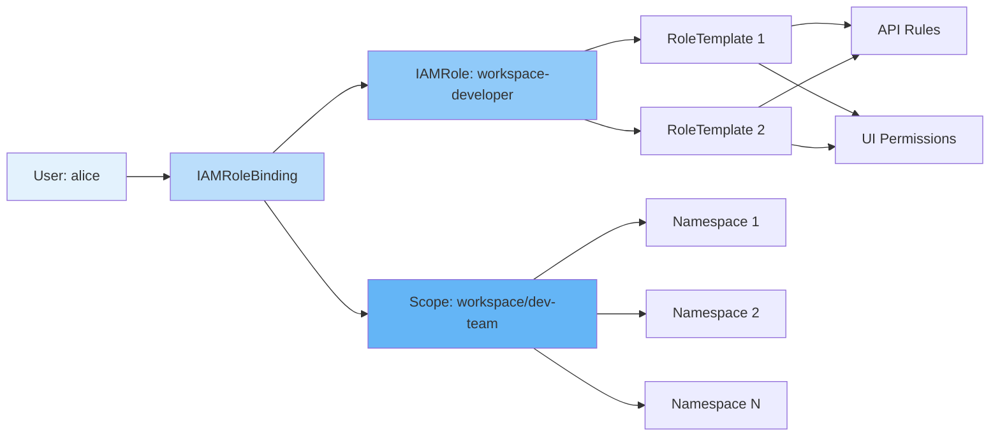
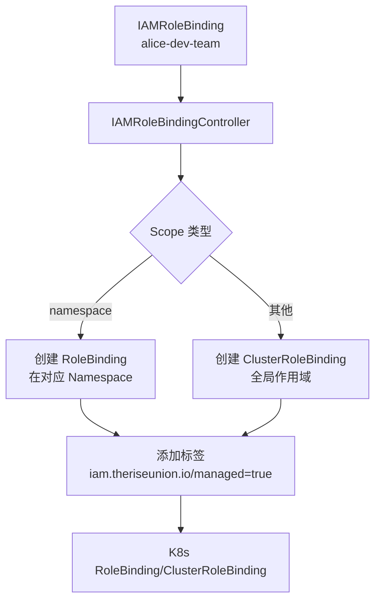

# 角色绑定

## 概述

IAMRoleBinding 是 Edge Platform 权限系统中连接用户和角色的桥梁。它通过 Scope 标签定义权限的作用范围,实现了细粒度的多租户权限控制。

## IAMRoleBinding 设计

### 资源定义

IAMRoleBinding 的 CRD 定义非常简洁,复用了 K8s RBAC 的 Subject 和 RoleRef:

```go
// IAMRoleBindingSpec defines the desired state of IAMRoleBinding
type IAMRoleBindingSpec struct {
    // Subjects holds references to the objects the role applies to
    // +optional
    Subjects []rbacv1.Subject `json:"subjects,omitempty"`

    // RoleRef references an IAMRole
    RoleRef rbacv1.RoleRef `json:"roleRef"`
}
```

**关键设计决策**:

1. **复用 K8s Subject**: 直接使用 `rbacv1.Subject`,保持与 K8s 的兼容性
2. **Scope 通过标签定义**: 不在 Spec 中定义 Scope,而是通过标签标识
3. **简化字段**: 只包含必要的 Subjects 和 RoleRef

### Scope 标签系统

Scope 信息完全通过标签表达:

```yaml
metadata:
  name: alice-workspace-dev
  labels:
    iam.theriseunion.io/scope: workspace
    iam.theriseunion.io/scope-value: dev-team
    iam.theriseunion.io/managed: "true"
```

**核心标签**:

| 标签 | 说明 | 示例值 |
|------|------|--------|
| `iam.theriseunion.io/scope` | Scope 类型 | platform, cluster, workspace, namespace, nodegroup, node |
| `iam.theriseunion.io/scope-value` | Scope 实例标识 | dev-team, prod-cluster, app-ns |
| `iam.theriseunion.io/managed` | 标识由 IAM 系统管理 | "true" |

## 用户-角色-Scope 关联

### 关联模型



### 完整示例

**步骤 1: 创建 RoleTemplate**

```yaml
apiVersion: iam.theriseunion.io/v1alpha1
kind: RoleTemplate
metadata:
  name: deployment-manager
  labels:
    iam.theriseunion.io/scope: namespace
    iam.theriseunion.io/category: workload
spec:
  displayName:
    zh: "部署管理"
    en: "Deployment Manager"

  rules:
    - apiGroups: ["apps"]
      resources: ["deployments"]
      verbs: ["get", "list", "watch", "create", "update", "patch", "delete"]

  uiPermissions:
    - "workload/deployment/view"
    - "workload/deployment/create"
    - "workload/deployment/edit"
    - "workload/deployment/delete"
```

**步骤 2: 创建 IAMRole**

```yaml
apiVersion: iam.theriseunion.io/v1alpha1
kind: IAMRole
metadata:
  name: workspace-developer
  labels:
    iam.theriseunion.io/scope: workspace
spec:
  displayName:
    zh: "工作空间开发者"
    en: "Workspace Developer"

  # 通过 RoleTemplate 聚合权限
  aggregationRoleTemplates:
    - name: deployment-manager
    - name: service-manager
    - name: configmap-manager
```

**步骤 3: 创建 IAMRoleBinding**

```yaml
apiVersion: iam.theriseunion.io/v1alpha1
kind: IAMRoleBinding
metadata:
  name: alice-dev-team
  labels:
    iam.theriseunion.io/scope: workspace
    iam.theriseunion.io/scope-value: dev-team
spec:
  subjects:
    - kind: User
      name: alice
      apiGroup: rbac.authorization.k8s.io

  roleRef:
    kind: IAMRole
    name: workspace-developer
    apiGroup: iam.theriseunion.io
```

**结果**: 用户 `alice` 在工作空间 `dev-team` 下的所有命名空间中拥有 `workspace-developer` 角色定义的权限。

## Subject 类型

### 1. User (用户)

最常见的 Subject 类型,代表单个用户:

```yaml
subjects:
  - kind: User
    name: alice
    apiGroup: rbac.authorization.k8s.io
```

**使用场景**:
- 为个人用户授予权限
- 精确控制单个用户的访问

### 2. Group (用户组)

代表用户组,所有组成员自动获得权限:

```yaml
subjects:
  - kind: Group
    name: developers
    apiGroup: rbac.authorization.k8s.io
```

**使用场景**:
- 批量授权给团队成员
- 简化权限管理

**与 LDAP/AD 集成**:

```yaml
# 示例: 为 LDAP 组授权
subjects:
  - kind: Group
    name: "cn=developers,ou=groups,dc=example,dc=com"
    apiGroup: rbac.authorization.k8s.io
```

### 3. ServiceAccount (服务账户)

代表 K8s ServiceAccount,用于应用程序访问:

```yaml
subjects:
  - kind: ServiceAccount
    name: app-service-account
    namespace: app-namespace
    apiGroup: ""
```

**使用场景**:
- CI/CD 流水线权限
- 应用程序访问 K8s API
- 自动化任务权限

## 批量绑定模式

### 多用户绑定到同一角色

```yaml
apiVersion: iam.theriseunion.io/v1alpha1
kind: IAMRoleBinding
metadata:
  name: dev-team-developers
  labels:
    iam.theriseunion.io/scope: workspace
    iam.theriseunion.io/scope-value: dev-team
spec:
  subjects:
    - kind: User
      name: alice
    - kind: User
      name: bob
    - kind: User
      name: charlie
    - kind: Group
      name: interns  # 包含实习生组

  roleRef:
    kind: IAMRole
    name: workspace-developer
```

**优势**:
- 统一管理团队权限
- 减少 IAMRoleBinding 资源数量
- 易于批量调整权限

### 同一用户在不同 Scope 的角色

用户可以在不同 Scope 拥有不同角色:

```yaml
# 1. 在 workspace A 是开发者
apiVersion: iam.theriseunion.io/v1alpha1
kind: IAMRoleBinding
metadata:
  name: alice-workspace-a-dev
  labels:
    iam.theriseunion.io/scope: workspace
    iam.theriseunion.io/scope-value: workspace-a
spec:
  subjects:
    - kind: User
      name: alice
  roleRef:
    kind: IAMRole
    name: workspace-developer

---
# 2. 在 workspace B 是管理员
apiVersion: iam.theriseunion.io/v1alpha1
kind: IAMRoleBinding
metadata:
  name: alice-workspace-b-admin
  labels:
    iam.theriseunion.io/scope: workspace
    iam.theriseunion.io/scope-value: workspace-b
spec:
  subjects:
    - kind: User
      name: alice
  roleRef:
    kind: IAMRole
    name: workspace-admin

---
# 3. 在 cluster 级别是查看者
apiVersion: iam.theriseunion.io/v1alpha1
kind: IAMRoleBinding
metadata:
  name: alice-cluster-viewer
  labels:
    iam.theriseunion.io/scope: cluster
    iam.theriseunion.io/scope-value: prod-cluster
spec:
  subjects:
    - kind: User
      name: alice
  roleRef:
    kind: IAMRole
    name: cluster-viewer
```

## Controller 自动同步

### IAMRoleBinding 到 K8s Binding 的转换

Controller 自动将 IAMRoleBinding 转换为 K8s ClusterRoleBinding:



### 转换实现

```go
package controller

import (
    "context"
    rbacv1 "k8s.io/api/rbac/v1"
    "sigs.k8s.io/controller-runtime/pkg/client"
    iamv1alpha1 "github.com/theriseunion/apiserver/api/iam/v1alpha1"
)

type IAMRoleBindingController struct {
    client client.Client
}

func (c *IAMRoleBindingController) Reconcile(ctx context.Context, req ctrl.Request) (ctrl.Result, error) {
    // 1. 获取 IAMRoleBinding
    var iamBinding iamv1alpha1.IAMRoleBinding
    if err := c.client.Get(ctx, req.NamespacedName, &iamBinding); err != nil {
        return ctrl.Result{}, client.IgnoreNotFound(err)
    }

    // 2. 获取 Scope 信息
    scope := iamBinding.Labels["iam.theriseunion.io/scope"]
    scopeValue := iamBinding.Labels["iam.theriseunion.io/scope-value"]

    // 3. 构造 K8s ClusterRoleBinding 名称
    bindingName := fmt.Sprintf("rs:iamrb:%s:%s:%s",
        scope,
        scopeValue,
        iamBinding.Name,
    )

    // 4. 构造 ClusterRoleBinding
    k8sBinding := &rbacv1.ClusterRoleBinding{
        ObjectMeta: metav1.ObjectMeta{
            Name: bindingName,
            Labels: map[string]string{
                "iam.theriseunion.io/managed":     "true",
                "iam.theriseunion.io/scope":       scope,
                "iam.theriseunion.io/scope-value": scopeValue,
            },
            // 设置 OwnerReference,确保级联删除
            OwnerReferences: []metav1.OwnerReference{
                {
                    APIVersion: "iam.theriseunion.io/v1alpha1",
                    Kind:       "IAMRoleBinding",
                    Name:       iamBinding.Name,
                    UID:        iamBinding.UID,
                    Controller: pointer.Bool(true),
                },
            },
        },
        Subjects: iamBinding.Spec.Subjects,
        RoleRef: rbacv1.RoleRef{
            APIGroup: "rbac.authorization.k8s.io",
            Kind:     "ClusterRole",
            // ClusterRole 名称格式: rs:iam:{scope}:{scope-value}:{role-name}
            Name: fmt.Sprintf("rs:iam:%s:%s:%s",
                scope,
                scopeValue,
                iamBinding.Spec.RoleRef.Name,
            ),
        },
    }

    // 5. 创建或更新 ClusterRoleBinding
    err := c.client.Patch(ctx, k8sBinding, client.Apply, client.ForceOwnership, client.FieldOwner("iam-controller"))
    if err != nil {
        return ctrl.Result{}, err
    }

    return ctrl.Result{}, nil
}
```

### 级联删除

通过 OwnerReference,删除 IAMRoleBinding 时自动删除对应的 K8s Binding:

```bash
# 删除 IAMRoleBinding
kubectl delete iamrolebinding alice-dev-team

# 自动删除对应的 ClusterRoleBinding
# rs:iamrb:workspace:dev-team:alice-dev-team
```

## 权限查询

### 查询用户的所有权限绑定

```bash
# 查询用户 alice 的所有 IAMRoleBinding
kubectl get iamrolebindings -A -o json \
  | jq '.items[] | select(.spec.subjects[].name=="alice")'

# 查询对应的 K8s ClusterRoleBinding
kubectl get clusterrolebindings -l iam.theriseunion.io/managed=true -o json \
  | jq '.items[] | select(.subjects[].name=="alice")'
```

### 查询 Scope 下的所有绑定

```bash
# 查询 workspace dev-team 的所有权限绑定
kubectl get iamrolebindings -l \
  iam.theriseunion.io/scope=workspace,\
  iam.theriseunion.io/scope-value=dev-team

# 查询对应的 K8s ClusterRoleBinding
kubectl get clusterrolebindings -l \
  iam.theriseunion.io/scope=workspace,\
  iam.theriseunion.io/scope-value=dev-team
```

### 查询角色的所有绑定

```bash
# 查询使用 workspace-developer 角色的所有绑定
kubectl get iamrolebindings -A -o json \
  | jq '.items[] | select(.spec.roleRef.name=="workspace-developer")'
```

## API 操作

### 创建绑定

```bash
# 通过 kubectl 创建
kubectl apply -f iamrolebinding.yaml

# 通过 API 创建
curl -X POST \
  -H "Authorization: Bearer $TOKEN" \
  -H "Content-Type: application/json" \
  -d @iamrolebinding.json \
  $API_SERVER/apis/iam.theriseunion.io/v1alpha1/iamrolebindings
```

### 更新绑定

```bash
# 添加用户到现有绑定
kubectl edit iamrolebinding alice-dev-team

# 通过 API 更新
curl -X PATCH \
  -H "Authorization: Bearer $TOKEN" \
  -H "Content-Type: application/merge-patch+json" \
  -d '{"spec":{"subjects":[{"kind":"User","name":"alice"},{"kind":"User","name":"bob"}]}}' \
  $API_SERVER/apis/iam.theriseunion.io/v1alpha1/iamrolebindings/alice-dev-team
```

### 删除绑定

```bash
# 删除单个绑定
kubectl delete iamrolebinding alice-dev-team

# 批量删除 Scope 下的所有绑定
kubectl delete iamrolebindings -l \
  iam.theriseunion.io/scope=workspace,\
  iam.theriseunion.io/scope-value=dev-team
```

## 最佳实践

### 1. 使用组而非单个用户

**不推荐**: 为每个用户创建单独的绑定

```yaml
# alice 的绑定
apiVersion: iam.theriseunion.io/v1alpha1
kind: IAMRoleBinding
metadata:
  name: alice-dev-team
spec:
  subjects:
    - kind: User
      name: alice
  roleRef:
    kind: IAMRole
    name: workspace-developer

---
# bob 的绑定 (重复代码)
apiVersion: iam.theriseunion.io/v1alpha1
kind: IAMRoleBinding
metadata:
  name: bob-dev-team
spec:
  subjects:
    - kind: User
      name: bob
  roleRef:
    kind: IAMRole
    name: workspace-developer
```

**推荐**: 使用组批量授权

```yaml
apiVersion: iam.theriseunion.io/v1alpha1
kind: IAMRoleBinding
metadata:
  name: dev-team-developers
spec:
  subjects:
    - kind: Group
      name: dev-team-members  # LDAP/AD 组
  roleRef:
    kind: IAMRole
    name: workspace-developer
```

### 2. 命名规范

遵循统一的命名规范:

```
格式: {user/group}-{scope-value}-{role-type}

示例:
- alice-dev-team-developer
- ops-team-prod-cluster-admin
- monitoring-sa-platform-viewer
```

### 3. 使用标签管理

添加额外的标签便于管理:

```yaml
metadata:
  name: alice-dev-team
  labels:
    iam.theriseunion.io/scope: workspace
    iam.theriseunion.io/scope-value: dev-team
    # 额外的管理标签
    team: dev-team
    environment: production
    owner: team-lead
```

### 4. 定期审计

```bash
# 查看所有权限绑定
kubectl get iamrolebindings -A

# 查看异常的绑定 (缺少 Scope 标签)
kubectl get iamrolebindings -A -o json \
  | jq '.items[] | select(.metadata.labels."iam.theriseunion.io/scope" == null)'

# 查看长时间未更新的绑定
kubectl get iamrolebindings -A --sort-by=.metadata.creationTimestamp
```

## 故障排查

### 问题 1: 绑定创建后权限不生效

**排查步骤**:

```bash
# 1. 检查 IAMRoleBinding 是否创建成功
kubectl get iamrolebinding alice-dev-team -o yaml

# 2. 检查是否同步为 K8s ClusterRoleBinding
kubectl get clusterrolebinding rs:iamrb:workspace:dev-team:alice-dev-team

# 3. 检查 Controller 日志
kubectl logs -n edge-system deployment/edge-controller | grep IAMRoleBinding

# 4. 验证 Scope 标签是否正确
kubectl describe iamrolebinding alice-dev-team
```

### 问题 2: 删除 IAMRoleBinding 后权限仍然生效

**原因**: 对应的 K8s ClusterRoleBinding 未被级联删除

**解决方案**:

```bash
# 手动删除 K8s ClusterRoleBinding
kubectl delete clusterrolebinding rs:iamrb:workspace:dev-team:alice-dev-team

# 检查 OwnerReference 是否设置正确
kubectl get clusterrolebinding rs:iamrb:workspace:dev-team:alice-dev-team -o yaml \
  | grep -A 5 ownerReferences
```

### 问题 3: 组成员权限不生效

**排查步骤**:

```bash
# 1. 检查用户是否在组中
# 查看用户的 groups 字段
kubectl auth can-i --list --as=alice | grep Groups

# 2. 检查 IAMRoleBinding 的 Subject
kubectl get iamrolebinding -o yaml | grep -A 3 subjects

# 3. 验证组名格式
# 对于 LDAP/AD, 确保组名与实际的 DN 匹配
```

## 下一步阅读

- [级联权限](./cascading.md) - 理解权限如何在 Scope 层级间继承
- [API 扩展](./api-extension.md) - 了解如何为非 K8s API 配置权限
- [RBAC 集成](./rbac.md) - 回顾 K8s RBAC 集成机制
