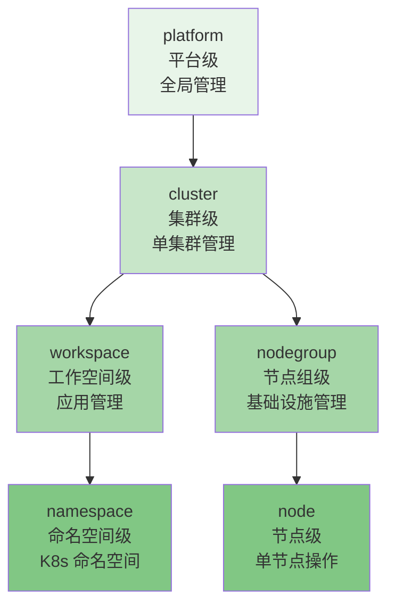
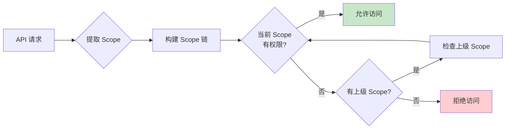
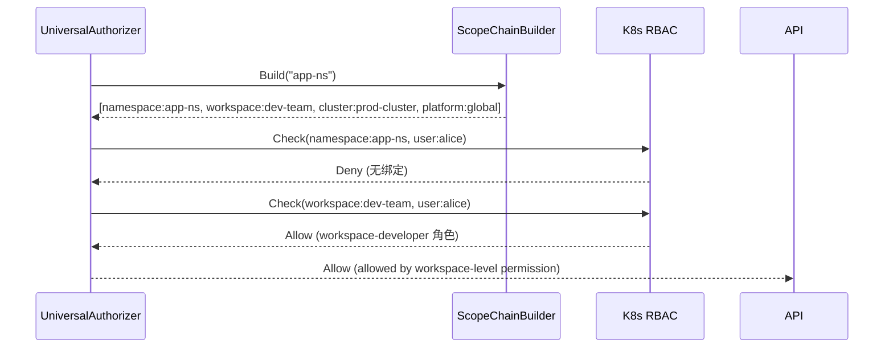

# Scope 感知授权

## 概述

Scope 感知授权是 Edge Platform 权限系统的核心特性,它通过 Scope 层级实现权限的级联检查和继承。本文详细介绍 Scope 感知授权的实现原理、算法细节和性能优化策略。

## Scope 层级结构

### 五级 Scope 体系

Edge Platform 定义了五级 Scope 层级,形成从抽象到具体的权限范围:



### Scope 层级详解

**1. platform (平台级)**

- **范围**: 整个 Edge Platform
- **用途**: 全局管理员权限
- **典型场景**:
  - 创建和管理所有集群
  - 配置全局系统设置
  - 管理所有用户和角色

**示例 IAMRoleBinding**:

```yaml
apiVersion: iam.theriseunion.io/v1alpha1
kind: IAMRoleBinding
metadata:
  name: admin-platform
  labels:
    iam.theriseunion.io/scope: platform
    iam.theriseunion.io/scope-value: global
spec:
  subjects:
    - kind: User
      name: admin
  roleRef:
    kind: IAMRole
    name: platform-admin
```

**2. cluster (集群级)**

- **范围**: 单个 Kubernetes 集群
- **用途**: 集群管理员权限
- **典型场景**:
  - 管理集群内的工作空间和节点组
  - 配置集群级别的策略
  - 查看集群资源使用情况

**示例 IAMRoleBinding**:

```yaml
apiVersion: iam.theriseunion.io/v1alpha1
kind: IAMRoleBinding
metadata:
  name: alice-cluster-admin
  labels:
    iam.theriseunion.io/scope: cluster
    iam.theriseunion.io/scope-value: prod-cluster
spec:
  subjects:
    - kind: User
      name: alice
  roleRef:
    kind: IAMRole
    name: cluster-admin
```

**3. workspace (工作空间级)**

- **范围**: 工作空间及其下的所有命名空间
- **用途**: 团队或项目级别的应用管理
- **典型场景**:
  - 管理工作空间下的应用
  - 分配和管理命名空间
  - 团队资源配额管理

**示例 IAMRoleBinding**:

```yaml
apiVersion: iam.theriseunion.io/v1alpha1
kind: IAMRoleBinding
metadata:
  name: bob-workspace-dev
  labels:
    iam.theriseunion.io/scope: workspace
    iam.theriseunion.io/scope-value: dev-team
spec:
  subjects:
    - kind: User
      name: bob
  roleRef:
    kind: IAMRole
    name: workspace-developer
```

**4. namespace (命名空间级)**

- **范围**: 单个 K8s 命名空间
- **用途**: 命名空间内的应用管理
- **典型场景**:
  - 部署和管理应用
  - 查看日志和监控
  - 管理配置和密钥

**示例 IAMRoleBinding**:

```yaml
apiVersion: iam.theriseunion.io/v1alpha1
kind: IAMRoleBinding
metadata:
  name: charlie-namespace-viewer
  labels:
    iam.theriseunion.io/scope: namespace
    iam.theriseunion.io/scope-value: app-namespace
spec:
  subjects:
    - kind: User
      name: charlie
  roleRef:
    kind: IAMRole
    name: namespace-viewer
```

**5. nodegroup (节点组级)**

- **范围**: 节点组及其下的所有节点
- **用途**: 基础设施管理
- **典型场景**:
  - 管理节点组配置
  - 批量操作节点
  - 节点健康检查

**示例 IAMRoleBinding**:

```yaml
apiVersion: iam.theriseunion.io/v1alpha1
kind: IAMRoleBinding
metadata:
  name: dave-nodegroup-operator
  labels:
    iam.theriseunion.io/scope: nodegroup
    iam.theriseunion.io/scope-value: edge-beijing
spec:
  subjects:
    - kind: User
      name: dave
  roleRef:
    kind: IAMRole
    name: nodegroup-operator
```

**6. node (节点级)**

- **范围**: 单个节点
- **用途**: 单节点操作权限
- **典型场景**:
  - 查看节点详情
  - 执行节点维护操作
  - 节点故障排查

## 级联权限检查算法

### 核心原理

Edge Platform 采用**向上级联**的权限检查策略:从当前 Scope 开始,逐级向上查找权限,直到找到允许权限或遍历完整个 Scope 链。



### Scope 链构建

**算法实现**:

```go
package authorizer

import (
    "context"
    metav1 "k8s.io/apimachinery/pkg/apis/meta/v1"
    "sigs.k8s.io/controller-runtime/pkg/client"
)

type ScopeChainBuilder struct {
    client client.Client
}

// Build 构建从当前 Scope 到 platform 的完整链
func (scb *ScopeChainBuilder) Build(ctx context.Context, attrs authorizer.Attributes) ([]Scope, error) {
    var scopeChain []Scope

    // 1. 从请求路径提取当前 Scope
    currentScope, err := scb.extractScope(attrs)
    if err != nil {
        return nil, err
    }

    // 2. 构建 Scope 链
    switch currentScope.Type {
    case "namespace":
        // namespace → workspace → cluster → platform
        scopeChain = append(scopeChain, currentScope)

        // 查询 namespace 所属的 workspace
        workspace, err := scb.getNamespaceWorkspace(ctx, currentScope.Value)
        if err == nil {
            scopeChain = append(scopeChain, Scope{Type: "workspace", Value: workspace})

            // 查询 workspace 所属的 cluster
            cluster, err := scb.getWorkspaceCluster(ctx, workspace)
            if err == nil {
                scopeChain = append(scopeChain, Scope{Type: "cluster", Value: cluster})
            }
        }

    case "node":
        // node → nodegroup → cluster → platform
        scopeChain = append(scopeChain, currentScope)

        // 查询 node 所属的 nodegroup
        nodegroup, err := scb.getNodeNodegroup(ctx, currentScope.Value)
        if err == nil {
            scopeChain = append(scopeChain, Scope{Type: "nodegroup", Value: nodegroup})

            // 查询 nodegroup 所属的 cluster
            cluster, err := scb.getNodegroupCluster(ctx, nodegroup)
            if err == nil {
                scopeChain = append(scopeChain, Scope{Type: "cluster", Value: cluster})
            }
        }

    case "workspace", "nodegroup":
        scopeChain = append(scopeChain, currentScope)

        // 查询所属的 cluster
        cluster, err := scb.getScopeCluster(ctx, currentScope)
        if err == nil {
            scopeChain = append(scopeChain, Scope{Type: "cluster", Value: cluster})
        }

    case "cluster":
        scopeChain = append(scopeChain, currentScope)

    case "platform":
        scopeChain = append(scopeChain, currentScope)
    }

    // 3. 最后添加 platform Scope
    if currentScope.Type != "platform" {
        scopeChain = append(scopeChain, Scope{Type: "platform", Value: "global"})
    }

    return scopeChain, nil
}

// 从 URL 路径提取 Scope
func (scb *ScopeChainBuilder) extractScope(attrs authorizer.Attributes) (Scope, error) {
    path := attrs.GetPath()

    // 示例: /api/v1/namespaces/app-ns/pods
    if strings.Contains(path, "/namespaces/") {
        parts := strings.Split(path, "/")
        for i, part := range parts {
            if part == "namespaces" && i+1 < len(parts) {
                return Scope{Type: "namespace", Value: parts[i+1]}, nil
            }
        }
    }

    // 示例: /oapis/tenant/v1/workspaces/dev-team/namespaces
    if strings.Contains(path, "/workspaces/") {
        parts := strings.Split(path, "/")
        for i, part := range parts {
            if part == "workspaces" && i+1 < len(parts) {
                return Scope{Type: "workspace", Value: parts[i+1]}, nil
            }
        }
    }

    // 默认为 platform Scope
    return Scope{Type: "platform", Value: "global"}, nil
}

// 查询 namespace 所属的 workspace
func (scb *ScopeChainBuilder) getNamespaceWorkspace(ctx context.Context, namespace string) (string, error) {
    var ns corev1.Namespace
    err := scb.client.Get(ctx, client.ObjectKey{Name: namespace}, &ns)
    if err != nil {
        return "", err
    }

    // 从标签中获取 workspace
    workspace, ok := ns.Labels["theriseunion.io/workspace"]
    if !ok {
        return "", fmt.Errorf("namespace %s has no workspace label", namespace)
    }

    return workspace, nil
}

// 类似方法用于查询其他 Scope 关系...
```

### 级联检查实现

```go
func (ua *UniversalAuthorizer) Authorize(ctx context.Context, attrs authorizer.Attributes) (authorizer.Decision, string, error) {
    // 1. 构建 Scope 链
    scopeChain, err := ua.scopeChainBuilder.Build(ctx, attrs)
    if err != nil {
        return authorizer.DecisionDeny, "failed to build scope chain", err
    }

    // 2. 按 Scope 链逐级检查
    for i, scope := range scopeChain {
        // 3. 查找该 Scope 的 IAMRoleBinding
        bindings, err := ua.findRoleBindings(ctx, attrs.GetUser(), scope)
        if err != nil {
            continue
        }

        // 4. 委托给 K8s RBAC 检查
        for _, binding := range bindings {
            decision, reason, err := ua.checkBinding(ctx, attrs, binding, scope)
            if err != nil {
                continue
            }

            if decision == authorizer.DecisionAllow {
                // 记录权限来源
                metrics.RecordPermissionCheck(
                    attrs.GetUser().GetName(),
                    scope.Type,
                    "allow",
                )

                return authorizer.DecisionAllow,
                    fmt.Sprintf("allowed by %s-level permission", scope.Type),
                    nil
            }
        }

        // 记录当前 Scope 检查失败
        metrics.RecordPermissionCheck(
            attrs.GetUser().GetName(),
            scope.Type,
            "deny",
        )
    }

    // 5. 所有 Scope 都检查失败
    return authorizer.DecisionDeny, "no permissions found in scope chain", nil
}

// 查找用户在指定 Scope 的角色绑定
func (ua *UniversalAuthorizer) findRoleBindings(ctx context.Context, user user.Info, scope Scope) ([]iamv1alpha1.IAMRoleBinding, error) {
    var bindingList iamv1alpha1.IAMRoleBindingList

    // 查询带 Scope 标签的 IAMRoleBinding
    err := ua.client.List(ctx, &bindingList, client.MatchingLabels{
        "iam.theriseunion.io/scope":       scope.Type,
        "iam.theriseunion.io/scope-value": scope.Value,
    })
    if err != nil {
        return nil, err
    }

    // 过滤出包含当前用户的绑定
    var result []iamv1alpha1.IAMRoleBinding
    for _, binding := range bindingList.Items {
        for _, subject := range binding.Spec.Subjects {
            if subject.Kind == "User" && subject.Name == user.GetName() {
                result = append(result, binding)
                break
            }
        }
    }

    return result, nil
}
```

## 实战场景

### 场景 1: 命名空间资源访问

**请求**: 用户 `alice` 访问 `GET /api/v1/namespaces/app-ns/pods`

**Scope 链构建**:

```
1. namespace: app-ns
2. workspace: dev-team (从 app-ns 的标签中获取)
3. cluster: prod-cluster (从 dev-team 的标签中获取)
4. platform: global
```

**权限检查过程**:



### 场景 2: 节点访问

**请求**: 用户 `bob` 访问 `GET /api/v1/nodes/edge-node-1`

**Scope 链构建**:

```
1. node: edge-node-1
2. nodegroup: edge-beijing (从 edge-node-1 的标签中获取)
3. cluster: prod-cluster (从 edge-beijing 的标签中获取)
4. platform: global
```

**权限检查过程**:

```
1. 检查 node:edge-node-1 → 无绑定
2. 检查 nodegroup:edge-beijing → 找到 bob 的 nodegroup-operator 角色
3. K8s RBAC 验证通过 → 允许访问
```

### 场景 3: 多集群访问

**请求**: 平台管理员 `admin` 访问 `GET /oapis/tenant/v1/clusters`

**Scope 链构建**:

```
1. platform: global
```

**权限检查过程**:

```
1. 检查 platform:global → 找到 admin 的 platform-admin 角色
2. K8s RBAC 验证通过 → 允许访问
```

## 缓存优化

### 三级缓存策略

```go
type PermissionCache struct {
    // L1: 内存缓存 (最快)
    memCache *lru.Cache

    // L2: Scope 链缓存
    scopeChainCache *sync.Map

    // L3: RoleBinding 缓存
    roleBindingCache *sync.Map
}

// 获取缓存的权限决策
func (pc *PermissionCache) Get(attrs authorizer.Attributes) (authorizer.Decision, bool) {
    key := pc.buildCacheKey(attrs)

    // L1: 检查内存缓存
    if value, found := pc.memCache.Get(key); found {
        metrics.IncCacheHit("mem")
        return value.(authorizer.Decision), true
    }

    metrics.IncCacheMiss("mem")
    return authorizer.DecisionNoOpinion, false
}

// 设置缓存
func (pc *PermissionCache) Set(attrs authorizer.Attributes, decision authorizer.Decision) {
    key := pc.buildCacheKey(attrs)

    // 设置 5 分钟 TTL
    pc.memCache.Add(key, decision, 5*time.Minute)
}

// 构建缓存键
func (pc *PermissionCache) buildCacheKey(attrs authorizer.Attributes) string {
    return fmt.Sprintf("%s:%s:%s:%s",
        attrs.GetUser().GetName(),
        attrs.GetVerb(),
        attrs.GetAPIGroup(),
        attrs.GetResource(),
    )
}
```

### 智能缓存失效

```go
// Controller 监听 IAMRoleBinding 变更
func (c *IAMRoleBindingController) Reconcile(ctx context.Context, req ctrl.Request) (ctrl.Result, error) {
    var binding iamv1alpha1.IAMRoleBinding
    if err := c.Get(ctx, req.NamespacedName, &binding); err != nil {
        return ctrl.Result{}, client.IgnoreNotFound(err)
    }

    // 精确失效: 只清理相关用户的缓存
    c.invalidateCache(&binding)

    return ctrl.Result{}, nil
}

func (c *IAMRoleBindingController) invalidateCache(binding *iamv1alpha1.IAMRoleBinding) {
    for _, subject := range binding.Spec.Subjects {
        if subject.Kind == "User" {
            // 清理该用户的所有缓存
            c.cache.InvalidateUser(subject.Name)
        }
    }

    // 通知其他 APIServer 实例失效缓存
    c.notifyClusterCache(binding)
}
```

### 性能指标

**典型场景下的性能表现**:

| 场景 | P50 延迟 | P95 延迟 | P99 延迟 |
|------|----------|----------|----------|
| 缓存命中 | < 1ms | < 2ms | < 5ms |
| 单级 Scope 检查 | 3-5ms | 8-10ms | 15-20ms |
| 三级 Scope 级联 | 8-12ms | 20-30ms | 40-50ms |

**缓存命中率**:
- 稳定状态: > 95%
- 权限变更后: 70-80% (逐步恢复)

## 监控和调试

### 关键监控指标

```yaml
# 权限检查统计
permission_checks_total{scope="namespace|workspace|cluster|platform", result="allow|deny"}

# Scope 链长度分布
permission_scope_chain_length{quantile="0.5|0.95|0.99"}

# 缓存性能
permission_cache_hit_ratio{level="L1|L2|L3"}
permission_cache_size_bytes
permission_cache_evictions_total

# 性能指标
permission_check_duration_seconds{scope="namespace|workspace|cluster|platform"}
```

### 调试工具

**1. Scope 链查看**

```bash
# 查看请求的 Scope 链
curl -H "Authorization: Bearer $TOKEN" \
  "$API_SERVER/debug/permission/scope-chain?path=/api/v1/namespaces/app-ns/pods"
```

**响应**:

```json
{
  "scopeChain": [
    {"type": "namespace", "value": "app-ns"},
    {"type": "workspace", "value": "dev-team"},
    {"type": "cluster", "value": "prod-cluster"},
    {"type": "platform", "value": "global"}
  ],
  "permissionFound": "workspace",
  "decision": "allow"
}
```

**2. 权限检查详情**

```bash
# 查看详细的权限检查过程
curl -H "Authorization: Bearer $TOKEN" \
  "$API_SERVER/debug/permission/check?verb=get&resource=pods&namespace=app-ns"
```

**响应**:

```json
{
  "scopeChain": [...],
  "checks": [
    {
      "scope": {"type": "namespace", "value": "app-ns"},
      "bindings": [],
      "decision": "deny",
      "reason": "no bindings found"
    },
    {
      "scope": {"type": "workspace", "value": "dev-team"},
      "bindings": ["alice-workspace-dev"],
      "decision": "allow",
      "reason": "allowed by workspace-developer role"
    }
  ],
  "finalDecision": "allow"
}
```

## 最佳实践

### 1. 合理设计 Scope 层级

**推荐**: 使用合适的 Scope 层级授权

```yaml
# 团队级别权限 → 使用 workspace
apiVersion: iam.theriseunion.io/v1alpha1
kind: IAMRoleBinding
metadata:
  labels:
    iam.theriseunion.io/scope: workspace
    iam.theriseunion.io/scope-value: dev-team
spec:
  subjects:
    - kind: User
      name: alice
  roleRef:
    kind: IAMRole
    name: workspace-developer
```

**不推荐**: 过度使用高层级权限

```yaml
# 仅需团队权限却授予集群权限
apiVersion: iam.theriseunion.io/v1alpha1
kind: IAMRoleBinding
metadata:
  labels:
    iam.theriseunion.io/scope: cluster  # 过宽
    iam.theriseunion.io/scope-value: prod-cluster
spec:
  subjects:
    - kind: User
      name: alice
  roleRef:
    kind: IAMRole
    name: cluster-admin  # 过宽
```

### 2. 利用权限继承

由于权限会向下继承,可以在上级 Scope 授予通用权限:

```yaml
# 在 workspace 级别授予部署查看权限
# 自动继承到所有命名空间
apiVersion: iam.theriseunion.io/v1alpha1
kind: IAMRoleBinding
metadata:
  labels:
    iam.theriseunion.io/scope: workspace
    iam.theriseunion.io/scope-value: dev-team
spec:
  subjects:
    - kind: User
      name: alice
  roleRef:
    kind: IAMRole
    name: deployment-viewer
```

### 3. 监控 Scope 链长度

过长的 Scope 链会影响性能:

```bash
# 查看 Scope 链长度分布
curl $API_SERVER/metrics | grep permission_scope_chain_length

# 优化建议: 大多数请求的 Scope 链应在 2-3 级
```

## 下一步阅读

- [角色绑定](./role-binding.md) - 了解 IAMRoleBinding 的详细设计
- [级联权限](./cascading.md) - 深入理解权限继承机制
- [API 扩展](./api-extension.md) - 学习非 K8s API 的权限控制
