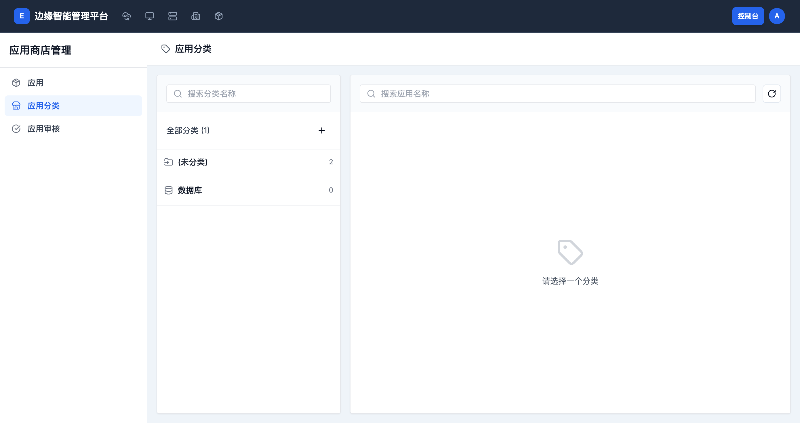

# 应用分类与应用模板

## 应用分类管理

> **导航路径**: 控制台 > 应用商店管理 > 应用分类
> **访问地址**: `/boss/apps-manage/categories`
> **所需权限**: 平台管理员

### 功能说明

应用分类用于在应用商店中组织和筛选应用。管理员可以创建、编辑和删除分类，并将应用归入对应分类。

### 页面概览

页面采用左右两栏布局：

- **左侧**：分类列表，显示分类名称和该分类下的应用数量
- **右侧**：选中分类下的应用列表

### 操作指南

#### 创建分类

**操作步骤**

1. 在控制台侧边栏中，展开 **应用商店管理**，点击 **应用分类**

2. 在左侧分类列表上方，点击 **创建** 按钮

3. 输入分类名称

4. 点击 **确认**

**操作结果**

新分类出现在左侧列表中，初始应用数量为 0。

#### 调整应用分类

**操作步骤**

1. 在左侧选择目标分类

2. 在右侧查看该分类下的应用

3. 通过应用管理页面修改应用所属分类

**操作结果**

应用在应用商店中按新分类进行展示。

---

## 应用模板管理

> **导航路径**: 集群 > 租户空间 > 选择租户空间 > 应用模板
> **所需权限**: 租户空间管理员

### 功能说明

应用模板是租户空间内的应用定义。租户空间管理员可以在此创建应用模板，上传版本，并提交到应用商店进行审核和上架。

### 页面概览

应用模板列表包含以下信息：

| 列 | 说明 |
|------|------|
| 应用信息 | 应用名称和图标 |
| 类型 | 应用模板类型 |
| 镜像来源 | 应用使用的镜像来源 |
| 作者 | 模板创建者 |
| 创建时间 | 模板创建时间 |

### 操作指南

#### 创建应用模板

**操作步骤**

1. 进入目标租户空间，在侧边栏点击 **应用模板**

2. 点击页面右上角的 **新建应用模板** 按钮

3. 填写应用基本信息：

   | 字段 | 是否必填 | 说明 |
   |------|----------|------|
   | 应用名称 | 是 | 应用的标识名称 |
   | 应用描述 | 否 | 应用的功能说明 |

4. 点击 **确认** 创建应用模板

**操作结果**

应用模板创建成功，可以继续上传版本。

#### 上传应用版本

**操作步骤**

1. 在应用模板列表中，点击目标模板名称

2. 在版本列表区域，点击 **上传版本**

3. 上传版本包，填写版本号和更新说明

4. 点击 **确认** 完成上传

**操作结果**

新版本出现在版本列表中。可以提交审核后发布到应用商店。

## 常见问题

### 问题：应用分类下没有应用
**现象**：新建分类后应用数量为 0
**原因**：新分类尚未关联任何应用
**解决**：在应用管理中将应用的分类设置为新建的分类

### 问题：无法创建应用模板
**现象**：点击新建按钮无反应或报错
**原因**：当前用户可能没有该租户空间的管理权限
**解决**：联系管理员确认您拥有该租户空间的应用管理权限
