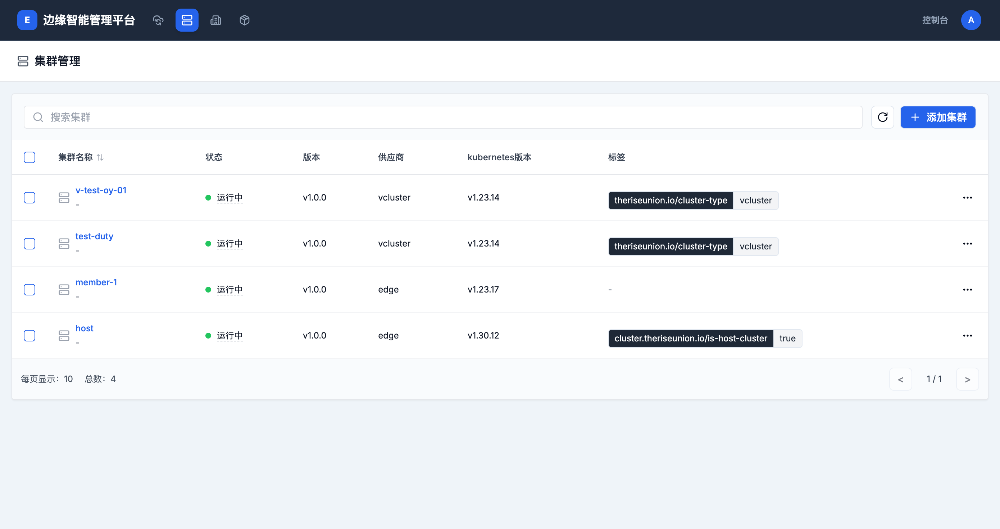

# 应用部署管理

## 概述

应用部署是EdgePlatform应用管理的核心功能，支持从应用商店部署应用到具体的工作空间和项目中。平台支持两种应用类型的部署：原生应用和Helm应用。

## 部署准备

### 前置条件

在部署应用之前，确保满足以下条件：

1. **权限要求**
   - 对目标工作空间具有成员权限
   - 对目标项目具有部署权限
   - 足够的资源配额（CPU、内存、存储）

2. **环境要求**
   - 目标集群正常运行
   - 工作空间和项目已创建
   - 网络连接正常

3. **应用要求**
   - 应用已在应用商店上架
   - 应用版本状态正常
   - 了解应用的基本配置要求

## 部署流程

### 从应用商店部署

#### 1. 选择应用

1. **进入应用商店**
   - 登录EdgePlatform控制台
   - 点击顶部导航栏的"应用商店"
   - 浏览或搜索目标应用

2. **查看应用详情**
   - 点击应用卡片进入详情页
   - 查看应用介绍、功能特性
   - 确认应用版本和更新日志



#### 2. 配置部署参数

1. **打开部署面板**
   - 在应用详情页点击"部署"按钮
   - 打开应用配置和部署面板

2. **选择应用版本**
   - 默认选中最新版本
   - 可从版本列表中选择其他版本
   - 查看版本的更新日志

3. **选择部署环境**
   - **选择工作空间**: 从下拉列表选择目标工作空间
   - **选择项目**: 选择目标项目（namespace）
   - 系统会自动验证权限和资源配额

#### 3. 配置应用参数

配置界面根据应用类型有所不同：

##### 原生应用配置

原生应用需要配置以下参数：

**基本信息**
- **应用名称**: 部署后的应用实例名称
- **显示名称**: 应用的显示名称（可选）

**工作负载配置**
- **工作负载类型**: Deployment、StatefulSet、DaemonSet等
- **副本数量**: 初始副本数（可后续调整）
- **容器配置**: 容器镜像、端口、环境变量等

**资源配置**
- **CPU请求**: 最小CPU需求（如：500m）
- **CPU限制**: 最大CPU限制（如：2000m）
- **内存请求**: 最小内存需求（如：512Mi）
- **内存限制**: 最大内存限制（如：2Gi）

**存储配置**
- **持久卷声明**: 如需持久化存储，配置PVC
- **存储卷类型**: 选择存储类型（如：块存储、文件���储）
- **存储容量**: 设置存储大小（如：10Gi）

**环境变量**
- **普通环境变量**: 键值对形式的环境变量
- **保密字典引用**: 从保密字典中引用敏感信息
- **配置字典引用**: 从配置字典中引用配置信息

##### Helm应用配置

Helm应用的配置相对简单：

**基本信息**
- **发布名称**: Helm发布的名称
- **命名空间**: 目标命名空间（项目）

**Chart配置**
- **Chart URL**: Helm Chart的下载地址（自动填充）
- **版本**: Chart版本号（自动选择）

**Values配置**
- **Values YAML**: 配置Helm Values参数
- 支持YAML格式的配置项
- 可以覆盖Chart的默认值

#### 4. 确认并部署

1. **预览配置**
   - 确认所有配置项正确
   - 检查资源配额是否充足
   - 验证权限设置

2. **执行部署**
   - 点击"部署"按钮
   - 等待部署完成
   - 系统会显示部署进度

3. **部署结果**
   - **成功**: 自动跳转到应用实例页面
   - **失败**: 查看错误信息并修正配置

## 部署验证

### 检查部署状态

部署完成后，需要验证应用是否正常运行：

#### 1. 查看应用实例

1. **进入项目**
   - 导航到目标工作空间
   - 进入目标项目
   - 在左侧菜单选择"应用"

2. **查看实例状态**
   - 应用列表显示所有部署的应用实例
   - 状态指示器：运行中、待定、失败等
   - 查看副本数量和就绪状态


#### 2. 检查工作负载

1. **查看部署状态**
   - 在项目中选择"部署"
   - 查看Deployment的详细信息
   - 确认副本数量和就绪状态

2. **查看容器组**
   - 在项目中选择"容器组"
   - 查看Pod的运行状态
   - 检查Pod的事件和日志

#### 3. 验证服务访问

1. **检查服务**
   - 在项目中选择"服务"
   - 确认服务已创建
   - 查看服务端口和类型

2. **测试访问**
   - 根据服务类型进行访问测试
   - ClusterIP: 集群内部访问
   - NodePort: 节点端口访问
   - LoadBalancer: 外部负载均衡访问

## 常见部署场景

### 场景1: 部署Web应用

**需求**: 部署一个Nginx Web服务

**步骤**:
1. 从应用商店选择Nginx应用
2. 选择目标工作空间和项目
3. 配置副本数量为3
4. 设置资源限制：CPU 500m-1000m，内存 512Mi-1Gi
5. 配置NodePort服务，对外暴露80端口
6. 执行部署

### 场景2: 部署数据库应用

**需求**: 部署MySQL数据库

**步骤**:
1. 从应用商店选择MySQL应用
2. 选择StatefulSet类型（有状态应用）
3. 配置持久卷声明，数��存储大小20Gi
4. 设置root密码（通过保密字典）
5. 配置环境变量：数据库名称、字符集等
6. 执行部署

### 场景3: 部署微服务应用

**需求**: 部署基于Helm的微服务应用栈

**步骤**:
1. 从应用商店选择微服务应用
2. 选择目标工作空间和项目
3. 配置Helm Values参数
4. 设置服务间通信配置
5. 配置外部访问入口
6. 执行部署

## 部署故障排查

### 常见问题

#### 1. 镜像拉取失败

**症状**: Pod状态为ImagePullBackOff或ErrImagePull

**原因**:
- 镜像地址错误
- 镜像仓库认证失败
- 网络连接问题

**解决方案**:
1. 检查镜像地址是否正确
2. 配置镜像拉取密钥（imagePullSecret）
3. 检查网络连接和防火墙设置

#### 2. 资源不足

**症状**: Pod状态为Pending，事件显示资源不足

**原因**:
- 集群资源不足
- 项目资源配额不足
- 请求资源超过节点能力

**解决方案**:
1. 检查集群资源使用情况
2. 调整项目资源配额
3. 降低应用的资源请求

#### 3. 存储挂载失败

**症状**: Pod状态为Pending，存储卷挂载失败

**原因**:
- 存储类不存在
- 存储容量不足
- PVC配置错误

**解决方案**:
1. 检查存储类是否可用
2. 调整存储容量大小
3. 确认PVC配置正确

#### 4. 健康检查失败

**症状**: Pod反复重启

**原因**:
- 应用启动时间过长
- 健康检查配置不当
- 应用服务异常

**解决方案**:
1. 调整健康检查的初始延迟时间
2. 修改健康检查的探测频率和阈值
3. 检查应用日志，排查服务异常

### 调试技巧

#### 1. 查看Pod详细信息

```bash
# 通过kubectl查看Pod详情
kubectl describe pod <pod-name> -n <namespace>

# 查看Pod日志
kubectl logs <pod-name> -n <namespace>

# 查看容器日志（多容器Pod）
kubectl logs <pod-name> -c <container-name> -n <namespace>
```

#### 2. 查看事件

```bash
# 查看命名空间的事件
kubectl get events -n <namespace> --sort-by='.lastTimestamp'

# 查看特定资源的事件
kubectl describe <resource-type> <resource-name> -n <namespace>
```

#### 3. 进入容器调试

```bash
# 进入Pod容器
kubectl exec -it <pod-name> -n <namespace> -- /bin/sh

# 查看容器进程
kubectl exec -it <pod-name> -n <namespace> -- ps aux

# 测试网络连接
kubectl exec -it <pod-name> -n <namespace> -- curl http://service-name
```

## 部署最佳实践

### 1. 资源配置

- **合理设置资源请求和限制**
  - 请求值应保证应用基本运行
  - 限制值应防止应用占用过多资源
  - 遵循"请求 ≤ 限制"的原则

- **预留资源缓冲**
  - 不要将节点的所有资源都分配
  - 为系统进程预留资源
  - 考虑突发流量情况

### 2. 高可用配置

- **多副本部署**
  - 生产环境至少部署3个副本
  - 使用反亲和性规则分散副本
  - 避免单点故障

- **健康检查配置**
  - 配置合适的存活探针（livenessProbe）
  - 配置就绪探针（readinessProbe）
  - 设置适当的检查间隔和超时时间

### 3. 安全配置

- **使用保密字典存储敏感信息**
  - 不要在环境变量中明文存储密码
  - 使用保密字典管理敏感配置
  - 定期轮换密钥和证书

- **限制容器权限**
  - 避免使用特权容器
  - 使用readOnlyRootFilesystem
  - 配置资源限制防止DoS攻击

### 4. 监控和日志

- **配置日志收集**
  - 应用日志输出到标准输出/错误
  - 避免日志文件写入容器文件系统
  - 使用日志采集工具收集日志

- **设置监控指标**
  - 配置应用性能监控
  - 设置资源使用告警
  - 监控应用业务指标

## 升级和回滚

### 应用升级

当应用有新版本发布时：

1. **查看新版本**
   - 在应用商店查看应用的新版本
   - 阅读版本更新日志
   - 评估升级影响

2. **备份数据**
   - 备份应用数据
   - 备份配置信息
   - 记录当前版本信息

3. **执行升级**
   - 在应用实例页面选择"升级"
   - 选择新版本
   - 更新应用配置（如需要）
   - 执行升级操作

4. **验证升级结果**
   - 检查应用运行状态
   - 验证业务功能正常
   - 查看监控指标

### 应用回滚

如果升级出现问题：

1. **快速回滚**
   - 在应用实例页面选择"回滚"
   - 选择之前的稳定版本
   - 执行回滚操作

2. **恢复数据**
   - 从备份恢复应用数据
   - 恢复配置信息
   - 验证数据完整性

## 相关文档

- [应用实例管理](./application-instance-management.md)
- [应用商店使用指南](./application-store-guide.md)
- [应用管理概述](./application-management-overview.md)