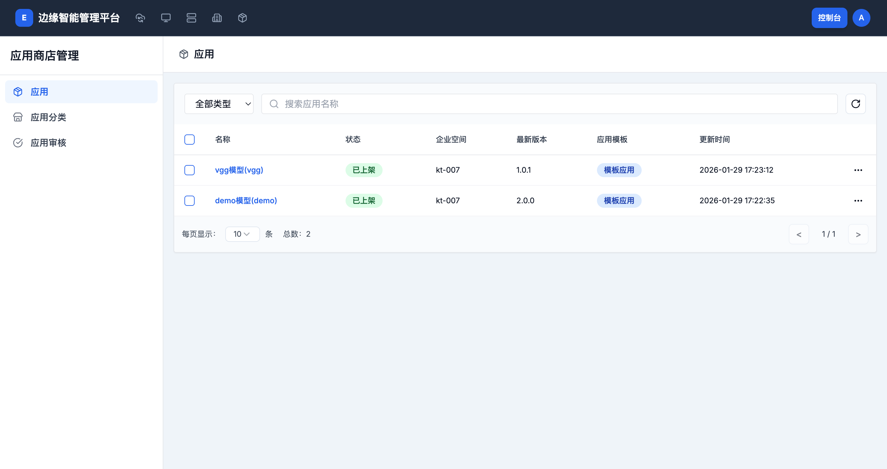

# 应用管理

> **导航路径**: 控制台 > 应用商店管理 > 应用
> **访问地址**: `/boss/apps-manage/apps`
> **所需权限**: 平台管理员

## 功能说明

应用管理页面供平台管理员管理所有应用。您可以查看应用列表、创建新应用、管理应用版本，以及控制应用的上架状态。

## 页面概览

应用管理列表包含以下信息：

| 列 | 说明 |
|------|------|
| 名称 | 应用名称和图标 |
| 状态 | 已上架、审核中、已下架等 |
| 租户空间 | 应用所属的租户空间 |
| 最新版本 | 当前最新版本号 |
| 应用模板 | 关联的应用模板名称 |
| 更新时间 | 最后更新时间 |

## 操作指南

### 操作一：查看应用列表

**操作步骤**

1. 在控制台侧边栏中，展开 **应用商店管理**，点击 **应用**

2. 查看应用列表中的所有应用

3. 使用搜索框按名称查找应用

**操作结果**

查看到平台中所有已创建的应用及其状态。

### 操作二：查看应用详情

**操作步骤**

1. 在应用列表中，点击目标应用的名称

2. 进入应用详情页，查看应用基本信息和版本列表

3. 在版本列表中查看各版本的状态和提交时间

**操作结果**

了解应用的详细信息和所有版本记录。

### 操作三：管理应用上架状态

**操作步骤**

1. 在应用列表中，找到目标应用

2. 点击操作列的下拉菜单

3. 选择 **上架** 或 **下架** 操作

4. 确认操作

**操作结果**

应用状态更新。上架后应用将在应用商店中对所有用户可见；下架后应用从应用商店中隐藏。

## 常见问题

### 问题：应用列表中看不到某个应用
**现象**：确认已创建的应用没有出现在管理列表中
**原因**：应用可能属于其他租户空间，或搜索条件过滤了该应用
**解决**：清空搜索条件，确认应用所属的租户空间

### 问题：无法上架应用
**现象**：点击上架按钮后操作失败
**原因**：应用没有通过审核的版本，至少需要一个已审核通过的版本才能上架
**解决**：先提交应用版本并通过审核，再执行上架操作
