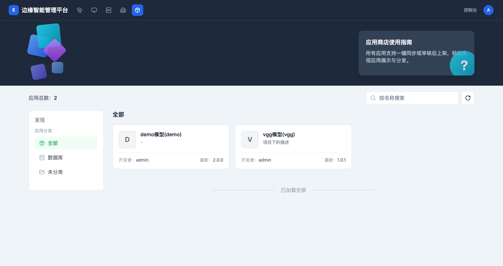
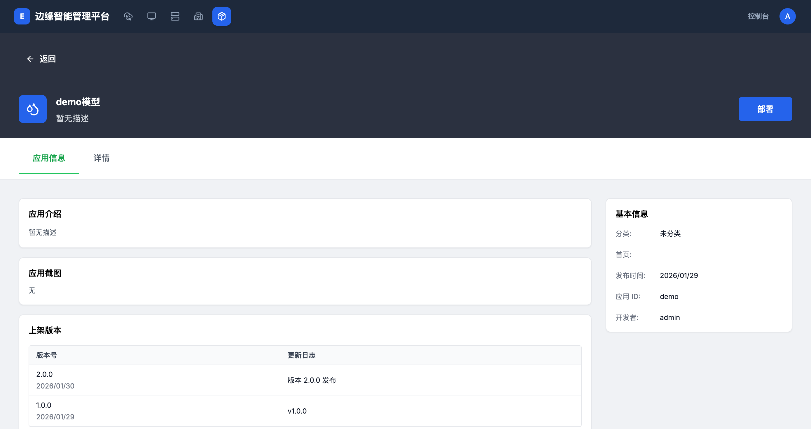

# 应用商店

> **导航路径**: 顶部导航栏 > 应用商店
> **访问地址**: `/marketplace`
> **所需权限**: 所有平台用户

## 功能说明

应用商店展示所有已上架的应用。您可以按分类浏览、按名称搜索应用，查看应用详情和版本信息。

## 页面概览

应用商店页面包含以下区域：

- **应用总数**：显示当前已上架的应用数量
- **搜索框**：按应用名称搜索
- **分类导航**（左侧）：按分类筛选应用，包括「全部」和各业务分类
- **应用列表**（右侧）：以卡片形式展示应用

每张应用卡片显示：

| 信息 | 说明 |
|------|------|
| 应用名称 | 显示名称和标识名 |
| 描述 | 应用的简要说明 |
| 开发者 | 发布该应用的用户 |
| 最新版本 | 当前最新的版本号 |

## 操作指南

### 操作一：浏览应用列表

**操作步骤**

1. 在顶部导航栏中，点击 **应用商店**

2. 默认显示「全部」分类下的所有应用

3. 点击左侧分类名称，筛选指定分类的应用

4. 在搜索框中输入名称，按名称搜索应用

**操作结果**

查看到应用商店中已上架的所有应用。

### 操作二：查看应用详情

**操作步骤**

1. 在应用列表中，点击目标应用的名称

2. 进入应用详情页面，查看以下信息：

   

   **应用信息标签页**
   - 应用介绍：应用的功能描述
   - 应用截图：应用的界面截图
   - 上架版本：所有已发布版本的列表，包含版本号、发布日期和更新日志

   **基本信息（右侧边栏）**

   | 字段 | 说明 |
   |------|------|
   | 分类 | 应用所属的分类 |
   | 首页 | 应用的主页链接 |
   | 发布时间 | 应用首次发布的日期 |
   | 应用 ID | 应用的唯一标识 |
   | 开发者 | 发布该应用的用户 |

3. 点击 **详情** 标签页，查看更多技术说明

**操作结果**

了解应用的功能介绍、版本历史和基本信息。

## 常见问题

### 问题：应用商店没有任何应用
**现象**：应用列表为空，显示应用总数为 0
**原因**：尚未有应用上架到应用商店
**解决**：联系平台管理员在租户空间中创建并发布应用模板

### 问题：搜索不到已知的应用
**现象**：输入应用名称后没有搜索结果
**原因**：应用可能尚未上架，或名称拼写不正确
**解决**：检查拼写；联系管理员确认应用是否已通过审核并上架
