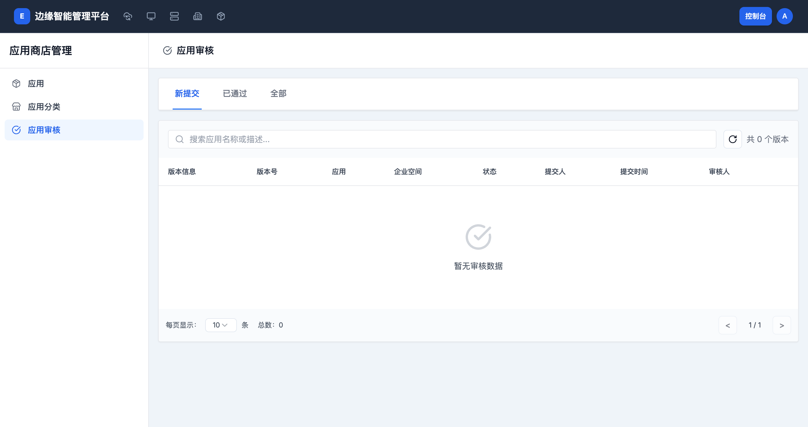

# 版本审核

> **导航路径**: 控制台 > 应用商店管理 > 应用审核
> **访问地址**: `/boss/apps-manage/reviews`
> **所需权限**: 平台管理员

## 功能说明

版本审核页面用于管理应用版本的审核流程。当租户空间用户提交应用版本后，平台管理员在此审核版本内容，决定通过或驳回。审核通过的版本可以发布到应用商店供用户部署。

## 页面概览

审核页面顶部有三个标签页用于筛选：

| 标签页 | 说明 |
|------|------|
| 新提交 | 等待审核的版本 |
| 已通过 | 审核已通过的版本 |
| 全部 | 所有提交记录 |

每条审核记录包含以下信息：

| 列 | 说明 |
|------|------|
| 版本信息 | 应用名称和版本描述 |
| 版本号 | 提交的版本号 |
| 应用 | 所属应用名称 |
| 租户空间 | 提交者所在的租户空间 |
| 状态 | 待审核、已通过、已驳回 |
| 提交人 | 提交版本的用户 |
| 提交时间 | 版本提交的时间 |
| 审核人 | 执行审核操作的管理员 |

## 操作指南

### 操作一：查看待审核版本

**操作步骤**

1. 在控制台侧边栏中，展开 **应用商店管理**，点击 **应用审核**

2. 点击 **新提交** 标签页，查看所有等待审核的版本

3. 点击版本名称查看版本详情

**操作结果**

查看到所有待审核的版本提交。

### 操作二：审核通过版本

**操作步骤**

1. 在待审核列表中，点击目标版本

2. 查看版本详情，确认版本内容符合要求

3. 点击 **通过** 按钮

4. 确认审核操作

**操作结果**

版本状态变为「已通过」。通过的版本将出现在应用商店的版本列表中，用户可以选择该版本进行部署。

### 操作三：驳回版本

**操作步骤**

1. 在待审核列表中，点击目标版本

2. 查看版本详情，确认不符合要求的内容

3. 点击 **驳回** 按钮

4. 填写驳回原因

5. 确认操作

**操作结果**

版本状态变为「已驳回」。提交者可以查看驳回原因，修改后重新提交。

## 常见问题

### 问题：新提交标签页没有内容
**现象**：新提交页面为空
**原因**：当前没有用户提交新版本，或所有版本已审核完毕
**解决**：这是正常状态，等待用户提交新版本即可

### 问题：审核通过后应用商店看不到新版本
**现象**：版本审核通过，但应用商店中没有显示
**原因**：应用本身可能尚未上架到应用商店
**解决**：在应用管理页面确认该应用的状态为「已上架」
