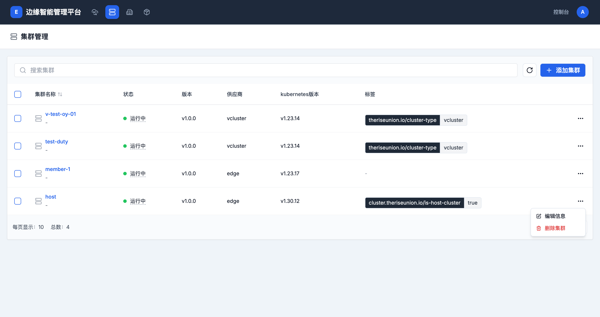
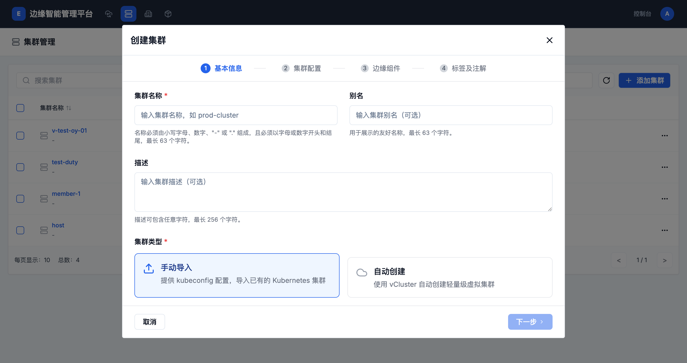
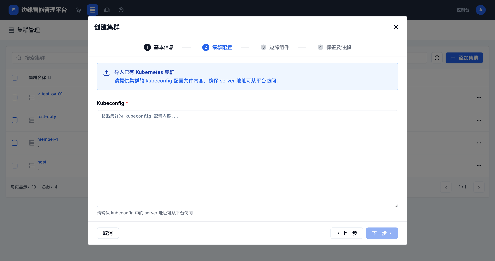
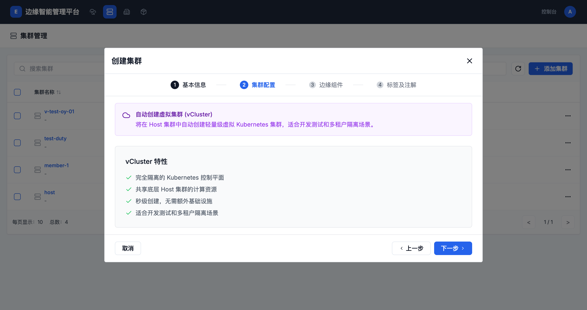
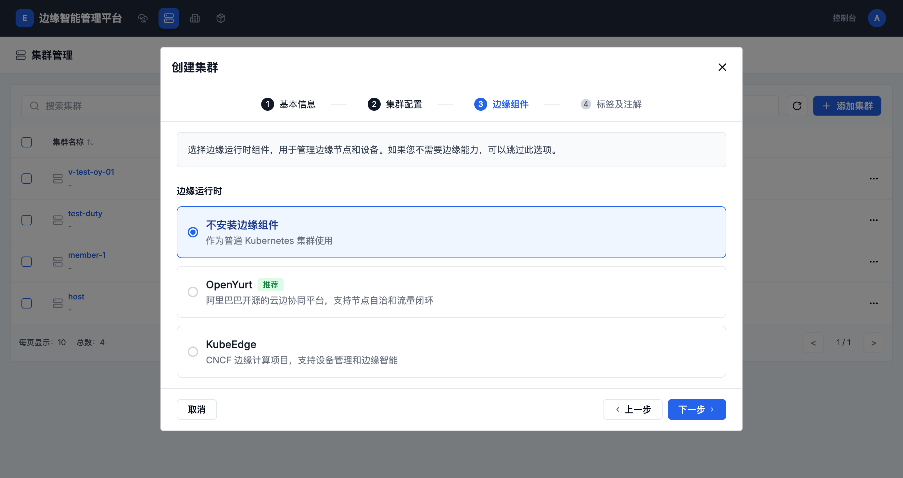
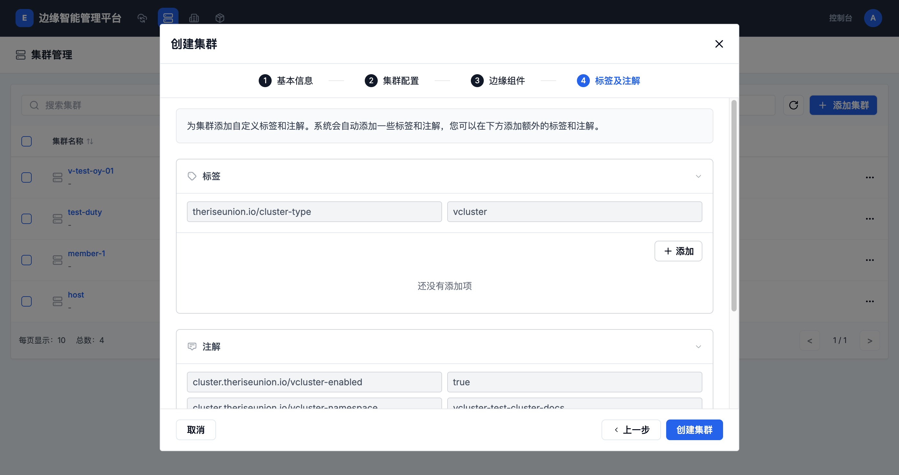

# 集群管理

集群管理模块允许用户创建、管理和监控多个Kubernetes集群，支持边缘集群和虚拟集群的部署。

## 集群列表

### 查看集群列表

集群列表页面显示所有已连接的集群信息，包括：

- **集群名称**：集群的唯一标识符
- **状态**：集群当前运行状态（运行中、异常等）
- **版本**：平台版本号
- **供应商**：集群类型（edge、vcluster等）
- **Kubernetes版本**：集群的K8s版本
- **标签**：集群的标识标签

### 集群操作

每个集群都有操作菜单，提供以下功能：

- **编辑信息**：修改集群的基本信息
- **删除集群**：删除集群及其相关配置

## 创建集群

### 创建方式选择

平台支持两种集群创建方式：

1. **手动导入**：导入已有的Kubernetes集群
2. **自动创建**：使用vCluster自动创建轻量级虚拟集群

### 基本信息配置

填写以下基本信息：

- **集群名称**：必填，必须由小写字母、数字、"-" 或 "." 组成，且必须以字母或数字开头和结尾，最长63个字符
- **别名**：可选，用于展示的友好名称，最长63个字符
- **描述**：可选，描述可包含任意字符，最长256个字符
- **集群类型**：选择手动导入或自动创建

### 手动导入集群

选择"手动导入"方式，需要提供kubeconfig配置文件：

- **Kubeconfig**：必填，粘贴集群的kubeconfig配置内容
- **要求**：确保kubeconfig中的server地址可从平台访问

### 自动创建虚拟集群

选择"自动创建"方式，使用vCluster创建轻量级虚拟集群：

#### vCluster特性

- 完全隔离的Kubernetes控制平面
- 共享底层Host集群的计算资源
- 秒级创建，无需额外基础设施
- 适合开发测试和多租户隔离场景

### 边缘组件选择

在创建集群时，可以选择安装边缘运行时组件：

- **不安装边缘组件**：作为普通Kubernetes集群使用
- **OpenYurt（推荐）**：阿里巴巴开源的云边协同平台，支持节点自治和流量闭环
- **KubeEdge**：CNCF边缘计算项目，支持设备管理和边缘智能

### 标签和注解配置

最后一步是为集群添加自定义标签和注解：

- **标签**：用于集群分类和选择
- **注解**：存储集群的元数据信息

系统会自动添加一些标签和注解，用户也可以添加额外的标签和注解。

## 集群管理功能

### 搜索和筛选

- 使用搜索框快速查找集群
- 通过集群名称进行精确或模糊搜索

### 分页显示

- 默认每页显示10个集群
- 支持分页浏览大量集群

### 集群状态监控

- 实时显示集群运行状态
- 快速识别异常集群

## 集群详情视图

### 概览页面

点击集群名称可以进入集群详情页面，查看集群的整体状态和资源使用情况。

#### 资源统计

- **节点数量**：显示集群中的总节点数和边缘节点数
- **算力资源**：集群中的算力资源数量
- **容器组**：当前运行的Pod总数
- **服务**：集群中创建的Service数量
- **部署**：Deployment资源数量
- **有状态副本集**：StatefulSet资源数量
- **守护进程集**：DaemonSet资源数量
- **项目**：集群中的项目（Namespace）数量

#### 实时资源用量

显示集群的实时资源使用情况：

- **CPU cores**：CPU使用量（已用/总量）
- **内存 GiB**：内存使用量（已用/总量）
- **磁盘 GB**：磁盘使用量（已用/总量）
- **GPU cores**：GPU使用量（已用/总量）

#### 集群配额统计

展示集群的资���配额分配情况：

- **CPU配额**：显示预留、上限和总量，以及当前分配百分比
- **内存配额**：显示预留、上限和总量，以及当前分配百分比

支持切换查看"预留"和"上限"两种配额模式。

#### 基本信息卡片

显示集群的基本配置信息：

- **提供商**：集群类型（vcluster/edge）
- **集群状态**：当前健康状态
- **Kubernetes版本**：K8s版本号
- **EdgePlatform版本**：平台版本号

#### 告警列表

显示当前集群的活动告警信息，支持重试获取失败的操作。

#### 资源用量排行

显示集群中资源使用量最高的项目排行：

- 支持按不同资源类型排序（容器组、服务、部署等）
- 支持按CPU用量、内存用量等不同维度排序

## 最佳实践

1. **集群命名规范**：使用有意义的名称，如 `prod-edge-cluster-01`
2. **标签管理**：为集群添加适当的标签，便于管理和筛选
3. **描述信息**：提供清晰的集群描述，包括用途、环境等信息
4. **边缘组件选择**：根据实际需求选择合适的边缘运行时
5. **访问控制**：确保kubeconfig的server地址可从平台访问

## 故障排除

### 常见问题

1. **集群连接失败**
   - 检查kubeconfig配置是否正确
   - 确认网络连接和防火墙设置
   - 验证server地址可访问性

2. **虚拟集群创建失败**
   - 检查Host集群资源是否充足
   - 确认有足够的权限创建命名空间和资源

3. **边缘组件安装失败**
   - 检查集群版本兼容性
   - 确认集群资源满足组件要求