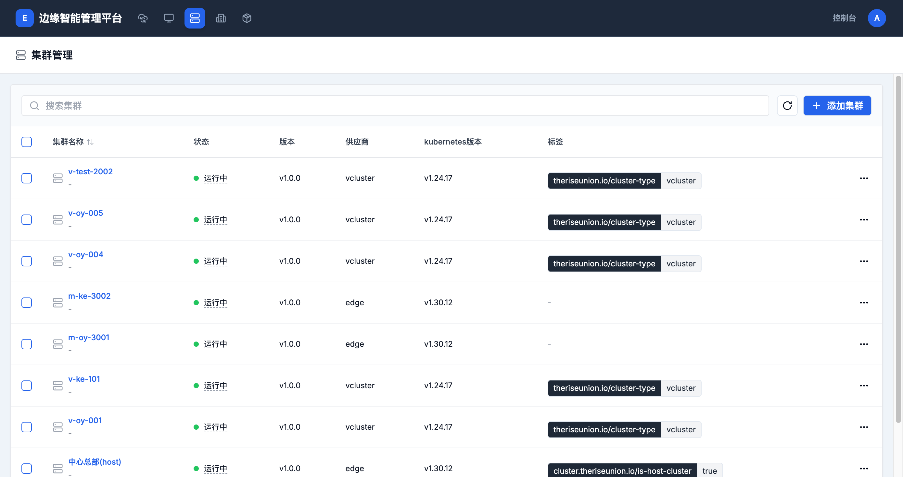
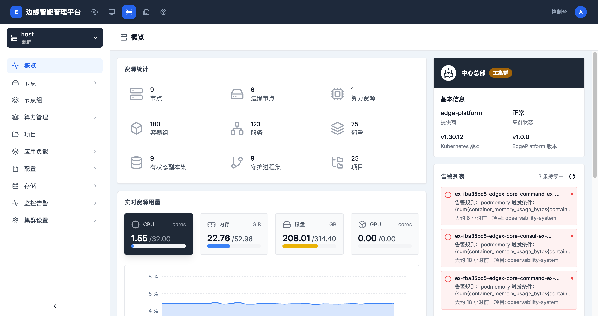

# 集群管理

> **导航路径**: 顶部导航栏 > 集群
> **访问地址**: `/boss/clusters`
> **所需权限**: 平台管理员或集群管理员

## 功能说明

集群管理页面展示平台中所有已注册的集群。您可以查看每个集群的运行状态、版本信息，创建新集群，以及进入集群详情查看资源概览。

## 页面概览

### 集群列表

集群列表显示以下信息：

| 列 | 说明 |
|------|------|
| 集群名称 | 集群的名称和别名 |
| 状态 | 运行状态（正常、异常等） |
| 版本 | 平台版本号 |
| 供应商 | 集群类型（edge-platform、vcluster 等） |
| 标签 | 集群的标识标签 |

### 集群概览

点击集群名称进入概览页面，包含以下区域：

**资源统计**

| 指标 | 说明 |
|------|------|
| 节点 | 集群中的总节点数 |
| 边缘节点 | 边缘节点数量 |
| 算力资源 | GPU 等算力资源数量 |
| 容器组 | 当前运行的容器组总数 |
| 服务 | 服务数量 |
| 部署 | 部署数量 |
| 有状态副本集 | 有状态副本集数量 |
| 守护进程集 | 守护进程集数量 |
| 项目 | 项目数量 |

**实时资源用量**

以仪表盘形式展示 CPU、内存、磁盘和 GPU 的使用量与总量，下方为用量趋势折线图。

**集群配额统计**

展示 CPU 和内存的配额分配情况，支持切换「预留」和「上限」两种视图。

**基本信息**

显示集群提供商、状态、Kubernetes 版本和平台版本。

**告警列表**

显示当前活跃告警，包含告警名称、规则、所属项目和触发时间。

**资源用量排行**

按 CPU 或内存用量对容器组、项目等进行排名。

## 操作指南

### 操作一：查看集群列表

**操作步骤**

1. 在顶部导航栏中，点击 **集群**

2. 查看所有已注册的集群及其运行状态

3. 使用搜索框按名称查找集群

**操作结果**

查看到平台中所有集群的概要信息。

### 操作二：查看集群概览

**操作步骤**

1. 在集群列表中，点击目标集群的名称

2. 进入集群概览页面

3. 查看资源统计、实时用量、配额分配和告警信息

**操作结果**

了解集群的整体资源使用情况和健康状态。

### 操作三：创建集群

**操作步骤**

1. 在集群列表页面，点击 **创建集群** 按钮

2. 填写基本信息：

   | 字段 | 是否必填 | 说明 |
   |------|----------|------|
   | 集群名称 | 是 | 小写字母、数字和连字符，最长 63 个字符 |
   | 别名 | 否 | 用于展示的友好名称 |
   | 描述 | 否 | 集群的用途说明 |
   | 集群类型 | 是 | 手动导入已有集群或自动创建虚拟集群 |

3. 根据集群类型完成后续配置

4. 点击 **确认** 创建集群

**操作结果**

集群创建成功后出现在集群列表中。

## 常见问题

### 问题：集群状态显示异常
**现象**：集群列表中某个集群状态不是「正常」
**原因**：集群网络不通或集群组件运行异常
**解决**：检查集群网络连接，确认集群 API 地址可达

### 问题：集群概览数据为空
**现象**：进入集群概览页面，资源统计和用量显示为 0
**原因**：集群刚创建或监控组件未就绪
**解决**：等待集群组件初始化完成后刷新页面
