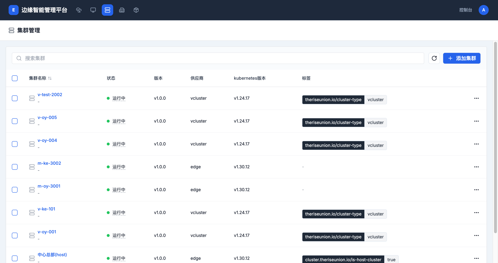
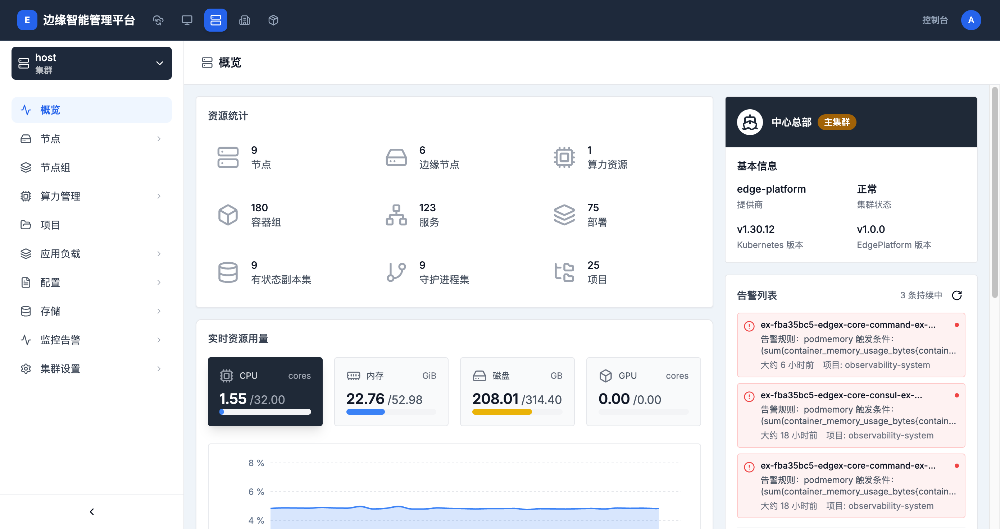
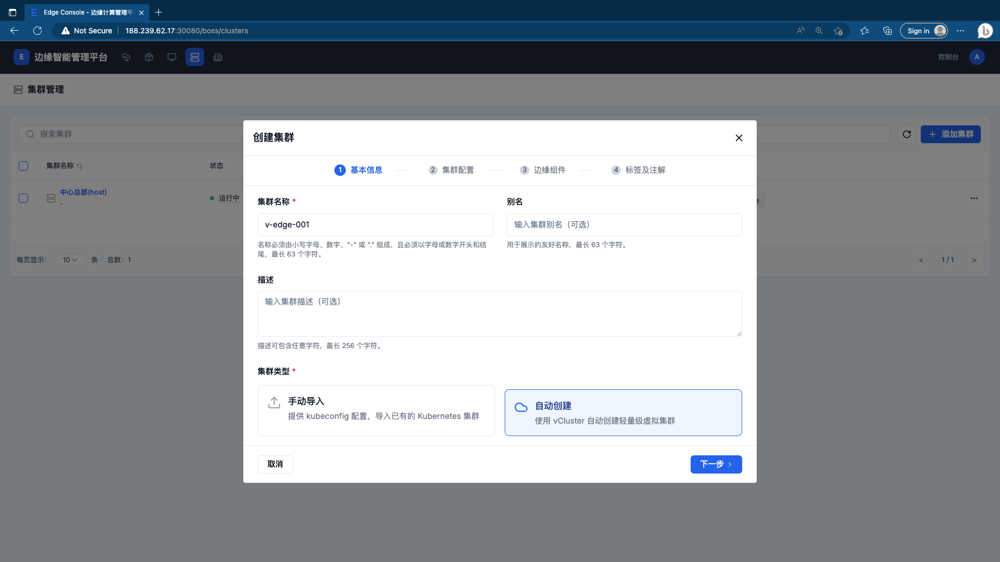
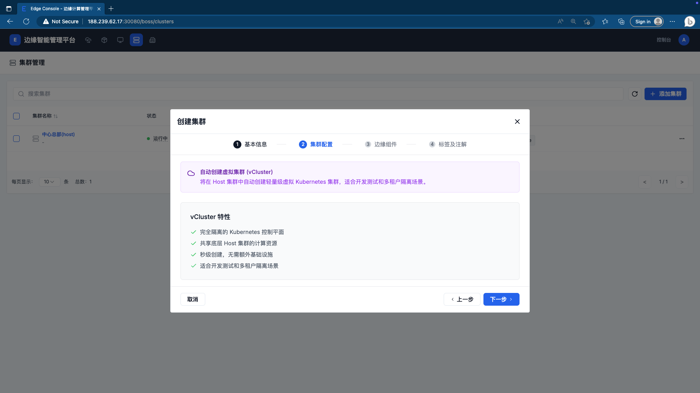
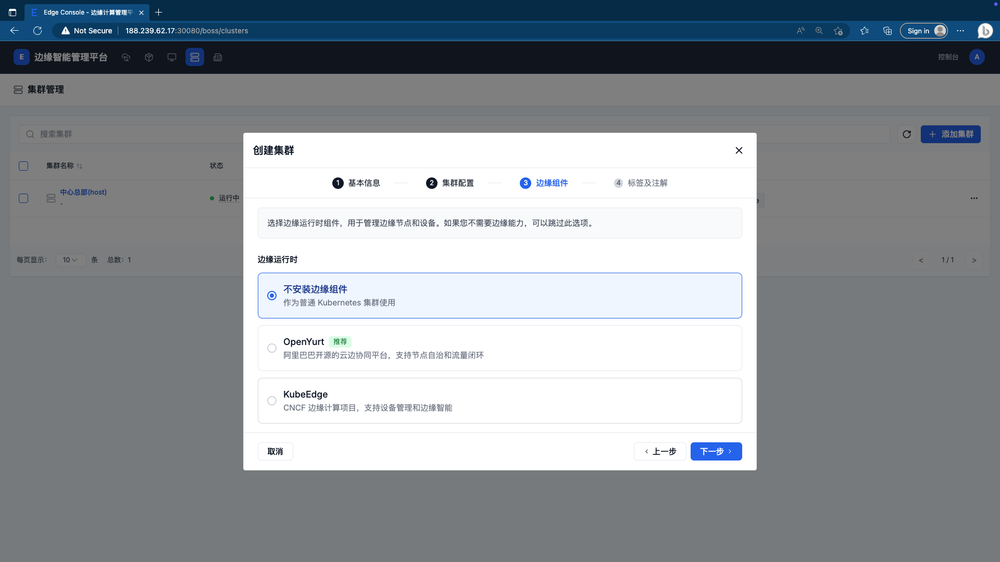
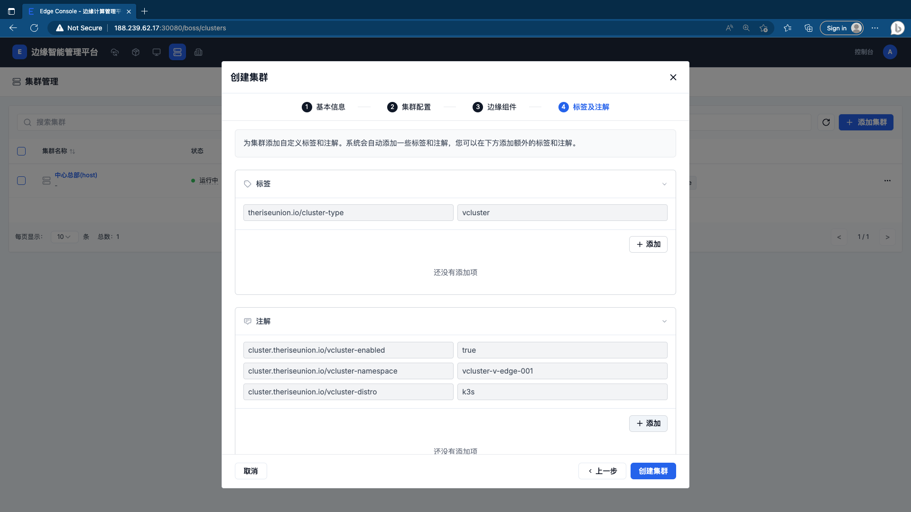
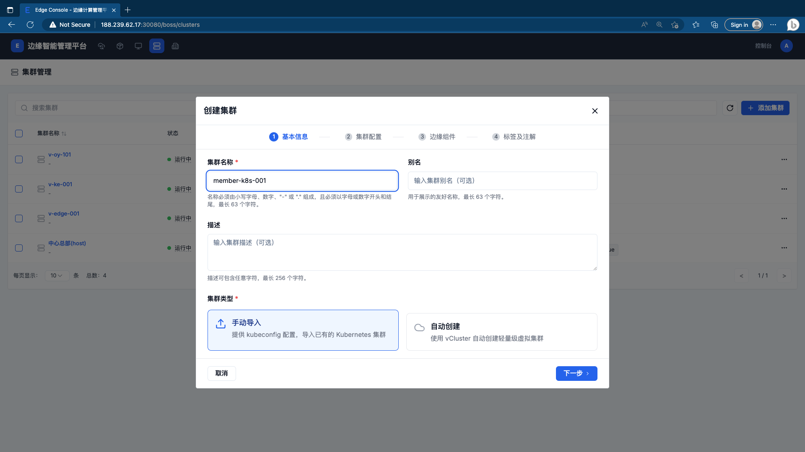
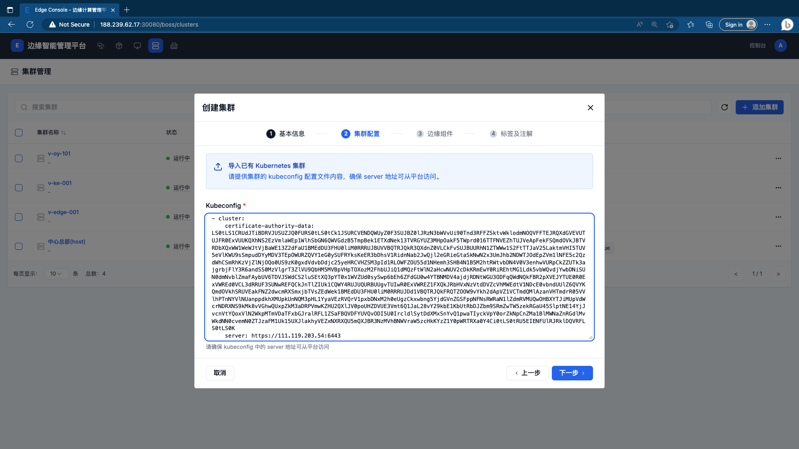
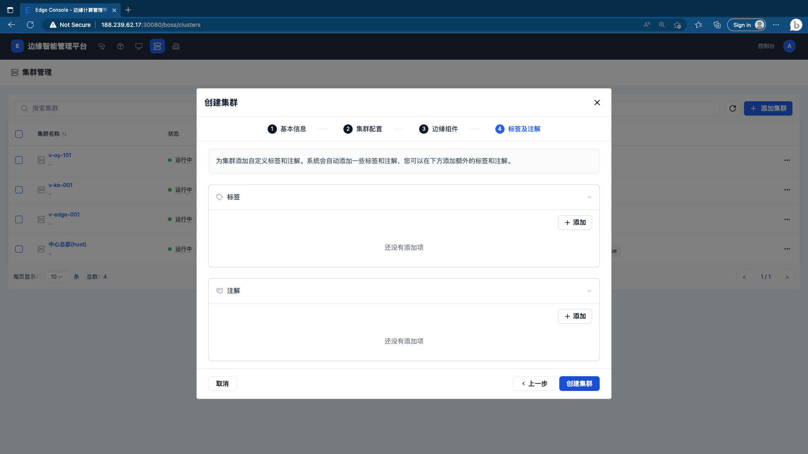
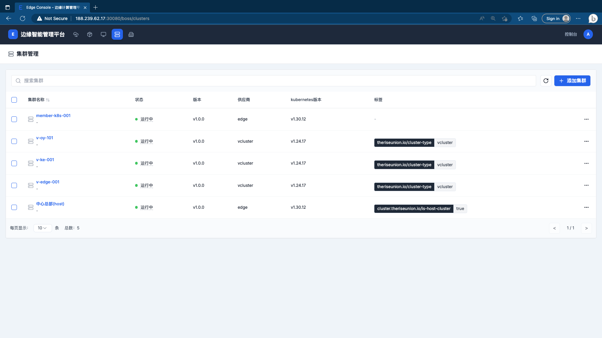

# 集群管理

> **导航路径**: 顶部导航栏 > 集群
> **访问地址**: `/boss/clusters`
> **所需权限**: 平台管理员或集群管理员

## 功能说明

集群管理页面展示平台中所有已注册的集群。您可以查看每个集群的运行状态、版本信息，创建新集群，以及进入集群详情查看资源概览。

## 页面概览

### 集群列表

集群列表显示以下信息：

| 列 | 说明 |
|------|------|
| 集群名称 | 集群的名称和别名 |
| 状态 | 运行状态（正常、异常等） |
| 版本 | 平台版本号 |
| 供应商 | 集群类型（edge-platform、vcluster 等） |
| 标签 | 集群的标识标签 |

### 集群概览

点击集群名称进入概览页面，包含以下区域：

**资源统计**

| 指标 | 说明 |
|------|------|
| 节点 | 集群中的总节点数 |
| 边缘节点 | 边缘节点数量 |
| 算力资源 | GPU 等算力资源数量 |
| 容器组 | 当前运行的容器组总数 |
| 服务 | 服务数量 |
| 部署 | 部署数量 |
| 有状态副本集 | 有状态副本集数量 |
| 守护进程集 | 守护进程集数量 |
| 项目 | 项目数量 |

**实时资源用量**

以仪表盘形式展示 CPU、内存、磁盘和 GPU 的使用量与总量，下方为用量趋势折线图。

**集群配额统计**

展示 CPU 和内存的配额分配情况，支持切换「预留」和「上限」两种视图。

**基本信息**

显示集群提供商、状态、Kubernetes 版本和平台版本。

**告警列表**

显示当前活跃告警，包含告警名称、规则、所属项目和触发时间。

**资源用量排行**

按 CPU 或内存用量对容器组、项目等进行排名。

## 操作指南

### 操作一：查看集群列表

**操作步骤**

1. 在顶部导航栏中，点击 **集群**

2. 查看所有已注册的集群及其运行状态

3. 使用搜索框按名称查找集群

**操作结果**

查看到平台中所有集群的概要信息。

### 操作二：查看集群概览

**操作步骤**

1. 在集群列表中，点击目标集群的名称

2. 进入集群概览页面

3. 查看资源统计、实时用量、配额分配和告警信息

**操作结果**

了解集群的整体资源使用情况和健康状态。

### 操作三：创建集群

平台目前支持两种子集群类型：

| 类型 | 说明 | 适用场景 |
|------|------|---------|
| **vCluster（自动创建）** | 使用 vCluster 在 Host 集群上自动创建轻量级虚拟 Kubernetes 集群 | 开发测试、多租户隔离、快速交付 |
| **托管 K8s（手动导入）** | 将已有的 Kubernetes 集群通过 kubeconfig 导入为 Host 的子集群 | 纳管存量集群、混合云场景 |

---

#### 创建 vCluster 子集群

在集群列表页面，点击右上角「**+ 添加集群**」，按向导完成以下步骤：

**第一步：基本信息**

| 字段 | 说明 |
|------|------|
| 集群名称 | 只能包含小写字母、数字、`-` 或 `.`，以字母或数字开头和结尾，最长 63 个字符 |
| 别名 | 用于展示的友好名称，最长 63 个字符（可选） |
| 描述 | 最长 256 个字符（可选） |
| 集群类型 | 选择「**自动创建**」 |

**第二步：集群配置**

此步骤展示 vCluster 特性说明，确认后继续：

- 完全隔离的 Kubernetes 控制平面
- 共享底层 Host 集群的计算资源
- 秒级创建，无需额外基础设施
- 适合开发测试和多租户隔离场景

**第三步：边缘组件**

选择「**不安装边缘组件**」，作为普通 Kubernetes 集群使用（创建后可在集群设置中随时切换边缘运行时）。

> 如需接入边缘节点，可选择 OpenYurt 或 KubeEdge，详见 [配置集群边缘运行时](../edge-nodes/cluster-runtime-setup)。

**第四步：标签及注解**

系统自动添加以下标签，也可手动添加自定义条目，确认后点击「**创建集群**」：

| Key | Value |
|-----|-------|
| `theriseunion.io/cluster-type` | `vcluster` |

集群创建成功后出现在集群列表中，状态变为「正常」即可使用。

---

#### 导入托管 K8s 子集群

将已有的 Kubernetes 集群通过 kubeconfig 导入，纳管为 Host 的子集群。

**第一步：基本信息**

填写集群名称（如 `member-k8s-001`），集群类型选择「**手动导入**」。

| 字段 | 说明 |
|------|------|
| 集群名称 | 只能包含小写字母、数字、`-` 或 `.`，以字母或数字开头和结尾，最长 63 个字符 |
| 别名 | 用于展示的友好名称（可选） |
| 描述 | 最长 256 个字符（可选） |
| 集群类型 | 选择「**手动导入**」：提供 kubeconfig 配置，导入已有的 Kubernetes 集群 |

**第二步：集群配置**

将目标集群的 kubeconfig 内容粘贴到输入框中。

> 确保 kubeconfig 中的 `server` 地址可从平台侧访问。

**第三步：边缘组件**

托管 K8s 集群通常选择「**不安装边缘组件**」，直接进入下一步。

**第四步：标签及注解**

可添加自定义标签和注解，确认后点击「**创建集群**」。

**导入成功**

集群导入成功后出现在集群列表，供应商显示为 `edge`，Kubernetes 版本与原集群一致。

## 相关文档

- [vCluster 参考](../appendix/vcluster) — vCluster 架构、发行版与版本说明
- [KubeEdge 参考](../appendix/kubeedge) — KubeEdge 架构、组件与版本说明
- [OpenYurt 参考](../appendix/openyurt) — OpenYurt 架构、组件与版本说明

## 常见问题

### 问题：集群状态显示异常
**现象**：集群列表中某个集群状态不是「正常」
**原因**：集群网络不通或集群组件运行异常
**解决**：检查集群网络连接，确认集群 API 地址可达

### 问题：集群概览数据为空
**现象**：进入集群概览页面，资源统计和用量显示为 0
**原因**：集群刚创建或监控组件未就绪
**解决**：等待集群组件初始化完成后刷新页面
