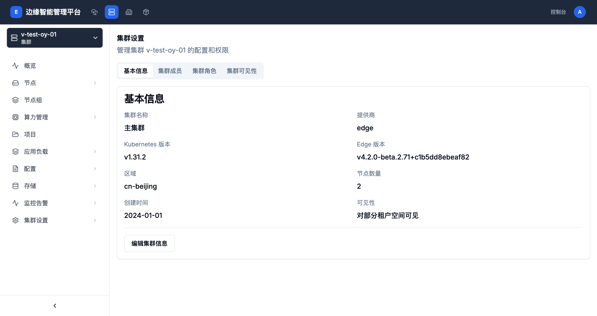
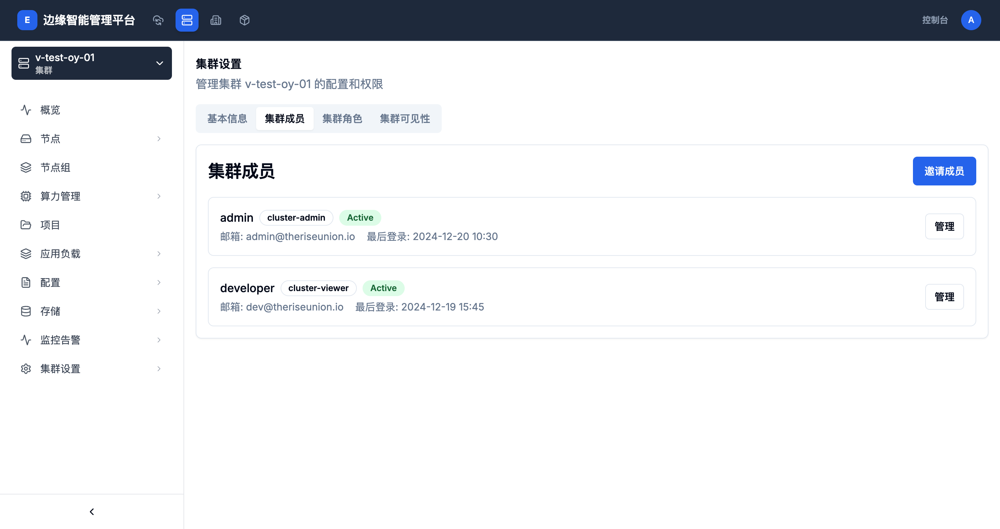

# 集群配置管理

## 概述

集群配置管理提供了对集群基本配置、成员权限、角色管理和可见性设置的全面控制。通过这些配置，管理员可以精细化管理集群的访问控制和安全策略。

## 配置管理功能

集群配置管理包含以下主要功能：

- **基本信息管理**：管理集群的基本配置信息
- **成员管理**：管理集群的用户和访问权限
- **角色管理**：创建和管理集群级别的角色
- **可见性设置**：控制集群对不同租户空间的可见性

## 基本信息

### 基本配置项

基本信息页面显示了集群的核心配置信息：

| 配置项 | 说明 | 示例 |
|-------|------|------|
| 集群名称 | 集群的唯一标识名称 | v-test-oy-01 |
| 提供商 | 集群类型提供商 | edge、vcluster |
| Kubernetes版本 | 集群的K8s版本 | v1.31.2 |
| Edge版本 | 平台版本号 | v4.2.0-beta.2.71+c1b5dd8ebeaf82 |
| 区域 | 集群所在的地理区域 | cn-beijing |
| 节点数量 | ��群中的节点总数 | 2 |
| 创建时间 | 集群的创建时间 | 2024-01-01 |
| 可见性 | 集群的可见性设置 | 对部分租户空间可见 |

### 编辑集群信息

1. **进入编辑页面**
   - 点击"编辑集群信息"按钮

2. **修改配置**
   - **集群别名**：修改集群的显示名称
   - **描述**：更新集群的用途说明
   - **区域信息**：调整集群的地理区域

3. **保存更改**
   - 确认修改内容
   - 点击保存按钮应用更改

## 集群成员管理

### 成员列表

集群成员页面显示了所有有权限访问该集群的用户列表：

### 成员信息

每个成员显示以下信息：

- **用户名**：成员的用户名称
- **角色**：成员在集群中的角色
- **状态**：成员的活跃状态（Active、Inactive）
- **邮箱**：成员的邮箱地址
- **最后登录**：成员最后一次登录时间

### 内置角色

平台提供了以下内置角色：

| 角色名称 | 权限说明 |
|---------|----------|
| cluster-admin | 集群管理员，拥有所有权限 |
| cluster-viewer | 集群查看者，只能查看资源 |
| cluster-edit | 集群编辑者，可以编辑资源 |
| cluster-operator | 集群运维人员，可以管理运维资源 |

### 邀请成员

1. **进入邀请页面**
   - 点击"邀请成员"按钮

2. **填写邀请信息**
   - **邮箱地址**：被邀请用户的邮箱
   - **角色**：选择用户的角色
   - **有效期**：设置邀请的有效期

3. **发送邀请**
   - 确认邀请信息
   - 发送邀请邮件给用户

### 管理成员权限

1. **修改角色**
   - 点击成员的"管理"按钮
   - 选择新的角色分配给成员

2. **移除成员**
   - 在成员管理页面选择移除
   - 确认移除操作

## 集群角色管理

### 角色列表

集群角色页面显示了所有自定义的集群角色：

- **角色名称**：角色的唯一标识
- **权限描述**：角色的权限说明
- **成员数量**：拥有此角色的成员数量
- **创建时间**：角色的创建时间

### 创建自定义角色

1. **进入创建页面**
   - 点击"创建角色"按钮

2. **定义角色信息**
   - **角色名称**：角色的唯一标识
   - **描述**：角色的用途说明
   - **权限规则**：配置角色的访问权限

3. **设置权限规则**

权限规则包括：

- **资源类型**：可以选择Pod、Service、Deployment等Kubernetes资源
- **操作类型**：支持get、list、create、update、delete等操作
- **资源名称**：可以指定特定的资源名称或使用通配符

4. **保存角色**
   - 确认角色配置
   - 保存角色定义

### 编辑角色

1. **修改权限规则**
   - 添加或删除权限规则
   - 调整现有规则的配置

2. **更新角色信息**
   - 修改角色名称和描述
   - 更新权限说明

3. **保存更改**
   - 应用角色配置的更改

### 删除角色

- 检查角色是否还在使用中
- 确认删除操作
- 删除角色会同时撤销所有成员的此角色权限

## 集群可见性设置

### 可见性类型

集群可以设置以下可见性：

| 可见性类型 | 说明 |
|-----------|------|
| 公开 | 所有租户空间都可以看到和访问集群 |
| 私有 | 只有平台管理员可以看到和访问集群 |
| 对部分租户空间可见 | 指定的租户空间可以看到和访问集群 |

### 配置可见性

1. **进入可见性设置**
   - 在集群设置页面选择"集群可见性"标签

2. **选择可见性类型**
   - 根据需求选择合适的可见性类型

3. **配置租户空间**
   - 如果选择"对部分租户空间可见"
   - 选择可以看到此集群的租户空间列表

4. **保存设置**
   - 应用可见性配置

### 可见性影响

集群的可见性设置会影响：

- **集群发现**：用户能否在列表中看到集群
- **访问控制**：用户能否访问集群资源
- **资源分配**：能否在集群中创建项目和工作负载

## 安全最佳实践

### 访问控制

1. **最小权限原则**
   - 为用户分配完成工作所需的最小权限
   - 定期审查和清理不必要的权限

2. **角色分离**
   - 区分管理、运维、开发等不同角色
   - 为不同职能创建专门的角色

3. **定期审计**
   - 定期检查集群成员列表
   - 审查角色权限配置

### 密码和密钥管理

1. **凭据安全**
   - 不在集群中存储明文密码
   - 使用Kubernetes Secret管理敏感信息

2. **访问密钥**
   - 定期轮换访问密钥
   - 撤销不再使用的密钥

### 网络安全

1. **网络隔离**
   - 使用网络策略限制Pod间通信
   - 控制集群对外暴露的服务

2. **访问限制**
   - 限制API Server的访问来源
   - 使用防火墙规则保护集群

## 监控和日志

### 访问审计

集群记录所有重要的访问和操作：

- **用户登录**：记录用户登录时间和来源
- **权限变更**：记录角色和权限的修改
- **资源操作**：记录对集群资源的创建、修改、删除操作

### 安全告警

设置以下安全告警：

- **异常登录**：检测异常的登录行为
- **权限变更**：监控重要的权限变更
- **资源访问**：监控对敏感资源的访问

## 故障排除

### 常见问题

1. **成员无法访问集群**
   - 检查成员的角色和权限配置
   - 确认集群的可见性设置
   - 验证成员的账户状态

2. **权限配置不生效**
   - 检查角色的权限规则配置
   - 确认资源类型和操作类型设置正确
   - 验证成员是否正确分配了角色

3. **集群可见性问题**
   - 检查集群的可见性设置
   - 确认租户空间是否在允许列表中
   - 验证用户账户的权限

## 相关文档

- [集群管理](./cluster-management.md)
- [节点组管理](./node-groups.md)
- [项目管理](./projects.md)