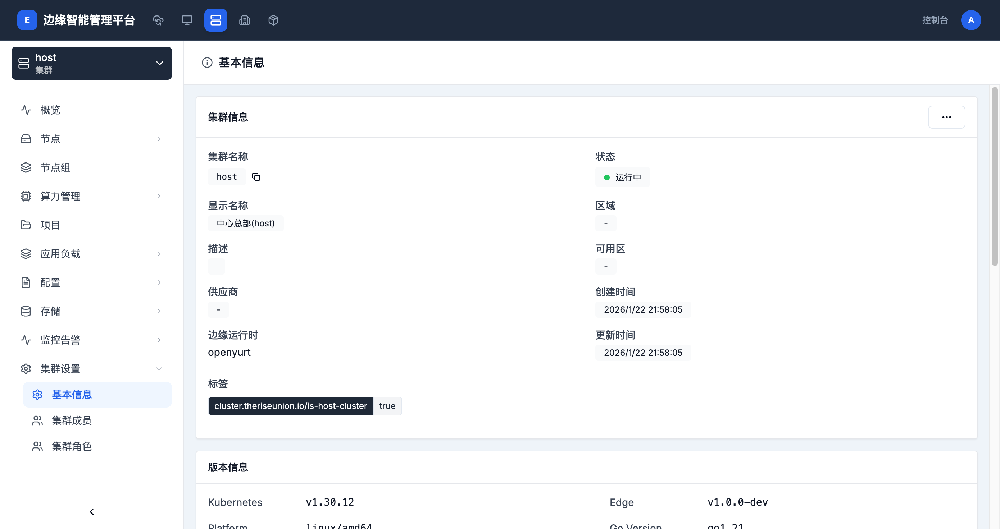
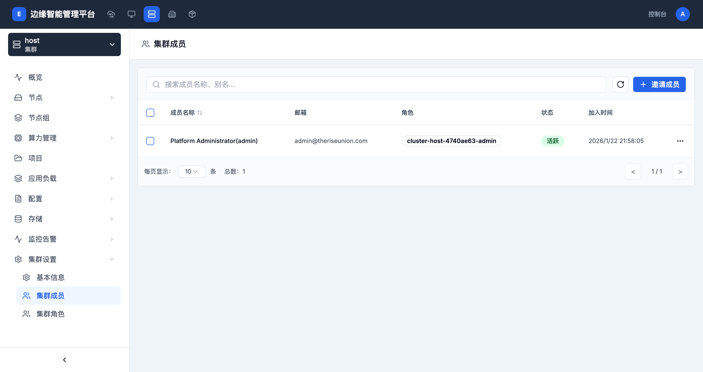

# 集群设置

> **导航路径**: 集群 > 选择集群 > 集群设置
> **所需权限**: 平台管理员或集群管理员

## 功能说明

集群设置包含三个子页面：基本信息、集群成员和集群角色。您可以在此查看和编辑集群的配置信息，管理谁可以访问集群，以及定义集群级别的权限角色。

## 基本信息

> **访问地址**: `/boss/clusters/{集群ID}/base-info`

### 页面概览

基本信息页面显示集群的核心配置：

| 字段 | 说明 |
|------|------|
| 集群名称 | 集群的标识名称 |
| 别名 | 集群的显示名称 |
| 描述 | 集群的用途说明 |
| 提供商 | 集群类型（edge-platform、vcluster） |
| Kubernetes 版本 | 集群的 K8s 版本 |
| 平台版本 | 边缘平台版本号 |
| 节点数量 | 集群中的节点总数 |
| 创建时间 | 集群的创建时间 |

### 编辑集群信息

**操作步骤**

1. 在基本信息页面，点击 **编辑集群信息** 按钮

2. 修改别名或描述信息

3. 点击 **确认** 保存修改

**操作结果**

集群信息更新成功。

---

## 集群成员

> **访问地址**: `/boss/clusters/{集群ID}/members`

### 页面概览

集群成员页面显示所有有权限访问该集群的用户：

| 列 | 说明 |
|------|------|
| 成员名称 | 用户的名称和别名 |
| 邮箱 | 成员的邮箱地址 |
| 角色 | 成员在集群中的角色 |
| 状态 | 成员状态（活跃、未激活） |
| 加入时间 | 成员加入集群的时间 |

### 邀请成员

**操作步骤**

1. 在集群成员页面，点击 **邀请成员** 按钮

2. 选择要邀请的用户

3. 为用户分配集群角色

4. 点击 **确认** 完成邀请

**操作结果**

用户被添加为集群成员，获得对应角色的权限。

### 修改成员角色

**操作步骤**

1. 在成员列表中，点击目标成员右侧的操作按钮

2. 选择 **修改角色**

3. 选择新的角色

4. 确认修改

**操作结果**

成员的集群权限按新角色生效。

### 移除成员

**操作步骤**

1. 在成员列表中，点击目标成员右侧的操作按钮

2. 选择 **移除**

3. 确认移除操作

**操作结果**

成员失去对该集群的访问权限。

---

## 集群角色

> **访问地址**: `/boss/clusters/{集群ID}/roles`

### 功能说明

集群角色定义了用户在集群中可以执行的操作。平台提供内置角色，您也可以根据需要创建自定义角色。

### 内置角色

| 角色 | 说明 |
|------|------|
| cluster-admin | 集群管理员，拥有所有权限 |
| cluster-viewer | 集群查看者，只能查看资源 |

## 常见问题

### 问题：邀请成员时找不到用户
**现象**：在邀请成员对话框中搜索不到目标用户
**原因**：目标用户尚未在平台中创建账号
**解决**：先在权限管理中创建用户，再进行集群成员邀请

### 问题：成员无法访问集群资源
**现象**：成员已添加到集群，但无法查看或操作资源
**原因**：分配的角色权限不足
**解决**：检查成员的角色是否具有所需的权限，必要时修改角色
