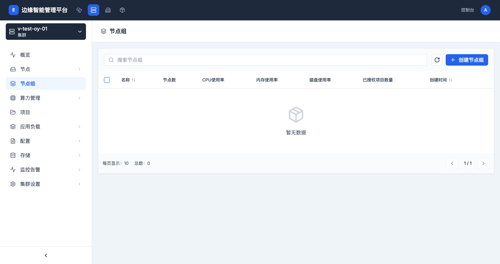

# 节点组管理

## 概述

节点组是边缘计算平台中用于管理集群节点的重要功能。通过节点组，管理员可以将节点按逻辑分组管理，实现资源的统一分配、监控和运维。



## 功能特性

- **节点分组管理**：将集群中的节点按业务逻辑或物理位置分组
- **资源监控**：实时监控节点组的CPU、内存、磁盘使用率
- **项目授权**：将节点组授权给特定项目使用
- **批量运维**：对节点组中的节点进行批量操作和管理

## 节点组列表视图

### 访问路径
```
集群管理 → 选择集群 → 节点组
```

### 列表字段说明

| 字段名称 | 说明 | 示例 |
|---------|------|------|
| 名称 | 节点组的唯一标识名称 | edge-node-group-1 |
| 节点数 | 节点组中包含的节点数量 | 5 |
| CPU使用率 | 节点组平均CPU使用率 | 45.2% |
| 内存使用率 | 节点组平均内存使用率 | 67.8% |
| 磁盘使用率 | 节点组平均磁盘使用率 | 32.1% |
| 已授权项目数量 | 被授权使用此节点组的项目数量 | 3 |
| 创建时间 | 节点组的创建时间 | 2024-01-01 10:30 |

### 操作功能

1. **搜索节点组**
   - 在搜索框中输入节点组名称进行过滤
   - 支持模糊搜索

2. **创建节点组**
   - 点击"创建节点组"按钮创建新节点组
   - 需要选择节点和配置节点组参数

3. **节点组详情**
   - 点击节点组名称查看详细信息
   - 包括节点列表、资源使用情况、授权项目等

## 创建节点组

### 基本步骤

1. **进入创建页面**
   - 在节点组列表页面点击"创建节点组"按钮

2. **填写基本信息**
   - **节点组名称**：必填，节点组的唯一标识
   - **描述**：可选，节点组的用途说明

3. **选择节点**
   - 从可用节点列表中选择要加入节点组的节点
   - 支持多选

4. **配置资源配额**
   - 设置CPU、内存等资源限制
   - 配置资源预留策略

5. **授权项目**
   - 选择可以使用此节点组的项目
   - 设置项目访问权限

## 节点组管理操作

### 查看节点组详情

点击节点组名称可以查看详细信息：

- **节点列表**：显示节点组中的所有节点
- **资源使用情况**：CPU、内存、磁盘的使用率和趋势图
- **授权项目**：显示被授权的项目列表
- **运行状态**：节点组的整体健康状态

### 编辑节点组

1. **修改基本信息**
   - 更新节点组名称和描述
   - 调整资源配置

2. **管理节点**
   - 添加或移除节点
   - 调整节点组成员

3. **更新授权**
   - 添加或移除授权项目
   - 修改项目访问权限

### 删除节点组

- 在节点组操作菜单中选择删除
- 确认删除操作（此操作不可逆）
- 删除节点组不会删除节点本身，只是解除分组关系

## 节点组类型

### 边缘节点组

- 包含边缘计算节点的节点组
- 通常部署在边缘位置
- 适合运行边缘应用和工作负载

### 云端节点组

- 包含云端计算节点的节点组
- 部署在中心数据中心
- 适合运行核心业务应用

### 混合节点组

- 同时包含云端和边缘节点的节点组
- 实现云边协同工作
- 适合需要云边协作的应用场景

## 资源监控

### 实时监控指标

节点组列表页面实时显示以下监控指标：

- **CPU使用率**：节点组中所有节点的平均CPU使用率
- **内存使用率**：节点组中所有节点的平均内存使用率
- **磁盘使用率**：节点组中所有节点的平均磁盘使用率

### 资源使用趋势

在节点组详情页面可以查看：

- 资源使用率的历史趋势图
- 支持不同时间范围的数据查看
- 资源使用预测和告警

## 项目授权管理

### 授权机制

节点组可以通过项目授权机制分配给特定的租户空间或项目使用：

1. **授权方式**
   - 在节点组设置中选择要授权的项目
   - 设置项目的访问权限级别

2. **权限级别**
   - **使用权限**：项目可以在节点组上部署工作负载
   - **查看权限**：项目只能查看节点组信息
   - **管理权限**：项目可以管理节点组配置

3. **资源隔离**
   - 不同项目的资源相互隔离
   - 通过资源配额控制项目使用量

### 授权管理操作

- **添加授权**：将节点组授权给新的项目使用
- **修改授权**：调整已授权项目的权限级别
- **撤销授权**：移除项目的节点组使用权限

## 最佳实践

1. **节点组规划**
   - 按业务类型或地理位置分组节点
   - 考虑网络延迟和故障域隔离

2. **资源配置**
   - 根据工作负载需求设置合理的资源配额
   - 预留足够的资源用于系统组件

3. **监控告警**
   - 设置资源使用率告警阈值
   - 定期检查节点组健康状态

4. **权限管理**
   - 遵循最小权限原则进行项目授权
   - 定期审计和清理不必要的授权

5. **高可用设计**
   - 关键应用跨节点组部署
   - 避免单点故障

## 注意事项

1. **节点组删除**：删除节点组前请确保没有工作负载依赖该节点组
2. **资源限制**：合理设置资源限制，避免资源争抢
3. **网络配置**：确保节点组内节点的网络连通性
4. **标签管理**：为节点组添加适当的标签便于管理和筛选
5. **备份策略**：重要节点组建议配置节点级别的备份策略

## 相关文档

- [集群管理](./cluster-management.md)
- [项目管理](./projects.md)
- [集群配置](./cluster-settings.md)