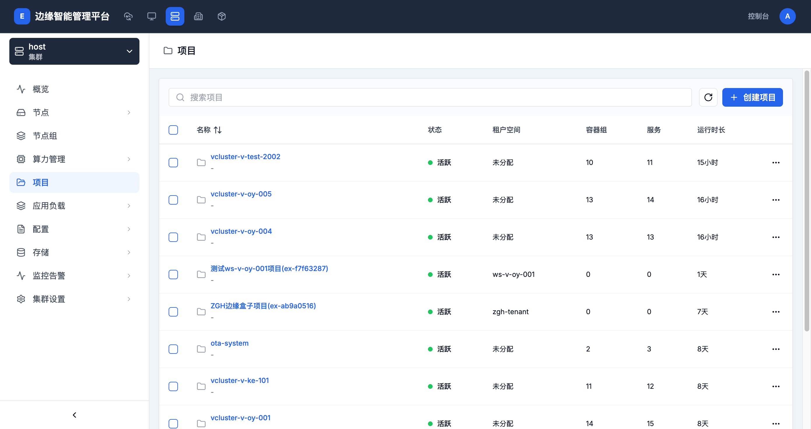

# 项目管理

> **导航路径**: 集群 > 选择集群 > 项目
> **访问地址**: `/boss/clusters/{集群ID}/namespaces`
> **所需权限**: 平台管理员或集群管理员

## 功能说明

项目是集群中的资源隔离单位。不同项目之间的资源相互隔离。您可以为每个项目设置资源配额、分配租户空间，并管理项目内的工作负载。

## 页面概览

项目列表包含以下信息：

| 列 | 说明 |
|------|------|
| 名称 | 项目名称和标识 |
| 状态 | 项目状态（活跃、停止等） |
| 租户空间 | 项目所属的租户空间（或「未分配」） |
| 容器组 | 项目中运行的容器组数量 |
| 服务 | 项目中的服务数量 |
| 运行时长 | 项目创建至今的时间 |

## 操作指南

### 操作一：查看项目列表

**操作步骤**

1. 进入目标集群，在侧边栏点击 **项目**

2. 查看所有项目的名称、状态和资源统计

3. 使用搜索框按名称查找项目

**操作结果**

查看到集群中所有项目及其基本状态。

### 操作二：创建项目

**操作步骤**

1. 在项目列表页面，点击 **创建项目** 按钮

2. 填写项目信息：

   | 字段 | 是否必填 | 说明 |
   |------|----------|------|
   | 项目名称 | 是 | 小写字母、数字和连字符，最长 63 个字符 |
   | 描述 | 否 | 项目的用途说明 |
   | 租户空间 | 否 | 选择项目所属的租户空间 |

3. 点击 **确认** 创建项目

**操作结果**

项目创建成功，出现在项目列表中，状态为「活跃」。

### 操作三：查看项目详情

**操作步骤**

1. 在项目列表中，点击目标项目的名称

2. 进入项目概览页面，查看以下信息：
   - 工作负载统计（部署、服务等数量）
   - 资源使用情况（CPU、内存）

**操作结果**

了解项目中的资源分配和使用状况。

### 操作四：删除项目

**操作步骤**

1. 在项目列表中，点击目标项目右侧的操作按钮

2. 选择 **删除**

3. 确认删除操作

**操作结果**

项目及其中的所有资源（工作负载、服务、配置等）被删除。此操作不可恢复。

## 常见问题

### 问题：项目无法删除
**现象**：点击删除后操作失败
**原因**：项目可能是系统项目，或项目中有正在运行的工作负载
**解决**：系统项目（如 kube-system、edge-system）不可删除；业务项目需先清理其中的工作负载

### 问题：项目列表中有很多系统项目
**现象**：项目列表中包含 kube-system、vcluster-* 等系统项目
**原因**：这些是平台和集群运行所需的系统项目
**解决**：这是正常情况。系统项目由平台自动管理，请勿修改或删除
