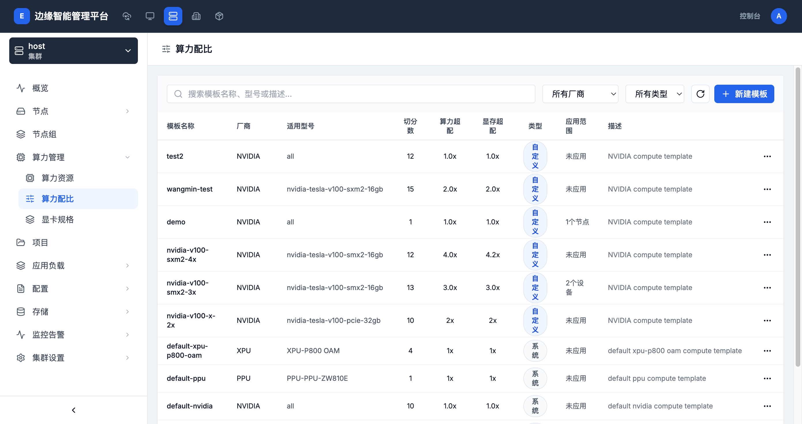

# 算力配比

> **导航路径**: 集群 > 选择集群 > 算力管理 > 算力配比
> **访问地址**: `/boss/clusters/{集群ID}/gpu-ratios`
> **所需权限**: 平台管理员或集群管理员

## 功能说明

算力配比用于定义 GPU 资源的虚拟化切分策略。通过创建算力配比模板，可以将一张物理 GPU 切分为多个虚拟 GPU，并设置算力和显存的超配比例。模板分为「系统」类型（平台预置）和「自定义」类型（用户创建）。

## 页面概览

算力配比列表包含以下信息：

| 列 | 说明 |
|------|------|
| 模板名称 | 算力配比模板的名称 |
| 厂商 | GPU 厂商（NVIDIA、Ascend、MLU 等） |
| 适用型号 | 模板适用的 GPU 型号（all 表示所有型号） |
| 切分数 | 每张物理 GPU 切分为多少个虚拟 GPU |
| 算力超配 | 算力的超配倍率 |
| 显存超配 | 显存的超配倍率 |
| 类型 | 系统预置或自定义 |
| 应用范围 | 模板已应用到的节点数量 |
| 描述 | 模板的描述信息 |

支持按厂商和类型（系统/自定义）筛选。

## 操作指南

### 操作一：查看算力配比列表

**操作步骤**

1. 进入目标集群，在侧边栏展开 **算力管理**

2. 点击 **算力配比**

3. 查看所有算力配比模板

4. 使用厂商和类型下拉框筛选模板

**操作结果**

查看到集群中所有算力配比模板及其配置。

### 操作二：创建算力配比模板

**操作步骤**

1. 在算力配比列表页面，点击 **新建模板** 按钮

2. 填写模板信息：

   | 字段 | 是否必填 | 说明 |
   |------|----------|------|
   | 模板名称 | 是 | 模板的标识名称 |
   | 厂商 | 是 | 选择 GPU 厂商 |
   | 适用型号 | 是 | 选择适用的 GPU 型号 |
   | 切分数 | 是 | 每张 GPU 切分的虚拟 GPU 数量 |
   | 算力超配 | 是 | 算力超配倍率（1.0 表示不超配） |
   | 显存超配 | 是 | 显存超配倍率（1.0 表示不超配） |
   | 描述 | 否 | 模板的用途说明 |

3. 点击 **确认** 创建模板

**操作结果**

算力配比模板创建成功，出现在列表中，类型为「自定义」。

### 操作三：应用模板到节点

**操作步骤**

1. 在模板列表中，点击目标模板右侧的操作按钮

2. 选择 **应用到节点**

3. 选择要应用的节点

4. 确认应用

**操作结果**

模板应用到选中的节点，节点上的 GPU 将按照模板配置进行切分。

### 操作四：删除模板

**操作步骤**

1. 在模板列表中，点击目标模板右侧的操作按钮

2. 选择 **删除**

3. 确认删除操作

**操作结果**

模板被删除。已应用到节点的配置不受影响。系统预置模板不可删除。

## 常见问题

### 问题：模板无法删除
**现象**：删除按钮不可用
**原因**：系统预置模板不支持删除
**解决**：仅自定义类型的模板可以删除

### 问题：应用模板后 GPU 切分未生效
**现象**：模板已应用但 GPU 设备未按预期切分
**原因**：节点上有正在运行的 GPU 工作负载
**解决**：停止节点上使用 GPU 的工作负载后重新应用模板
