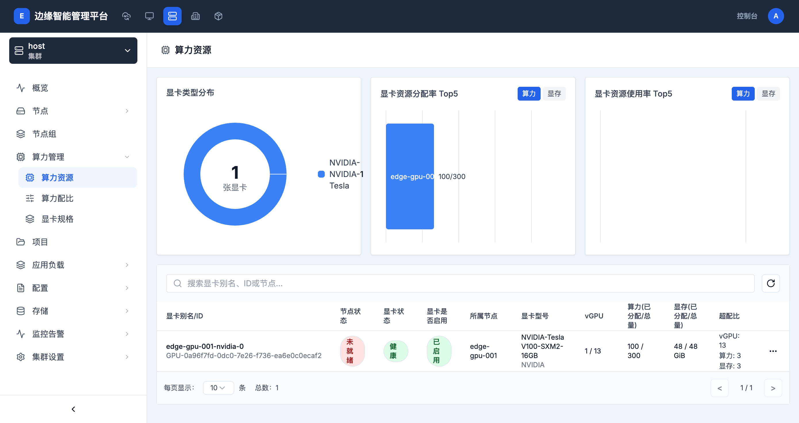

# 算力资源

> **导航路径**: 集群 > 选择集群 > 算力管理 > 算力资源
> **访问地址**: `/boss/clusters/{集群ID}/gpus`
> **所需权限**: 平台管理员或集群管理员

## 功能说明

算力资源页面展示集群中所有 GPU 设备的资源概览，包括显卡类型分布、资源分配率排行和使用率排行，以及每张 GPU 的详细状态信息。

## 页面概览

### 顶部统计区域

| 区域 | 说明 |
|------|------|
| 显卡类型分布 | 饼图展示集群中各型号显卡的数量分布 |
| 显卡资源分配率 Top5 | 按算力或显存分配率排名前 5 的 GPU 设备 |
| 显卡资源使用率 Top5 | 按算力或显存使用率排名前 5 的 GPU 设备 |

### GPU 设备列表

| 列 | 说明 |
|------|------|
| 显卡别名/ID | GPU 设备的别名和硬件 ID |
| 节点状态 | GPU 所在节点的运行状态（就绪、未就绪） |
| 显卡状态 | GPU 设备的健康状态 |
| 显卡是否启用 | GPU 是否已启用可供分配 |
| 所属节点 | GPU 设备所在的节点名称 |
| 显卡型号 | GPU 的完整型号名称 |
| vGPU | 已分配的虚拟 GPU 数量 / 总量 |
| 算力(已分配/总量) | 算力的分配情况（百分比） |
| 显存(已分配/总量) | 显存的分配情况（GiB） |
| 超配比 | vGPU 切分数、算力超配比和显存超配比 |

## 操作指南

### 操作一：查看 GPU 设备列表

**操作步骤**

1. 进入目标集群，在侧边栏展开 **算力管理**

2. 点击 **算力资源**

3. 查看顶部的统计图表和下方的设备列表

4. 使用搜索框按显卡别名、ID 或节点名称查找

**操作结果**

了解集群中所有 GPU 设备的分配和使用状况。

### 操作二：切换分配率/使用率排行

**操作步骤**

1. 在分配率或使用率 Top5 区域，点击 **算力** 或 **显存** 按钮

2. 切换查看不同维度的排行数据

**操作结果**

查看按算力或显存排名的 GPU 设备。

## 常见问题

### 问题：GPU 列表为空
**现象**：算力资源页面没有显示任何 GPU 设备
**原因**：集群中未安装 GPU 设备，或 GPU 设备插件未部署
**解决**：确认集群节点已安装 GPU 硬件，且相关设备插件已正确部署

### 问题：显卡状态显示「未就绪」
**现象**：GPU 设备的节点状态为「未就绪」
**原因**：GPU 所在节点离线或节点上的设备驱动异常
**解决**：检查节点运行状态，确认 GPU 驱动已正确安装
