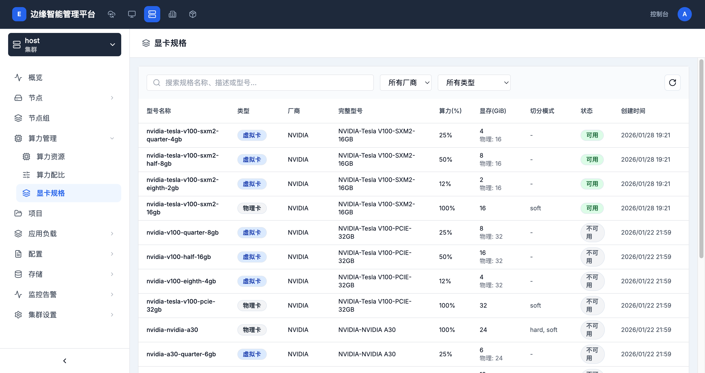

# 显卡规格

> **导航路径**: 集群 > 选择集群 > 算力管理 > 显卡规格
> **访问地址**: `/boss/clusters/{集群ID}/gpu-models`
> **所需权限**: 平台管理员或集群管理员

## 功能说明

显卡规格页面展示集群中所有已注册的 GPU 型号定义，包括物理卡和虚拟卡规格。物理卡规格对应实际 GPU 硬件型号，虚拟卡规格对应通过算力配比切分后的虚拟 GPU 规格。

## 页面概览

显卡规格列表包含以下信息：

| 列 | 说明 |
|------|------|
| 型号名称 | GPU 规格的标识名称 |
| 类型 | 物理卡或虚拟卡 |
| 厂商 | GPU 厂商（如 NVIDIA） |
| 完整型号 | GPU 的完整型号名称 |
| 算力(%) | GPU 算力占物理卡的百分比 |
| 显存(GiB) | GPU 可用显存大小 |
| 切分模式 | 切分方式（soft、hard 等） |
| 状态 | 规格状态（可用、不可用） |
| 创建时间 | 规格的创建时间 |

支持按厂商和类型（物理卡/虚拟卡）筛选。

## 操作指南

### 操作一：查看显卡规格列表

**操作步骤**

1. 进入目标集群，在侧边栏展开 **算力管理**

2. 点击 **显卡规格**

3. 查看所有 GPU 型号规格

4. 使用厂商和类型下拉框筛选规格

5. 使用搜索框按名称、描述或型号查找

**操作结果**

查看到集群中所有 GPU 规格及其参数。

### 操作二：理解物理卡与虚拟卡

**物理卡**

- 对应实际安装的 GPU 硬件型号
- 算力为 100%，显存为物理卡完整显存
- 切分模式表示该物理卡支持的虚拟化方式

**虚拟卡**

- 通过算力配比模板切分生成
- 算力和显存为物理卡的一部分
- 显示对应物理卡的总显存作为参考

## 常见问题

### 问题：显卡规格状态为「不可用」
**现象**：部分规格的状态显示「不可用」
**原因**：集群中没有安装对应型号的 GPU 硬件
**解决**：这是正常情况。系统预置了常见 GPU 型号的规格定义，只有集群中实际存在的型号才显示为「可用」
