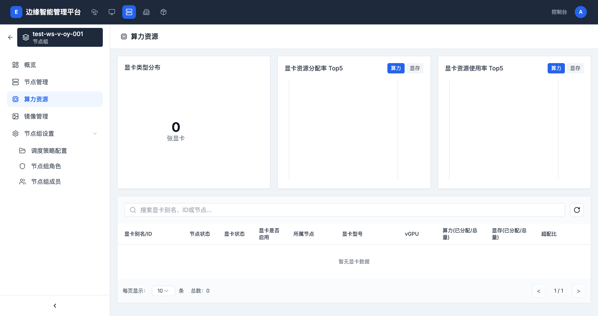

# 节点组算力

> **导航路径**: 集群 > 节点组 > 选择节点组 > 算力资源
> **访问地址**: `/boss/clusters/{集群ID}/nodegroups/{节点组ID}/gpus`
> **所需权限**: 平台管理员或集群管理员

## 功能说明

节点组详情中的算力资源页面展示该节点组内的 GPU 设备信息。页面布局与集群级别的算力资源页面一致，但仅显示属于当前节点组的 GPU 设备。

## 页面概览

页面包含以下区域：

### 顶部统计

| 区域 | 说明 |
|------|------|
| 显卡类型分布 | 节点组内各型号显卡的数量分布 |
| 显卡资源分配率 Top5 | 节点组内分配率最高的 GPU 设备 |
| 显卡资源使用率 Top5 | 节点组内使用率最高的 GPU 设备 |

### GPU 设备列表

与集群级别的算力资源列表字段相同，包含：显卡别名/ID、节点状态、显卡状态、显卡是否启用、所属节点、显卡型号、vGPU、算力(已分配/总量)、显存(已分配/总量)、超配比。

## 操作指南

### 操作一：查看节点组 GPU 资源

**操作步骤**

1. 进入目标集群，在侧边栏点击 **节点组**

2. 点击目标节点组的名称，进入节点组详情

3. 点击 **算力资源** 标签页

4. 查看节点组内的 GPU 设备列表和统计信息

**操作结果**

了解节点组内 GPU 设备的分配和使用情况。

## 常见问题

### 问题：节点组 GPU 列表为空
**现象**：节点组的算力资源页面显示「暂无显卡数据」
**原因**：节点组内的节点没有安装 GPU 设备
**解决**：确认节点组内包含安装了 GPU 的节点
