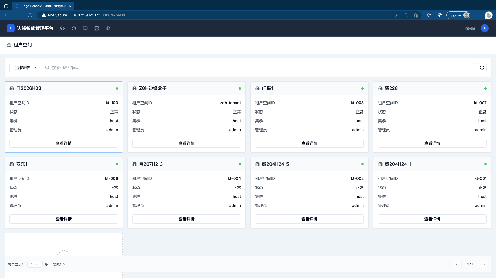
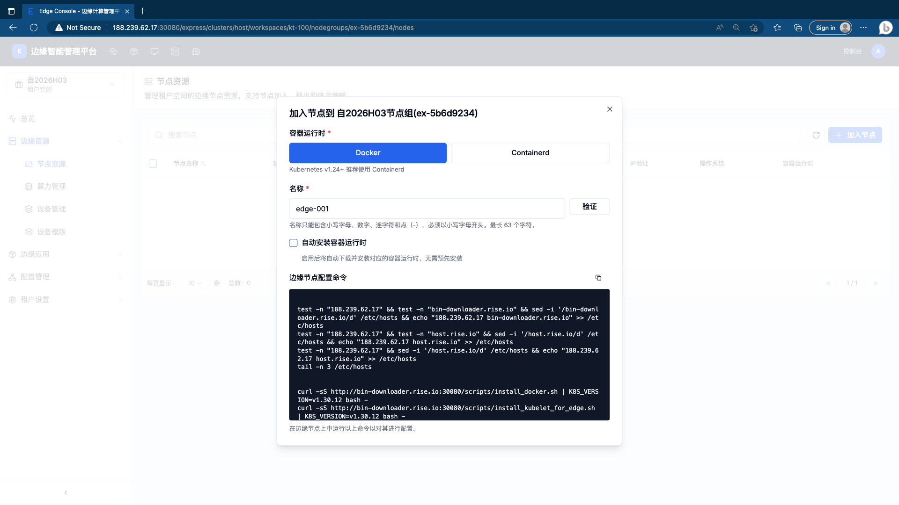
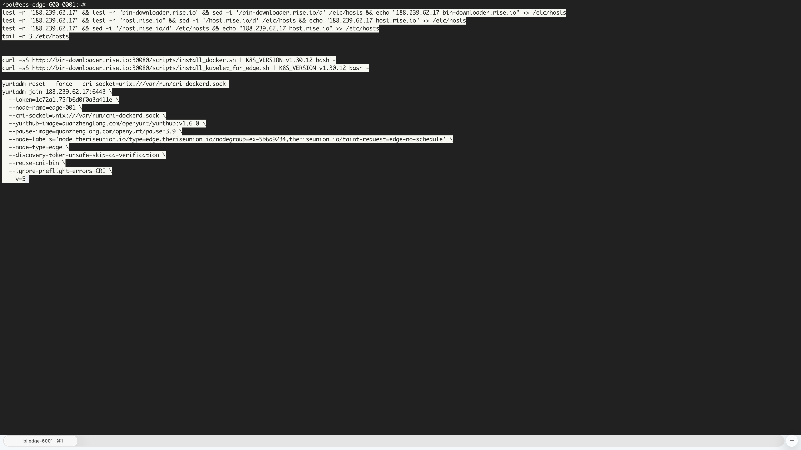
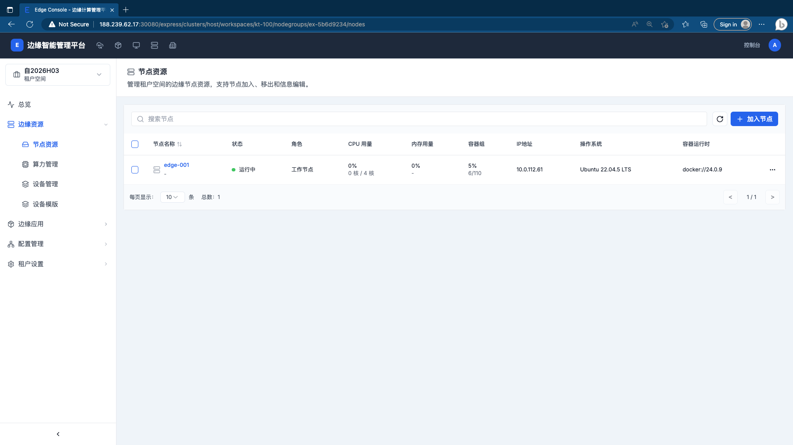
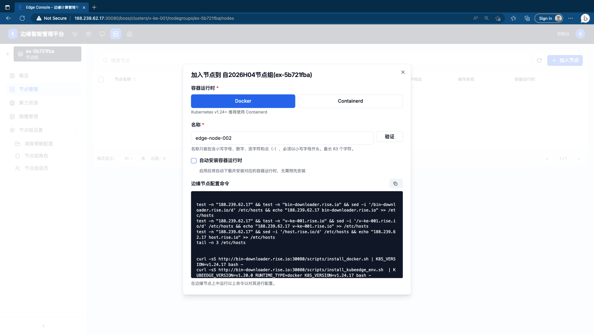
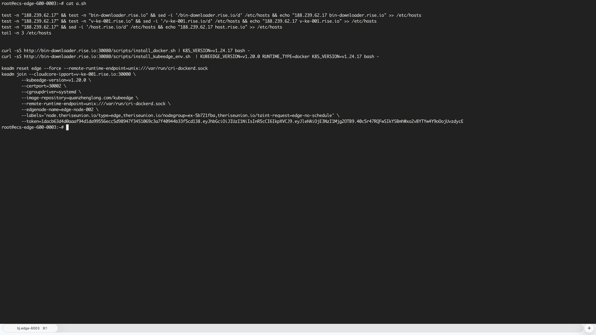
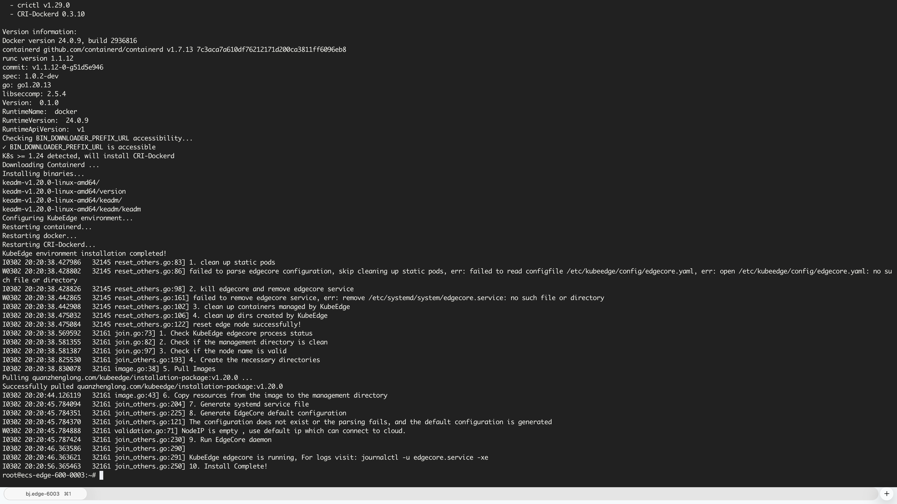
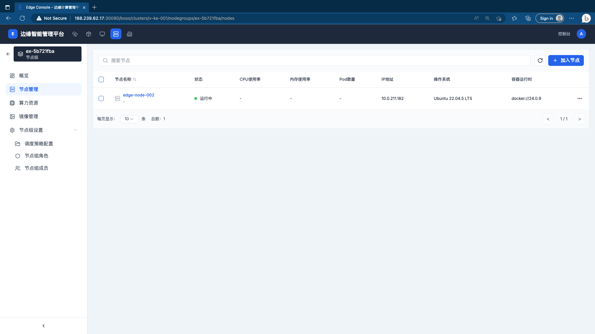
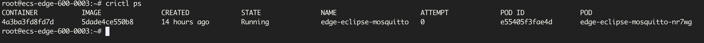
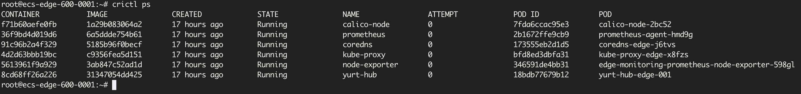

# 添加边缘节点

平台支持通过三种入口将边缘节点加入集群，操作流程基本一致：输入节点名称并验证，系统生成安装命令，将命令复制到边缘节点执行，等待节点上线。

## 前提条件

- 目标集群已配置边缘运行时（KubeEdge 或 OpenYurt），参见 [配置集群边缘运行时](./cluster-runtime-setup)
- 边缘节点可访问集群 API Server 地址
- 边缘节点已安装 Linux 操作系统，具有 root 权限

## 三种入口对比

三种入口均支持 **KubeEdge** 和 **OpenYurt** 两种运行时，对话框和操作步骤完全一致，仅生成的节点注册命令不同（`keadm join` / `yurtadm join`）。

| 入口 | URL 路径 | 适用场景 |
|------|---------|---------|
| **集群入口** | `/boss/clusters/{集群ID}/edge-nodes` | 按集群维度统一管理所有边缘节点 |
| **节点组入口** | `/boss/clusters/{集群ID}/nodegroups/{节点组ID}/nodes` | 将节点直接归入指定节点组，上线后自动关联 |
| **租户空间入口** | `/express/clusters/{集群ID}/workspaces/{租户ID}/nodegroups/{节点组ID}/nodes` | 在租户视角下管理本租户边缘节点 |

---

## 从租户空间添加节点

以下以 **OpenYurt** 运行时集群为例，演示从租户空间入口添加边缘节点的完整流程。

### 第一步：进入租户空间

进入平台「**租户空间**」页面，找到目标租户，点击「**查看详情**」。

> URL 格式：`/express/clusters/{集群ID}/workspaces/{租户ID}/nodegroups/{节点组ID}/nodes`



### 第二步：进入节点资源页

在租户侧边栏，点击「**边缘资源 > 节点资源**」，进入节点列表页。

点击右上角「**+ 加入节点**」，弹出节点配置对话框。

### 第三步：填写节点信息并生成命令



在弹窗中完成以下配置：

| 字段 | 说明 |
|------|------|
| **容器运行时** | 选择 `Docker` 或 `Containerd`（Kubernetes v1.24+ 推荐使用 Containerd） |
| **名称** | 节点名称，只能包含小写字母、数字和连字符（`-`），最长 63 个字符 |
| **自动安装容器运行时** | 勾选后，安装脚本将自动下载并安装所选容器运行时，无需预先安装 |

填写完节点名称后，点击「**验证**」，系统自动生成「**边缘节点配置命令**」。

### 第四步：在边缘节点执行命令

点击命令区域右上角的复制图标，将完整命令复制到剪贴板。

登录边缘节点，以 root 身份粘贴并执行命令：



命令将依次完成以下操作：

1. 配置 `/etc/hosts`，确保节点可解析平台域名
2. 安装 Docker / Containerd 容器运行时（如选择自动安装）
3. 安装 kubelet 及边缘 agent
4. 执行 `yurtadm join`（OpenYurt）或 `keadm join`（KubeEdge）将节点注册到集群

### 第五步：验证节点上线

命令执行完成后，返回平台节点列表页刷新，节点状态变为「**运行中**」即表示接入成功。



节点列表展示以下信息：

| 字段 | 说明 |
|------|------|
| 节点名称 | 注册时填写的名称 |
| 状态 | 运行中 / 未就绪 / 离线 |
| 角色 | 工作节点 / 控制平面 |
| CPU / 内存用量 | 实时资源使用率 |
| IP 地址 | 节点内网 IP |
| 操作系统 | 节点 OS 信息 |
| 容器运行时 | 如 `docker://24.0.9` 或 `containerd://1.7.x` |

### KubeEdge 运行时差异

如集群运行时为 **KubeEdge**，操作入口和对话框完全相同，仅生成的命令最后一步不同：系统将生成 `keadm join` 命令替代 `yurtadm join`，其余步骤一致。

---

## 从集群入口添加节点

以下以 **OpenYurt** 运行时集群为例，演示从集群入口添加边缘节点的完整流程。

### 第一步：进入集群边缘节点页

在左侧导航中选择目标集群（需已配置边缘运行时），点击「**节点 > 边缘节点**」，进入边缘节点列表页。

> URL 格式：`/boss/clusters/{集群ID}/edge-nodes`

点击右上角「**+ 添加节点**」，弹出节点配置对话框。

### 第二步：填写节点信息并生成命令


在弹窗中完成以下配置：

| 字段 | 说明 |
|------|------|
| **容器运行时** | 选择 `Docker` 或 `Containerd`（Kubernetes v1.24+ 推荐使用 Containerd） |
| **名称** | 节点名称，只能包含小写字母、数字和连字符（`-`），最长 63 个字符 |
| **自动安装容器运行时** | 勾选后，安装脚本将自动下载并安装所选容器运行时，无需预先安装 |

填写完节点名称后，点击「**验证**」，系统自动生成「**边缘节点配置命令**」。

### 第三步：在边缘节点执行命令

点击命令区域右上角的复制图标，将完整命令复制到剪贴板。

登录边缘节点，以 root 身份粘贴并执行命令：


命令将依次完成以下操作：

1. 配置 `/etc/hosts`，确保节点可解析平台域名
2. 安装 Docker / Containerd 容器运行时（如选择自动安装）
3. 安装 kubelet 及边缘 agent
4. 执行 `yurtadm join` 将节点注册到集群

### 第四步：验证节点上线

命令执行完成后，返回平台边缘节点列表页刷新，节点状态变为「**运行中**」即表示接入成功。


点击节点名称可进入节点详情页，查看 CPU / 内存用量、健康状态、容器组等详细信息。

### KubeEdge 运行时差异

如集群运行时为 **KubeEdge**，操作入口和对话框完全相同，仅生成的命令最后一步不同：系统将生成 `keadm join` 命令替代 `yurtadm join`，其余步骤一致。

---

## 从节点组入口添加节点

以下以 **KubeEdge** 运行时集群为例，演示从节点组入口添加边缘节点的完整流程。

### 第一步：进入节点组节点管理页

在目标集群中，点击左侧菜单「**节点组**」，进入节点组列表，点击目标节点组，在左侧菜单点击「**节点管理**」。

> URL 格式：`/boss/clusters/{集群ID}/nodegroups/{节点组ID}/nodes`

点击右上角「**+ 加入节点**」，弹出节点配置对话框。

### 第二步：填写节点信息并生成命令



对话框标题显示目标节点组名称（如「加入节点到 自2026H04节点组(ex-5b721fba)」），字段与其他入口完全相同：

| 字段 | 说明 |
|------|------|
| **容器运行时** | 选择 `Docker` 或 `Containerd`（Kubernetes v1.24+ 推荐使用 Containerd） |
| **名称** | 节点名称，只能包含小写字母、数字和连字符（`-`），最长 63 个字符 |
| **自动安装容器运行时** | 勾选后，安装脚本将自动下载并安装所选容器运行时，无需预先安装 |

填写完节点名称后，点击「**验证**」，系统自动生成「**边缘节点配置命令**」。

### 第三步：在边缘节点执行命令

点击命令区域右上角的复制图标，将完整命令复制到剪贴板。

登录边缘节点，以 root 身份粘贴并执行命令：



命令将依次完成以下操作：

1. 配置 `/etc/hosts`，确保节点可解析平台域名
2. 安装 Docker / Containerd 容器运行时及 KubeEdge 环境（`install_kubeedge_env.sh`）
3. 执行 `keadm reset` 清理旧环境
4. 执行 `keadm join` 将节点注册到集群，命令中携带节点组标签（`theriseunion.io/nodegroup=<节点组ID>`）



出现 `Install Complete!` 表示节点已成功接入集群。

### 第四步：验证节点上线

命令执行完成后，返回节点组节点管理页刷新，节点状态变为「**运行中**」即表示接入成功。节点上线后自动归属于该节点组，无需手动分配。



### OpenYurt 运行时差异

如集群运行时为 **OpenYurt**，操作入口和对话框完全相同，仅生成的命令最后一步不同：系统将生成 `yurtadm join` 命令替代 `keadm join`，其余步骤一致。

---

## KubeEdge 与 OpenYurt 命令差异

不同运行时生成的接入命令有所不同，主要体现在最后的注册步骤：

**OpenYurt（yurtadm）：**

```bash
yurtadm reset --force --cri-socket=unix:///var/run/cri-dockerd.sock
yurtadm join <API_SERVER>:<PORT> \
  --token=<TOKEN> \
  --node-name=<NODE_NAME> \
  --cri-socket=unix:///var/run/cri-dockerd.sock \
  --yurthub-image=<YURTHUB_IMAGE> \
  --pause-image=<PAUSE_IMAGE> \
  --node-labels='node.theriseunion.io/type=edge,...' \
  --node-type=edge \
  --discovery-token-unsafe-skip-ca-verification \
  --v=5
```

**KubeEdge（keadm）：**

```bash
keadm reset edge --force --remote-runtime-endpoint=unix:///var/run/cri-dockerd.sock
keadm join \
  --cloudcore-ipport=<API_SERVER>:<PORT> \
  --kubeedge-version=<VERSION> \
  --certport=<CERT_PORT> \
  --cgroupdriver=systemd \
  --image-repository=<IMAGE_REPO> \
  --remote-runtime-endpoint=unix:///var/run/cri-dockerd.sock \
  --edgenode-name=<NODE_NAME> \
  --labels='node.theriseunion.io/type=edge,theriseunion.io/nodegroup=<NODE_GROUP_ID>,...' \
  --token=<TOKEN>
```

> 通过节点组入口添加时，`--labels` 中会自动携带 `theriseunion.io/nodegroup=<节点组ID>`，节点上线后自动关联到对应节点组。

---

## 常见问题

**节点执行命令后长时间未上线？**

- 检查边缘节点是否可以访问集群 API Server 地址和端口
- 确认 `/etc/hosts` 中平台域名解析是否正确（命令中已包含配置步骤）
- 查看节点上 yurthub / edgecore 服务日志：
  ```bash
  journalctl -u yurthub -f        # OpenYurt
  journalctl -u edgecore -f       # KubeEdge
  ```

**容器运行时安装失败？**

- 勾选「自动安装容器运行时」后如安装失败，可手动安装后重新执行 join 命令
- Kubernetes v1.24+ 建议使用 Containerd，Docker 需配合 `cri-dockerd` 使用

---

## 节点上线后的容器运行情况

边缘节点成功加入集群后，可在节点上执行 `crictl ps` 查看运行中的容器。不同运行时部署的组件有所差异。

### KubeEdge

KubeEdge 的边缘侧设计非常轻量，节点加入后仅运行业务容器本身，系统组件（edgecore）以系统服务形式运行，不体现在 `crictl ps` 中。



示例中边缘节点仅运行了 1 个业务容器（`edge-eclipse-mosquitto`），无额外系统容器占用资源。

### OpenYurt

OpenYurt 在边缘侧部署了完整的云边协同组件，节点加入后会自动运行以下系统容器：

| 容器名 | 说明 |
|--------|------|
| `yurt-hub` | 边缘自治核心组件，缓存云端数据，弱网时保障节点自治 |
| `calico-node` | 网络插件，负责 Pod 网络互通 |
| `coredns` | 边缘 DNS 解析 |
| `kube-proxy` | 服务代理，维护 iptables/ipvs 规则 |
| `prometheus` | 监控指标采集 agent |
| `node-exporter` | 节点资源指标导出 |



---

## 相关文档

- [配置集群边缘运行时](./cluster-runtime-setup)
- [节点组管理](../clusters/node-groups)
- [租户管理](../tenant/tenant-management)
