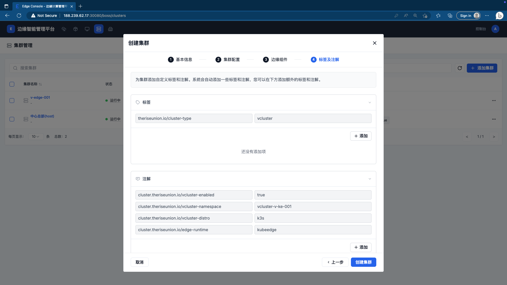
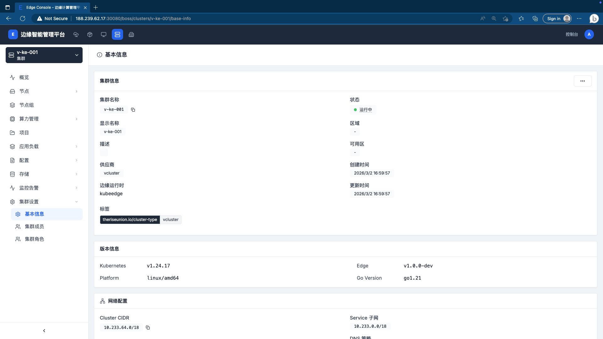
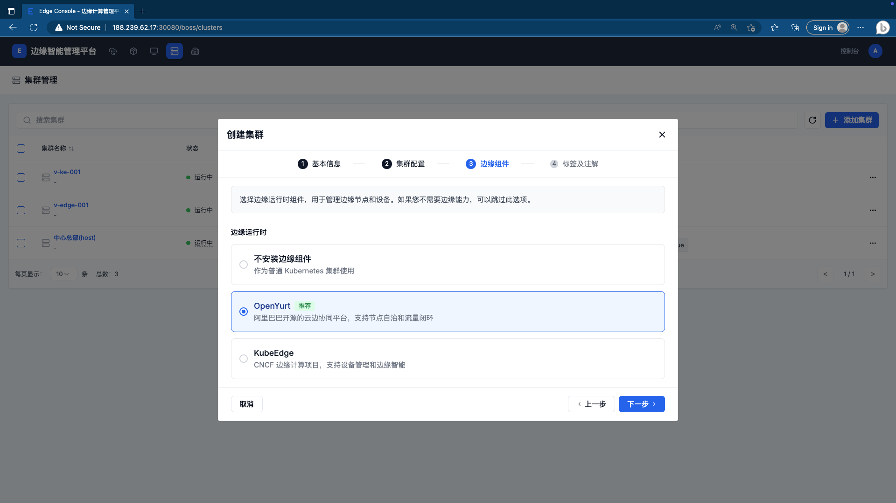
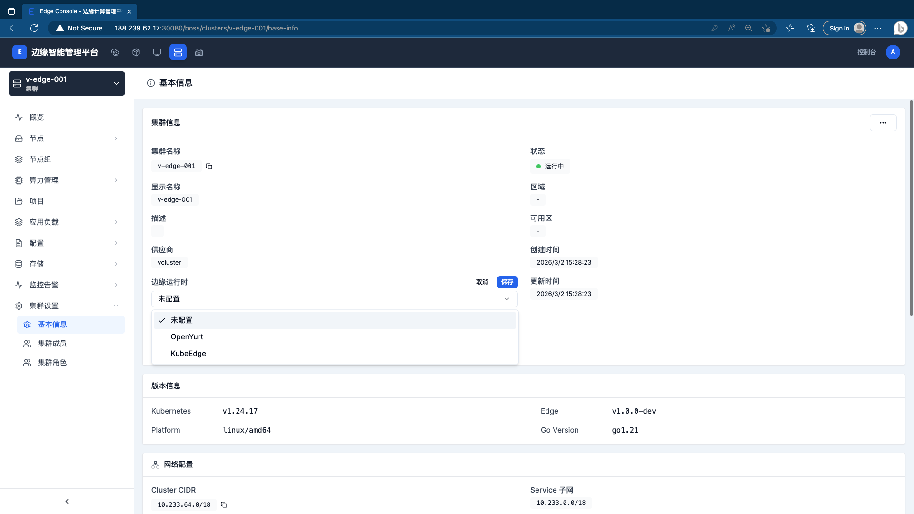

# 配置集群边缘运行时

平台支持在 **创建集群时** 预置边缘运行时，系统将自动完成组件安装和配置。也可以先创建空集群，之后在集群基本信息页手动切换运行时类型。

## 创建集群

进入 **集群管理** 页面，点击右上角「**+ 添加集群**」，按向导完成以下 4 个步骤。

### 第一步：基本信息

填写集群基础配置：

| 字段 | 说明 |
|------|------|
| 集群名称 | 只能包含小写字母、数字、`-` 或 `.`，以字母或数字开头和结尾，最长 63 个字符 |
| 别名 | 用于展示的友好名称，最长 63 个字符（可选） |
| 描述 | 最长 256 个字符（可选） |
| 集群类型 | **手动导入**：提供 kubeconfig 导入已有集群；**自动创建**：使用 vCluster 自动创建轻量级虚拟集群 |

### 第二步：集群配置

选择「自动创建」类型时，此步骤展示 vCluster 特性说明：

- 完全隔离的 Kubernetes 控制平面
- 共享底层 Host 集群的计算资源
- 秒级创建，无需额外基础设施
- 适合开发测试和多租户隔离场景

### 第三步：边缘组件

选择集群的**边缘运行时**类型，用于管理边缘节点和设备。

平台提供三种选项：

| 选项 | 说明 |
|------|------|
| **不安装边缘组件** | 作为普通 Kubernetes 集群使用，创建后可在集群设置中切换 |
| **OpenYurt**（推荐） | 阿里巴巴开源的云边协同平台，支持节点自治和流量闭环 |
| **KubeEdge** | CNCF 边缘计算项目，支持设备管理和边缘智能 |

### 第四步：标签及注解

系统自动为集群添加以下标签和注解，也可手动添加自定义条目：

**标签（自动）：**

| Key | Value |
|-----|-------|
| `theriseunion.io/cluster-type` | `vcluster` |

**注解（自动，含运行时时）：**

| Key | Value（示例） |
|-----|-------------|
| `cluster.theriseunion.io/vcluster-enabled` | `true` |
| `cluster.theriseunion.io/vcluster-namespace` | `vcluster-<集群名>` |
| `cluster.theriseunion.io/vcluster-distro` | `k3s` |
| `cluster.theriseunion.io/edge-runtime` | `kubeedge` 或 `openyurt` |

> 选择「不安装边缘组件」时，不会生成 `edge-runtime` 注解。

确认无误后点击「**创建集群**」完成创建。

---

## 创建 KubeEdge 集群

在第三步「边缘组件」中选择 **KubeEdge**，其余步骤与上述流程相同。

集群创建成功后，在集群基本信息页可看到「边缘运行时」字段显示为 `kubeedge`。

---

## 创建 OpenYurt 集群

在第三步「边缘组件」中选择 **OpenYurt**，其余步骤与上述流程相同。

集群创建成功后，在集群基本信息页可看到「边缘运行时」字段显示为 `openyurt`。

---

## 创建空集群并手动配置运行时

如果创建时选择了「不安装边缘组件」，可在集群创建完成后随时切换运行时。

**操作步骤：**

1. 进入目标集群，点击左侧菜单「**集群设置 > 基本信息**」
2. 找到「**边缘运行时**」字段，当前状态为「未配置」
3. 点击下拉框，选择 **OpenYurt** 或 **KubeEdge**
4. 点击「**保存**」，等待系统完成组件安装

> **注意**：切换运行时会触发集群组件变更，建议在业务低峰期操作。

---

## 相关文档

- [添加边缘节点](./add-edge-node)
- [集群管理](../clusters/cluster-management)
