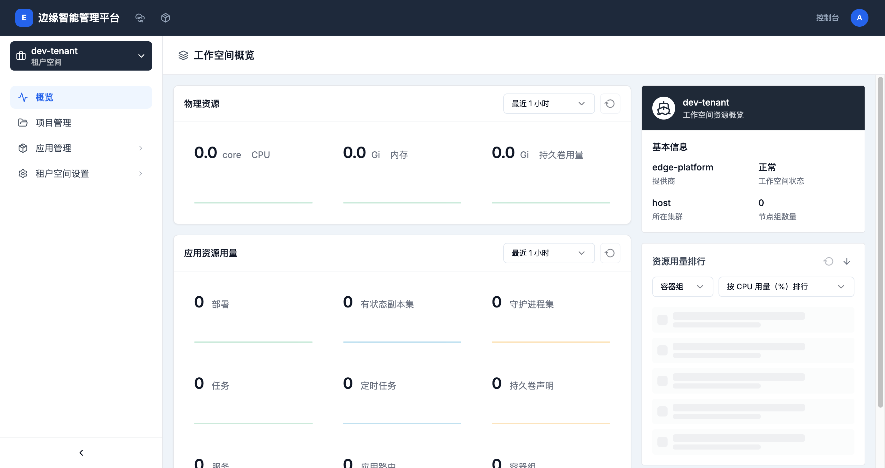

# IAM快速入门指南

## 欢迎使用IAM

欢迎使用边缘智能管理平台的IAM（身份和访问管理）系统！本指南将帮助您快速上手IAM的基本功能。

## 前置条件

在开始使用IAM之前，请确保您：

- ✅ 已拥有管理员账号
- ✅ 已成功登录边缘智能管理平台
- ✅ 具有访问IAM功能的权限

## 第一次使用

### 1. 访问IAM功能

1. **登录平台**
   - 打开浏览器，访问平台地址：`http://188.239.62.17:30446/dashboard`
   - 使用管理员账号登录

2. **进入控制台**
   - 点击顶部导航栏中的"控制台"
   - 进入平台管理控制台

3. **选择IAM功能**
   - 在左侧菜单中选择"访问控制"
   - 您可以看到"用户管理"和"角色管理"两个选项

### 2. 创建第一个用户



**步骤：**

1. **进入用户管理**
   - 点击"用户管理"
   - 系统显示用户列表页面

2. **创建新用户**
   - 点击右上角的"新建用户"按钮
   - 系统弹出创建用户对话框

3. **填写用户信息**
   ```
   用户名：zhangsan
   邮箱：zhangsan@company.com
   密码：Password123!
   显示名称：张三
   描述：开发工程师
   ```

4. **分配角色**
   - 选择初始角色：platform-regular
   - 点击"确定"完成创建

### 3. 分配用户角色

**角色分配场景：**

为不同岗位的用户分配合适的角色：

```
开发人员 → apps-manager + namespaces-viewer
运维人员 → clusters-manager + monitoring-manager
测试人员 → apps-viewer + monitoring-viewer
管理人员 → platform-admin
```

**操作步骤：**
1. 在用户列表中找到目标用户
2. 点击操作菜单中的"管理角色"
3. 勾选合适的角色
4. 点击"确定"保存

### 4. 创建自定义角色（可选）

如果系统内置角色不能满足需求，您可以创建自定义角色：

**步骤：**

1. **进入角色管理**
   - 点击"角色管理"
   - 系统显示角色列表页面

2. **创建新角色**
   - 点击"创建角色"按钮
   - 填写角色基本信息

3. **配置角色权限**
   ```
   角色名称：application-developer
   显示名称：应用开发人员
   角色类型：platform
   作用范围：global
   权限模板：
     - apps-manager
     - namespaces-viewer
     - monitoring-viewer
   ```

4. **保存角色**
   - 点击"确定"完成创建

## 常用操作

### 用户操作

**创建用户**
```
用户管理 → 新建用户 → 填写信息 → 分配角色 → 确定
```

**编辑用户信息**
```
用户列表 → 找到用户 → 编辑信息 → 修改信息 → 保存
```

**管理用户角色**
```
用户列表 → 找到用户 → 管理角色 → 选择角色 → 确定
```

**重置密码**
```
用户列表 → 找到用户 → 重置密码 → 设置新密码 → 确定
```

**删除用户**
```
用户列表 → 找到用户 → 删除 → 确认用户名 → 确定
```

### 角色操作

**创建角色**
```
角色管理 → 创建角色 → 填写信息 → 配置权限 → 确定
```

**编辑角色信息**
```
角色列表 → 找到角色 → 编辑信息 → 修改信息 → 保存
```

**编辑角色权限**
```
角色列表 → 找到角色 → 编辑权限 → 选择模板 → 确定
```

**删除角色**
```
角色列表 → 找到角色 → 删除 → 确认删除 → 确定
```

## 核心概念

### 用户（User）

用户是平台的访问主体，每个用户都有：
- **用户名**：唯一标识符，用于登录
- **邮箱**：接收系统通知和密码重置
- **角色**：决定用户的权限范围
- **状态**：活跃、禁用、待激活

### 角色（Role）

角色定义了一组权限的集合：
- **平台角色**：platform-admin、platform-regular等
- **集群角色**：cluster-admin、cluster-regular等
- **工作空间角色**：workspace-admin、workspace-regular等
- **项目角色**：namespace-admin、namespace-regular等

### 权限（Permission）

权限控制用户对资源的操作：
- **读取权限**：查看资源信息
- **创建权限**：创建新资源
- **更新权限**：修改资源配置
- **删除权限**：删除资源

## 典型使用场景

### 场景1：为新员工创建账号

**需求**：公司新入职一名开发工程师，需要为其创建平台账号。

**步骤：**
1. 创建用户账号，设置初始密码
2. 分配"应用开发人员"角色
3. 通知用户账号信息和首次登录指引

**预期权限**：
- ✅ 可以查看和管理应用
- ✅ 可以查看项目信息
- ✅ 可以查看监控数据
- ❌ 不能管理集群和节点
- ❌ 不能管理其他用户

### 场景2：为项目分配团队成员

**需求**：为某个项目添加多名开发人员，他们需要管理该项目下的应用。

**步骤：**
1. 为每个团队成员创建用户账号
2. 为所有用户分配"项目开发人员"角色
3. 限制角色作用范围为指定项目

**预期权限**：
- ✅ 可以管理指定项目的应用
- ✅ 可以查看项目配置
- ❌ 不能访问其他项目
- ❌ 不能修改集群设置

### 场景3：权限变更

**需求**：某员工从开发岗位转到运维岗位，需要调整其权限。

**步骤：**
1. 进入用户详情页面
2. 移除开发相关角色
3. 添加运维相关角色
4. 通知用户重新登录

**权限变化**：
- ❌ 移除：apps-manager（应用管理）
- ✅ 添加：clusters-manager（集群管理）
- ✅ 添加：monitoring-manager（监控管理）

## 安全建议

### 密码安全

1. **设置强密码**
   - 最少8个字符
   - 包含大小写字母、数字、特殊字符
   - 避免使用个人信息

2. **定期更换密码**
   - 建议每90天更换一次
   - 重要岗位每60天更换

3. **密码重置**
   - 使用"重置密码"功能
   - 重置后立即修改

### 权限管理

1. **最小权限原则**
   - 只授予工作所需的最小权限
   - 定期审查用户权限
   - 及时回收不需要的权限

2. **职责分离**
   - 将重要操作分散到不同角色
   - 避免单个用户权限过大
   - 关键操作需要多人协作

3. **定期审计**
   - 每季度审查用户列表
   - 清理离职员工账号
   - 检查异常权限配置

## 常见问题

### Q1：忘记密码怎么办？

**A**：请联系管理员重置密码。管理员使用"重置密码"功能为您设置新密码，您首次登录后应立即修改。

### Q2：为什么我看不到某些功能？

**A**：这通常是因为您的账号权限不足。请检查：
1. 您的角色是否正确分配
2. 角色的权限是否包含该功能
3. 是否需要重新登录刷新权限

### Q3：如何测试我的权限？

**A**：使用权限测试工具：
1. 进入"访问控制" → "权限测试"
2. 选择要测试的用户和资源
3. 执行测试查看权限结果

### Q4：删除用户会怎样？

**A**：删除用户操作不可撤销，会：
- ✅ 移除用户的所有角色绑定
- ✅ 清除用户的个人配置
- ❌ 不会影响用户创建的资源
- ❌ 不会删除用户创建的应用

### Q5：一个用户可以有多个角色吗？

**A**：可以。一个用户可以拥有多个角色，所有角色的权限会叠加。例如：
- 同时拥有"应用开发人员"和"项目管理员"角色
- 用户同时拥有两个角色的所有权限
- 不同层级的角色可以同时存在

## 下一步

现在您已经掌握了IAM的基本使用方法，接下来可以：

1. **深入学习**
   - 阅读[IAM概述](./iam-overview.md)了解系统架构
   - 查看[用户管理指南](./user-management.md)学习高级功能
   - 学习[角色管理指南](./role-management.md)掌握角色配置

2. **实践操作**
   - 为团队成员创建账号
   - 创建自定义角色满足特定需求
   - 配置复杂的权限组合

3. **安全优化**
   - 审查现有用户权限配置
   - 实施最小权限原则
   - 建立定期权限审查机制

## 获取帮助

如果在使用过程中遇到问题：

1. **查看文档**
   - 右侧文档导航包含详细的操作指南
   - 每个功能都有对应的说明文档

2. **使用工具**
   - 权限测试工具：验证权限配置
   - 审计日志：查看操作历史
   - 系统监控：检查系统状态

3. **联系支持**
   - 技术支持：support@theriseunion.io
   - 用户论坛：分享经验和获取帮助
   - 在线客服：工作日 9:00-18:00

## 快捷参考

### 常用角色对照表

| 角色名称 | 显示名称 | 权限范围 | 典型用途 |
|---------|---------|---------|---------|
| platform-admin | 平台管理员 | 整个平台 | 系统管理 |
| platform-regular | 平台用户 | 整个平台 | 基本使用 |
| cluster-admin | 集群管理员 | 特定集群 | 集群运维 |
| workspace-admin | 工作空间管理员 | 特定工作空间 | 团队管理 |
| namespace-admin | 项目管理员 | 特定项目 | 项目管理 |

### 快捷操作路径

| 操作 | 路径 |
|-----|------|
| 创建用户 | 控制��� → 访问控制 → 用户管理 → 新建用户 |
| 管理角色 | 控制台 → 访问控制 → 用户管理 → 管理角色 |
| 创建角色 | 控制台 → 访问控制 → 角色管理 → 创建角色 |
| 权限测试 | 控制台 → 访问控制 → 权限测试 |

恭喜您完成了IAM快速入门！祝您使用愉快！🎉

## 相关文档
- [IAM概述](./iam-overview.md)
- [用户管理指南](./user-management.md)
- [角色管理指南](./role-management.md)
- [权限管理指南](./permission-management.md)
- [访问控制最佳实践](./access-control-best-practices.md)