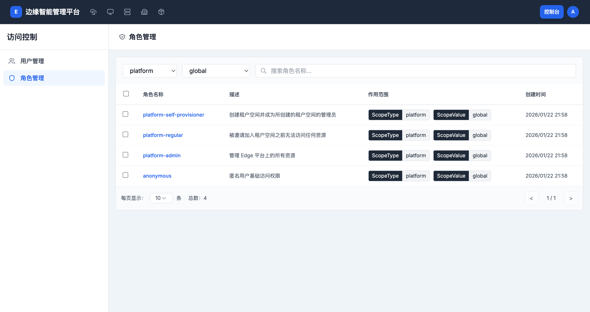
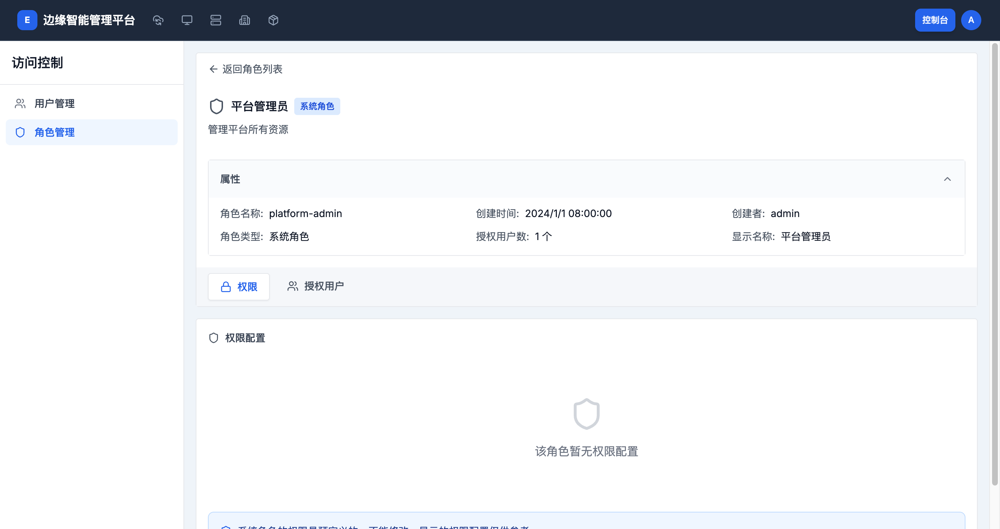
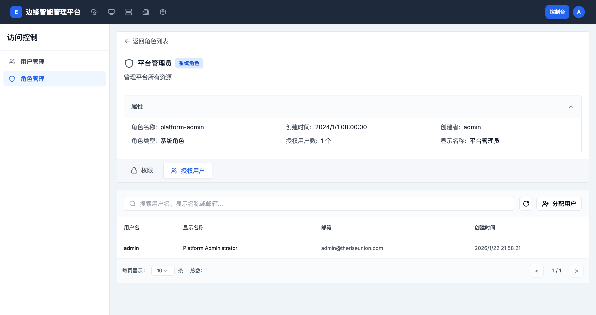

# 角色管理

> **导航路径**: 控制台 > 访问控制 > 角色管理
> **访问地址**: `/boss/access/roles`
> **所需权限**: 平台管理员

## 功能说明

角色管理页面用于查看平台中所有角色的列表，查看角色的权限配置和已授权的用户。角色按作用范围分类，可以通过筛选器查看不同范围的角色。

## 页面概览

角色列表包含以下信息：

| 列 | 说明 |
|------|------|
| 角色名称 | 角色的标识名称 |
| 描述 | 角色的功能描述 |
| 作用范围 | 角色的范围类型和范围值 |
| 创建时间 | 角色创建的时间 |

页面顶部提供两个筛选器：

| 筛选器 | 说明 | 可选值 |
|--------|------|--------|
| 范围类型 | 按角色的作用范围筛选 | 全部范围、platform、cluster、workspace、nodegroup、namespace |
| 范围值 | 按角色的具体作用对象筛选 | global 或具体的资源名称 |

## 操作指南

### 操作一：查看角色列表

**操作步骤**

1. 进入 **控制台 > 访问控制 > 角色管理**

2. 使用范围类型筛选器选择要查看的角色范围

3. 浏览角色列表

**操作结果**

查看指定范围下的所有角色。

### 操作二：查看角色详情

**操作步骤**

1. 在角色列表中，点击目标角色名称

2. 进入角色详情页面

   

   详情页面显示以下属性：

   | 属性 | 说明 |
   |------|------|
   | 角色名称 | 角色的唯一标识 |
   | 创建时间 | 角色创建时间 |
   | 创建者 | 创建该角色的用户 |
   | 角色类型 | 系统角色或自定义角色 |
   | 授权用户数 | 当前被分配该角色的用户数量 |
   | 显示名称 | 角色的中文名称 |

3. 在详情页面下方，有两个标签页：

   - **权限** — 查看角色的权限配置
   - **授权用户** — 查看被分配该角色的用户

**操作结果**

了解角色的完整信息和权限范围。

### 操作三：查看授权用户

**操作步骤**

1. 在角色详情页面，点击 **授权用户** 标签页

   

2. 查看被分配该角色的用户列表

   | 列 | 说明 |
   |------|------|
   | 用户名 | 用户的唯一标识 |
   | 显示名称 | 用户的显示名称 |
   | 邮箱 | 用户的邮箱地址 |
   | 创建时间 | 用户账户的创建时间 |

**操作结果**

了解哪些用户被分配了该角色。

### 操作四：为角色分配用户

**操作步骤**

1. 在角色详情的 **授权用户** 标签页中，点击 **分配用户** 按钮

2. 在弹出的对话框中搜索并选择要分配的用户

3. 点击 **确认**

**操作结果**

选中的用户被分配该角色，获得相应权限。

### 操作五：按范围筛选角色

**操作步骤**

1. 在角色列表顶部，点击范围类型筛选器

2. 选择目标范围（如 cluster、workspace 等）

3. 可选：进一步选择范围值筛选特定资源下的角色

**操作结果**

列表仅显示指定范围下的角色。

## 常见问题

### 问题：系统角色无法编辑权限
**现象**：在角色详情中看到「系统角色的权限是预定义的，不能修改」
**原因**：系统角色（如 platform-admin）是平台内置的，权限不可更改
**解决**：如需自定义权限，可以创建新的自定义角色

### 问题：找不到某个角色
**现象**：在角色列表中找不到目标角色
**原因**：角色可能属于其他范围类型
**解决**：切换范围类型筛选器查看不同范围下的角色
