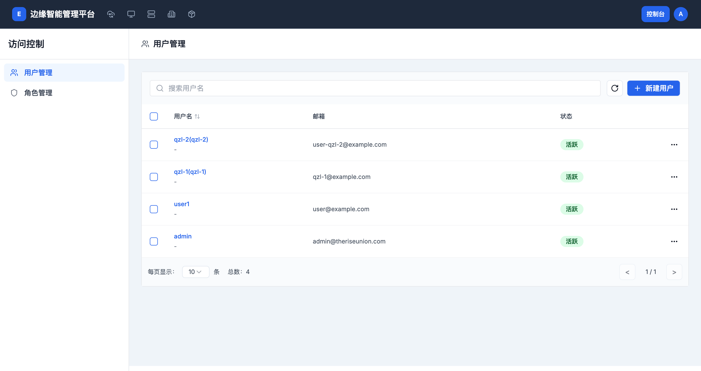
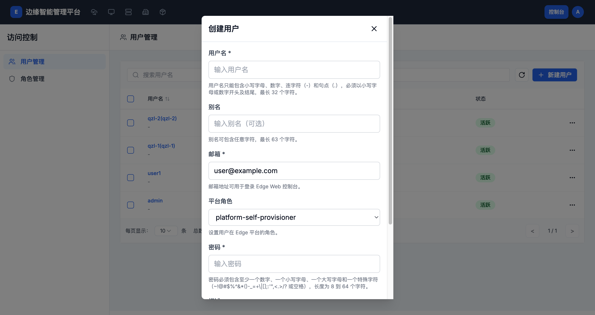
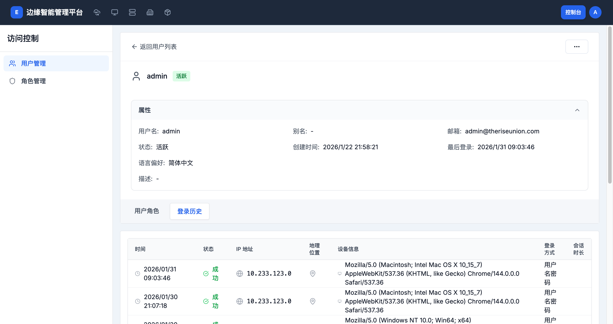
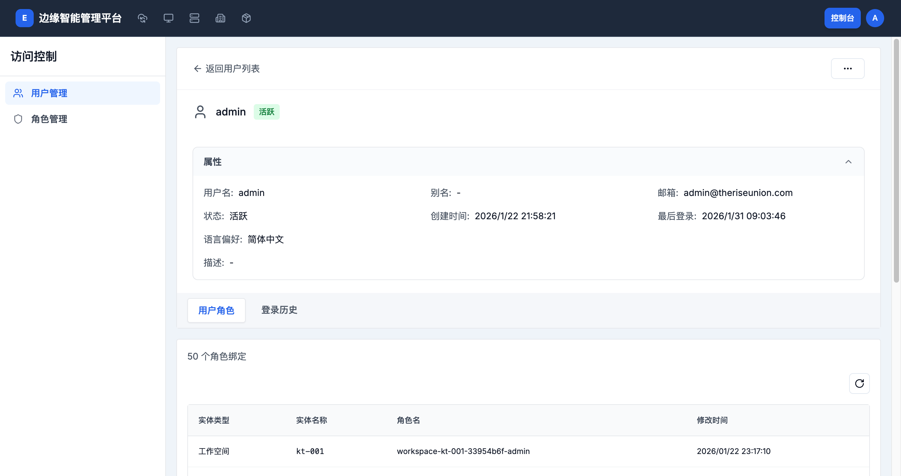

# 用户管理

> **导航路径**: 控制台 > 访问控制 > 用户管理
> **访问地址**: `/boss/access/users`
> **所需权限**: 平台管理员

## 功能说明

用户管理页面用于创建和管理平台的用户账户。您可以创建新用户、查看用户详情、管理用户角色、重置密码和查看登录历史。

## 页面概览

用户列表包含以下信息：

| 列 | 说明 |
|------|------|
| 用户名 | 用户的用户名和别名 |
| 邮箱 | 用户的邮箱地址 |
| 状态 | 用户状态（活跃、禁用） |

## 操作指南

### 操作一：创建用户

**操作步骤**

1. 在用户列表页面，点击 **新建用户** 按钮

2. 在弹出的「创建用户」面板中，填写以下信息：

   

   | 字段 | 是否必填 | 说明 |
   |------|----------|------|
   | 用户名 | 是 | 小写字母、数字、连字符和句点，最长 32 个字符 |
   | 别名 | 否 | 任意字符，最长 63 个字符 |
   | 邮箱 | 是 | 用户的邮箱地址，可用于登录 |
   | 平台角色 | 否 | 选择用户的平台角色 |
   | 密码 | 是 | 必须包含数字、大小写字母和特殊字符，8-64 个字符 |
   | 描述 | 否 | 用户描述，最长 256 个字符 |

3. 点击 **确定** 创建用户

**操作结果**

用户创建成功，出现在用户列表中。

### 操作二：查看用户详情

**操作步骤**

1. 在用户列表中，点击目标用户的用户名

2. 进入用户详情页面

   

   详情页面显示以下属性：

   | 属性 | 说明 |
   |------|------|
   | 用户名 | 用户的唯一标识 |
   | 别名 | 用户的显示名称 |
   | 邮箱 | 用户的邮箱地址 |
   | 状态 | 当前账户状态 |
   | 创建时间 | 账户创建时间 |
   | 最后登录 | 最近一次登录的时间 |
   | 语言偏好 | 用户界面语言设置 |
   | 描述 | 用户描述信息 |

3. 在详情页面下方，有两个标签页：

   - **用户角色** — 查看用户被分配的所有角色
   - **登录历史** — 查看用户的登录记录

**操作结果**

查看用户的完整信息。

### 操作三：查看用户角色

**操作步骤**

1. 在用户详情页面，点击 **用户角色** 标签页

   

2. 查看用户在各个资源上的角色绑定

   | 列 | 说明 |
   |------|------|
   | 实体类型 | 角色绑定的资源类型（工作空间、集群等） |
   | 实体名称 | 具体的资源名称 |
   | 角色名 | 分配的角色名称 |
   | 修改时间 | 角色绑定的时间 |

**操作结果**

了解用户在平台各处被分配的角色。

### 操作四：查看登录历史

**操作步骤**

1. 在用户详情页面，点击 **登录历史** 标签页

2. 查看用户的登录记录

   | 列 | 说明 |
   |------|------|
   | 时间 | 登录时间 |
   | 状态 | 登录是否成功 |
   | IP 地址 | 登录来源的 IP 地址 |
   | 设备信息 | 浏览器和操作系统信息 |
   | 登录方式 | 登录认证方式 |

**操作结果**

了解用户的登录活动。

### 操作五：编辑用户信息

**操作步骤**

1. 在用户列表中，点击目标用户右侧的操作菜单（...）

2. 选择 **编辑信息**

3. 修改用户的别名、邮箱或描述

4. 点击 **保存**

**操作结果**

用户信息已更新。

### 操作六：重置密码

**操作步骤**

1. 点击目标用户右侧的操作菜单（...）

2. 选择 **重置密码**

3. 输入新密码

4. 点击 **确定**

**操作结果**

用户密码已重置，下次登录需使用新密码。

### 操作七：禁用/启用用户

**操作步骤**

1. 点击目标用户右侧的操作菜单（...）

2. 选择 **禁用** 或 **启用**

**操作结果**

被禁用的用户无法登录平台。启用后恢复登录能力。

### 操作八：删除用户

**操作步骤**

1. 点击目标用户右侧的操作菜单（...）

2. 选择 **删除**

3. 在确认对话框中输入用户名确认删除

**操作结果**

用户已删除，该用户的所有角色绑定同时被移除。

## 常见问题

### 问题：用户无法登录
**现象**：用户输入正确的用户名和密码后无法登录
**原因**：用户账户被禁用，或密码已过期
**解决**：在用户列表中检查用户状态，如果显示「禁用」则启用该用户；或重置用户密码

### 问题：创建用户时提示用户名已存在
**现象**：创建用户时报错
**原因**：平台中已存在同名用户
**解决**：使用不同的用户名
