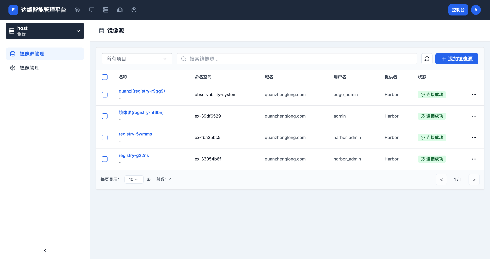
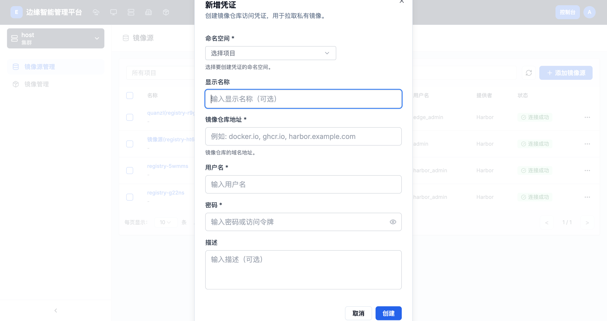

# 镜像源管理

> **导航路径**: 控制台 > 镜像仓库 > 镜像源管理
> **访问地址**: `/boss/images/registry`
> **所需权限**: 平台管理员

## 功能说明

镜像源管理页面用于管理镜像仓库的访问凭证。您可以添加多个镜像源（如 Harbor、Docker Hub），并验证连接状态，为后续添加镜像仓库做准备。

## 页面概览

镜像源列表包含以下信息：

| 列 | 说明 |
|------|------|
| 名称 | 镜像源的名称和别名 |
| 命名空间 | 镜像源所属的项目 |
| 域名 | 镜像仓库的访问地址 |
| 用户名 | 登录用户名 |
| 提供者 | 镜像仓库类型（Harbor、Docker Hub 等） |
| 状态 | 连接状态（连接成功、连接失败、未测试） |

页面顶部提供项目筛选器和搜索框，可按项目或关键词筛选镜像源。

## 操作指南

### 操作一：添加镜像源

**操作步骤**

1. 在镜像源列表页面，点击 **添加镜像源** 按钮

2. 在弹出的「新增凭证」对话框中，填写以下信息：

   

   | 字段 | 是否必填 | 说明 | 示例 |
   |------|----------|------|------|
   | 命名空间 | 是 | 选择镜像源所属的项目 | `observability-system` |
   | 显示名称 | 否 | 镜像源的易识别名称 | `生产 Harbor` |
   | 镜像仓库地址 | 是 | 镜像仓库的域名地址 | `harbor.example.com` |
   | 用户名 | 是 | 登录用户名 | `admin` |
   | 密码 | 是 | 登录密码或访问令牌 | -- |
   | 描述 | 否 | 镜像源的用途说明 | `生产环境主仓库` |

3. 点击 **创建** 完成添加

**操作结果**

镜像源添加成功，出现在镜像源列表中。

### 操作二：测试连接

**操作步骤**

1. 在镜像源列表中，点击目标镜像源右侧的操作菜单（...）

2. 选择 **测试连接**

3. 系统自动验证连接状态

**操作结果**

状态列更新为「连接成功」或「连接失败」。

### 操作三：编辑镜像源信息

**操作步骤**

1. 点击目标镜像源右侧的操作菜单（...）

2. 选择 **编辑信息**

3. 修改显示名称或描述

4. 点击 **保存**

**操作结果**

镜像源的显示名称和描述已更新。

> 域名、用户名、密码等核心配置不支持修改。如需更改，请删除后重新创建。

### 操作四：删除镜像源

**操作步骤**

1. 点击目标镜像源右侧的操作菜单（...）

2. 选择 **删除**

3. 在确认对话框中确认删除

**操作结果**

镜像源已删除。使用该凭证的镜像仓库将无法正常同步。

> 支持批量删除：勾选多个镜像源后，点击工具栏的删除按钮。

### 操作五：按项目筛选

**操作步骤**

1. 点击页面顶部的项目选择器

2. 选择目标项目，或选择「所有项目」查看全部镜像源

**操作结果**

列表仅显示所选项目下的镜像源。

## 常见问题

### 问题：连接测试失败
**现象**：测试连接后状态显示「连接失败」
**原因**：域名配置错误、用户名密码错误、网络不通或镜像仓库服务不可用
**解决**：
1. 确认镜像仓库地址是否正确（不需要包含 `https://` 前缀）
2. 确认用户名和密码是否正确
3. 确认平台所在服务器能够访问该镜像仓库地址

### 问题：需要更新密码
**现象**：镜像仓库密码已更改，需要更新凭证
**原因**：平台不支持直接修改密码
**解决**：删除现有镜像源，使用新密码重新创建
