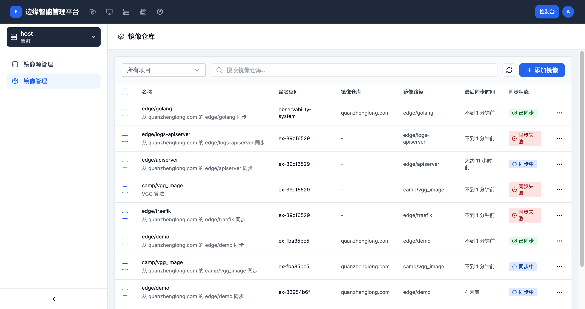
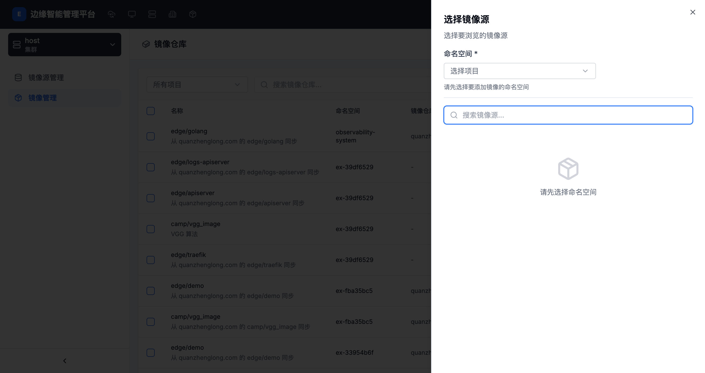

# 镜像仓库管理

> **导航路径**: 控制台 > 镜像仓库 > 镜像管理
> **访问地址**: `/boss/images/repository`
> **所需权限**: 平台管理员

## 功能说明

镜像仓库管理页面用于管理需要从镜像源同步的具体镜像。添加镜像后，系统会自动从对应的镜像源同步镜像信息，并显示同步状态。

## 页面概览

镜像仓库列表包含以下信息：

| 列 | 说明 |
|------|------|
| 名称 | 镜像名称和描述 |
| 命名空间 | 镜像所属的项目 |
| 镜像仓库 | 镜像源的域名地址 |
| 镜像路径 | 镜像在仓库中的路径 |
| 最后同步时间 | 上次成功同步的时间 |
| 同步状态 | 当前同步状态（已同步、同步中、同步失败） |

页面顶部提供项目筛选器和搜索框。列表采用滚动加载方式，向下滚动自动加载更多数据。

## 同步状态说明

| 状态 | 说明 |
|------|------|
| 已同步 | 镜像信息已成功同步 |
| 同步中 | 正在同步镜像信息 |
| 同步失败 | 同步过程出现错误，需检查镜像源连接或镜像路径 |

## 操作指南

### 操作一：添加镜像

**前提条件**

已添加至少一个镜像源，且连接状态为「连接成功」。

**操作步骤**

1. 在镜像仓库列表页面，点击 **添加镜像** 按钮

2. 在弹出的「选择镜像源」对话框中：

   

   | 字段 | 是否必填 | 说明 |
   |------|----------|------|
   | 命名空间 | 是 | 选择镜像所属的项目 |
   | 镜像源 | 是 | 从已有的镜像源中选择 |

3. 选择镜像源后，浏览并选择要同步的镜像

4. 确认添加

**操作结果**

镜像添加成功，系统自动开始同步。同步完成后状态变为「已同步」。

### 操作二：查看镜像详情

**操作步骤**

1. 在镜像仓库列表中，点击目标镜像的名称

2. 进入镜像详情页面，查看镜像的完整信息

**操作结果**

查看镜像的基本信息和同步状态。

### 操作三：删除镜像

**操作步骤**

1. 点击目标镜像右侧的操作菜单（...）

2. 选择 **删除**

3. 在确认对话框中确认删除

**操作结果**

镜像配置已删除，系统停止同步该镜像。已拉取到节点的镜像不会被删除。

> 支持批量删除：勾选多个镜像后，点击工具栏的删除按钮。

### 操作四：按项目筛选

**操作步骤**

1. 点击页面顶部的项目选择器

2. 选择目标项目，或选择「所有项目」查看全部镜像

**操作结果**

列表仅显示所选项目下的镜像。

## 常见问题

### 问题：镜像同步失败
**现象**：同步状态一直显示「同步失败」
**原因**：镜像源连接异常、镜像路径不存在或权限不足
**解决**：
1. 先检查对应镜像源的连接状态
2. 确认镜像路径在镜像仓库中存在
3. 确认镜像源的账户有权限访问该镜像

### 问题：同步状态一直显示「同步中」
**现象**：镜像长时间处于同步中状态
**原因**：网络连接中断或镜像过大
**解决**：
1. 检查平台到镜像仓库的网络连接
2. 等待一段时间后刷新页面查看状态
3. 如持续无变化，删除后重新添加
