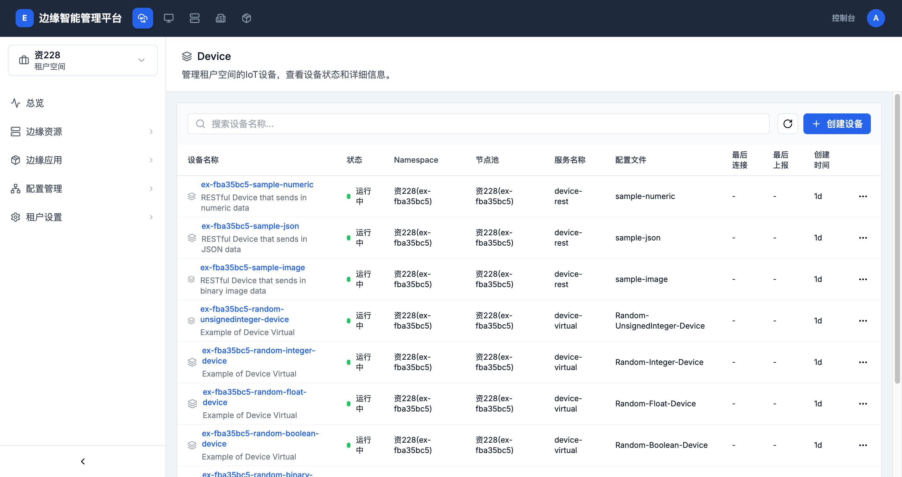

# 设备管理

> **导航路径**: 智能边缘平台 > 选择工作台 > 选择节点组 > 边缘资源 > 设备管理
> **访问地址**: `/tenant/{租户空间ID}/nodegroups/{节点组ID}/device`
> **所需权限**: 租户空间管理员或成员

## 功能说明

设备管理页面展示当前节点组内所有已注册的物联网设备。您可以查看设备的运行状态、关联的服务和配置文件，以及创建新设备。

## 页面概览

设备列表包含以下信息：

| 列 | 说明 |
|------|------|
| 设备名称 | 设备的名称和描述 |
| 状态 | 设备运行状态（运行中、离线等） |
| Namespace | 设备所在的项目 |
| 节点池 | 设备所属的节点池 |
| 服务名称 | 设备关联的服务名称 |
| 配置文件 | 设备使用的配置文件（设备模版） |
| 最后连接 | 设备最后一次连接的时间 |
| 最后上报 | 设备最后一次上报数据的时间 |
| 创建时间 | 设备的创建时间 |

## 操作指南

### 操作一：查看设备列表

**操作步骤**

1. 在工作台侧边栏中，展开 **边缘资源**

2. 点击 **设备管理**

3. 查看所有设备的名称、状态和关联信息

4. 使用搜索框按设备名称查找

**操作结果**

查看到节点组内所有物联网设备及其运行状态。

### 操作二：创建设备

**操作步骤**

1. 在设备列表页面，点击 **创建设备** 按钮

2. 填写设备信息

3. 选择关联的配置文件和服务

4. 点击 **确认** 创建设备

**操作结果**

设备创建成功，出现在设备列表中。

### 操作三：查看设备详情

**操作步骤**

1. 在设备列表中，点击目标设备的名称

2. 进入设备详情页面，查看设备的状态、属性值和事件

**操作结果**

了解设备的详细运行状态和数据。

## 常见问题

### 问题：设备状态显示「离线」
**现象**：设备列表中设备状态不是「运行中」
**原因**：设备与边缘节点的连接中断，或设备服务未启动
**解决**：检查设备网络连接，确认边缘节点上的设备服务正常运行

### 问题：设备列表为空
**现象**：进入设备管理页面，列表中没有设备
**原因**：当前节点组内未注册任何设备
**解决**：点击「创建设备」注册新设备，或确认选择了正确的节点组
